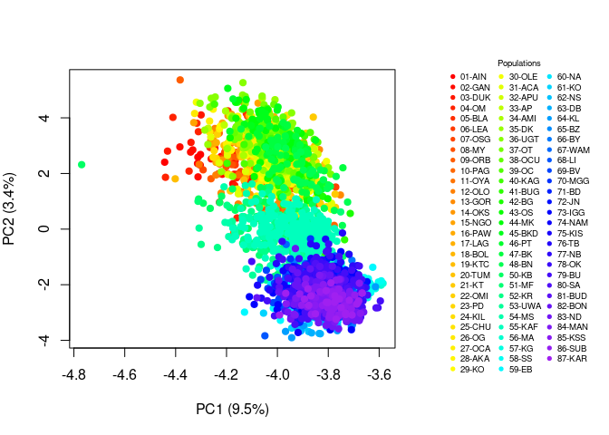
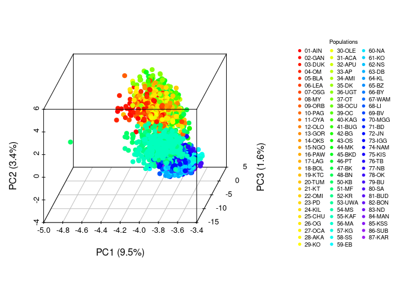
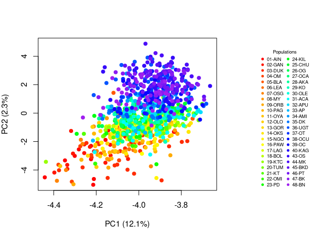
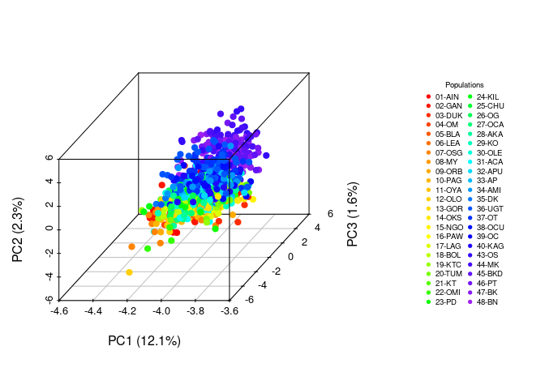
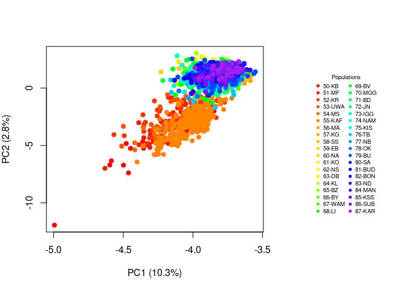
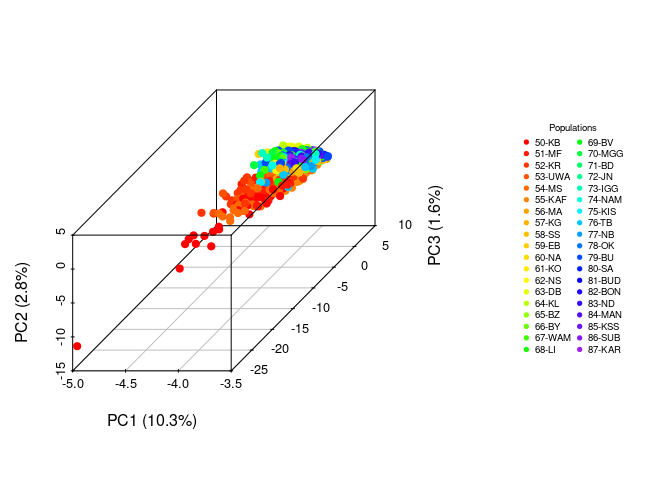
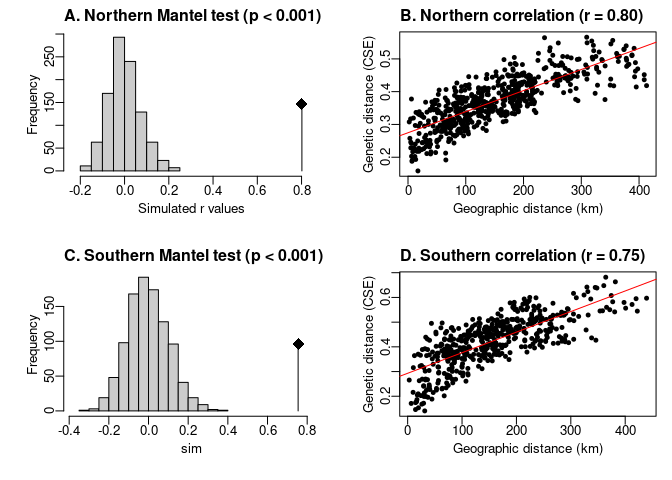

Uganda tsetse PopGen: PCA, diversity, CSE
================
Norah Saarman
2025-06-03

- [Importing data as genind object from
  .gen](#importing-data-as-genind-object-from-gen)
- [Visualize genetic variation with
  PCA](#visualize-genetic-variation-with-pca)
- [Considering K=2 by Evano method](#considering-k2-by-evano-method)
- [Choosing sites for Random Forest
  (K=2)](#choosing-sites-for-random-forest-k2)
- [Genetic diversity](#genetic-diversity)
- [Cavalli-Sforza and Edwards’ Distance
  (CSE)](#cavalli-sforza-and-edwards-distance-cse)
- [Isolation by Distance & Mantel
  tests](#isolation-by-distance--mantel-tests)

RStudio Configuration: - **R version:** R 4.4.0 (Geospatial packages)  
- **Number of cores:** 4 (up to 32 available)  
- **Account:** saarman-np  
- **Partition:** saarman-shared-np (allows multiple simultaneous jobs)  
- **Memory per job:** 100G (cluster limit: 1000G total; avoid exceeding
half)

``` r
library(adegenet)
library(geosphere)
library(igraph)
library(scatterplot3d)
library(ggplot2)
library(dplyr)
library(hierfstat)
library(pegas)
library(PopGenReport)
library(poppr)
library(sf)
library(rnaturalearth)
library(rnaturalearthdata)
library(cowplot)
library(viridis)
library(ade4)
```

# Importing data as genind object from .gen

``` r
# 1. Genepop .gen file "./input/Gff_11loci_allsites_genepop.gen" 
Gff.genind <- read.genepop("../input/Gff_11loci_allsites_genepop.gen", ncode = 3)
```

    ## 
    ##  Converting data from a Genepop .gen file to a genind object... 
    ## 
    ## 
    ## File description:  Glossina fuscipes fuscipes Uganda, all sites, 11 loci, GpCAG133 has a lot of missing data 
    ## 
    ## ...done.

``` r
# Metadata with base R function read.csv()
Gff <- read.csv("../input/Gff_11loci_allsites_indinfo.txt", header=TRUE, sep = "\t")

# Add site code to @pop slot
Gff.genind@pop <- as.factor(Gff$SiteCode)

# Check genind object
Gff.genind
```

    ## /// GENIND OBJECT /////////
    ## 
    ##  // 2,736 individuals; 11 loci; 162 alleles; size: 1.9 Mb
    ## 
    ##  // Basic content
    ##    @tab:  2736 x 162 matrix of allele counts
    ##    @loc.n.all: number of alleles per locus (range: 7-28)
    ##    @loc.fac: locus factor for the 162 columns of @tab
    ##    @all.names: list of allele names for each locus
    ##    @ploidy: ploidy of each individual  (range: 2-2)
    ##    @type:  codom
    ##    @call: read.genepop(file = "../input/Gff_11loci_allsites_genepop.gen", 
    ##     ncode = 3)
    ## 
    ##  // Optional content
    ##    @pop: population of each individual (group size range: 8-236)

``` r
summary(Gff.genind)
```

    ## 
    ## // Number of individuals: 2736
    ## // Group sizes: 19 20 25 15 10 8 20 15 20 20 9 24 25 26 25 13 17 25 20 20 17 15 13 21 25 37 20 26 15 24 25 29 15 25 16 64 40 25 20 20 18 13 32 24 24 26 40 40 40 38 55 25 30 236 33 32 40 35 33 40 16 32 40 18 62 14 46 60 59 35 40 65 15 8 28 17 119 119 15 24 24 40 35 35 24 24
    ## // Number of alleles per locus: 27 7 17 8 10 15 9 13 28 10 18
    ## // Number of alleles per group: 65 65 65 61 52 50 60 60 59 57 52 54 69 66 57 50 50 59 56 56 55 60 59 61 62 70 59 61 54 58 66 55 51 47 56 56 49 49 49 47 48 46 48 38 43 41 46 54 62 77 82 64 52 73 34 35 42 42 33 35 35 33 44 41 57 40 61 58 58 53 40 60 48 35 46 40 50 65 46 40 36 31 37 32 28 28
    ## // Percentage of missing data: 3.25 %
    ## // Observed heterozygosity: 0.72 0.44 0.51 0.2 0.59 0.51 0.33 0.43 0.71 0.51 0.65
    ## // Expected heterozygosity: 0.85 0.63 0.69 0.23 0.71 0.73 0.5 0.56 0.87 0.7 0.84

# Visualize genetic variation with PCA

All samples:

``` r
# replace NAs with locus means for PCA
gen_tab <- tab(Gff.genind, NA.method = "mean")  

# Compute PCA on the subset
pca_result3 <- dudi.pca(gen_tab, cent = FALSE, scale = TRUE, scannf = FALSE, nf = 4)

# Extract percent variance explained for PC1 and PC2
var_explained <- round(100 * pca_result3$eig / sum(pca_result3$eig), 1)

# Generate 86 visually distinct colors
set.seed(123)  # for reproducibility
n_pops <- nlevels(pop(Gff.genind))
color_palette <- colorRampPalette(c("red", "orange", "yellow", "green", "cyan", "blue", "purple"))(n_pops)

# Map population levels to colors
site_levels <- levels(pop(Gff.genind))
site_colors <- setNames(color_palette, site_levels)

# Get color for each individual
pop_colors <- site_colors[as.character(pop(Gff.genind))]

# Layout: 2 panels (main plot + legend)
layout(matrix(c(1, 2), nrow = 1), widths = c(6, 2.5))

# PCA plot
#pdf("../figures/PCA-all-2D.pdf", width = 14, height = 10)
par(mar = c(5, 4, 4, 2))
plot(pca_result3$li[, 1:2],
     col = pop_colors,
     pch = 19,
     xlab = paste0("PC1 (", var_explained[1], "%)"),
     ylab = paste0("PC2 (", var_explained[2], "%)"))
# Legend panel
par(mar = c(1,1,1,1))  # increase space to avoid clipping
plot.new()
legend("center", 
       legend = site_levels,
       col = site_colors,
       pch = 19,
       cex = 0.6,
       title = "Populations", 
       ncol = 3,
       bty = "n")  # <- no border
```

<!-- -->

``` r
#dev.off()

# 3D PCA plot
#pdf("../figures/PCA-all-3D.pdf", width = 14, height = 10)
par(mar = c(5, 4, 4, 2))
s3d <- scatterplot3d(pca_result3$li[, c(1,3,2)],
                     color = pop_colors,
                     pch = 19,
                     xlab = paste0("PC1 (", var_explained[1], "%)"), # horizontal 
                     ylab = paste0("PC3 (", var_explained[3], "%)"), # depth
                     zlab = paste0("PC2 (", var_explained[2], "%)"), # vertical
                     angle = 55,
                     box = TRUE)
# Legend panel
par(mar = c(1, 1, 1, 1))
plot.new()
legend("center",
       legend = site_levels,
       col = site_colors,
       pch = 19,
       cex = 0.6,
       title = "Populations",
       ncol = 3,
       bty = "n")
```

<!-- -->

``` r
#dev.off()
```

# Considering K=2 by Evano method

``` r
# Add K2 cluster combining "south" and "west" into "south"
Gff$K2 <- ifelse(Gff$SiteMajCluster %in% c("south", "west"), "south", Gff$SiteMajCluster)
```

PCA for each K2 clusters separately

``` r
# PCA for each K2 cluster separately
for (region in c("north","south")) {
  genind_sub <- Gff.genind[pop(Gff.genind) %in% Gff$SiteCode[Gff$K2 == region]]
  # Replace NAs with locus means for PCA
  gen_tab <- tab(genind_sub, NA.method = "mean")
  pca_result <- dudi.pca(gen_tab, cent = FALSE, scale = TRUE, scannf = FALSE, nf = 4)
  var_explained <- round(100 * pca_result$eig / sum(pca_result$eig), 1)
  # Color palette
  set.seed(123)
  n_pops <- nlevels(pop(genind_sub))
  palette <- colorRampPalette(c("red", "orange", "yellow", "green", "cyan", "blue", "purple"))(n_pops)
  site_levels <- levels(pop(genind_sub))
  site_colors <- setNames(palette, site_levels)
  pop_colors <- site_colors[as.character(pop(genind_sub))]
  layout(matrix(c(1, 2), nrow = 1), widths = c(6, 2.5))
  
  # 2D PCA plot
  #pdf(paste0("../figures/PCA-", region, "-2D.pdf"), width = 14, height = 10)
  par(mar = c(5, 4, 4, 2))
  plot(pca_result$li[, 1:2],
       col = pop_colors,
       pch = 19,
       xlab = paste0("PC1 (", var_explained[1], "%)"),
       ylab = paste0("PC2 (", var_explained[2], "%)"))
  # Legend
  par(mar = c(1, 1, 1, 1))
  plot.new()
  legend("center",
         legend = site_levels,
         col = site_colors,
         pch = 19,
         cex = 0.6,
         title = "Populations",
         ncol = 2,
         bty = "n")
  #dev.off()
  
  # 3D PCA plot
  #pdf(paste0("../figures/PCA-", region, "-3D.pdf"), width = 14, height = 10)
  par(mar = c(5, 1, 4, 2))
  scatterplot3d(x = pca_result$li[, 1], # horizontal
                y = pca_result$li[, 3], # depth
                z = pca_result$li[, 2], # vertical
                color = pop_colors,
                pch = 19,
                xlab = paste0("PC1 (", var_explained[1], "%)"),
                ylab = paste0("PC3 (", var_explained[3], "%)"),
                zlab = paste0("PC2 (", var_explained[2], "%)"),
                angle = 55,
                box = TRUE) 
  par(mar = c(1, 1, 1, 1))
  
  plot.new()
  legend("center",
         legend = site_levels,
         col = site_colors,
         pch = 19,
         cex = 0.6,
         title ="Populations",
         ncol = 2,
         bty = "n")
  
  #dev.off()
}
```

<!-- --><!-- --><!-- --><!-- -->

# Choosing sites for Random Forest (K=2)

Filter out any Gff\$Cluster == nogroup to avoid admixed individuals,
which will inflate the genetic distance within each geographic region.

Filtering for only largest/most complete genetic sample from each 5 km
radius for gps within each Gff\$SiteMajCluster independently so that we
get best samples from both north and south of the river/Lake Kyoga
dividing north and south.

``` r
# Create filtered copy of Gff excluding 'nogroup'
Gff_filt <- Gff[Gff$Cluster != "nogroup", ]

# Ensure Gff$SiteCode matches pop(Gff.genind)
Gff_filt$SiteCode <- as.character(Gff_filt$SiteCode)
pop_names <- as.character(pop(Gff.genind))
if (!all(pop_names == Gff_filt$SiteCode)) {
  Gff_filt <- Gff_filt[match(pop_names, Gff_filt$SiteCode), ]
  stopifnot(all(as.character(pop(Gff.genind)) == Gff_filt$SiteCode))
}
```

    ## Warning in pop_names == Gff_filt$SiteCode: longer object length is not a
    ## multiple of shorter object length

``` r
# Initialize storage
selected_sites <- character()
report_list <- list()

# Loop through each K2 cluster separately (north/south)
for (region in c("north","south")) {
  Gff_sub <- Gff_filt[Gff_filt$K2 == region, ]
  # Build coordinate matrix
  xy <- cbind(lon = Gff_sub$SiteLong, lat = Gff_sub$SiteLat)
  dist_mat <- distm(xy, fun = distHaversine)
  # Define adjacency for <2 km
  threshold_m <- 2000
  adj_mat <- dist_mat < threshold_m
  # Create undirected graph of close sites
  g <- graph_from_adjacency_matrix(adj_mat, mode = "undirected", diag = FALSE)
  clust_ids <- components(g)$membership
  # For each 5km cluster, pick the SiteCode with the most individuals in Gff.genind
  for (cid in unique(clust_ids)) {
    site_group <- Gff_sub$SiteCode[clust_ids == cid]
    counts <- table(pop(Gff.genind)[pop(Gff.genind) %in% site_group])
    best_site <- names(which.max(counts))
    selected_sites <- c(selected_sites, best_site)
    report_list[[best_site]] <- site_group
  }
}

# Subset Gff and Gff.genind to selected sites
Gff_rf <- Gff_filt[Gff_filt$SiteCode %in% selected_sites, ]
Gff.genind_rf <- Gff.genind[pop(Gff.genind) %in% selected_sites]

# Report selected SiteCodes by region
print(split(Gff_rf$SiteCode, Gff_rf$K2))
```

    ## $north
    ##   [1] "01-AIN" "01-AIN" "01-AIN" "01-AIN" "01-AIN" "01-AIN" "01-AIN" "01-AIN"
    ##   [9] "01-AIN" "01-AIN" "01-AIN" "01-AIN" "01-AIN" "01-AIN" "01-AIN" "01-AIN"
    ##  [17] "01-AIN" "01-AIN" "01-AIN" "02-GAN" "02-GAN" "02-GAN" "02-GAN" "02-GAN"
    ##  [25] "02-GAN" "02-GAN" "02-GAN" "02-GAN" "02-GAN" "02-GAN" "02-GAN" "02-GAN"
    ##  [33] "02-GAN" "02-GAN" "02-GAN" "02-GAN" "02-GAN" "02-GAN" "02-GAN" "03-DUK"
    ##  [41] "03-DUK" "03-DUK" "03-DUK" "03-DUK" "03-DUK" "03-DUK" "03-DUK" "03-DUK"
    ##  [49] "03-DUK" "03-DUK" "03-DUK" "03-DUK" "03-DUK" "03-DUK" "03-DUK" "03-DUK"
    ##  [57] "03-DUK" "03-DUK" "03-DUK" "03-DUK" "03-DUK" "03-DUK" "03-DUK" "03-DUK"
    ##  [65] "05-BLA" "05-BLA" "05-BLA" "05-BLA" "05-BLA" "05-BLA" "05-BLA" "05-BLA"
    ##  [73] "05-BLA" "05-BLA" "06-LEA" "06-LEA" "06-LEA" "06-LEA" "06-LEA" "06-LEA"
    ##  [81] "06-LEA" "06-LEA" "07-OSG" "07-OSG" "07-OSG" "07-OSG" "07-OSG" "07-OSG"
    ##  [89] "07-OSG" "07-OSG" "07-OSG" "07-OSG" "07-OSG" "07-OSG" "07-OSG" "07-OSG"
    ##  [97] "07-OSG" "07-OSG" "07-OSG" "07-OSG" "07-OSG" "07-OSG" "08-MY"  "08-MY" 
    ## [105] "08-MY"  "08-MY"  "08-MY"  "08-MY"  "08-MY"  "08-MY"  "08-MY"  "08-MY" 
    ## [113] "08-MY"  "08-MY"  "08-MY"  "08-MY"  "08-MY"  "09-ORB" "09-ORB" "09-ORB"
    ## [121] "09-ORB" "09-ORB" "09-ORB" "09-ORB" "09-ORB" "09-ORB" "09-ORB" "09-ORB"
    ## [129] "09-ORB" "09-ORB" "09-ORB" "09-ORB" "09-ORB" "09-ORB" "09-ORB" "09-ORB"
    ## [137] "09-ORB" "10-PAG" "10-PAG" "10-PAG" "10-PAG" "10-PAG" "10-PAG" "10-PAG"
    ## [145] "10-PAG" "10-PAG" "10-PAG" "10-PAG" "10-PAG" "10-PAG" "10-PAG" "10-PAG"
    ## [153] "10-PAG" "10-PAG" "10-PAG" "10-PAG" "10-PAG" "11-OYA" "11-OYA" "11-OYA"
    ## [161] "11-OYA" "11-OYA" "11-OYA" "11-OYA" "11-OYA" "11-OYA" "12-OLO" "12-OLO"
    ## [169] "12-OLO" "12-OLO" "12-OLO" "12-OLO" "12-OLO" "12-OLO" "12-OLO" "12-OLO"
    ## [177] "12-OLO" "12-OLO" "12-OLO" "12-OLO" "12-OLO" "12-OLO" "12-OLO" "12-OLO"
    ## [185] "12-OLO" "12-OLO" "12-OLO" "12-OLO" "12-OLO" "12-OLO" "14-OKS" "14-OKS"
    ## [193] "14-OKS" "14-OKS" "14-OKS" "14-OKS" "14-OKS" "14-OKS" "14-OKS" "14-OKS"
    ## [201] "14-OKS" "14-OKS" "14-OKS" "14-OKS" "14-OKS" "14-OKS" "14-OKS" "14-OKS"
    ## [209] "14-OKS" "14-OKS" "14-OKS" "14-OKS" "14-OKS" "14-OKS" "14-OKS" "14-OKS"
    ## [217] "15-NGO" "15-NGO" "15-NGO" "15-NGO" "15-NGO" "15-NGO" "15-NGO" "15-NGO"
    ## [225] "15-NGO" "15-NGO" "15-NGO" "15-NGO" "15-NGO" "15-NGO" "15-NGO" "15-NGO"
    ## [233] "15-NGO" "15-NGO" "15-NGO" "15-NGO" "15-NGO" "15-NGO" "15-NGO" "15-NGO"
    ## [241] "15-NGO" "16-PAW" "16-PAW" "16-PAW" "16-PAW" "16-PAW" "16-PAW" "16-PAW"
    ## [249] "16-PAW" "16-PAW" "16-PAW" "16-PAW" "16-PAW" "16-PAW" "17-LAG" "17-LAG"
    ## [257] "17-LAG" "17-LAG" "17-LAG" "17-LAG" "17-LAG" "17-LAG" "17-LAG" "17-LAG"
    ## [265] "17-LAG" "17-LAG" "17-LAG" "17-LAG" "17-LAG" "17-LAG" "17-LAG" "18-BOL"
    ## [273] "18-BOL" "18-BOL" "18-BOL" "18-BOL" "18-BOL" "18-BOL" "18-BOL" "18-BOL"
    ## [281] "18-BOL" "18-BOL" "18-BOL" "18-BOL" "18-BOL" "18-BOL" "18-BOL" "18-BOL"
    ## [289] "18-BOL" "18-BOL" "18-BOL" "18-BOL" "18-BOL" "18-BOL" "18-BOL" "18-BOL"
    ## [297] "19-KTC" "19-KTC" "19-KTC" "19-KTC" "19-KTC" "19-KTC" "19-KTC" "19-KTC"
    ## [305] "19-KTC" "19-KTC" "19-KTC" "19-KTC" "19-KTC" "19-KTC" "19-KTC" "19-KTC"
    ## [313] "19-KTC" "19-KTC" "19-KTC" "19-KTC" "20-TUM" "20-TUM" "20-TUM" "20-TUM"
    ## [321] "20-TUM" "20-TUM" "20-TUM" "20-TUM" "20-TUM" "20-TUM" "20-TUM" "20-TUM"
    ## [329] "20-TUM" "20-TUM" "20-TUM" "20-TUM" "20-TUM" "20-TUM" "20-TUM" "20-TUM"
    ## [337] "21-KT"  "21-KT"  "21-KT"  "21-KT"  "21-KT"  "21-KT"  "21-KT"  "21-KT" 
    ## [345] "21-KT"  "21-KT"  "21-KT"  "21-KT"  "21-KT"  "21-KT"  "21-KT"  "21-KT" 
    ## [353] "21-KT"  "22-OMI" "22-OMI" "22-OMI" "22-OMI" "22-OMI" "22-OMI" "22-OMI"
    ## [361] "22-OMI" "22-OMI" "22-OMI" "22-OMI" "22-OMI" "22-OMI" "22-OMI" "22-OMI"
    ## [369] "23-PD"  "23-PD"  "23-PD"  "23-PD"  "23-PD"  "23-PD"  "23-PD"  "23-PD" 
    ## [377] "23-PD"  "23-PD"  "23-PD"  "23-PD"  "23-PD"  "24-KIL" "24-KIL" "24-KIL"
    ## [385] "24-KIL" "24-KIL" "24-KIL" "24-KIL" "24-KIL" "24-KIL" "24-KIL" "24-KIL"
    ## [393] "24-KIL" "24-KIL" "24-KIL" "24-KIL" "24-KIL" "24-KIL" "24-KIL" "24-KIL"
    ## [401] "24-KIL" "24-KIL" "25-CHU" "25-CHU" "25-CHU" "25-CHU" "25-CHU" "25-CHU"
    ## [409] "25-CHU" "25-CHU" "25-CHU" "25-CHU" "25-CHU" "25-CHU" "25-CHU" "25-CHU"
    ## [417] "25-CHU" "25-CHU" "25-CHU" "25-CHU" "25-CHU" "25-CHU" "25-CHU" "25-CHU"
    ## [425] "25-CHU" "25-CHU" "25-CHU" "26-OG"  "26-OG"  "26-OG"  "26-OG"  "26-OG" 
    ## [433] "26-OG"  "26-OG"  "26-OG"  "26-OG"  "26-OG"  "26-OG"  "26-OG"  "26-OG" 
    ## [441] "26-OG"  "26-OG"  "26-OG"  "26-OG"  "26-OG"  "26-OG"  "26-OG"  "26-OG" 
    ## [449] "26-OG"  "26-OG"  "26-OG"  "26-OG"  "26-OG"  "26-OG"  "26-OG"  "26-OG" 
    ## [457] "26-OG"  "26-OG"  "26-OG"  "26-OG"  "26-OG"  "26-OG"  "26-OG"  "26-OG" 
    ## [465] "27-OCA" "27-OCA" "27-OCA" "27-OCA" "27-OCA" "27-OCA" "27-OCA" "27-OCA"
    ## [473] "27-OCA" "27-OCA" "27-OCA" "27-OCA" "27-OCA" "27-OCA" "27-OCA" "27-OCA"
    ## [481] "27-OCA" "27-OCA" "27-OCA" "27-OCA" "28-AKA" "28-AKA" "28-AKA" "28-AKA"
    ## [489] "28-AKA" "28-AKA" "28-AKA" "28-AKA" "28-AKA" "28-AKA" "28-AKA" "28-AKA"
    ## [497] "28-AKA" "28-AKA" "28-AKA" "28-AKA" "28-AKA" "28-AKA" "28-AKA" "28-AKA"
    ## [505] "28-AKA" "28-AKA" "28-AKA" "28-AKA" "28-AKA" "28-AKA" "30-OLE" "30-OLE"
    ## [513] "30-OLE" "30-OLE" "30-OLE" "30-OLE" "30-OLE" "30-OLE" "30-OLE" "30-OLE"
    ## [521] "30-OLE" "30-OLE" "30-OLE" "30-OLE" "30-OLE" "30-OLE" "30-OLE" "30-OLE"
    ## [529] "30-OLE" "30-OLE" "30-OLE" "30-OLE" "30-OLE" "30-OLE" "31-ACA" "31-ACA"
    ## [537] "31-ACA" "31-ACA" "31-ACA" "31-ACA" "31-ACA" "31-ACA" "31-ACA" "31-ACA"
    ## [545] "31-ACA" "31-ACA" "31-ACA" "31-ACA" "31-ACA" "31-ACA" "31-ACA" "31-ACA"
    ## [553] "31-ACA" "31-ACA" "31-ACA" "31-ACA" "31-ACA" "31-ACA" "31-ACA" "32-APU"
    ## [561] "32-APU" "32-APU" "32-APU" "32-APU" "32-APU" "32-APU" "32-APU" "32-APU"
    ## [569] "32-APU" "32-APU" "32-APU" "32-APU" "32-APU" "32-APU" "32-APU" "32-APU"
    ## [577] "32-APU" "32-APU" "32-APU" "32-APU" "32-APU" "32-APU" "32-APU" "32-APU"
    ## [585] "32-APU" "32-APU" "32-APU" "32-APU" "33-AP"  "33-AP"  "33-AP"  "33-AP" 
    ## [593] "33-AP"  "33-AP"  "33-AP"  "33-AP"  "33-AP"  "33-AP"  "33-AP"  "33-AP" 
    ## [601] "33-AP"  "33-AP"  "33-AP"  "36-UGT" "36-UGT" "36-UGT" "36-UGT" "36-UGT"
    ## [609] "36-UGT" "36-UGT" "36-UGT" "36-UGT" "36-UGT" "36-UGT" "36-UGT" "36-UGT"
    ## [617] "36-UGT" "36-UGT" "36-UGT" "36-UGT" "36-UGT" "36-UGT" "36-UGT" "36-UGT"
    ## [625] "36-UGT" "36-UGT" "36-UGT" "36-UGT" "36-UGT" "36-UGT" "36-UGT" "36-UGT"
    ## [633] "36-UGT" "36-UGT" "36-UGT" "36-UGT" "36-UGT" "36-UGT" "36-UGT" "36-UGT"
    ## [641] "36-UGT" "36-UGT" "36-UGT" "36-UGT" "36-UGT" "36-UGT" "36-UGT" "36-UGT"
    ## [649] "36-UGT" "36-UGT" "36-UGT" "36-UGT" "36-UGT" "36-UGT" "36-UGT" "36-UGT"
    ## [657] "36-UGT" "36-UGT" "36-UGT" "36-UGT" "36-UGT" "36-UGT" "36-UGT" "36-UGT"
    ## [665] "36-UGT" "36-UGT" "36-UGT" "37-OT"  "37-OT"  "37-OT"  "37-OT"  "37-OT" 
    ## [673] "37-OT"  "37-OT"  "37-OT"  "37-OT"  "37-OT"  "37-OT"  "37-OT"  "37-OT" 
    ## [681] "37-OT"  "37-OT"  "37-OT"  "37-OT"  "37-OT"  "37-OT"  "37-OT"  "37-OT" 
    ## [689] "37-OT"  "37-OT"  "37-OT"  "37-OT"  "37-OT"  "37-OT"  "37-OT"  "37-OT" 
    ## [697] "37-OT"  "37-OT"  "37-OT"  "37-OT"  "37-OT"  "37-OT"  "37-OT"  "37-OT" 
    ## [705] "37-OT"  "37-OT"  "37-OT"  "38-OCU" "38-OCU" "38-OCU" "38-OCU" "38-OCU"
    ## [713] "38-OCU" "38-OCU" "38-OCU" "38-OCU" "38-OCU" "38-OCU" "38-OCU" "38-OCU"
    ## [721] "38-OCU" "38-OCU" "38-OCU" "38-OCU" "38-OCU" "38-OCU" "38-OCU" "38-OCU"
    ## [729] "38-OCU" "38-OCU" "38-OCU" "38-OCU" "40-KAG" "40-KAG" "40-KAG" "40-KAG"
    ## [737] "40-KAG" "40-KAG" "40-KAG" "40-KAG" "40-KAG" "40-KAG" "40-KAG" "40-KAG"
    ## [745] "40-KAG" "40-KAG" "40-KAG" "40-KAG" "40-KAG" "40-KAG" "40-KAG" "40-KAG"
    ## [753] "43-OS"  "43-OS"  "43-OS"  "43-OS"  "43-OS"  "43-OS"  "43-OS"  "43-OS" 
    ## [761] "43-OS"  "43-OS"  "43-OS"  "43-OS"  "43-OS"  "43-OS"  "43-OS"  "43-OS" 
    ## [769] "43-OS"  "43-OS"  "43-OS"  "43-OS"  "43-OS"  "43-OS"  "43-OS"  "43-OS" 
    ## [777] "43-OS"  "43-OS"  "43-OS"  "43-OS"  "43-OS"  "43-OS"  "43-OS"  "43-OS" 
    ## [785] "44-MK"  "44-MK"  "44-MK"  "44-MK"  "44-MK"  "44-MK"  "44-MK"  "44-MK" 
    ## [793] "44-MK"  "44-MK"  "44-MK"  "44-MK"  "44-MK"  "44-MK"  "44-MK"  "44-MK" 
    ## [801] "44-MK"  "44-MK"  "44-MK"  "44-MK"  "44-MK"  "44-MK"  "44-MK"  "44-MK" 
    ## [809] "45-BKD" "45-BKD" "45-BKD" "45-BKD" "45-BKD" "45-BKD" "45-BKD" "45-BKD"
    ## [817] "45-BKD" "45-BKD" "45-BKD" "45-BKD" "45-BKD" "45-BKD" "45-BKD" "45-BKD"
    ## [825] "45-BKD" "45-BKD" "45-BKD" "45-BKD" "45-BKD" "45-BKD" "45-BKD" "45-BKD"
    ## [833] "46-PT"  "46-PT"  "46-PT"  "46-PT"  "46-PT"  "46-PT"  "46-PT"  "46-PT" 
    ## [841] "46-PT"  "46-PT"  "46-PT"  "46-PT"  "46-PT"  "46-PT"  "46-PT"  "46-PT" 
    ## [849] "46-PT"  "46-PT"  "46-PT"  "46-PT"  "46-PT"  "46-PT"  "46-PT"  "46-PT" 
    ## [857] "46-PT"  "46-PT"  "47-BK"  "47-BK"  "47-BK"  "47-BK"  "47-BK"  "47-BK" 
    ## [865] "47-BK"  "47-BK"  "47-BK"  "47-BK"  "47-BK"  "47-BK"  "47-BK"  "47-BK" 
    ## [873] "47-BK"  "47-BK"  "47-BK"  "47-BK"  "47-BK"  "47-BK"  "47-BK"  "47-BK" 
    ## [881] "47-BK"  "47-BK"  "47-BK"  "47-BK"  "47-BK"  "47-BK"  "47-BK"  "47-BK" 
    ## [889] "47-BK"  "47-BK"  "47-BK"  "47-BK"  "47-BK"  "47-BK"  "47-BK"  "47-BK" 
    ## [897] "47-BK"  "47-BK"  "48-BN"  "48-BN"  "48-BN"  "48-BN"  "48-BN"  "48-BN" 
    ## [905] "48-BN"  "48-BN"  "48-BN"  "48-BN"  "48-BN"  "48-BN"  "48-BN"  "48-BN" 
    ## [913] "48-BN"  "48-BN"  "48-BN"  "48-BN"  "48-BN"  "48-BN"  "48-BN"  "48-BN" 
    ## [921] "48-BN"  "48-BN"  "48-BN"  "48-BN"  "48-BN"  "48-BN"  "48-BN"  "48-BN" 
    ## [929] "48-BN"  "48-BN"  "48-BN"  "48-BN"  "48-BN"  "48-BN"  "48-BN"  "48-BN" 
    ## [937] "48-BN"  "48-BN" 
    ## 
    ## $south
    ##    [1] "50-KB"  "50-KB"  "50-KB"  "50-KB"  "50-KB"  "50-KB"  "50-KB"  "50-KB" 
    ##    [9] "50-KB"  "50-KB"  "50-KB"  "50-KB"  "50-KB"  "50-KB"  "50-KB"  "50-KB" 
    ##   [17] "50-KB"  "50-KB"  "50-KB"  "50-KB"  "50-KB"  "50-KB"  "50-KB"  "50-KB" 
    ##   [25] "50-KB"  "50-KB"  "50-KB"  "50-KB"  "50-KB"  "50-KB"  "50-KB"  "50-KB" 
    ##   [33] "50-KB"  "50-KB"  "50-KB"  "50-KB"  "50-KB"  "50-KB"  "50-KB"  "50-KB" 
    ##   [41] "51-MF"  "51-MF"  "51-MF"  "51-MF"  "51-MF"  "51-MF"  "51-MF"  "51-MF" 
    ##   [49] "51-MF"  "51-MF"  "51-MF"  "51-MF"  "51-MF"  "51-MF"  "51-MF"  "51-MF" 
    ##   [57] "51-MF"  "51-MF"  "51-MF"  "51-MF"  "51-MF"  "51-MF"  "51-MF"  "51-MF" 
    ##   [65] "51-MF"  "51-MF"  "51-MF"  "51-MF"  "51-MF"  "51-MF"  "51-MF"  "51-MF" 
    ##   [73] "51-MF"  "51-MF"  "51-MF"  "51-MF"  "51-MF"  "51-MF"  "52-KR"  "52-KR" 
    ##   [81] "52-KR"  "52-KR"  "52-KR"  "52-KR"  "52-KR"  "52-KR"  "52-KR"  "52-KR" 
    ##   [89] "52-KR"  "52-KR"  "52-KR"  "52-KR"  "52-KR"  "52-KR"  "52-KR"  "52-KR" 
    ##   [97] "52-KR"  "52-KR"  "52-KR"  "52-KR"  "52-KR"  "52-KR"  "52-KR"  "52-KR" 
    ##  [105] "52-KR"  "52-KR"  "52-KR"  "52-KR"  "52-KR"  "52-KR"  "52-KR"  "52-KR" 
    ##  [113] "52-KR"  "52-KR"  "52-KR"  "52-KR"  "52-KR"  "52-KR"  "52-KR"  "52-KR" 
    ##  [121] "52-KR"  "52-KR"  "52-KR"  "52-KR"  "52-KR"  "52-KR"  "52-KR"  "52-KR" 
    ##  [129] "52-KR"  "52-KR"  "52-KR"  "52-KR"  "52-KR"  "54-MS"  "54-MS"  "54-MS" 
    ##  [137] "54-MS"  "54-MS"  "54-MS"  "54-MS"  "54-MS"  "54-MS"  "54-MS"  "54-MS" 
    ##  [145] "54-MS"  "54-MS"  "54-MS"  "54-MS"  "54-MS"  "54-MS"  "54-MS"  "54-MS" 
    ##  [153] "54-MS"  "54-MS"  "54-MS"  "54-MS"  "54-MS"  "54-MS"  "54-MS"  "54-MS" 
    ##  [161] "54-MS"  "54-MS"  "54-MS"  "55-KAF" "55-KAF" "55-KAF" "55-KAF" "55-KAF"
    ##  [169] "55-KAF" "55-KAF" "55-KAF" "55-KAF" "55-KAF" "55-KAF" "55-KAF" "55-KAF"
    ##  [177] "55-KAF" "55-KAF" "55-KAF" "55-KAF" "55-KAF" "55-KAF" "55-KAF" "55-KAF"
    ##  [185] "55-KAF" "55-KAF" "55-KAF" "55-KAF" "55-KAF" "55-KAF" "55-KAF" "55-KAF"
    ##  [193] "55-KAF" "55-KAF" "55-KAF" "55-KAF" "55-KAF" "55-KAF" "55-KAF" "55-KAF"
    ##  [201] "55-KAF" "55-KAF" "55-KAF" "55-KAF" "55-KAF" "55-KAF" "55-KAF" "55-KAF"
    ##  [209] "55-KAF" "55-KAF" "55-KAF" "55-KAF" "55-KAF" "55-KAF" "55-KAF" "55-KAF"
    ##  [217] "55-KAF" "55-KAF" "55-KAF" "55-KAF" "55-KAF" "55-KAF" "55-KAF" "55-KAF"
    ##  [225] "55-KAF" "55-KAF" "55-KAF" "55-KAF" "55-KAF" "55-KAF" "55-KAF" "55-KAF"
    ##  [233] "55-KAF" "55-KAF" "55-KAF" "55-KAF" "55-KAF" "55-KAF" "55-KAF" "55-KAF"
    ##  [241] "55-KAF" "55-KAF" "55-KAF" "55-KAF" "55-KAF" "55-KAF" "55-KAF" "55-KAF"
    ##  [249] "55-KAF" "55-KAF" "55-KAF" "55-KAF" "55-KAF" "55-KAF" "55-KAF" "55-KAF"
    ##  [257] "55-KAF" "55-KAF" "55-KAF" "55-KAF" "55-KAF" "55-KAF" "55-KAF" "55-KAF"
    ##  [265] "55-KAF" "55-KAF" "55-KAF" "55-KAF" "55-KAF" "55-KAF" "55-KAF" "55-KAF"
    ##  [273] "55-KAF" "55-KAF" "55-KAF" "55-KAF" "55-KAF" "55-KAF" "55-KAF" "55-KAF"
    ##  [281] "55-KAF" "55-KAF" "55-KAF" "55-KAF" "55-KAF" "55-KAF" "55-KAF" "55-KAF"
    ##  [289] "55-KAF" "55-KAF" "55-KAF" "55-KAF" "55-KAF" "55-KAF" "55-KAF" "55-KAF"
    ##  [297] "55-KAF" "55-KAF" "55-KAF" "55-KAF" "55-KAF" "55-KAF" "55-KAF" "55-KAF"
    ##  [305] "55-KAF" "55-KAF" "55-KAF" "55-KAF" "55-KAF" "55-KAF" "55-KAF" "55-KAF"
    ##  [313] "55-KAF" "55-KAF" "55-KAF" "55-KAF" "55-KAF" "55-KAF" "55-KAF" "55-KAF"
    ##  [321] "55-KAF" "55-KAF" "55-KAF" "55-KAF" "55-KAF" "55-KAF" "55-KAF" "55-KAF"
    ##  [329] "55-KAF" "55-KAF" "55-KAF" "55-KAF" "55-KAF" "55-KAF" "55-KAF" "55-KAF"
    ##  [337] "55-KAF" "55-KAF" "55-KAF" "55-KAF" "55-KAF" "55-KAF" "55-KAF" "55-KAF"
    ##  [345] "55-KAF" "55-KAF" "55-KAF" "55-KAF" "55-KAF" "55-KAF" "55-KAF" "55-KAF"
    ##  [353] "55-KAF" "55-KAF" "55-KAF" "55-KAF" "55-KAF" "55-KAF" "55-KAF" "55-KAF"
    ##  [361] "55-KAF" "55-KAF" "55-KAF" "55-KAF" "55-KAF" "55-KAF" "55-KAF" "55-KAF"
    ##  [369] "55-KAF" "55-KAF" "55-KAF" "55-KAF" "55-KAF" "55-KAF" "55-KAF" "55-KAF"
    ##  [377] "55-KAF" "55-KAF" "55-KAF" "55-KAF" "55-KAF" "55-KAF" "55-KAF" "55-KAF"
    ##  [385] "55-KAF" "55-KAF" "55-KAF" "55-KAF" "55-KAF" "55-KAF" "55-KAF" "55-KAF"
    ##  [393] "55-KAF" "55-KAF" "55-KAF" "55-KAF" "55-KAF" "55-KAF" "55-KAF" "56-MA" 
    ##  [401] "56-MA"  "56-MA"  "56-MA"  "56-MA"  "56-MA"  "56-MA"  "56-MA"  "56-MA" 
    ##  [409] "56-MA"  "56-MA"  "56-MA"  "56-MA"  "56-MA"  "56-MA"  "56-MA"  "56-MA" 
    ##  [417] "56-MA"  "56-MA"  "56-MA"  "56-MA"  "56-MA"  "56-MA"  "56-MA"  "56-MA" 
    ##  [425] "56-MA"  "56-MA"  "56-MA"  "56-MA"  "56-MA"  "56-MA"  "56-MA"  "56-MA" 
    ##  [433] "57-KG"  "57-KG"  "57-KG"  "57-KG"  "57-KG"  "57-KG"  "57-KG"  "57-KG" 
    ##  [441] "57-KG"  "57-KG"  "57-KG"  "57-KG"  "57-KG"  "57-KG"  "57-KG"  "57-KG" 
    ##  [449] "57-KG"  "57-KG"  "57-KG"  "57-KG"  "57-KG"  "57-KG"  "57-KG"  "57-KG" 
    ##  [457] "57-KG"  "57-KG"  "57-KG"  "57-KG"  "57-KG"  "57-KG"  "57-KG"  "57-KG" 
    ##  [465] "58-SS"  "58-SS"  "58-SS"  "58-SS"  "58-SS"  "58-SS"  "58-SS"  "58-SS" 
    ##  [473] "58-SS"  "58-SS"  "58-SS"  "58-SS"  "58-SS"  "58-SS"  "58-SS"  "58-SS" 
    ##  [481] "58-SS"  "58-SS"  "58-SS"  "58-SS"  "58-SS"  "58-SS"  "58-SS"  "58-SS" 
    ##  [489] "58-SS"  "58-SS"  "58-SS"  "58-SS"  "58-SS"  "58-SS"  "58-SS"  "58-SS" 
    ##  [497] "58-SS"  "58-SS"  "58-SS"  "58-SS"  "58-SS"  "58-SS"  "58-SS"  "58-SS" 
    ##  [505] "59-EB"  "59-EB"  "59-EB"  "59-EB"  "59-EB"  "59-EB"  "59-EB"  "59-EB" 
    ##  [513] "59-EB"  "59-EB"  "59-EB"  "59-EB"  "59-EB"  "59-EB"  "59-EB"  "59-EB" 
    ##  [521] "59-EB"  "59-EB"  "59-EB"  "59-EB"  "59-EB"  "59-EB"  "59-EB"  "59-EB" 
    ##  [529] "59-EB"  "59-EB"  "59-EB"  "59-EB"  "59-EB"  "59-EB"  "59-EB"  "59-EB" 
    ##  [537] "59-EB"  "59-EB"  "59-EB"  "60-NA"  "60-NA"  "60-NA"  "60-NA"  "60-NA" 
    ##  [545] "60-NA"  "60-NA"  "60-NA"  "60-NA"  "60-NA"  "60-NA"  "60-NA"  "60-NA" 
    ##  [553] "60-NA"  "60-NA"  "60-NA"  "60-NA"  "60-NA"  "60-NA"  "60-NA"  "60-NA" 
    ##  [561] "60-NA"  "60-NA"  "60-NA"  "60-NA"  "60-NA"  "60-NA"  "60-NA"  "60-NA" 
    ##  [569] "60-NA"  "60-NA"  "60-NA"  "60-NA"  "61-KO"  "61-KO"  "61-KO"  "61-KO" 
    ##  [577] "61-KO"  "61-KO"  "61-KO"  "61-KO"  "61-KO"  "61-KO"  "61-KO"  "61-KO" 
    ##  [585] "61-KO"  "61-KO"  "61-KO"  "61-KO"  "61-KO"  "61-KO"  "61-KO"  "61-KO" 
    ##  [593] "61-KO"  "61-KO"  "61-KO"  "61-KO"  "61-KO"  "61-KO"  "61-KO"  "61-KO" 
    ##  [601] "61-KO"  "61-KO"  "61-KO"  "61-KO"  "61-KO"  "61-KO"  "61-KO"  "61-KO" 
    ##  [609] "61-KO"  "61-KO"  "61-KO"  "61-KO"  "62-NS"  "62-NS"  "62-NS"  "62-NS" 
    ##  [617] "62-NS"  "62-NS"  "62-NS"  "62-NS"  "62-NS"  "62-NS"  "62-NS"  "62-NS" 
    ##  [625] "62-NS"  "62-NS"  "62-NS"  "62-NS"  "63-DB"  "63-DB"  "63-DB"  "63-DB" 
    ##  [633] "63-DB"  "63-DB"  "63-DB"  "63-DB"  "63-DB"  "63-DB"  "63-DB"  "63-DB" 
    ##  [641] "63-DB"  "63-DB"  "63-DB"  "63-DB"  "63-DB"  "63-DB"  "63-DB"  "63-DB" 
    ##  [649] "63-DB"  "63-DB"  "63-DB"  "63-DB"  "63-DB"  "63-DB"  "63-DB"  "63-DB" 
    ##  [657] "63-DB"  "63-DB"  "63-DB"  "63-DB"  "64-KL"  "64-KL"  "64-KL"  "64-KL" 
    ##  [665] "64-KL"  "64-KL"  "64-KL"  "64-KL"  "64-KL"  "64-KL"  "64-KL"  "64-KL" 
    ##  [673] "64-KL"  "64-KL"  "64-KL"  "64-KL"  "64-KL"  "64-KL"  "64-KL"  "64-KL" 
    ##  [681] "64-KL"  "64-KL"  "64-KL"  "64-KL"  "64-KL"  "64-KL"  "64-KL"  "64-KL" 
    ##  [689] "64-KL"  "64-KL"  "64-KL"  "64-KL"  "64-KL"  "64-KL"  "64-KL"  "64-KL" 
    ##  [697] "64-KL"  "64-KL"  "64-KL"  "64-KL"  "65-BZ"  "65-BZ"  "65-BZ"  "65-BZ" 
    ##  [705] "65-BZ"  "65-BZ"  "65-BZ"  "65-BZ"  "65-BZ"  "65-BZ"  "65-BZ"  "65-BZ" 
    ##  [713] "65-BZ"  "65-BZ"  "65-BZ"  "65-BZ"  "65-BZ"  "65-BZ"  "66-BY"  "66-BY" 
    ##  [721] "66-BY"  "66-BY"  "66-BY"  "66-BY"  "66-BY"  "66-BY"  "66-BY"  "66-BY" 
    ##  [729] "66-BY"  "66-BY"  "66-BY"  "66-BY"  "66-BY"  "66-BY"  "66-BY"  "66-BY" 
    ##  [737] "66-BY"  "66-BY"  "66-BY"  "66-BY"  "66-BY"  "66-BY"  "66-BY"  "66-BY" 
    ##  [745] "66-BY"  "66-BY"  "66-BY"  "66-BY"  "66-BY"  "66-BY"  "66-BY"  "66-BY" 
    ##  [753] "66-BY"  "66-BY"  "66-BY"  "66-BY"  "66-BY"  "66-BY"  "66-BY"  "66-BY" 
    ##  [761] "66-BY"  "66-BY"  "66-BY"  "66-BY"  "66-BY"  "66-BY"  "66-BY"  "66-BY" 
    ##  [769] "66-BY"  "66-BY"  "66-BY"  "66-BY"  "66-BY"  "66-BY"  "66-BY"  "66-BY" 
    ##  [777] "66-BY"  "66-BY"  "66-BY"  "66-BY"  "67-WAM" "67-WAM" "67-WAM" "67-WAM"
    ##  [785] "67-WAM" "67-WAM" "67-WAM" "67-WAM" "67-WAM" "67-WAM" "67-WAM" "67-WAM"
    ##  [793] "67-WAM" "67-WAM" "68-LI"  "68-LI"  "68-LI"  "68-LI"  "68-LI"  "68-LI" 
    ##  [801] "68-LI"  "68-LI"  "68-LI"  "68-LI"  "68-LI"  "68-LI"  "68-LI"  "68-LI" 
    ##  [809] "68-LI"  "68-LI"  "68-LI"  "68-LI"  "68-LI"  "68-LI"  "68-LI"  "68-LI" 
    ##  [817] "68-LI"  "68-LI"  "68-LI"  "68-LI"  "68-LI"  "68-LI"  "68-LI"  "68-LI" 
    ##  [825] "68-LI"  "68-LI"  "68-LI"  "68-LI"  "68-LI"  "68-LI"  "68-LI"  "68-LI" 
    ##  [833] "68-LI"  "68-LI"  "68-LI"  "68-LI"  "68-LI"  "68-LI"  "68-LI"  "68-LI" 
    ##  [841] "69-BV"  "69-BV"  "69-BV"  "69-BV"  "69-BV"  "69-BV"  "69-BV"  "69-BV" 
    ##  [849] "69-BV"  "69-BV"  "69-BV"  "69-BV"  "69-BV"  "69-BV"  "69-BV"  "69-BV" 
    ##  [857] "69-BV"  "69-BV"  "69-BV"  "69-BV"  "69-BV"  "69-BV"  "69-BV"  "69-BV" 
    ##  [865] "69-BV"  "69-BV"  "69-BV"  "69-BV"  "69-BV"  "69-BV"  "69-BV"  "69-BV" 
    ##  [873] "69-BV"  "69-BV"  "69-BV"  "69-BV"  "69-BV"  "69-BV"  "69-BV"  "69-BV" 
    ##  [881] "69-BV"  "69-BV"  "69-BV"  "69-BV"  "69-BV"  "69-BV"  "69-BV"  "69-BV" 
    ##  [889] "69-BV"  "69-BV"  "69-BV"  "69-BV"  "69-BV"  "69-BV"  "69-BV"  "69-BV" 
    ##  [897] "69-BV"  "69-BV"  "69-BV"  "69-BV"  "70-MGG" "70-MGG" "70-MGG" "70-MGG"
    ##  [905] "70-MGG" "70-MGG" "70-MGG" "70-MGG" "70-MGG" "70-MGG" "70-MGG" "70-MGG"
    ##  [913] "70-MGG" "70-MGG" "70-MGG" "70-MGG" "70-MGG" "70-MGG" "70-MGG" "70-MGG"
    ##  [921] "70-MGG" "70-MGG" "70-MGG" "70-MGG" "70-MGG" "70-MGG" "70-MGG" "70-MGG"
    ##  [929] "70-MGG" "70-MGG" "70-MGG" "70-MGG" "70-MGG" "70-MGG" "70-MGG" "70-MGG"
    ##  [937] "70-MGG" "70-MGG" "70-MGG" "70-MGG" "70-MGG" "70-MGG" "70-MGG" "70-MGG"
    ##  [945] "70-MGG" "70-MGG" "70-MGG" "70-MGG" "70-MGG" "70-MGG" "70-MGG" "70-MGG"
    ##  [953] "70-MGG" "70-MGG" "70-MGG" "70-MGG" "70-MGG" "70-MGG" "70-MGG" "71-BD" 
    ##  [961] "71-BD"  "71-BD"  "71-BD"  "71-BD"  "71-BD"  "71-BD"  "71-BD"  "71-BD" 
    ##  [969] "71-BD"  "71-BD"  "71-BD"  "71-BD"  "71-BD"  "71-BD"  "71-BD"  "71-BD" 
    ##  [977] "71-BD"  "71-BD"  "71-BD"  "71-BD"  "71-BD"  "71-BD"  "71-BD"  "71-BD" 
    ##  [985] "71-BD"  "71-BD"  "71-BD"  "71-BD"  "71-BD"  "71-BD"  "71-BD"  "71-BD" 
    ##  [993] "71-BD"  "71-BD"  "72-JN"  "72-JN"  "72-JN"  "72-JN"  "72-JN"  "72-JN" 
    ## [1001] "72-JN"  "72-JN"  "72-JN"  "72-JN"  "72-JN"  "72-JN"  "72-JN"  "72-JN" 
    ## [1009] "72-JN"  "72-JN"  "72-JN"  "72-JN"  "72-JN"  "72-JN"  "72-JN"  "72-JN" 
    ## [1017] "72-JN"  "72-JN"  "72-JN"  "72-JN"  "72-JN"  "72-JN"  "72-JN"  "72-JN" 
    ## [1025] "72-JN"  "72-JN"  "72-JN"  "72-JN"  "72-JN"  "72-JN"  "72-JN"  "72-JN" 
    ## [1033] "72-JN"  "72-JN"  "73-IGG" "73-IGG" "73-IGG" "73-IGG" "73-IGG" "73-IGG"
    ## [1041] "73-IGG" "73-IGG" "73-IGG" "73-IGG" "73-IGG" "73-IGG" "73-IGG" "73-IGG"
    ## [1049] "73-IGG" "73-IGG" "73-IGG" "73-IGG" "73-IGG" "73-IGG" "73-IGG" "73-IGG"
    ## [1057] "73-IGG" "73-IGG" "73-IGG" "73-IGG" "73-IGG" "73-IGG" "73-IGG" "73-IGG"
    ## [1065] "73-IGG" "73-IGG" "73-IGG" "73-IGG" "73-IGG" "73-IGG" "73-IGG" "73-IGG"
    ## [1073] "73-IGG" "73-IGG" "73-IGG" "73-IGG" "73-IGG" "73-IGG" "73-IGG" "73-IGG"
    ## [1081] "73-IGG" "73-IGG" "73-IGG" "73-IGG" "73-IGG" "73-IGG" "73-IGG" "73-IGG"
    ## [1089] "73-IGG" "73-IGG" "73-IGG" "73-IGG" "73-IGG" "73-IGG" "73-IGG" "73-IGG"
    ## [1097] "73-IGG" "73-IGG" "73-IGG" "74-NAM" "74-NAM" "74-NAM" "74-NAM" "74-NAM"
    ## [1105] "74-NAM" "74-NAM" "74-NAM" "74-NAM" "74-NAM" "74-NAM" "74-NAM" "74-NAM"
    ## [1113] "74-NAM" "74-NAM" "75-KIS" "75-KIS" "75-KIS" "75-KIS" "75-KIS" "75-KIS"
    ## [1121] "75-KIS" "75-KIS" "76-TB"  "76-TB"  "76-TB"  "76-TB"  "76-TB"  "76-TB" 
    ## [1129] "76-TB"  "76-TB"  "76-TB"  "76-TB"  "76-TB"  "76-TB"  "76-TB"  "76-TB" 
    ## [1137] "76-TB"  "76-TB"  "76-TB"  "76-TB"  "76-TB"  "76-TB"  "76-TB"  "76-TB" 
    ## [1145] "76-TB"  "76-TB"  "76-TB"  "76-TB"  "76-TB"  "76-TB"  "78-OK"  "78-OK" 
    ## [1153] "78-OK"  "78-OK"  "78-OK"  "78-OK"  "78-OK"  "78-OK"  "78-OK"  "78-OK" 
    ## [1161] "78-OK"  "78-OK"  "78-OK"  "78-OK"  "78-OK"  "78-OK"  "78-OK"  "78-OK" 
    ## [1169] "78-OK"  "78-OK"  "78-OK"  "78-OK"  "78-OK"  "78-OK"  "78-OK"  "78-OK" 
    ## [1177] "78-OK"  "78-OK"  "78-OK"  "78-OK"  "78-OK"  "78-OK"  "78-OK"  "78-OK" 
    ## [1185] "78-OK"  "78-OK"  "78-OK"  "78-OK"  "78-OK"  "78-OK"  "78-OK"  "78-OK" 
    ## [1193] "78-OK"  "78-OK"  "78-OK"  "78-OK"  "78-OK"  "78-OK"  "78-OK"  "78-OK" 
    ## [1201] "78-OK"  "78-OK"  "78-OK"  "78-OK"  "78-OK"  "78-OK"  "78-OK"  "78-OK" 
    ## [1209] "78-OK"  "78-OK"  "78-OK"  "78-OK"  "78-OK"  "78-OK"  "78-OK"  "78-OK" 
    ## [1217] "78-OK"  "78-OK"  "78-OK"  "78-OK"  "78-OK"  "78-OK"  "78-OK"  "78-OK" 
    ## [1225] "78-OK"  "78-OK"  "78-OK"  "78-OK"  "78-OK"  "78-OK"  "78-OK"  "78-OK" 
    ## [1233] "78-OK"  "78-OK"  "78-OK"  "78-OK"  "78-OK"  "78-OK"  "78-OK"  "78-OK" 
    ## [1241] "78-OK"  "78-OK"  "78-OK"  "78-OK"  "78-OK"  "78-OK"  "78-OK"  "78-OK" 
    ## [1249] "78-OK"  "78-OK"  "78-OK"  "78-OK"  "78-OK"  "78-OK"  "78-OK"  "78-OK" 
    ## [1257] "78-OK"  "78-OK"  "78-OK"  "78-OK"  "78-OK"  "78-OK"  "78-OK"  "78-OK" 
    ## [1265] "78-OK"  "78-OK"  "78-OK"  "78-OK"  "78-OK"  "79-BU"  "79-BU"  "79-BU" 
    ## [1273] "79-BU"  "79-BU"  "79-BU"  "79-BU"  "79-BU"  "79-BU"  "79-BU"  "79-BU" 
    ## [1281] "79-BU"  "79-BU"  "79-BU"  "79-BU"  "79-BU"  "79-BU"  "79-BU"  "79-BU" 
    ## [1289] "79-BU"  "79-BU"  "79-BU"  "79-BU"  "79-BU"  "79-BU"  "79-BU"  "79-BU" 
    ## [1297] "79-BU"  "79-BU"  "79-BU"  "79-BU"  "79-BU"  "79-BU"  "79-BU"  "79-BU" 
    ## [1305] "79-BU"  "79-BU"  "79-BU"  "79-BU"  "79-BU"  "79-BU"  "79-BU"  "79-BU" 
    ## [1313] "79-BU"  "79-BU"  "79-BU"  "79-BU"  "79-BU"  "79-BU"  "79-BU"  "79-BU" 
    ## [1321] "79-BU"  "79-BU"  "79-BU"  "79-BU"  "79-BU"  "79-BU"  "79-BU"  "79-BU" 
    ## [1329] "79-BU"  "79-BU"  "79-BU"  "79-BU"  "79-BU"  "79-BU"  "79-BU"  "79-BU" 
    ## [1337] "79-BU"  "79-BU"  "79-BU"  "79-BU"  "79-BU"  "79-BU"  "79-BU"  "79-BU" 
    ## [1345] "79-BU"  "79-BU"  "79-BU"  "79-BU"  "79-BU"  "79-BU"  "79-BU"  "79-BU" 
    ## [1353] "79-BU"  "79-BU"  "79-BU"  "79-BU"  "79-BU"  "79-BU"  "79-BU"  "79-BU" 
    ## [1361] "79-BU"  "79-BU"  "79-BU"  "79-BU"  "79-BU"  "79-BU"  "79-BU"  "79-BU" 
    ## [1369] "79-BU"  "79-BU"  "79-BU"  "79-BU"  "79-BU"  "79-BU"  "79-BU"  "79-BU" 
    ## [1377] "79-BU"  "79-BU"  "79-BU"  "79-BU"  "79-BU"  "79-BU"  "79-BU"  "79-BU" 
    ## [1385] "79-BU"  "79-BU"  "79-BU"  "79-BU"  "81-BUD" "81-BUD" "81-BUD" "81-BUD"
    ## [1393] "81-BUD" "81-BUD" "81-BUD" "81-BUD" "81-BUD" "81-BUD" "81-BUD" "81-BUD"
    ## [1401] "81-BUD" "81-BUD" "81-BUD" "81-BUD" "81-BUD" "81-BUD" "81-BUD" "81-BUD"
    ## [1409] "81-BUD" "81-BUD" "81-BUD" "81-BUD" "82-BON" "82-BON" "82-BON" "82-BON"
    ## [1417] "82-BON" "82-BON" "82-BON" "82-BON" "82-BON" "82-BON" "82-BON" "82-BON"
    ## [1425] "82-BON" "82-BON" "82-BON" "82-BON" "82-BON" "82-BON" "82-BON" "82-BON"
    ## [1433] "82-BON" "82-BON" "82-BON" "82-BON" "83-ND"  "83-ND"  "83-ND"  "83-ND" 
    ## [1441] "83-ND"  "83-ND"  "83-ND"  "83-ND"  "83-ND"  "83-ND"  "83-ND"  "83-ND" 
    ## [1449] "83-ND"  "83-ND"  "83-ND"  "83-ND"  "83-ND"  "83-ND"  "83-ND"  "83-ND" 
    ## [1457] "83-ND"  "83-ND"  "83-ND"  "83-ND"  "83-ND"  "83-ND"  "83-ND"  "83-ND" 
    ## [1465] "83-ND"  "83-ND"  "83-ND"  "83-ND"  "83-ND"  "83-ND"  "83-ND"  "83-ND" 
    ## [1473] "83-ND"  "83-ND"  "83-ND"  "83-ND"  "84-MAN" "84-MAN" "84-MAN" "84-MAN"
    ## [1481] "84-MAN" "84-MAN" "84-MAN" "84-MAN" "84-MAN" "84-MAN" "84-MAN" "84-MAN"
    ## [1489] "84-MAN" "84-MAN" "84-MAN" "84-MAN" "84-MAN" "84-MAN" "84-MAN" "84-MAN"
    ## [1497] "84-MAN" "84-MAN" "84-MAN" "84-MAN" "84-MAN" "84-MAN" "84-MAN" "84-MAN"
    ## [1505] "84-MAN" "84-MAN" "84-MAN" "84-MAN" "84-MAN" "84-MAN" "84-MAN" "85-KSS"
    ## [1513] "85-KSS" "85-KSS" "85-KSS" "85-KSS" "85-KSS" "85-KSS" "85-KSS" "85-KSS"
    ## [1521] "85-KSS" "85-KSS" "85-KSS" "85-KSS" "85-KSS" "85-KSS" "85-KSS" "85-KSS"
    ## [1529] "85-KSS" "85-KSS" "85-KSS" "85-KSS" "85-KSS" "85-KSS" "85-KSS" "85-KSS"
    ## [1537] "85-KSS" "85-KSS" "85-KSS" "85-KSS" "85-KSS" "85-KSS" "85-KSS" "85-KSS"
    ## [1545] "85-KSS" "85-KSS" "86-SUB" "86-SUB" "86-SUB" "86-SUB" "86-SUB" "86-SUB"
    ## [1553] "86-SUB" "86-SUB" "86-SUB" "86-SUB" "86-SUB" "86-SUB" "86-SUB" "86-SUB"
    ## [1561] "86-SUB" "86-SUB" "86-SUB" "86-SUB" "86-SUB" "86-SUB" "86-SUB" "86-SUB"
    ## [1569] "86-SUB" "86-SUB" "87-KAR" "87-KAR" "87-KAR" "87-KAR" "87-KAR" "87-KAR"
    ## [1577] "87-KAR" "87-KAR" "87-KAR" "87-KAR" "87-KAR" "87-KAR" "87-KAR" "87-KAR"
    ## [1585] "87-KAR" "87-KAR" "87-KAR" "87-KAR" "87-KAR" "87-KAR" "87-KAR" "87-KAR"
    ## [1593] "87-KAR" "87-KAR"

``` r
# Report groupings and selected representative from each 5km cluster
report_df <- data.frame(
  selected = names(report_list),
  group = sapply(report_list, function(x) paste(sort(unique(x)), collapse = ", ")),
  row.names = NULL
)
print(report_df)
```

    ##    selected                 group
    ## 1    01-AIN                01-AIN
    ## 2    02-GAN                02-GAN
    ## 3    03-DUK         03-DUK, 04-OM
    ## 4    05-BLA                05-BLA
    ## 5    06-LEA                06-LEA
    ## 6    07-OSG                07-OSG
    ## 7     08-MY                 08-MY
    ## 8    09-ORB                09-ORB
    ## 9    10-PAG                10-PAG
    ## 10   11-OYA                11-OYA
    ## 11   12-OLO                12-OLO
    ## 12   14-OKS        13-GOR, 14-OKS
    ## 13   15-NGO                15-NGO
    ## 14   16-PAW                16-PAW
    ## 15   17-LAG                17-LAG
    ## 16   18-BOL                18-BOL
    ## 17   19-KTC                19-KTC
    ## 18   20-TUM                20-TUM
    ## 19    21-KT                 21-KT
    ## 20   22-OMI                22-OMI
    ## 21    23-PD                 23-PD
    ## 22   24-KIL                24-KIL
    ## 23   25-CHU                25-CHU
    ## 24    26-OG                 26-OG
    ## 25   27-OCA                27-OCA
    ## 26   28-AKA                28-AKA
    ## 27   30-OLE         29-KO, 30-OLE
    ## 28   31-ACA                31-ACA
    ## 29   32-APU                32-APU
    ## 30    33-AP                 33-AP
    ## 31   36-UGT 34-AMI, 35-DK, 36-UGT
    ## 32    37-OT                 37-OT
    ## 33   38-OCU         38-OCU, 39-OC
    ## 34   40-KAG                40-KAG
    ## 35    43-OS                 43-OS
    ## 36    44-MK                 44-MK
    ## 37   45-BKD                45-BKD
    ## 38    46-PT                 46-PT
    ## 39    47-BK                 47-BK
    ## 40    48-BN                 48-BN
    ## 41    50-KB                 50-KB
    ## 42    51-MF                 51-MF
    ## 43    52-KR         52-KR, 53-UWA
    ## 44    54-MS                 54-MS
    ## 45   55-KAF                55-KAF
    ## 46    56-MA                 56-MA
    ## 47    57-KG                 57-KG
    ## 48    58-SS                 58-SS
    ## 49    59-EB                 59-EB
    ## 50    60-NA                 60-NA
    ## 51    61-KO                 61-KO
    ## 52    62-NS                 62-NS
    ## 53    63-DB                 63-DB
    ## 54    64-KL                 64-KL
    ## 55    65-BZ                 65-BZ
    ## 56    66-BY                 66-BY
    ## 57   67-WAM                67-WAM
    ## 58    68-LI                 68-LI
    ## 59    69-BV                 69-BV
    ## 60   70-MGG                70-MGG
    ## 61    71-BD                 71-BD
    ## 62    72-JN                 72-JN
    ## 63   73-IGG                73-IGG
    ## 64   74-NAM                74-NAM
    ## 65   75-KIS                75-KIS
    ## 66    76-TB          76-TB, 77-NB
    ## 67    78-OK                 78-OK
    ## 68    79-BU          79-BU, 80-SA
    ## 69   81-BUD                81-BUD
    ## 70   82-BON                82-BON
    ## 71    83-ND                 83-ND
    ## 72   84-MAN                84-MAN
    ## 73   85-KSS                85-KSS
    ## 74   86-SUB                86-SUB
    ## 75   87-KAR                87-KAR

Remove smaller sample size(s) of any 2-3 sites within 2 km of each
other: 04-OM, 29-KO, 13-GOR, 34-AMI, 35-DK, 39-OC, 53-UWA, 77-NB, 80-SA

Brings total site count down to 75.

``` r
Gff.genind_rf # group size 8-236
```

    ## /// GENIND OBJECT /////////
    ## 
    ##  // 2,532 individuals; 11 loci; 162 alleles; size: 1.8 Mb
    ## 
    ##  // Basic content
    ##    @tab:  2532 x 162 matrix of allele counts
    ##    @loc.n.all: number of alleles per locus (range: 7-28)
    ##    @loc.fac: locus factor for the 162 columns of @tab
    ##    @all.names: list of allele names for each locus
    ##    @ploidy: ploidy of each individual  (range: 2-2)
    ##    @type:  codom
    ##    @call: .local(x = x, i = i, j = j, drop = drop)
    ## 
    ##  // Optional content
    ##    @pop: population of each individual (group size range: 8-236)

``` r
table(pop(Gff.genind_rf))
```

    ## 
    ## 01-AIN 02-GAN 03-DUK 05-BLA 06-LEA 07-OSG  08-MY 09-ORB 10-PAG 11-OYA 12-OLO 
    ##     19     20     25     10      8     20     15     20     20      9     24 
    ## 14-OKS 15-NGO 16-PAW 17-LAG 18-BOL 19-KTC 20-TUM  21-KT 22-OMI  23-PD 24-KIL 
    ##     26     25     13     17     25     20     20     17     15     13     21 
    ## 25-CHU  26-OG 27-OCA 28-AKA 30-OLE 31-ACA 32-APU  33-AP 36-UGT  37-OT 38-OCU 
    ##     25     37     20     26     24     25     29     15     64     40     25 
    ## 40-KAG  43-OS  44-MK 45-BKD  46-PT  47-BK  48-BN  50-KB  51-MF  52-KR  54-MS 
    ##     20     32     24     24     26     40     40     40     38     55     30 
    ## 55-KAF  56-MA  57-KG  58-SS  59-EB  60-NA  61-KO  62-NS  63-DB  64-KL  65-BZ 
    ##    236     33     32     40     35     33     40     16     32     40     18 
    ##  66-BY 67-WAM  68-LI  69-BV 70-MGG  71-BD  72-JN 73-IGG 74-NAM 75-KIS  76-TB 
    ##     62     14     46     60     59     35     40     65     15      8     28 
    ##  78-OK  79-BU 81-BUD 82-BON  83-ND 84-MAN 85-KSS 86-SUB 87-KAR 
    ##    119    119     24     24     40     35     35     24     24

Too imbalanced… - Downsample 55-KAF, 78-OK, 79-BU to N individuals
(e.g., 50) - Remove sites with fewer than n=15

``` r
# Set thresholds
min_n <- 15
max_n <- 50

# Compute sample sizes per population
pop_sizes <- table(pop(Gff.genind_rf))

# Keep populations with n >= min_n
pops_to_keep <- names(pop_sizes[pop_sizes >= min_n])

# Indices to retain
inds_keep <- unlist(lapply(pops_to_keep, function(p) {
  inds <- which(pop(Gff.genind_rf) == p)
  if (length(inds) > max_n) {
    sample(inds, max_n)  # downsample
  } else {
    inds  # keep as-is
  }
}))

#Subset both genind and metadata
Gff.genind_rf <- Gff.genind_rf[inds_keep]
Gff_rf <- Gff_rf[inds_keep, ]

# Re-check population sizes
Gff.genind_rf
```

    ## /// GENIND OBJECT /////////
    ## 
    ##  // 2,068 individuals; 11 loci; 162 alleles; size: 1.5 Mb
    ## 
    ##  // Basic content
    ##    @tab:  2068 x 162 matrix of allele counts
    ##    @loc.n.all: number of alleles per locus (range: 7-28)
    ##    @loc.fac: locus factor for the 162 columns of @tab
    ##    @all.names: list of allele names for each locus
    ##    @ploidy: ploidy of each individual  (range: 2-2)
    ##    @type:  codom
    ##    @call: .local(x = x, i = i, j = j, drop = drop)
    ## 
    ##  // Optional content
    ##    @pop: population of each individual (group size range: 15-50)

``` r
summary(Gff.genind_rf)
```

    ## 
    ## // Number of individuals: 2068
    ## // Group sizes: 19 20 25 20 15 20 20 24 26 25 17 25 20 20 17 15 21 25 37 20 26 24 25 29 15 50 40 25 20 32 24 24 26 40 40 40 38 50 30 50 33 32 40 35 33 40 16 32 40 18 50 46 50 50 35 40 50 15 28 50 50 24 24 40 35 35 24 24
    ## // Number of alleles per locus: 26 7 16 8 10 12 9 13 28 9 18
    ## // Number of alleles per group: 65 65 65 60 60 59 57 54 66 57 50 59 56 56 55 60 61 62 70 59 61 58 66 55 51 55 49 49 47 48 38 43 41 46 54 62 77 81 52 50 34 35 42 42 33 35 35 33 44 41 54 61 56 55 53 40 57 48 46 46 54 40 36 31 37 32 28 28
    ## // Percentage of missing data: 2.51 %
    ## // Observed heterozygosity: 0.71 0.47 0.5 0.19 0.59 0.52 0.32 0.39 0.71 0.51 0.63
    ## // Expected heterozygosity: 0.85 0.63 0.69 0.23 0.71 0.73 0.51 0.55 0.87 0.7 0.84

``` r
table(pop(Gff.genind_rf))
```

    ## 
    ## 01-AIN 02-GAN 03-DUK 07-OSG  08-MY 09-ORB 10-PAG 12-OLO 14-OKS 15-NGO 17-LAG 
    ##     19     20     25     20     15     20     20     24     26     25     17 
    ## 18-BOL 19-KTC 20-TUM  21-KT 22-OMI 24-KIL 25-CHU  26-OG 27-OCA 28-AKA 30-OLE 
    ##     25     20     20     17     15     21     25     37     20     26     24 
    ## 31-ACA 32-APU  33-AP 36-UGT  37-OT 38-OCU 40-KAG  43-OS  44-MK 45-BKD  46-PT 
    ##     25     29     15     50     40     25     20     32     24     24     26 
    ##  47-BK  48-BN  50-KB  51-MF  52-KR  54-MS 55-KAF  56-MA  57-KG  58-SS  59-EB 
    ##     40     40     40     38     50     30     50     33     32     40     35 
    ##  60-NA  61-KO  62-NS  63-DB  64-KL  65-BZ  66-BY  68-LI  69-BV 70-MGG  71-BD 
    ##     33     40     16     32     40     18     50     46     50     50     35 
    ##  72-JN 73-IGG 74-NAM  76-TB  78-OK  79-BU 81-BUD 82-BON  83-ND 84-MAN 85-KSS 
    ##     40     50     15     28     50     50     24     24     40     35     35 
    ## 86-SUB 87-KAR 
    ##     24     24

``` r
length(unique(Gff_rf$SiteCode))
```

    ## [1] 68

Now 68 pops with group size ranges from 15-50.

# Genetic diversity

Estimate allelic richness (standardized/rarefied) with pegas

``` r
genind_hf <- genind2hierfstat(Gff.genind_rf)

# This function rarefies allelic richness to the smallest sample size
allelic_richness <- allelic.richness(genind_hf)

# Extract mean rarefied allelic richness per population
mean_ar <- colMeans(allelic_richness$Ar, na.rm = TRUE)
mean_ar
```

    ##   01-AIN   02-GAN   03-DUK   07-OSG    08-MY   09-ORB   10-PAG   12-OLO 
    ## 4.583157 4.260748 4.324919 4.298275 4.085127 4.124468 3.989337 3.799450 
    ##   14-OKS   15-NGO   17-LAG   18-BOL   19-KTC   20-TUM    21-KT   22-OMI 
    ## 4.158996 4.035677 3.671817 3.970963 4.001584 3.920779 3.954186 4.306697 
    ##   24-KIL   25-CHU    26-OG   27-OCA   28-AKA   30-OLE   31-ACA   32-APU 
    ## 4.053850 3.882766 4.005494 4.195913 3.955369 3.790632 4.011672 3.736532 
    ##    33-AP   36-UGT    37-OT   38-OCU   40-KAG    43-OS    44-MK   45-BKD 
    ## 3.819058 3.615759 3.491427 3.415275 3.498529 3.352508 2.731920 2.899221 
    ##    46-PT    47-BK    48-BN    50-KB    51-MF    52-KR    54-MS   55-KAF 
    ## 2.999925 3.098557 3.452087 3.821452 4.047632 4.130584 3.607622 3.158181 
    ##    56-MA    57-KG    58-SS    59-EB    60-NA    61-KO    62-NS    63-DB 
    ## 2.297347 2.260882 2.463630 2.910498 2.463815 2.444742 2.715141 2.465209 
    ##    64-KL    65-BZ    66-BY    68-LI    69-BV   70-MGG    71-BD    72-JN 
    ## 2.742293 2.972306 3.202754 3.409572 3.228719 3.301905 3.203263 2.776018 
    ##   73-IGG   74-NAM    76-TB    78-OK    79-BU   81-BUD   82-BON    83-ND 
    ## 3.238009 3.443531 3.045357 3.088576 3.127337 3.124326 3.088781 2.251466 
    ##   84-MAN   85-KSS   86-SUB   87-KAR 
    ## 2.628454 2.433326 2.108145 2.310008

Most diversity stats use poppr

``` r
# Compute per-population stats
div_stats <- poppr(Gff.genind_rf)

# View a summary table
div_stats
```

    ##       Pop    N  MLG eMLG       SE    H      G lambda   E.5  Hexp       Ia
    ## 1  01-AIN   19   19 15.0 1.33e-07 2.94   19.0  0.947 1.000 0.721  0.04162
    ## 2  02-GAN   20   20 15.0 1.50e-07 3.00   20.0  0.950 1.000 0.695 -0.02912
    ## 3  03-DUK   25   25 15.0 4.18e-07 3.22   25.0  0.960 1.000 0.687  0.01829
    ## 4  07-OSG   20   20 15.0 1.50e-07 3.00   20.0  0.950 1.000 0.685 -0.28441
    ## 5   08-MY   15   15 15.0 0.00e+00 2.71   15.0  0.933 1.000 0.638  0.00679
    ## 6  09-ORB   20   20 15.0 1.50e-07 3.00   20.0  0.950 1.000 0.646 -0.06216
    ## 7  10-PAG   20   20 15.0 1.50e-07 3.00   20.0  0.950 1.000 0.649  0.00277
    ## 8  12-OLO   24   24 15.0 4.63e-07 3.18   24.0  0.958 1.000 0.608  0.01274
    ## 9  14-OKS   26   26 15.0 2.46e-07 3.26   26.0  0.962 1.000 0.622 -0.08768
    ## 10 15-NGO   25   25 15.0 4.18e-07 3.22   25.0  0.960 1.000 0.645 -0.06576
    ## 11 17-LAG   17   17 15.0 0.00e+00 2.83   17.0  0.941 1.000 0.570  0.65876
    ## 12 18-BOL   25   25 15.0 4.18e-07 3.22   25.0  0.960 1.000 0.614  0.06185
    ## 13 19-KTC   20   20 15.0 1.50e-07 3.00   20.0  0.950 1.000 0.634  0.17083
    ## 14 20-TUM   20   20 15.0 1.50e-07 3.00   20.0  0.950 1.000 0.603  0.12220
    ## 15  21-KT   17   17 15.0 0.00e+00 2.83   17.0  0.941 1.000 0.633  0.07529
    ## 16 22-OMI   15   15 15.0 0.00e+00 2.71   15.0  0.933 1.000 0.632  0.31473
    ## 17 24-KIL   21   21 15.0 0.00e+00 3.04   21.0  0.952 1.000 0.642  0.09284
    ## 18 25-CHU   25   25 15.0 4.18e-07 3.22   25.0  0.960 1.000 0.599  0.09597
    ## 19  26-OG   37   37 15.0 9.13e-07 3.61   37.0  0.973 1.000 0.621 -0.11078
    ## 20 27-OCA   20   20 15.0 1.50e-07 3.00   20.0  0.950 1.000 0.666 -0.08867
    ## 21 28-AKA   26   26 15.0 2.46e-07 3.26   26.0  0.962 1.000 0.618  0.06542
    ## 22 30-OLE   24   24 15.0 4.63e-07 3.18   24.0  0.958 1.000 0.597  0.11002
    ## 23 31-ACA   25   25 15.0 4.18e-07 3.22   25.0  0.960 1.000 0.606  0.20404
    ## 24 32-APU   29   29 15.0 9.38e-07 3.37   29.0  0.966 1.000 0.601 -0.06391
    ## 25  33-AP   15   15 15.0 0.00e+00 2.71   15.0  0.933 1.000 0.606  0.34404
    ## 26 36-UGT   50   50 15.0 0.00e+00 3.91   50.0  0.980 1.000 0.585  0.08853
    ## 27  37-OT   40   40 15.0 1.80e-06 3.69   40.0  0.975 1.000 0.571  0.06462
    ## 28 38-OCU   25   25 15.0 4.18e-07 3.22   25.0  0.960 1.000 0.568 -0.05678
    ## 29 40-KAG   20   20 15.0 1.50e-07 3.00   20.0  0.950 1.000 0.570  0.29471
    ## 30  43-OS   32   32 15.0 0.00e+00 3.47   32.0  0.969 1.000 0.540  0.01320
    ## 31  44-MK   24   24 15.0 4.63e-07 3.18   24.0  0.958 1.000 0.431 -0.10228
    ## 32 45-BKD   24   24 15.0 4.63e-07 3.18   24.0  0.958 1.000 0.451 -0.06728
    ## 33  46-PT   26   26 15.0 2.46e-07 3.26   26.0  0.962 1.000 0.511 -0.01831
    ## 34  47-BK   40   40 15.0 1.80e-06 3.69   40.0  0.975 1.000 0.504  0.11078
    ## 35  48-BN   40   40 15.0 1.80e-06 3.69   40.0  0.975 1.000 0.578  0.28780
    ## 36  50-KB   40   40 15.0 1.80e-06 3.69   40.0  0.975 1.000 0.583 -0.10537
    ## 37  51-MF   38   38 15.0 0.00e+00 3.64   38.0  0.974 1.000 0.636 -0.01558
    ## 38  52-KR   50   50 15.0 0.00e+00 3.91   50.0  0.980 1.000 0.655 -0.00793
    ## 39  54-MS   30   30 15.0 6.09e-07 3.40   30.0  0.967 1.000 0.581  0.14182
    ## 40 55-KAF   50   50 15.0 0.00e+00 3.91   50.0  0.980 1.000 0.497  0.03315
    ## 41  56-MA   33   33 15.0 0.00e+00 3.50   33.0  0.970 1.000 0.304  0.24065
    ## 42  57-KG   32   32 15.0 0.00e+00 3.47   32.0  0.969 1.000 0.315 -0.00445
    ## 43  58-SS   40   40 15.0 1.80e-06 3.69   40.0  0.975 1.000 0.341  0.04044
    ## 44  59-EB   35   35 15.0 9.66e-07 3.56   35.0  0.971 1.000 0.487  0.42852
    ## 45  60-NA   33   33 15.0 0.00e+00 3.50   33.0  0.970 1.000 0.467  0.13936
    ## 46  61-KO   40   40 15.0 1.80e-06 3.69   40.0  0.975 1.000 0.383 -0.07328
    ## 47  62-NS   16   16 15.0 0.00e+00 2.77   16.0  0.938 1.000 0.407  0.16855
    ## 48  63-DB   32   32 15.0 0.00e+00 3.47   32.0  0.969 1.000 0.424 -0.04743
    ## 49  64-KL   40   40 15.0 1.80e-06 3.69   40.0  0.975 1.000 0.479  0.05266
    ## 50  65-BZ   18   18 15.0 1.05e-07 2.89   18.0  0.944 1.000 0.486  0.06400
    ## 51  66-BY   50   50 15.0 0.00e+00 3.91   50.0  0.980 1.000 0.509  0.09059
    ## 52  68-LI   46   46 15.0 0.00e+00 3.83   46.0  0.978 1.000 0.524 -0.00226
    ## 53  69-BV   50   50 15.0 0.00e+00 3.91   50.0  0.980 1.000 0.534 -0.02767
    ## 54 70-MGG   50   50 15.0 0.00e+00 3.91   50.0  0.980 1.000 0.519 -0.05398
    ## 55  71-BD   35   35 15.0 9.66e-07 3.56   35.0  0.971 1.000 0.511 -0.11040
    ## 56  72-JN   40   40 15.0 1.80e-06 3.69   40.0  0.975 1.000 0.444  0.06943
    ## 57 73-IGG   50   50 15.0 0.00e+00 3.91   50.0  0.980 1.000 0.528  0.04277
    ## 58 74-NAM   15   15 15.0 0.00e+00 2.71   15.0  0.933 1.000 0.545 -0.17373
    ## 59  76-TB   28   28 15.0 0.00e+00 3.33   28.0  0.964 1.000 0.512 -0.00191
    ## 60  78-OK   50   50 15.0 0.00e+00 3.91   50.0  0.980 1.000 0.514 -0.09053
    ## 61  79-BU   50   50 15.0 0.00e+00 3.91   50.0  0.980 1.000 0.502  0.11748
    ## 62 81-BUD   24   24 15.0 4.63e-07 3.18   24.0  0.958 1.000 0.511  0.06376
    ## 63 82-BON   24   24 15.0 4.63e-07 3.18   24.0  0.958 1.000 0.537  0.34967
    ## 64  83-ND   40   40 15.0 1.80e-06 3.69   40.0  0.975 1.000 0.354  0.20419
    ## 65 84-MAN   35   35 15.0 9.66e-07 3.56   35.0  0.971 1.000 0.396  0.07113
    ## 66 85-KSS   35   35 15.0 9.66e-07 3.56   35.0  0.971 1.000 0.362 -0.05269
    ## 67 86-SUB   24   24 15.0 4.63e-07 3.18   24.0  0.958 1.000 0.289  0.04648
    ## 68 87-KAR   24   23 14.6 4.85e-01 3.12   22.2  0.955 0.977 0.375  0.03373
    ## 69  Total 2068 2067 15.0 7.01e-03 7.63 2066.0  1.000 1.000 0.664  0.75189
    ##        rbarD          File
    ## 1   0.004200 Gff.genind_rf
    ## 2  -0.002956 Gff.genind_rf
    ## 3   0.001847 Gff.genind_rf
    ## 4  -0.028581 Gff.genind_rf
    ## 5   0.000700 Gff.genind_rf
    ## 6  -0.006376 Gff.genind_rf
    ## 7   0.000282 Gff.genind_rf
    ## 8   0.001282 Gff.genind_rf
    ## 9  -0.008886 Gff.genind_rf
    ## 10 -0.006648 Gff.genind_rf
    ## 11  0.067972 Gff.genind_rf
    ## 12  0.006248 Gff.genind_rf
    ## 13  0.017287 Gff.genind_rf
    ## 14  0.012386 Gff.genind_rf
    ## 15  0.007744 Gff.genind_rf
    ## 16  0.032072 Gff.genind_rf
    ## 17  0.009369 Gff.genind_rf
    ## 18  0.009782 Gff.genind_rf
    ## 19 -0.011138 Gff.genind_rf
    ## 20 -0.009091 Gff.genind_rf
    ## 21  0.006631 Gff.genind_rf
    ## 22  0.011256 Gff.genind_rf
    ## 23  0.020782 Gff.genind_rf
    ## 24 -0.006480 Gff.genind_rf
    ## 25  0.035299 Gff.genind_rf
    ## 26  0.009062 Gff.genind_rf
    ## 27  0.006541 Gff.genind_rf
    ## 28 -0.005804 Gff.genind_rf
    ## 29  0.029830 Gff.genind_rf
    ## 30  0.001346 Gff.genind_rf
    ## 31 -0.010768 Gff.genind_rf
    ## 32 -0.007719 Gff.genind_rf
    ## 33 -0.001955 Gff.genind_rf
    ## 34  0.011300 Gff.genind_rf
    ## 35  0.032032 Gff.genind_rf
    ## 36 -0.010561 Gff.genind_rf
    ## 37 -0.001562 Gff.genind_rf
    ## 38 -0.000800 Gff.genind_rf
    ## 39  0.014381 Gff.genind_rf
    ## 40  0.003590 Gff.genind_rf
    ## 41  0.028274 Gff.genind_rf
    ## 42 -0.000513 Gff.genind_rf
    ## 43  0.004714 Gff.genind_rf
    ## 44  0.048785 Gff.genind_rf
    ## 45  0.015967 Gff.genind_rf
    ## 46 -0.008711 Gff.genind_rf
    ## 47  0.024362 Gff.genind_rf
    ## 48 -0.005514 Gff.genind_rf
    ## 49  0.005902 Gff.genind_rf
    ## 50  0.007225 Gff.genind_rf
    ## 51  0.009545 Gff.genind_rf
    ## 52 -0.000231 Gff.genind_rf
    ## 53 -0.002889 Gff.genind_rf
    ## 54 -0.006035 Gff.genind_rf
    ## 55 -0.012401 Gff.genind_rf
    ## 56  0.007418 Gff.genind_rf
    ## 57  0.004767 Gff.genind_rf
    ## 58 -0.019502 Gff.genind_rf
    ## 59 -0.000215 Gff.genind_rf
    ## 60 -0.010430 Gff.genind_rf
    ## 61  0.012353 Gff.genind_rf
    ## 62  0.008090 Gff.genind_rf
    ## 63  0.043995 Gff.genind_rf
    ## 64  0.025826 Gff.genind_rf
    ## 65  0.009257 Gff.genind_rf
    ## 66 -0.006982 Gff.genind_rf
    ## 67  0.007154 Gff.genind_rf
    ## 68  0.004515 Gff.genind_rf
    ## 69  0.075992 Gff.genind_rf

Hierfstat, separating by pop and rarefying to min samples size with 100
replications with own code:

``` r
# Set rarefaction parameters
# Minimum number of individuals per population to include
min_n <- 15

# Number of random resampling repetitions per population
n_reps <- 100

# Split the genind object by population
# seppop() returns a list of genind objects, one for each population
pop_list <- seppop(Gff.genind_rf)

# For each pop, repeat random sampling n_reps times
# For each replicate:
# - Randomly sample min_n individuals (with no replacement)
# - Convert to hierfstat format
# - Run basic.stats()
# - Extract and average FIS, Ho (observed heterozygosity), and He (expected heterozygosity)
results <- lapply(names(pop_list), function(pname) {
  g <- pop_list[[pname]]
  # Skip populations with fewer than min_n individuals
  if (nInd(g) < min_n) return(NULL)
  # Repeat rarefied sampling n_reps times
  replicate(n_reps, {
    # Randomly sample min_n individuals
    inds <- sample(1:nInd(g), min_n)
    g_sub <- g[inds, ]
    # Convert to hierfstat format and compute basic stats
    hf <- genind2hierfstat(g_sub)
    bs <- basic.stats(hf)
    # Return vector of average values across loci
    c(
      FIS = mean(bs$Fis, na.rm = TRUE),
      Ho  = mean(bs$Ho, na.rm = TRUE),
      He  = mean(bs$Hs, na.rm = TRUE)
    )
  }) |>
    t() |>                  # transpose so each row = one replicate
    as.data.frame()         # convert to data frame for easy averaging
})

# Average results across replicates for each population
# Keep only populations where stats were successfully computed
names(results) <- names(pop_list)[sapply(results, is.data.frame)]

# Compute mean FIS, Ho, He across replicates
summary_stats <- do.call(rbind, lapply(results, function(df) {
  colMeans(df, na.rm = TRUE)
}))

# Format as a final summary table
summary_df <- data.frame(
  Population = rownames(summary_stats),
  round(summary_stats, 3),  # round to 3 decimal places
  row.names = NULL
)
```

Compile results from the three code chunks into one data frame

``` r
# Convert allelic richness (mean_ar) to a data frame
ar_df <- data.frame(
  Population = names(mean_ar),
  Allelic_Richness = as.numeric(mean_ar),
  row.names = NULL
)

# Convert poppr results (div_stats) to a data frame
#    (assumes div_stats has rownames corresponding to populations)
div_stats_df <- data.frame(
  Population = div_stats$Pop,
  div_stats[ , setdiff(names(div_stats), "Pop") ],
  row.names = NULL
)

# Merge all three data frames by "Population"
#    Use Reduce() for a sequential full join
summary_df <- Reduce(function(x, y) {
  merge(x, y, by = "Population", all = TRUE)
}, list(ar_df, div_stats_df, summary_df))

# Save the combined summary to a CSV file
#write.csv(summary_df, "../input/summary_df.csv", row.names = FALSE)

# Print the final table
print(summary_df)
```

    ##    Population Allelic_Richness    N  MLG     eMLG           SE        H
    ## 1      01-AIN         4.583157   19   19 15.00000 1.332800e-07 2.944439
    ## 2      02-GAN         4.260748   20   20 15.00000 1.504944e-07 2.995732
    ## 3      03-DUK         4.324919   25   25 15.00000 4.182955e-07 3.218876
    ## 4      07-OSG         4.298275   20   20 15.00000 1.504944e-07 2.995732
    ## 5       08-MY         4.085127   15   15 15.00000 0.000000e+00 2.708050
    ## 6      09-ORB         4.124468   20   20 15.00000 1.504944e-07 2.995732
    ## 7      10-PAG         3.989337   20   20 15.00000 1.504944e-07 2.995732
    ## 8      12-OLO         3.799450   24   24 15.00000 4.626565e-07 3.178054
    ## 9      14-OKS         4.158996   26   26 15.00000 2.457562e-07 3.258097
    ## 10     15-NGO         4.035677   25   25 15.00000 4.182955e-07 3.218876
    ## 11     17-LAG         3.671817   17   17 15.00000 0.000000e+00 2.833213
    ## 12     18-BOL         3.970963   25   25 15.00000 4.182955e-07 3.218876
    ## 13     19-KTC         4.001584   20   20 15.00000 1.504944e-07 2.995732
    ## 14     20-TUM         3.920779   20   20 15.00000 1.504944e-07 2.995732
    ## 15      21-KT         3.954186   17   17 15.00000 0.000000e+00 2.833213
    ## 16     22-OMI         4.306697   15   15 15.00000 0.000000e+00 2.708050
    ## 17     24-KIL         4.053850   21   21 15.00000 0.000000e+00 3.044522
    ## 18     25-CHU         3.882766   25   25 15.00000 4.182955e-07 3.218876
    ## 19      26-OG         4.005494   37   37 15.00000 9.127493e-07 3.610918
    ## 20     27-OCA         4.195913   20   20 15.00000 1.504944e-07 2.995732
    ## 21     28-AKA         3.955369   26   26 15.00000 2.457562e-07 3.258097
    ## 22     30-OLE         3.790632   24   24 15.00000 4.626565e-07 3.178054
    ## 23     31-ACA         4.011672   25   25 15.00000 4.182955e-07 3.218876
    ## 24     32-APU         3.736532   29   29 15.00000 9.377082e-07 3.367296
    ## 25      33-AP         3.819058   15   15 15.00000 0.000000e+00 2.708050
    ## 26     36-UGT         3.615759   50   50 15.00000 0.000000e+00 3.912023
    ## 27      37-OT         3.491427   40   40 15.00000 1.803964e-06 3.688879
    ## 28     38-OCU         3.415275   25   25 15.00000 4.182955e-07 3.218876
    ## 29     40-KAG         3.498529   20   20 15.00000 1.504944e-07 2.995732
    ## 30      43-OS         3.352508   32   32 15.00000 0.000000e+00 3.465736
    ## 31      44-MK         2.731920   24   24 15.00000 4.626565e-07 3.178054
    ## 32     45-BKD         2.899221   24   24 15.00000 4.626565e-07 3.178054
    ## 33      46-PT         2.999925   26   26 15.00000 2.457562e-07 3.258097
    ## 34      47-BK         3.098557   40   40 15.00000 1.803964e-06 3.688879
    ## 35      48-BN         3.452087   40   40 15.00000 1.803964e-06 3.688879
    ## 36      50-KB         3.821452   40   40 15.00000 1.803964e-06 3.688879
    ## 37      51-MF         4.047632   38   38 15.00000 0.000000e+00 3.637586
    ## 38      52-KR         4.130584   50   50 15.00000 0.000000e+00 3.912023
    ## 39      54-MS         3.607622   30   30 15.00000 6.085806e-07 3.401197
    ## 40     55-KAF         3.158181   50   50 15.00000 0.000000e+00 3.912023
    ## 41      56-MA         2.297347   33   33 15.00000 0.000000e+00 3.496508
    ## 42      57-KG         2.260882   32   32 15.00000 0.000000e+00 3.465736
    ## 43      58-SS         2.463630   40   40 15.00000 1.803964e-06 3.688879
    ## 44      59-EB         2.910498   35   35 15.00000 9.657056e-07 3.555348
    ## 45      60-NA         2.463815   33   33 15.00000 0.000000e+00 3.496508
    ## 46      61-KO         2.444742   40   40 15.00000 1.803964e-06 3.688879
    ## 47      62-NS         2.715141   16   16 15.00000 0.000000e+00 2.772589
    ## 48      63-DB         2.465209   32   32 15.00000 0.000000e+00 3.465736
    ## 49      64-KL         2.742293   40   40 15.00000 1.803964e-06 3.688879
    ## 50      65-BZ         2.972306   18   18 15.00000 1.053671e-07 2.890372
    ## 51      66-BY         3.202754   50   50 15.00000 0.000000e+00 3.912023
    ## 52      68-LI         3.409572   46   46 15.00000 0.000000e+00 3.828641
    ## 53      69-BV         3.228719   50   50 15.00000 0.000000e+00 3.912023
    ## 54     70-MGG         3.301905   50   50 15.00000 0.000000e+00 3.912023
    ## 55      71-BD         3.203263   35   35 15.00000 9.657056e-07 3.555348
    ## 56      72-JN         2.776018   40   40 15.00000 1.803964e-06 3.688879
    ## 57     73-IGG         3.238009   50   50 15.00000 0.000000e+00 3.912023
    ## 58     74-NAM         3.443531   15   15 15.00000 0.000000e+00 2.708050
    ## 59      76-TB         3.045357   28   28 15.00000 0.000000e+00 3.332205
    ## 60      78-OK         3.088576   50   50 15.00000 0.000000e+00 3.912023
    ## 61      79-BU         3.127337   50   50 15.00000 0.000000e+00 3.912023
    ## 62     81-BUD         3.124326   24   24 15.00000 4.626565e-07 3.178054
    ## 63     82-BON         3.088781   24   24 15.00000 4.626565e-07 3.178054
    ## 64      83-ND         2.251466   40   40 15.00000 1.803964e-06 3.688879
    ## 65     84-MAN         2.628454   35   35 15.00000 9.657056e-07 3.555348
    ## 66     85-KSS         2.433326   35   35 15.00000 9.657056e-07 3.555348
    ## 67     86-SUB         2.108145   24   24 15.00000 4.626565e-07 3.178054
    ## 68     87-KAR         2.310008   24   23 14.61957 4.854937e-01 3.120292
    ## 69      Total               NA 2068 2067 14.99995 7.011983e-03 7.633667
    ##             G    lambda       E.5      Hexp           Ia         rbarD
    ## 1    19.00000 0.9473684 1.0000000 0.7208808  0.041616591  0.0042002802
    ## 2    20.00000 0.9500000 1.0000000 0.6948870 -0.029117292 -0.0029556143
    ## 3    25.00000 0.9600000 1.0000000 0.6866765  0.018290805  0.0018470585
    ## 4    20.00000 0.9500000 1.0000000 0.6853279 -0.284413207 -0.0285812567
    ## 5    15.00000 0.9333333 1.0000000 0.6384535  0.006791379  0.0006995413
    ## 6    20.00000 0.9500000 1.0000000 0.6458834 -0.062158096 -0.0063755282
    ## 7    20.00000 0.9500000 1.0000000 0.6489510  0.002766823  0.0002824040
    ## 8    24.00000 0.9583333 1.0000000 0.6077979  0.012742568  0.0012822709
    ## 9    26.00000 0.9615385 1.0000000 0.6217202 -0.087681707 -0.0088864910
    ## 10   25.00000 0.9600000 1.0000000 0.6452916 -0.065758420 -0.0066475919
    ## 11   17.00000 0.9411765 1.0000000 0.5699336  0.658758970  0.0679723412
    ## 12   25.00000 0.9600000 1.0000000 0.6142299  0.061851960  0.0062484109
    ## 13   20.00000 0.9500000 1.0000000 0.6344010  0.170825520  0.0172873245
    ## 14   20.00000 0.9500000 1.0000000 0.6033110  0.122202089  0.0123856772
    ## 15   17.00000 0.9411765 1.0000000 0.6328068  0.075291161  0.0077435310
    ## 16   15.00000 0.9333333 1.0000000 0.6319086  0.314726418  0.0320724946
    ## 17   21.00000 0.9523810 1.0000000 0.6418541  0.092842924  0.0093691731
    ## 18   25.00000 0.9600000 1.0000000 0.5991458  0.095967779  0.0097815036
    ## 19   37.00000 0.9729730 1.0000000 0.6206347 -0.110778501 -0.0111377650
    ## 20   20.00000 0.9500000 1.0000000 0.6660260 -0.088671148 -0.0090910872
    ## 21   26.00000 0.9615385 1.0000000 0.6180584  0.065423613  0.0066307659
    ## 22   24.00000 0.9583333 1.0000000 0.5974624  0.110023484  0.0112558835
    ## 23   25.00000 0.9600000 1.0000000 0.6062798  0.204039654  0.0207819184
    ## 24   29.00000 0.9655172 1.0000000 0.6007143 -0.063913591 -0.0064798638
    ## 25   15.00000 0.9333333 1.0000000 0.6058752  0.344038061  0.0352989160
    ## 26   50.00000 0.9800000 1.0000000 0.5845777  0.088533996  0.0090617988
    ## 27   40.00000 0.9750000 1.0000000 0.5707955  0.064618140  0.0065406477
    ## 28   25.00000 0.9600000 1.0000000 0.5679406 -0.056782035 -0.0058040628
    ## 29   20.00000 0.9500000 1.0000000 0.5702670  0.294709961  0.0298300587
    ## 30   32.00000 0.9687500 1.0000000 0.5400839  0.013204821  0.0013463203
    ## 31   24.00000 0.9583333 1.0000000 0.4307979 -0.102279586 -0.0107682308
    ## 32   24.00000 0.9583333 1.0000000 0.4514068 -0.067275704 -0.0077192455
    ## 33   26.00000 0.9615385 1.0000000 0.5114544 -0.018314825 -0.0019553909
    ## 34   40.00000 0.9750000 1.0000000 0.5043689  0.110779966  0.0113004959
    ## 35   40.00000 0.9750000 1.0000000 0.5778481  0.287803253  0.0320317006
    ## 36   40.00000 0.9750000 1.0000000 0.5830840 -0.105366399 -0.0105605272
    ## 37   38.00000 0.9736842 1.0000000 0.6357320 -0.015579471 -0.0015622365
    ## 38   50.00000 0.9800000 1.0000000 0.6545189 -0.007927994 -0.0008004312
    ## 39   30.00000 0.9666667 1.0000000 0.5809571  0.141824546  0.0143805742
    ## 40   50.00000 0.9800000 1.0000000 0.4967772  0.033145778  0.0035901824
    ## 41   33.00000 0.9696970 1.0000000 0.3043507  0.240653955  0.0282741339
    ## 42   32.00000 0.9687500 1.0000000 0.3154762 -0.004454101 -0.0005129762
    ## 43   40.00000 0.9750000 1.0000000 0.3409243  0.040438533  0.0047139646
    ## 44   35.00000 0.9714286 1.0000000 0.4873703  0.428520444  0.0487853405
    ## 45   33.00000 0.9696970 1.0000000 0.4669210  0.139357083  0.0159667239
    ## 46   40.00000 0.9750000 1.0000000 0.3827947 -0.073278338 -0.0087109335
    ## 47   16.00000 0.9375000 1.0000000 0.4065526  0.168554828  0.0243624995
    ## 48   32.00000 0.9687500 1.0000000 0.4241162 -0.047432175 -0.0055144322
    ## 49   40.00000 0.9750000 1.0000000 0.4789701  0.052661988  0.0059018944
    ## 50   18.00000 0.9444444 1.0000000 0.4859334  0.063996759  0.0072245000
    ## 51   50.00000 0.9800000 1.0000000 0.5089285  0.090590732  0.0095454847
    ## 52   46.00000 0.9782609 1.0000000 0.5244826 -0.002258499 -0.0002305685
    ## 53   50.00000 0.9800000 1.0000000 0.5339183 -0.027672346 -0.0028892877
    ## 54   50.00000 0.9800000 1.0000000 0.5193046 -0.053979384 -0.0060350933
    ## 55   35.00000 0.9714286 1.0000000 0.5112005 -0.110396274 -0.0124005298
    ## 56   40.00000 0.9750000 1.0000000 0.4444438  0.069428837  0.0074180714
    ## 57   50.00000 0.9800000 1.0000000 0.5277465  0.042767647  0.0047670215
    ## 58   15.00000 0.9333333 1.0000000 0.5446010 -0.173733618 -0.0195023913
    ## 59   28.00000 0.9642857 1.0000000 0.5119924 -0.001908985 -0.0002147069
    ## 60   50.00000 0.9800000 1.0000000 0.5141629 -0.090534755 -0.0104298411
    ## 61   50.00000 0.9800000 1.0000000 0.5019481  0.117483054  0.0123526285
    ## 62   24.00000 0.9583333 1.0000000 0.5110280  0.063755017  0.0080899078
    ## 63   24.00000 0.9583333 1.0000000 0.5366809  0.349669262  0.0439954174
    ## 64   40.00000 0.9750000 1.0000000 0.3537687  0.204194236  0.0258259005
    ## 65   35.00000 0.9714286 1.0000000 0.3963515  0.071133644  0.0092574112
    ## 66   35.00000 0.9714286 1.0000000 0.3622693 -0.052692176 -0.0069824976
    ## 67   24.00000 0.9583333 1.0000000 0.2894485  0.046481546  0.0071543028
    ## 68   22.15385 0.9548611 0.9769483 0.3752051  0.033730644  0.0045145283
    ## 69 2066.00193 0.9995160 0.9997036 0.6643510  0.751892157  0.0759915177
    ##             File    FIS    Ho    He
    ## 1  Gff.genind_rf  0.041 0.691 0.721
    ## 2  Gff.genind_rf  0.189 0.570 0.698
    ## 3  Gff.genind_rf  0.155 0.575 0.688
    ## 4  Gff.genind_rf  0.137 0.585 0.689
    ## 5  Gff.genind_rf  0.082 0.576 0.641
    ## 6  Gff.genind_rf  0.195 0.532 0.649
    ## 7  Gff.genind_rf  0.160 0.550 0.651
    ## 8  Gff.genind_rf  0.036 0.587 0.608
    ## 9  Gff.genind_rf  0.074 0.562 0.620
    ## 10 Gff.genind_rf  0.044 0.620 0.645
    ## 11 Gff.genind_rf  0.138 0.488 0.569
    ## 12 Gff.genind_rf  0.046 0.582 0.614
    ## 13 Gff.genind_rf  0.072 0.575 0.636
    ## 14 Gff.genind_rf  0.043 0.564 0.606
    ## 15 Gff.genind_rf  0.126 0.557 0.637
    ## 16 Gff.genind_rf  0.155 0.560 0.635
    ## 17 Gff.genind_rf  0.048 0.604 0.641
    ## 18 Gff.genind_rf  0.003 0.593 0.601
    ## 19 Gff.genind_rf  0.016 0.623 0.622
    ## 20 Gff.genind_rf  0.014 0.641 0.667
    ## 21 Gff.genind_rf -0.011 0.621 0.617
    ## 22 Gff.genind_rf  0.027 0.577 0.597
    ## 23 Gff.genind_rf  0.044 0.569 0.607
    ## 24 Gff.genind_rf  0.068 0.556 0.603
    ## 25 Gff.genind_rf  0.085 0.556 0.608
    ## 26 Gff.genind_rf  0.082 0.536 0.584
    ## 27 Gff.genind_rf  0.050 0.538 0.570
    ## 28 Gff.genind_rf -0.003 0.555 0.569
    ## 29 Gff.genind_rf  0.204 0.479 0.574
    ## 30 Gff.genind_rf  0.066 0.514 0.547
    ## 31 Gff.genind_rf -0.064 0.459 0.432
    ## 32 Gff.genind_rf  0.068 0.417 0.453
    ## 33 Gff.genind_rf  0.068 0.484 0.514
    ## 34 Gff.genind_rf  0.087 0.458 0.503
    ## 35 Gff.genind_rf  0.084 0.524 0.578
    ## 36 Gff.genind_rf -0.011 0.591 0.581
    ## 37 Gff.genind_rf  0.009 0.629 0.635
    ## 38 Gff.genind_rf  0.096 0.593 0.657
    ## 39 Gff.genind_rf  0.056 0.553 0.578
    ## 40 Gff.genind_rf  0.081 0.464 0.495
    ## 41 Gff.genind_rf -0.100 0.340 0.304
    ## 42 Gff.genind_rf  0.009 0.309 0.314
    ## 43 Gff.genind_rf  0.031 0.322 0.341
    ## 44 Gff.genind_rf  0.024 0.469 0.488
    ## 45 Gff.genind_rf -0.105 0.508 0.466
    ## 46 Gff.genind_rf  0.023 0.375 0.385
    ## 47 Gff.genind_rf  0.102 0.386 0.407
    ## 48 Gff.genind_rf -0.027 0.440 0.424
    ## 49 Gff.genind_rf  0.023 0.482 0.478
    ## 50 Gff.genind_rf  0.074 0.457 0.487
    ## 51 Gff.genind_rf  0.032 0.489 0.510
    ## 52 Gff.genind_rf  0.002 0.529 0.525
    ## 53 Gff.genind_rf  0.072 0.498 0.534
    ## 54 Gff.genind_rf  0.014 0.511 0.520
    ## 55 Gff.genind_rf  0.014 0.506 0.510
    ## 56 Gff.genind_rf  0.024 0.433 0.443
    ## 57 Gff.genind_rf  0.081 0.490 0.530
    ## 58 Gff.genind_rf -0.026 0.559 0.544
    ## 59 Gff.genind_rf  0.026 0.495 0.512
    ## 60 Gff.genind_rf  0.012 0.507 0.512
    ## 61 Gff.genind_rf  0.073 0.463 0.498
    ## 62 Gff.genind_rf  0.066 0.485 0.511
    ## 63 Gff.genind_rf -0.072 0.574 0.537
    ## 64 Gff.genind_rf -0.012 0.361 0.354
    ## 65 Gff.genind_rf -0.008 0.402 0.394
    ## 66 Gff.genind_rf  0.053 0.339 0.360
    ## 67 Gff.genind_rf  0.030 0.287 0.294
    ## 68 Gff.genind_rf  0.296 0.260 0.377
    ## 69 Gff.genind_rf     NA    NA    NA

# Cavalli-Sforza and Edwards’ Distance (CSE)

Pairwise within cluster “north”

``` r
# Subset genind and metadata
meta_sub <- Gff_rf[Gff_rf$K2 == "north", ]
gen_sub <- Gff.genind_rf[pop(Gff.genind_rf) %in% meta_sub$SiteCode]

# Convert to genpop (aggregates by population)
genpop_sub <- genind2genpop(gen_sub)
```

    ## 
    ##  Converting data from a genind to a genpop object... 
    ## 
    ## ...done.

``` r
# Compute Cavalli-Sforza and Edwards’ distance
cse_dist <- dist.genpop(genpop_sub, method = 2)  # method = 2 (CSE distance

# Display as a matrix
cse_north <- as.matrix(cse_dist)
```

Pairwise within cluster “south”

``` r
# Subset genind and metadata
meta_sub <- Gff_rf[Gff_rf$K2 == "south", ]
gen_sub <- Gff.genind_rf[pop(Gff.genind_rf) %in% meta_sub$SiteCode]

# Convert to genpop (aggregates by population)
genpop_sub <- genind2genpop(gen_sub)
```

    ## 
    ##  Converting data from a genind to a genpop object... 
    ## 
    ## ...done.

``` r
# Compute Cavalli-Sforza and Edwards’ distance
cse_dist <- dist.genpop(genpop_sub, method = 2)  # method = 2 (CSE distance)

# Display as a matrix
cse_south <- as.matrix(cse_dist)
```

Combine CSE output into a single dataframe for downstream analysis:

``` r
# Create a metadata data frame for coordinates and cluster
meta_coords <- unique(Gff_rf[, c("SiteCode", "SiteLat", "SiteLong", "K2")])
names(meta_coords) <- c("SiteCode", "lat", "long", "cluster")

# Process the "north" CSE matrix
north_df <- as.data.frame(as.table(cse_north), stringsAsFactors = FALSE)
names(north_df) <- c("Var1", "Var2", "CSEdistance")

# Keep only one triangle (Var1 < Var2 alphabetically)
north_df <- subset(north_df, Var1 < Var2)

# Merge to get lat1, long1, and Pop1_cluster
north_df <- merge(
  north_df,
  meta_coords,
  by.x = "Var1",
  by.y = "SiteCode",
  all.x = TRUE,
  suffixes = c("", ".ignore")
)
names(north_df)[names(north_df) == "lat"]       <- "lat1"
names(north_df)[names(north_df) == "long"]      <- "long1"
names(north_df)[names(north_df) == "cluster"]   <- "Pop1_cluster"

# Merge to get lat2, long2, and Pop2_cluster
north_df <- merge(
  north_df,
  meta_coords,
  by.x = "Var2",
  by.y = "SiteCode",
  all.x = TRUE,
  suffixes = c("", ".ignore")
)
names(north_df)[names(north_df) == "lat"]       <- "lat2"
names(north_df)[names(north_df) == "long"]      <- "long2"
names(north_df)[names(north_df) == "cluster"]   <- "Pop2_cluster"
# Select and order columns
north_df <- north_df[, c(
  "Var1", "Var2", "CSEdistance",
  "lat1", "long1", "lat2", "long2",
  "Pop1_cluster", "Pop2_cluster"
)]

# Process the "south" CSE matrix (analogous steps)
south_df <- as.data.frame(as.table(cse_south), stringsAsFactors = FALSE)
names(south_df) <- c("Var1", "Var2", "CSEdistance")
south_df <- subset(south_df, Var1 < Var2)
south_df <- merge(
  south_df,
  meta_coords,
  by.x = "Var1",
  by.y = "SiteCode",
  all.x = TRUE,
  suffixes = c("", ".ignore")
)
names(south_df)[names(south_df) == "lat"]       <- "lat1"
names(south_df)[names(south_df) == "long"]      <- "long1"
names(south_df)[names(south_df) == "cluster"]   <- "Pop1_cluster"
south_df <- merge(
  south_df,
  meta_coords,
  by.x = "Var2",
  by.y = "SiteCode",
  all.x = TRUE,
  suffixes = c("", ".ignore")
)
names(south_df)[names(south_df) == "lat"]       <- "lat2"
names(south_df)[names(south_df) == "long"]      <- "long2"
names(south_df)[names(south_df) == "cluster"]   <- "Pop2_cluster"
south_df <- south_df[, c(
  "Var1", "Var2", "CSEdistance",
  "lat1", "long1", "lat2", "long2",
  "Pop1_cluster", "Pop2_cluster"
)]
# Combine "north" and "south" results
cse_combined <- rbind(north_df, south_df)

# Save to CSV
#write.csv(cse_combined, "../input/Gff_11loci_68sites_cse.csv", row.names = FALSE)

# View the first few rows
head(cse_combined)
```

    ##     Var1   Var2 CSEdistance   lat1   long1   lat2   long2 Pop1_cluster
    ## 1 01-AIN 02-GAN   0.2424627 3.3044 31.1191 3.2521 31.1231        north
    ## 2 01-AIN 03-DUK   0.3169412 3.3044 31.1191 3.2671 31.1352        north
    ## 3 02-GAN 03-DUK   0.3076377 3.2521 31.1231 3.2671 31.1352        north
    ## 4 03-DUK 07-OSG   0.4064882 3.2671 31.1352 3.2110 31.7253        north
    ## 5 02-GAN 07-OSG   0.3732382 3.2521 31.1231 3.2110 31.7253        north
    ## 6 01-AIN 07-OSG   0.3726589 3.3044 31.1191 3.2110 31.7253        north
    ##   Pop2_cluster
    ## 1        north
    ## 2        north
    ## 3        north
    ## 4        north
    ## 5        north
    ## 6        north

Create density plots of CSEdistance for each cluster

``` r
# Capitalize or rename cluster labels (“Northern”/“Southern”)
cse_combined <- cse_combined %>%
  mutate(
    Pop1_cluster = case_when(
      Pop1_cluster == "north" ~ "Northern",
      Pop1_cluster == "south" ~ "Southern",
      TRUE ~ Pop1_cluster
    ),
    Pop2_cluster = case_when(
      Pop2_cluster == "north" ~ "Northern",
      Pop2_cluster == "south" ~ "Southern",
      TRUE ~ Pop2_cluster
    )
  )
# Create two density plots (one for “Northern”, one for “Southern”)
cluster_names <- unique(
  cse_combined$Pop1_cluster[cse_combined$Pop1_cluster == cse_combined$Pop2_cluster]
)
density_plots <- lapply(cluster_names, function(cl) {
  df <- filter(cse_combined, Pop1_cluster == cl & Pop2_cluster == cl)
  ggplot(df, aes(x = CSEdistance)) +
    geom_density(fill = "grey80", color = "black") +
    labs(
      title = paste0(cl, " Genetic Cluster"),
      x = "CSE Distance",
      y = "Density"
    ) +
    theme_minimal() +
    theme(
      plot.title = element_text(size = 12, face = "bold", hjust = 0.5),
      axis.title = element_text(size = 10),
      axis.text = element_text(size = 9)
    )
})
# Turn each row into an sf LINESTRING, colored by CSE
lines_list <- lapply(seq_len(nrow(cse_combined)), function(i) {
  coords <- matrix(
    c(
      cse_combined$long1[i], cse_combined$lat1[i],
      cse_combined$long2[i], cse_combined$lat2[i]
    ),
    ncol = 2,
    byrow = TRUE
  )
  st_linestring(coords)
})
lines_sf <- st_sf(
  geometry = st_sfc(lines_list, crs = 4326),
  CSE = cse_combined$CSEdistance
)
# 5. Load Uganda outline as an sf object
uganda <- ne_countries(scale = "medium", country = "Uganda", returnclass = "sf")

# 6. Build the map with reversed “magma” (yellow→purple) and
#    move legend to the right, vertically centered
map_plot <- ggplot() +
  geom_sf(data = uganda, fill = "white", color = "black") +
  geom_sf(
    data = lines_sf,
    aes(color = CSE),
    size = 0.6
  ) +
  scale_color_viridis_c(
    name = "CSE",
    option = "magma",   # use the “magma” palette
    direction = -1      # reverse so low = yellow, high = purple
  ) +
  theme_void() +
  theme(
    # place legend at (x=0.95, y=0.50) relative to entire panel
    legend.position = c(1.3, 0.50),
    legend.background = element_rect(fill = alpha("white", 0.6), color = NA),
    legend.title = element_text(size = 9),
    legend.text = element_text(size = 8)
  )
```

    ## Warning: A numeric `legend.position` argument in `theme()` was deprecated in ggplot2
    ## 3.5.0.
    ## ℹ Please use the `legend.position.inside` argument of `theme()` instead.
    ## This warning is displayed once every 8 hours.
    ## Call `lifecycle::last_lifecycle_warnings()` to see where this warning was
    ## generated.

``` r
# 7. Combine the two density plots (top) and the map (bottom)
top_row <- plot_grid(
  plotlist = density_plots,
  nrow = 1,
  rel_widths = rep(1, length(density_plots))
)
cse_figure <- plot_grid(
  top_row,
  map_plot,
  ncol = 1,
  rel_heights = c(1, 2)
)

# Display CSE density plots
#pdf("../figures/CSE_density.pdf", width = 14, height = 10)
cse_figure
```

<!-- -->

``` r
#dev.off()  
```

# Isolation by Distance & Mantel tests

``` r
cse_combined <- cse_combined %>%
  mutate(
    geo_km = distHaversine(
      cbind(long1, lat1),
      cbind(long2, lat2)
    ) / 1000
  )

# Northern cluster
north_df  <- filter(cse_combined, Pop1_cluster == "Northern", Pop2_cluster == "Northern")
pops_n    <- sort(unique(c(north_df$Var1, north_df$Var2)))
mat_gen_n <- matrix(0, length(pops_n), length(pops_n), dimnames = list(pops_n, pops_n))
mat_geo_n <- mat_gen_n
for (i in seq_len(nrow(north_df))) {
  v1 <- north_df$Var1[i]; v2 <- north_df$Var2[i]
  mat_gen_n[v1, v2] <- north_df$CSEdistance[i]
  mat_gen_n[v2, v1] <- north_df$CSEdistance[i]
  mat_geo_n[v1, v2] <- north_df$geo_km[i]
  mat_geo_n[v2, v1] <- north_df$geo_km[i]
}
gen_dist_n <- as.dist(mat_gen_n)
geo_dist_n <- as.dist(mat_geo_n)
mt_n       <- mantel.rtest(gen_dist_n, geo_dist_n, nrepet = 999)

# Southern cluster
south_df  <- filter(cse_combined, Pop1_cluster == "Southern", Pop2_cluster == "Southern")
pops_s    <- sort(unique(c(south_df$Var1, south_df$Var2)))
mat_gen_s <- matrix(0, length(pops_s), length(pops_s), dimnames = list(pops_s, pops_s))
mat_geo_s <- mat_gen_s
for (i in seq_len(nrow(south_df))) {
  v1 <- south_df$Var1[i]; v2 <- south_df$Var2[i]
  mat_gen_s[v1, v2] <- south_df$CSEdistance[i]
  mat_gen_s[v2, v1] <- south_df$CSEdistance[i]
  mat_geo_s[v1, v2] <- south_df$geo_km[i]
  mat_geo_s[v2, v1] <- south_df$geo_km[i]
}
gen_dist_s <- as.dist(mat_gen_s)
geo_dist_s <- as.dist(mat_geo_s)
mt_s       <- mantel.rtest(gen_dist_s, geo_dist_s, nrepet = 999)

# panel labels
label_A <- "A. Northern Mantel test (p < 0.001)"
label_B <- sprintf("B. Northern correlation (r = %.2f)", mt_n$obs)
label_C <- "C. Southern Mantel test (p < 0.001)"
label_D <- sprintf("D. Southern correlation (r = %.2f)", mt_s$obs)

# 2×2 layout, reading rows left-to-right
par(
  mfrow = c(2, 2),
  mar   = c(4, 4, 2, 1),
  mgp   = c(1.5, .4, 0)  # axis title, label, line
)

# A: Northern null distribution
plot(mt_n, main = "", xlab = "Simulated r values")
mtext(label_A, side = 3, line = 0.5, font =2, adj = 0)

# B: Northern scatter
plot(
  as.vector(geo_dist_n),
  as.vector(gen_dist_n),
  pch  = 20,
  xlab = "Geographic distance (km)",
  ylab = "Genetic distance (CSE)",
  main = ""
)
mtext(label_B, side = 3, line = 0.5, font = 2, adj = 0)
abline(lm(as.vector(gen_dist_n) ~ as.vector(geo_dist_n)), col = "red")

# C: Southern null distribution
plot(mt_s, main = "", xlab = "sim")
mtext(label_C, side = 3, line = 0.5, font = 2, adj = 0)

# D: Southern scatter
plot(
  as.vector(geo_dist_s),
  as.vector(gen_dist_s),
  pch  = 20,
  xlab = "Geographic distance (km)",
  ylab = "Genetic distance (CSE)",
  main = ""
)
mtext(label_D, side = 3, line = 0.5, font = 2, adj = 0)
abline(lm(as.vector(gen_dist_s) ~ as.vector(geo_dist_s)), col = "red")
```

<!-- -->

``` r
ibd_figure <- recordPlot()
# Display plots of IBD
#pdf("../figures/ibd_mantel.pdf",width=6.5,height=6.5)
#ibd_figure
#dev.off()  
```
