Uganda tsetse prepare rasters
================
Norah Saarman
2025-06-11

- [Inputs](#inputs)
- [Outputs](#outputs)
- [1. Setup](#1-setup)
- [2. Sampling Kernel Density](#2-sampling-kernel-density)
- [3. River (and Lake Edge) Kernel
  Density](#3-river-and-lake-edge-kernel-density)
- [4. Lake binary mask (using
  target_lakes)](#4-lake-binary-mask-using-target_lakes)
- [5. Uniform geographic distance
  layer](#5-uniform-geographic-distance-layer)

RStudio Configuration:  
- **R version:** R 4.4.0 (Geospatial packages)  
- **Number of cores:** 4 (up to 32 available)  
- **Account:** saarman-np  
- **Partition:** saarman-shared-np (allows multiple simultaneous jobs) -
**Memory per job:** 100G (cluster limit: 1000G total; avoid exceeding
half)

# Inputs

- input/Gff_11loci_68sites_cse.csv \# CSV with pairwise CSE distances
  and coordinates (long1, lat1, long2, lat2)
- data/raw/slope_1KMmedian_MERIT_UgandaClip.tif \# GeoTIFF template for
  extent and projection
- data/raw/ne_10m_lakes.shp \# Natural Earth lake shapefile (plus .dbf,
  .shx, .prj)
- data/raw/Uganda_rivers_shape.shp \# Uganda river shapefile (plus .dbf,
  .shx, .prj)

# Outputs

- data/processed/sample_kernel_density_40km.tif \# 40 km sampling
  density
- data/processed/sample_kernel_density_20km.tif \# 20 km sampling
  density
- data/processed/sample_kernel_density_10km.tif \# 10 km sampling
  density
- data/processed/sample_kernel_density_5km.tif \# 5 km sampling density
- data/processed/river_kernel_density_10km.tif \# 10 km river+lake edge
  density  
- data/processed/river_kernel_density_5km.tif \# 5 km river+lake edge
  density  
- data/processed/river_kernel_density_2km.tif \# 2 km river+lake edge
  density  
- data/processed/river_kernel_density_1km.tif \# 1 km river+lake edge
  density  
- data/processed/lake_binary.tif \# binary lake mask (1 = water, 0 =
  land)  
- data/processed/geo_dist_uniform.tif \# uniform geographic distance
  raster

# 1. Setup

``` r
# load only required packages
library(raster)
library(sf)
library(terra)
library(KernSmooth)
library(maps)
library(units)
library(future.apply)

# define data directory
data_dir <- "/uufs/chpc.utah.edu/common/home/saarman-group1/uganda-tsetse-LG/data"

# define coordinate reference system
crs_geo <- 4326     # EPSG code for WGS84

# Read template raster for extent and projection
pixels_raster <- raster(file.path(data_dir, "raw/slope_1KMmedian_MERIT_UgandaClip.tif"))
```

# 2. Sampling Kernel Density

``` r
# Read pairwise CSE data and extract unique coordinates
pairs <- read.csv("../input/Gff_11loci_68sites_cse.csv", header = TRUE)
coords_df <- unique(rbind(
  data.frame(long = pairs$long1, lat = pairs$lat1),
  data.frame(long = pairs$long2, lat = pairs$lat2)
))

# Convert to sf and reproject to equal-distance projection
points_sf <- st_as_sf(coords_df, coords = c("long", "lat"), crs = crs_geo)
eqd_crs <- "+proj=eqdc +lat_0=39 +lon_0=-96 +lat_1=33 +lat_2=45 +datum=NAD83 +units=m"
points_m  <- st_transform(points_sf, crs = eqd_crs)
coords_m  <- st_coordinates(points_m)

# Build projected raster template at 1 km resolution
proj_temp <- terra::project(terra::rast(pixels_raster), eqd_crs, res = 1000)
ext_m     <- terra::ext(proj_temp)

# --- 40 km bandwidth ---

# Compute 2D kernel density (bandwidth)
est <- bkde2D(coords_m,
              bandwidth = c(40000, 40000),
              gridsize  = c(nrow(proj_temp), ncol(proj_temp)),
              range.x   = list(c(ext_m$xmin, ext_m$xmax), c(ext_m$ymin, ext_m$ymax)))

# Convert result to raster, project back to WGS84, and match grid
kd_raster <- raster(list(x = est$x1, y = est$x2, z = est$fhat),
                    crs = eqd_crs)
kd_wgs84  <- projectRaster(kd_raster, crs = crs(pixels_raster), res = res(pixels_raster))
sampling_kd <- resample(kd_wgs84, pixels_raster, method = "bilinear")
names(sampling_kd) <- "sampling_40km"
crs(sampling_kd) <- crs(pixels_raster)
plot(sampling_kd, axes = FALSE, box = FALSE, frame.plot = FALSE, main = "Sampling 40 km")
```

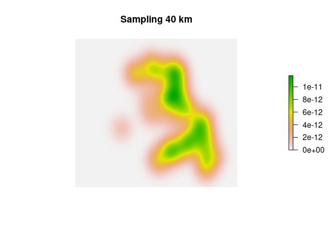<!-- -->

``` r
# Save output
#writeRaster(sampling_kd, file.path(data_dir, "processed/sample_kernel_density_40km.tif"), overwrite = TRUE)

# --- 20 km bandwidth ---

# Compute 2D kernel density (bandwidth)
est <- bkde2D(coords_m,
              bandwidth = c(20000, 20000),
              gridsize  = c(nrow(proj_temp), ncol(proj_temp)),
              range.x   = list(c(ext_m$xmin, ext_m$xmax), c(ext_m$ymin, ext_m$ymax)))

# Convert result to raster, project back to WGS84, and match grid
kd_raster <- raster(list(x = est$x1, y = est$x2, z = est$fhat),
                    crs = eqd_crs)
kd_wgs84  <- projectRaster(kd_raster, crs = crs(pixels_raster), res = res(pixels_raster))
sampling_kd <- resample(kd_wgs84, pixels_raster, method = "bilinear")
names(sampling_kd) <- "sampling_20km"
crs(sampling_kd) <- crs(pixels_raster)
plot(sampling_kd, axes = FALSE, box = FALSE, frame.plot = FALSE, main = "Sampling 20 km")
```

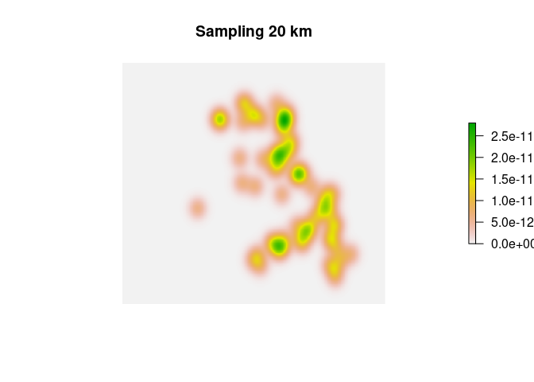<!-- -->

``` r
# Save output
#writeRaster(sampling_kd, file.path(data_dir, "processed/sample_kernel_density_20km.tif"), overwrite = TRUE)

# --- 10 km bandwidth ---

# Compute 2D kernel density (bandwidth)
est <- bkde2D(coords_m,
              bandwidth = c(10000, 10000),
              gridsize  = c(nrow(proj_temp), ncol(proj_temp)),
              range.x   = list(c(ext_m$xmin, ext_m$xmax), c(ext_m$ymin, ext_m$ymax)))

# Convert result to raster, project back to WGS84, and match grid
kd_raster <- raster(list(x = est$x1, y = est$x2, z = est$fhat),
                    crs = eqd_crs)
kd_wgs84  <- projectRaster(kd_raster, crs = crs(pixels_raster), res = res(pixels_raster))
sampling_kd <- resample(kd_wgs84, pixels_raster, method = "bilinear")
names(sampling_kd) <- "sampling_10km"
crs(sampling_kd) <- crs(pixels_raster)
plot(sampling_kd, axes = FALSE, box = FALSE, frame.plot = FALSE, main = "Sampling 10 km")
```

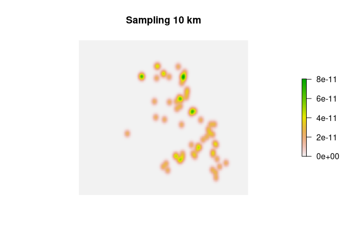<!-- -->

``` r
# Save output
#writeRaster(sampling_kd,file.path(data_dir,  "processed/sample_kernel_density_10km.tif"), overwrite = TRUE)

# --- 5 km bandwidth ---

# Compute 2D kernel density (bandwidth)
est <- bkde2D(coords_m,
              bandwidth = c(5000, 5000),
              gridsize  = c(nrow(proj_temp), ncol(proj_temp)),
              range.x   = list(c(ext_m$xmin, ext_m$xmax), c(ext_m$ymin, ext_m$ymax)))

# Convert result to raster, project back to WGS84, and match grid
kd_raster <- raster(list(x = est$x1, y = est$x2, z = est$fhat),
                    crs = eqd_crs)
kd_wgs84  <- projectRaster(kd_raster, crs = crs(pixels_raster), res = res(pixels_raster))
sampling_kd <- resample(kd_wgs84, pixels_raster, method = "bilinear")
names(sampling_kd) <- "sampling_5km"
crs(sampling_kd) <- crs(pixels_raster)
plot(sampling_kd, axes = FALSE, box = FALSE, frame.plot = FALSE, main = "Sampling 5 km")
```

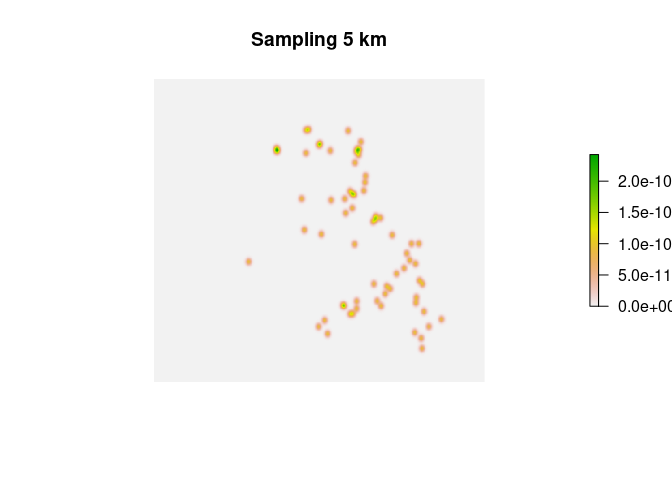<!-- -->

``` r
# Save output
#writeRaster(sampling_kd, file.path(data_dir, "processed/sample_kernel_density_5km.tif"), overwrite = TRUE)
```

# 3. River (and Lake Edge) Kernel Density

``` r
# Read lakes https://www.naturalearthdata.com/downloads/10m-physical-vectors/
lakes_ne <- st_read(file.path(data_dir,"raw/ne_10m_lakes.shp")) # After downloading and unzipping
lakes_ne <- st_transform(lakes_ne, crs = crs_geo)

# Convert terra extent to sf polygon (projected extent)
ext_poly <- as.polygons(ext_m) |> st_as_sf()
st_crs(ext_poly) <- st_crs(proj_temp)  # same CRS as proj_temp

# Transform extent polygon to crs_geo to match lakes_ne
ext_poly_geo <- st_transform(ext_poly, crs = crs_geo)

# Filter lakes that intersect the raster extent
sf_use_s2(FALSE)
target_lakes <- lakes_ne[st_intersects(lakes_ne, ext_poly_geo, sparse = FALSE), ]

# Convert lake polygons to boundaries (as lines)
lake_edges <- st_boundary(target_lakes)

# In case of MULTILINESTRINGs, flatten them to LINESTRINGs
lake_edges <- st_cast(lake_edges, "LINESTRING")

plot(lake_edges$geometry)
```

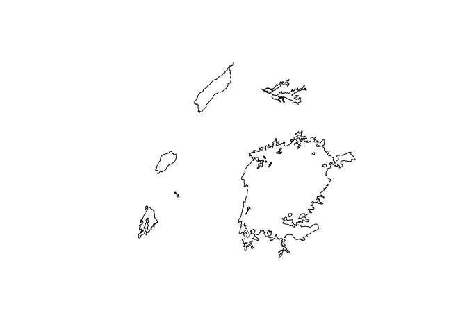<!-- -->

``` r
# Read river shapefile and ensure WGS84 projection
rivers_only <- st_read(file.path(data_dir, "raw/Uganda_rivers_shape.shp"))
rivers_only <- st_transform(rivers_only, crs = crs_geo)

# Combine with rivers
rivers <- c(
  st_geometry(rivers_only),    # existing river lines
  st_geometry(lake_edges)      # lake perimeters as lines
)
plot(st_geometry(rivers))
```

<!-- -->

``` r
# Explode all to LINESTRING first
rivers <- st_cast(rivers, "LINESTRING")

# Densify rivers using 250 meter spacing with parallel workers
options(future.rng.onMisuse = "ignore")    # suppress future RNG warnings
plan(multisession, workers = 4)            # 4 local cores, each gets a chunk
river_dense_list <- future_lapply(st_geometry(rivers), function(geom) { #densify
  st_segmentize(geom, dfMaxLength = set_units(250, "m"))
})
rivers_dense <- st_sf(geometry = st_sfc(river_dense_list, # Rebuild sf object
                                crs = st_crs(rivers)))
plan(sequential)                                          # Reset plan to default

# Cast to POINT geometries and project to equal-distance CRS
eqd_crs <- "+proj=eqdc +lat_0=39 +lon_0=-96 +lat_1=33 +lat_2=45 +datum=NAD83 +units=m"
river_points <- st_cast(rivers_dense, "POINT")
river_points_eqd <- st_transform(river_points, crs = eqd_crs)
coords_river_m <- st_coordinates(river_points_eqd)

# --- 10 km bandwidth ---

# Use same raster template and extent as for sampling
est_riv <- bkde2D(coords_river_m,
                  bandwidth = c(10000, 10000),
                  gridsize  = c(nrow(proj_temp), ncol(proj_temp)),
                  range.x   = list(c(ext_m$xmin, ext_m$xmax), c(ext_m$ymin, ext_m$ymax)))

# Convert to raster, reproject, resample
kd_river <- raster(list(x = est_riv$x1, y = est_riv$x2, z = est_riv$fhat),
                   crs = eqd_crs)
kd_river_wgs84 <- projectRaster(kd_river, crs = crs(pixels_raster), res = res(pixels_raster))
river_kd <- resample(kd_river_wgs84, pixels_raster, method = "bilinear")
names(river_kd) <- "river_10km"
crs(river_kd) <- crs(pixels_raster)
plot(river_kd, axes = FALSE, box = FALSE, frame.plot = FALSE, main = "Rivers 10 km")
```

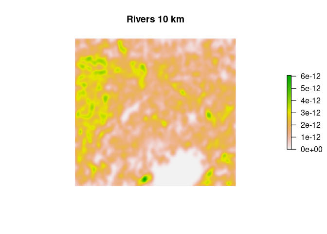<!-- -->

``` r
# Save output
#writeRaster(river_kd, file.path(data_dir, "processed/river_kernel_density_10km.tif"), overwrite = TRUE)

# --- 5 km bandwidth ---

# Use same raster template and extent as for sampling
est_riv <- bkde2D(coords_river_m,
                  bandwidth = c(5000, 5000),
                  gridsize  = c(nrow(proj_temp), ncol(proj_temp)),
                  range.x   = list(c(ext_m$xmin, ext_m$xmax), c(ext_m$ymin, ext_m$ymax)))

# Convert to raster, reproject, resample
kd_river <- raster(list(x = est_riv$x1, y = est_riv$x2, z = est_riv$fhat),
                   crs = eqd_crs)
kd_river_wgs84 <- projectRaster(kd_river, crs = crs(pixels_raster), res = res(pixels_raster))
river_kd <- resample(kd_river_wgs84, pixels_raster, method = "bilinear")
names(river_kd) <- "river_5km"
crs(river_kd) <- crs(pixels_raster)
plot(river_kd, axes = FALSE, box = FALSE, frame.plot = FALSE, main = "Rivers 5 km")
```

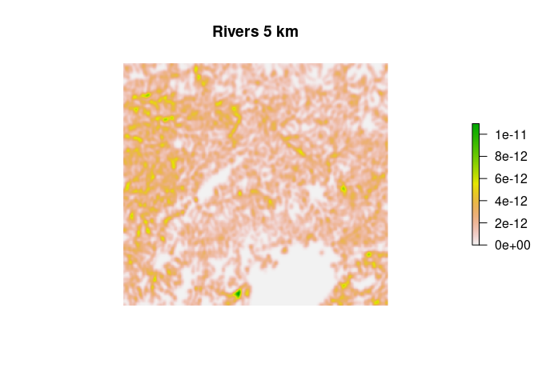<!-- -->

``` r
# Save output
#writeRaster(river_kd, file.path(data_dir, "processed/river_kernel_density_5km.tif"), overwrite = TRUE)

# --- 3 km bandwidth ---

# Use same raster template and extent as for sampling
est_riv <- bkde2D(coords_river_m,
                  bandwidth = c(3000, 3000),
                  gridsize  = c(nrow(proj_temp), ncol(proj_temp)),
                  range.x   = list(c(ext_m$xmin, ext_m$xmax), c(ext_m$ymin, ext_m$ymax)))

# Convert to raster, reproject, resample
kd_river <- raster(list(x = est_riv$x1, y = est_riv$x2, z = est_riv$fhat),
                   crs = eqd_crs)
kd_river_wgs84 <- projectRaster(kd_river, crs = crs(pixels_raster), res = res(pixels_raster))
river_kd <- resample(kd_river_wgs84, pixels_raster, method = "bilinear")
names(river_kd) <- "river_3km"
crs(river_kd) <- crs(pixels_raster)
plot(river_kd, axes = FALSE, box = FALSE, frame.plot = FALSE, main = "Rivers 3 km")
```

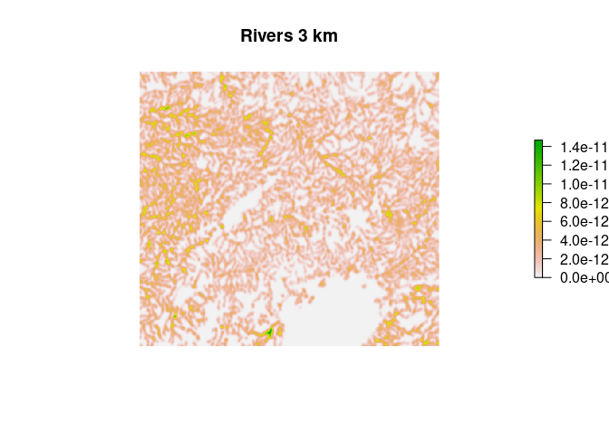<!-- -->

``` r
# Save output
#writeRaster(river_kd, file.path(data_dir, "processed/river_kernel_density_3km.tif"), overwrite = TRUE)

# --- 2 km bandwidth ---

# Use same raster template and extent as for sampling
est_riv <- bkde2D(coords_river_m,
                  bandwidth = c(2000, 2000),
                  gridsize  = c(nrow(proj_temp), ncol(proj_temp)),
                  range.x   = list(c(ext_m$xmin, ext_m$xmax), c(ext_m$ymin, ext_m$ymax)))

# Convert to raster, reproject, resample
kd_river <- raster(list(x = est_riv$x1, y = est_riv$x2, z = est_riv$fhat),
                   crs = eqd_crs)
kd_river_wgs84 <- projectRaster(kd_river, crs = crs(pixels_raster), res = res(pixels_raster))
river_kd <- resample(kd_river_wgs84, pixels_raster, method = "bilinear")
names(river_kd) <- "river_2km"
crs(river_kd) <- crs(pixels_raster)
plot(river_kd, axes = FALSE, box = FALSE, frame.plot = FALSE, main = "Rivers 2 km")
```

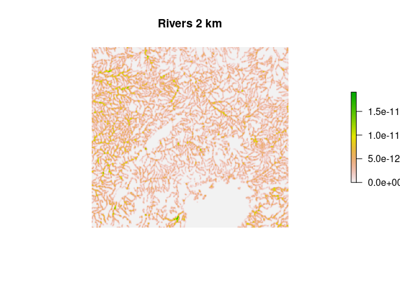<!-- -->

``` r
# Save output
#writeRaster(river_kd,file.path(data_dir, "processed/river_kernel_density_2km.tif"),overwrite = TRUE)

# --- 1 km bandwidth ---

# Use same raster template and extent as for sampling
est_riv <- bkde2D(coords_river_m,
                  bandwidth = c(1000, 1000),
                  gridsize  = c(nrow(proj_temp), ncol(proj_temp)),
                  range.x   = list(c(ext_m$xmin, ext_m$xmax), c(ext_m$ymin, ext_m$ymax)))

# Convert to raster, reproject, resample
kd_river <- raster(list(x = est_riv$x1, y = est_riv$x2, z = est_riv$fhat),
                   crs = eqd_crs)
kd_river_wgs84 <- projectRaster(kd_river, crs = crs(pixels_raster), res = res(pixels_raster))
river_kd <- resample(kd_river_wgs84, pixels_raster, method = "bilinear")
names(river_kd) <- "river_1km"
crs(river_kd) <- crs(pixels_raster)
plot(river_kd, axes = FALSE, box = FALSE, frame.plot = FALSE, main = "Rivers 1 km")
```

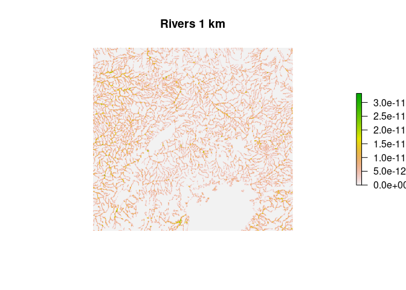<!-- -->

``` r
# Save output
#writeRaster(river_kd,file.path(data_dir, "processed/river_kernel_density_1km.tif"),overwrite = TRUE)
```

# 4. Lake binary mask (using target_lakes)

``` r
# target_lakes: sf of lake polygons already filtered to our extent
# Convert to Spatial for rasterization
target_lakes_sp <- as(target_lakes, "Spatial")

# Rasterize: 1 = lake, 0 = land
lake_binary <- rasterize(
  target_lakes_sp,
  pixels_raster,
  field      = 1,
  background = 0
)
names(lake_binary) <- "lake_binary"
plot(lake_binary, axes = FALSE, box = FALSE, frame.plot = FALSE, main = "Lakes")
```

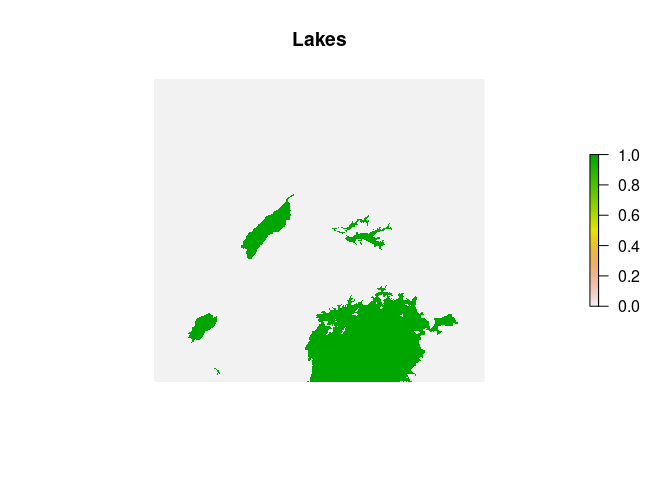<!-- -->

``` r
# Save lake mask
#writeRaster(lake_binary, filename  = file.path(data_dir, "processed/lake_binary.tif"), overwrite = TRUE)
```

# 5. Uniform geographic distance layer

``` r
# Copy the template and set every value to 1
geo_dist <- pixels_raster
values(geo_dist) <- 1
names(geo_dist) <- "geo_dist_uniform"
plot(geo_dist, axes = FALSE, box = FALSE, frame.plot = FALSE, main = "Uniform surface")
```

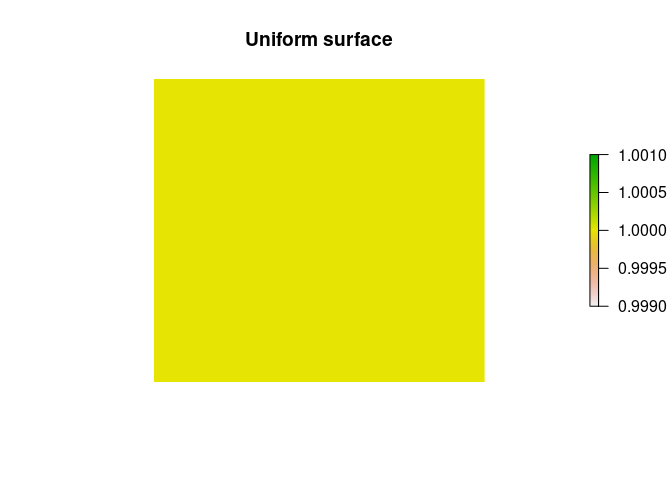<!-- -->

``` r
# Save uniform distance raster
#writeRaster(geo_dist,filename  = file.path(data_dir, "processed/geo_dist_uniform.tif"),overwrite = TRUE)
```
