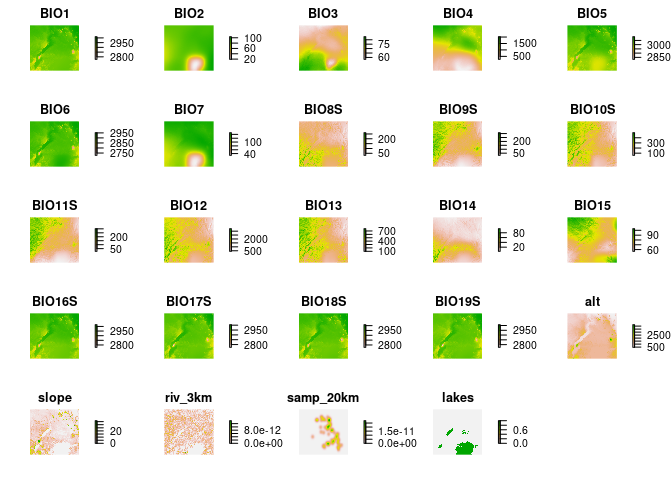

Extract environmental variables along paths
================
Norah Saarman
2025-06-13

- [Setup](#setup)
- [Inputs](#inputs)
- [Outputs](#outputs)
- [1. Load environmental rasters](#1-load-environmental-rasters)
- [2. Extract mean, median, mode for each env summaries in
  parallel](#2-extract-mean-median-mode-for-each-env-summaries-in-parallel)

RStudio Configuration:  
- **R version:** R 4.4.0 (Geospatial packages)  
- **Number of cores:** 4 (up to 32 available)  
- **Account:** saarman-np  
- **Partition:** saarman-shared-np (allows multiple simultaneous jobs)  
- **Memory per job:** 100G (cluster limit: 1000G total; avoid exceeding
half)

# Setup

``` r
# load only required packages
library(raster)
library(gdistance)
library(sp)
library(sf)
library(foreach)
library(doParallel)
library(ggplot2)
library(rnaturalearth)
library(viridis)
library(units)
library(future.apply)

# base directories
data_dir  <- "/uufs/chpc.utah.edu/common/home/saarman-group1/uganda-tsetse-LG/data"
input_dir <- "../input"

# read the combined CSE + coords table
G.table <- read.csv(file.path(input_dir, "Gff_11loci_68sites_cse.csv"),
                    header = TRUE)

# simple mode helper
get_mode <- function(x) {
  ux <- unique(x[!is.na(x)])
  ux[ which.max(tabulate(match(x, ux))) ]
}

# define coordinate reference system
crs_geo <- 4326     # EPSG code for WGS84
```

# Inputs

- `../input/Gff_11loci_68sites_cse.csv` - Combined CSE table with
  coordinates (long1, lat1, long2, lat2)
- `../data_dir/processed/altitude_1KMmedian_MERIT_UgandaClip.tif` -
  Median elevation at 1 km resolution (MERIT DEM)  
- `../data_dir/processed/slope_1KMmedian_MERIT_UgandaClip.tif` - Median
  slope (degrees) at 1 km resolution (derived from MERIT DEM)  
- `../data_dir/processed/UgandaBiovarsSeasonalAllYears.tif` - Seasonal
  BioClim variables (all seasons, all years)  
- `../data_dir/processed/river_kernel_density_3km.tif` - 3 km river+lake
  edge density
- `../data_dir/processed/sample_kernel_density_20km.tif` - 20 km
  sampling density
- `../data_dir/processed/lake_binary.tif` - binary lake mask (1 = water,
  0 = land)  
- `../data_dir/processed/geo_dist_uniform.tif` - uniform geographic
  distance raster  
- `../data_dir/raw/ne_10m_lakes.shp` - shapefile of lakes  
- `../data_dir/processed/LC_paths.shp` - Least cost paths spatialLines
  shapefile

# Outputs

- `../input/Gff_cse_envCostPaths.csv` - Combined CSE table with
  coordinates (long1, lat1, long2, lat2), pix_dist = geographic distance
  in sum of pixels, and mean, median, mode of each Env parameter

# 1. Load environmental rasters

``` r
# define WGS84 CRS
crs_geo <- "+proj=longlat +datum=WGS84 +no_defs"

# load seasonal BioClim stack and assign CRS
envvars1 <- stack(
  file.path(data_dir, "processed", "UgandaBiovarsSeasonalAllYears.tif"))
crs(envvars1) <- crs_geo
names(envvars1) <- c(paste0("BIO", 8:11, "S"), paste0("BIO", 16:19, "S"))


# load additional BioClim layers (annual, monthly, etc) and assign CRS
envvars2 <- stack(
  file.path(data_dir, "processed","UgandaBiovarsQuartersAllYears.tif"))
crs(envvars1) <- crs_geo
names(envvars2) <- paste0("BIO",c(1:19))

# combine envvars in order
envvars <- raster::stack(envvars2[[1:7]],envvars1[[1:4]],envvars2[[12:15]],envvars1[[5:8]])

# load elevation and slope rasters
altitude <- raster(
  file.path(data_dir, "processed", "altitude_1KMmedian_MERIT_UgandaClip.tif"))
crs(altitude) <- crs_geo
names(altitude) <- "alt"

slope <- raster(
  file.path(data_dir, "processed", "slope_1KMmedian_MERIT_UgandaClip.tif"))
crs(slope) <- crs_geo
names(slope) <- "slope"

# load river and sampling kernels
rivers <- raster(
  file.path(data_dir, "processed", "river_kernel_density_3km.tif"))
crs(rivers) <- crs_geo
names(rivers) <- "riv_3km" 

kernel <- raster(
  file.path(data_dir, "processed", "sample_kernel_density_20km.tif"))
crs(kernel) <- crs_geo
names(kernel) <- "samp_20km" 

# load lake binary layer
lakeRaster <- raster(
  file.path(data_dir, "processed", "lake_binary.tif"))
crs(lakeRaster) <- crs_geo
names(lakeRaster) <- "lakes"

# load uniform geo‐distance raster
geo_dist <- raster(
  file.path(data_dir, "processed", "geo_dist_uniform.tif"))
crs(geo_dist) <- crs_geo
names(geo_dist) <- "uniform"

# stack everything except uniform geo_dist into one object
env <- stack(envvars, altitude, slope, rivers, kernel, lakeRaster)
plot(env, maxnl = nlayers(env), axes = FALSE, box = FALSE, frame.plot = FALSE)
```

<!-- -->

``` r
# plot slope for example
plot(env[["slope"]], axes = FALSE, box = FALSE, frame.plot = FALSE)
```

<!-- -->

# 2. Extract mean, median, mode for each env summaries in parallel

``` r
# assumes shape file of least-cost paths have already been created
lines_sf <- st_read(file.path(data_dir,"processed","LC_paths.shp"), quiet=TRUE)

# convert to a SpatialLinesDataFrame
lines_sldf <- as(lines_sf, "Spatial")

# split into a list of single‐line SpatialLines objects
sp_lines_list <- lapply(seq_len(length(lines_sldf)), function(i) {
  lines_sldf[i, ]
})

# spin up 4 cores
cl <- makeCluster(4)
registerDoParallel(cl)

# mean, median, mode of each env layer along each line
env_summ <- foreach(i = seq_along(sp_lines_list),
                    .combine = rbind,
                    .packages = "raster") %dopar% {
  vals <- extract(env, sp_lines_list[[i]])[[1]]
  means <- colMeans(vals, na.rm = TRUE)
  medians <- apply(vals, 2, median, na.rm = TRUE)
  modes <- apply(vals, 2, get_mode)
  data.frame(t(c(means, medians, modes)))
  }

# sum across paths for geo-distances
geo_dist_sum <- foreach(i = seq_along(sp_lines_list),
                            .combine = c,
                            .packages = "raster") %dopar% {
  vals <- extract(geo_dist, sp_lines_list[[i]])[[1]]
  sum(vals, na.rm = TRUE)

# shut down cores
stopCluster(cl)

# name geodist column for data frame
pix_dist <- data.frame(pix_dist = geo_dist_sum)

# suppose 'env' is your RasterStack; get its layer names
lay_names <- names(env)

# build the new column names
new_names <- c(
  paste0(lay_names, "_mean"),
  paste0(lay_names, "_median"),
  paste0(lay_names, "_mode")
)

# env_summ currently comes out with 3 * length(lay_names) columns
# so we just assign in that order
colnames(env_summ) <- new_names

# cbind
res <- cbind(G.table, pix_dist, env_summ)

#preview
head(res)

# and write it all out to a single CSV
write.csv(
  res,
  file.path(input_dir, "Gff_cse_envCostPaths.csv"),
  row.names = FALSE
)
```
