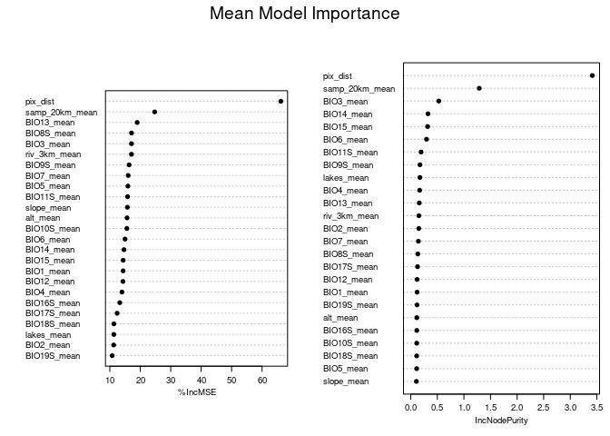
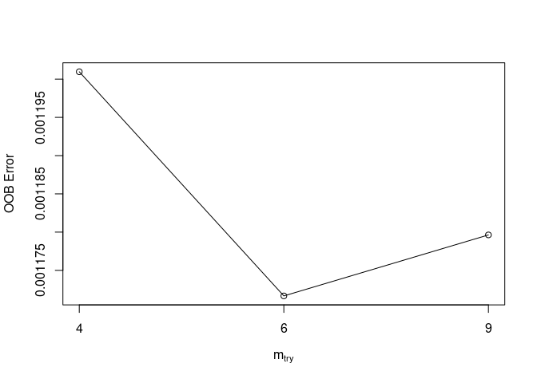
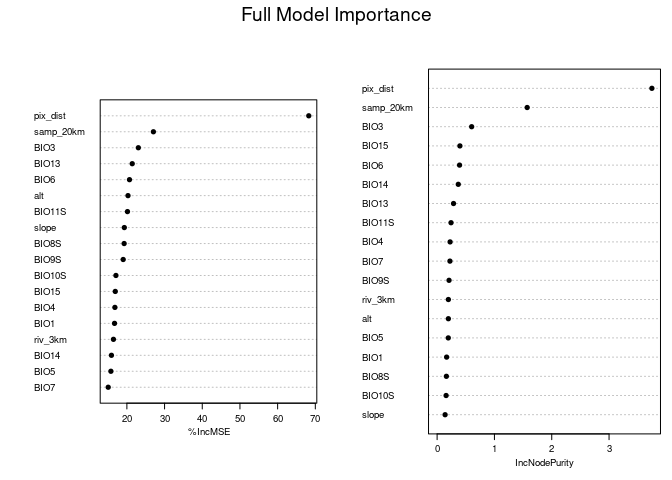
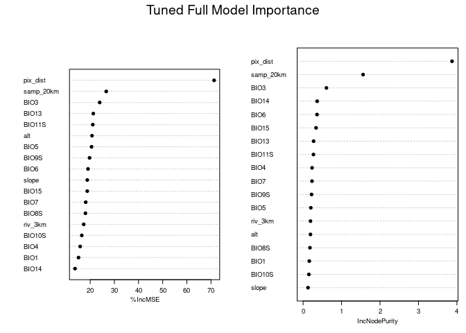
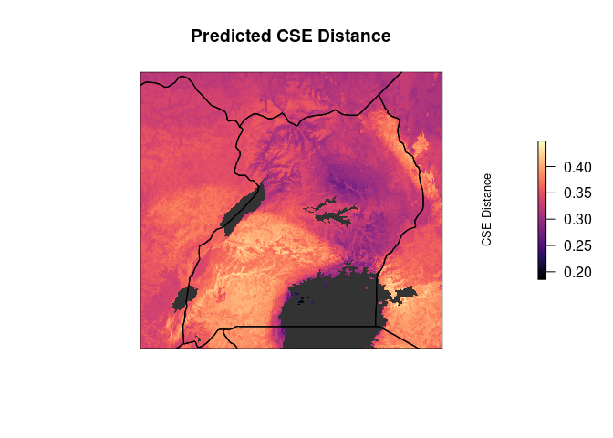

RF model full – LC lakes paths
================
Norah Saarman
2025-06-17

- [Setup](#setup)
- [Inputs](#inputs)
- [Outputs](#outputs)
- [1. Prepare the data](#1-prepare-the-data)
- [2. Build full Random Forest model](#2-build-full-random-forest-model)
- [2. Prune variables?](#2-prune-variables)
  - [Compare mean versus median versus
    mode:](#compare-mean-versus-median-versus-mode)
  - [Prune more variables after narrowing to mean
    only?](#prune-more-variables-after-narrowing-to-mean-only)
  - [Top 18 predictors](#top-18-predictors)
- [3. Tune random forest with chosen
  variables](#3-tune-random-forest-with-chosen-variables)
  - [Compare full and full tuned models (top 18 mean-only
    predictors)](#compare-full-and-full-tuned-models-top-18-mean-only-predictors)
  - [Top contributors:](#top-contributors)
- [4. Projection of model](#4-projection-of-model)

RStudio Configuration:  
- **R version:** R 4.4.0 (Geospatial packages)  
- **Number of cores:** 4 (up to 32 available)  
- **Account:** saarman-np  
- **Partition:** saarman-shared-np (allows multiple simultaneous jobs)  
- **Memory per job:** 100G (cluster limit: 1000G total; avoid exceeding
half)

# Setup

``` r
# load only required packages
library(randomForest)
library(doParallel)
library(raster)
library(sf)
library(viridis)

# base directories
data_dir  <- "/uufs/chpc.utah.edu/common/home/saarman-group1/uganda-tsetse-LG/data"
input_dir <- "../input"
results_dir <- "/uufs/chpc.utah.edu/common/home/saarman-group1/uganda-tsetse-LG/results"

# read the combined CSE + coords table + pix_dist + Env variables
V.table <- read.csv(file.path(input_dir, "Gff_cse_envCostPaths.csv"),
                    header = TRUE)

# define coordinate reference system
crs_geo <- 4326     # EPSG code for WGS84

# simple mode helper
get_mode <- function(x) {
  ux <- unique(x[!is.na(x)])
  ux[ which.max(tabulate(match(x, ux))) ]
}

# setup running in parallel
cl <- makeCluster(4)
registerDoParallel(cl)
clusterExport(cl, "get_mode")
```

# Inputs

- `../input/Gff_cse_envCostPaths.csv` - Combined CSE table with
  coordinates (long1, lat1, long2, lat2), pix_dist = geographic distance
  in sum of pixels, and mean, median, mode of each Env parameter

# Outputs

- Full RF model output
- Projection of full RF model

# 1. Prepare the data

``` r
# Assign input, checking for any rows with NA
sum(!complete.cases(V.table))  # should return 0
```

    ## [1] 0

``` r
rf_data <- na.omit(V.table)    # should omit zero rows

# Confirm that CSEdistance is numeric
rf_data$CSEdistance <- as.numeric(rf_data$CSEdistance)

# Select variables: all predictors (mean, median, mode)  
predictor_vars <- c("pix_dist",                      # geo dist
  paste0("BIO", 1:7, "_mean"),                       # mean 
  paste0("BIO", 8:11, "S_mean"),                     # mean
  paste0("BIO", 12:15, "_mean"),                     # mean
  paste0("BIO", 16:19, "S_mean"),                    # mean
  "alt_mean", "slope_mean", "riv_3km_mean",          # mean
  "samp_20km_mean", "lakes_mean",                    # mean
  paste0("BIO", 1:7, "_median"),                     # median
  paste0("BIO", 8:11, "S_median"),                   # median
  paste0("BIO", 12:15, "_median"),                   # median
  paste0("BIO", 16:19, "S_median"),                  # median
  "alt_median", "slope_median", "riv_3km_median",    # median
  "samp_20km_median", "lakes_median",                # median
  paste0("BIO", 1:7, "_mode"),                       # mode
  paste0("BIO", 8:11, "S_mode"),                     # mode
  paste0("BIO", 12:15, "_mode"),                     # mode
  paste0("BIO", 16:19, "S_mode"),                    # mode
  "alt_mode", "slope_mode", "riv_3km_mode",          # mode
  "samp_20km_mode", "lakes_mode"                     # mode
)

# subset predictors that we want to use
rf_data <- rf_data[, c("CSEdistance", predictor_vars)]
```

# 2. Build full Random Forest model

``` r
# Build full RF model
set.seed(1234)  # ensures reproducibility
rf_full <- randomForest(
  CSEdistance ~ .,
  data = rf_data,
  importance = TRUE,
  ntree = 500
)

print(rf_full)
```

    ## 
    ## Call:
    ##  randomForest(formula = CSEdistance ~ ., data = rf_data, importance = TRUE,      ntree = 500) 
    ##                Type of random forest: regression
    ##                      Number of trees: 500
    ## No. of variables tried at each split: 24
    ## 
    ##           Mean of squared residuals: 0.001127682
    ##                     % Var explained: 86.8

``` r
importance(rf_full)
```

    ##                     %IncMSE IncNodePurity
    ## pix_dist         57.2233328  3.409299e+00
    ## BIO1_mean         8.2461974  2.811689e-02
    ## BIO2_mean         6.2205356  4.695578e-02
    ## BIO3_mean        13.8628947  3.025302e-01
    ## BIO4_mean        12.4853783  5.961137e-02
    ## BIO5_mean         8.8231630  3.931383e-02
    ## BIO6_mean        12.9434294  1.720245e-01
    ## BIO7_mean        10.4025482  5.810920e-02
    ## BIO8S_mean        9.4575906  4.078228e-02
    ## BIO9S_mean        9.9226692  6.741861e-02
    ## BIO10S_mean       9.3021209  4.715939e-02
    ## BIO11S_mean      11.5870313  9.269949e-02
    ## BIO12_mean        8.8130082  5.721936e-02
    ## BIO13_mean        9.1743978  8.197544e-02
    ## BIO14_mean        8.6864026  1.277451e-01
    ## BIO15_mean        7.3633484  1.075320e-01
    ## BIO16S_mean       9.1728532  3.020069e-02
    ## BIO17S_mean      10.3066592  4.639070e-02
    ## BIO18S_mean       7.8550923  3.375701e-02
    ## BIO19S_mean       8.3554613  3.849249e-02
    ## alt_mean          9.2259072  4.515102e-02
    ## slope_mean       13.2790835  3.670555e-02
    ## riv_3km_mean     11.2862173  5.355017e-02
    ## samp_20km_mean   19.0065773  9.865145e-01
    ## lakes_mean        6.1078728  6.347136e-02
    ## BIO1_median       7.9683403  3.783837e-02
    ## BIO2_median      10.6800553  4.941583e-02
    ## BIO3_median      16.0788413  1.274061e-01
    ## BIO4_median      12.6134372  4.868474e-02
    ## BIO5_median       8.5235307  5.481466e-02
    ## BIO6_median      11.9238451  2.206315e-01
    ## BIO7_median      13.0870828  4.751271e-02
    ## BIO8S_median      7.6502585  3.198425e-02
    ## BIO9S_median     12.4788456  7.800545e-02
    ## BIO10S_median    10.2763599  4.962403e-02
    ## BIO11S_median     8.0079633  8.495971e-02
    ## BIO12_median      7.7370582  4.047373e-02
    ## BIO13_median     10.8340283  9.814140e-02
    ## BIO14_median      5.2690494  2.565693e-02
    ## BIO15_median     13.3920658  7.899323e-02
    ## BIO16S_median     5.3423100  3.694671e-02
    ## BIO17S_median     7.8182722  3.743202e-02
    ## BIO18S_median     7.2606414  2.456747e-02
    ## BIO19S_median    12.0728952  3.596723e-02
    ## alt_median       10.5339166  5.992962e-02
    ## slope_median     10.9756244  4.639782e-02
    ## riv_3km_median   10.5419488  4.901675e-02
    ## samp_20km_median 15.7768316  7.665258e-01
    ## lakes_median     -0.7662631  3.724073e-05
    ## BIO1_mode        11.0515036  2.911252e-02
    ## BIO2_mode         9.9009386  6.934078e-02
    ## BIO3_mode        14.1347022  7.549949e-02
    ## BIO4_mode        11.4838217  2.897795e-02
    ## BIO5_mode         8.7336641  3.442985e-02
    ## BIO6_mode         8.6436310  1.241677e-01
    ## BIO7_mode        10.2872419  3.256384e-02
    ## BIO8S_mode        4.9994723  2.639211e-02
    ## BIO9S_mode       10.3014623  3.179655e-02
    ## BIO10S_mode      11.6438096  3.904631e-02
    ## BIO11S_mode       9.7512884  5.379046e-02
    ## BIO12_mode        6.4835590  2.905746e-02
    ## BIO13_mode       10.5440452  3.566376e-02
    ## BIO14_mode        9.7837516  2.884828e-02
    ## BIO15_mode        8.5634491  7.748932e-02
    ## BIO16S_mode       9.3822337  3.064583e-02
    ## BIO17S_mode      10.5342702  4.043393e-02
    ## BIO18S_mode       7.4106357  2.707043e-02
    ## BIO19S_mode       9.9145396  6.082623e-02
    ## alt_mode         10.5745468  2.652980e-02
    ## slope_mode        9.8089404  3.519143e-02
    ## riv_3km_mode      7.6268007  4.166634e-02
    ## samp_20km_mode   13.3788158  3.440249e-01
    ## lakes_mode       -1.0010015  1.460090e-04

# 2. Prune variables?

## Compare mean versus median versus mode:

``` r
# Extract groups of variables by suffix
mean_vars   <- grep("_mean$", names(rf_data), value = TRUE)
median_vars <- grep("_median$", names(rf_data), value = TRUE)
mode_vars   <- grep("_mode$", names(rf_data), value = TRUE)

# Always include geographic distance
common_var <- "pix_dist"

# Build and run each model
set.seed(123438972)  # ensures reproducibility
rf_mean <- randomForest(CSEdistance ~ ., data = rf_data[, c("CSEdistance", common_var, mean_vars)], ntree = 500, importance = TRUE)
rf_median <- randomForest(CSEdistance ~ ., data = rf_data[, c("CSEdistance", common_var, median_vars)], ntree = 500, importance = TRUE)
rf_mode <- randomForest(CSEdistance ~ ., data = rf_data[, c("CSEdistance", common_var, mode_vars)], ntree = 500, importance = TRUE)

# Compare performance
c(mean = rf_mean$rsq[500] * 100,
  median = rf_median$rsq[500] * 100,
  mode = rf_mode$rsq[500] * 100)
```

    ##     mean   median     mode 
    ## 86.05681 85.53271 85.16006

Including mean of env variable along least cost paths performs the best,
adding median and mode does not greatly improve the model and increases
risks of over fitting…

Could add in minimum, maximum, standard deviation, range, turnover
(analogous to slope) etc… later!

## Prune more variables after narrowing to mean only?

``` r
# Plot variable importance
par(mar = c(5, 10, 2, 2))  # bottom, left, top, right
varImpPlot(rf_mean, main = "Mean Model Importance",cex = 0.6, pch = 19)
```

<!-- -->

``` r
# Rank variables by %IncMSE (from tuned model)
imp <- importance(rf_mean)[, "%IncMSE"]
imp <- sort(imp, decreasing = TRUE)

# Multiple runs with N top predictors
# Store results
prune_results <- list()
n_list <- c(5:length(imp))

for (n in n_list) {
  top_vars <- names(imp)[1:n]
  formula_n <- as.formula(paste("CSEdistance ~", paste(top_vars, collapse = " + ")))
  
  set.seed(1234783645)
  rf_n <- randomForest(
    formula = formula_n,
    data = rf_data,
    ntree = 500,
    importance = TRUE
  )
  
  prune_results[[paste0("Top", n)]] <- rf_n
}

sapply(prune_results, function(mod) {
  c(OOB_MSE = mod$mse[500], VarExpl = mod$rsq[500] * 100)
})
```

    ##                 Top5         Top6         Top7         Top8        Top9
    ## OOB_MSE  0.001378454  0.001233934  0.001234894  0.001189004  0.00119538
    ## VarExpl 83.863469172 85.555258949 85.544017957 86.081215619 86.00657580
    ##                Top10        Top11        Top12        Top13        Top14
    ## OOB_MSE  0.001185355  0.001182811  0.001175771  0.001162388  0.001171419
    ## VarExpl 86.123938248 86.153718082 86.236130074 86.392792836 86.287071970
    ##                Top15        Top16        Top17        Top18        Top19
    ## OOB_MSE  0.001168933  0.001173137  0.001170081  0.001167182  0.001179703
    ## VarExpl 86.316176590 86.266961746 86.302736644 86.336667268 86.190093777
    ##               Top20        Top21        Top22        Top23        Top24
    ## OOB_MSE  0.00117958  0.001158376  0.001173274  0.001185691  0.001178741
    ## VarExpl 86.19153960 86.439755060 86.265359946 86.120005290 86.201365855
    ##                Top25
    ## OOB_MSE  0.001173343
    ## VarExpl 86.264546750

% Variance Explained increases rapidly up to around 18 variables, after
which it plateaus.

OOB MSE decreases quickly early on, with minimal gains beyond the top
~18 predictors.

## Top 18 predictors

``` r
# Get variable importance
var_imp <- importance(rf_mean)[, "%IncMSE"]

# Sort and get names of top 18 predictors
top18_vars <- names(sort(var_imp, decreasing = TRUE))[1:18]

rf_top18_data <- rf_data[, c("CSEdistance", top18_vars)]
```

# 3. Tune random forest with chosen variables

``` r
# Subset data for the mean-only model
#rf_mean_data <- rf_data[, c("CSEdistance", common_var, mean_vars)]
rf_mean_data <- rf_data[, c("CSEdistance", top18_vars)]

# Rename predictors by removing "_mean" for later projections
names(rf_mean_data) <- gsub("_mean$", "", names(rf_mean_data))

# Build full RF model
set.seed(10981234)  # ensures reproducibility
rf_mean18 <- randomForest(
  CSEdistance ~ .,
  data = rf_mean_data,
  importance = TRUE,
  ntree = 500
)

print(rf_mean18)
```

    ## 
    ## Call:
    ##  randomForest(formula = CSEdistance ~ ., data = rf_mean_data,      importance = TRUE, ntree = 500) 
    ##                Type of random forest: regression
    ##                      Number of trees: 500
    ## No. of variables tried at each split: 6
    ## 
    ##           Mean of squared residuals: 0.001186111
    ##                     % Var explained: 86.12

``` r
importance(rf_mean18)
```

    ##            %IncMSE IncNodePurity
    ## pix_dist  68.26582     3.7473878
    ## samp_20km 27.03633     1.5715196
    ## BIO3      23.04118     0.6027221
    ## BIO11S    20.15872     0.2429617
    ## BIO7      15.04943     0.2237217
    ## BIO6      20.69409     0.3917131
    ## BIO13     21.42089     0.2866575
    ## BIO4      16.82231     0.2265064
    ## alt       20.29698     0.1964753
    ## BIO5      15.75939     0.1949511
    ## riv_3km   16.43603     0.1965698
    ## BIO15     16.92251     0.3976390
    ## BIO10S    17.09371     0.1568443
    ## BIO8S     19.27274     0.1617264
    ## slope     19.32200     0.1392786
    ## BIO14     15.90573     0.3694579
    ## BIO1      16.72155     0.1658423
    ## BIO9S     19.02293     0.2081613

``` r
# Tune mtry (number of variables tried at each split)
set.seed(92834567)
rf_mean18_tuned <- tuneRF(
  x = rf_mean_data[, -1],   # exclude response variable
  y = rf_mean_data$CSEdistance,
  ntreeTry = 500,
  stepFactor = 1.5,         # factor by which mtry is increased/decreased
  improve = 0.01,           # minimum improvement to continue search
  trace = TRUE,             # print progress
  plot = TRUE,              # plot OOB error vs mtry
  doBest = TRUE,             # return the model with lowest OOB error
  importance = TRUE
)
```

    ## mtry = 6  OOB error = 0.001163416 
    ## Searching left ...
    ## mtry = 4     OOB error = 0.001196531 
    ## -0.02846368 0.01 
    ## Searching right ...
    ## mtry = 9     OOB error = 0.001169886 
    ## -0.005561065 0.01

<!-- -->

## Compare full and full tuned models (top 18 mean-only predictors)

``` r
print(rf_mean18)
```

    ## 
    ## Call:
    ##  randomForest(formula = CSEdistance ~ ., data = rf_mean_data,      importance = TRUE, ntree = 500) 
    ##                Type of random forest: regression
    ##                      Number of trees: 500
    ## No. of variables tried at each split: 6
    ## 
    ##           Mean of squared residuals: 0.001186111
    ##                     % Var explained: 86.12

``` r
print(rf_mean18_tuned)
```

    ## 
    ## Call:
    ##  randomForest(x = x, y = y, mtry = res[which.min(res[, 2]), 1],      importance = TRUE) 
    ##                Type of random forest: regression
    ##                      Number of trees: 500
    ## No. of variables tried at each split: 6
    ## 
    ##           Mean of squared residuals: 0.001176689
    ##                     % Var explained: 86.23

``` r
data.frame(
  Model = c("Full (default mtry)", paste("Tuned (mtry = ",rf_mean18_tuned$mtry,")")),
  MSE = c(rf_mean18$mse[rf_mean18$ntree], rf_mean18_tuned$mse[rf_mean18_tuned$ntree]),
  Rsq = c(rf_mean18$rsq[rf_mean18$ntree], rf_mean18_tuned$rsq[rf_mean18_tuned$ntree])
)
```

    ##                 Model         MSE       Rsq
    ## 1 Full (default mtry) 0.001186111 0.8611509
    ## 2  Tuned (mtry =  6 ) 0.001176689 0.8622539

``` r
par(mar = c(5, 30, 2,2))  # bottom, left, top, right
varImpPlot(rf_mean18, main = "Full Model Importance",cex = 0.6, pch = 19)
```

<!-- -->

``` r
varImpPlot(rf_mean18_tuned, main = "Tuned Full Model Importance",cex = 0.6, pch = 19)
```

<!-- --> That’s a
very small improvement from tuning:

Default (mtry = of about 7):  
- MSE: 0.001178  
- RSQ: 86.21%

Tuned (mtry = 6):  
- MSE: 0.001170 - RSQ: 86.30%

The tuned model performs slightly better, but the gain may not be
meaningful… however, it does confirm that the model is stable and that
the mean-only predictors carry strong signal.

Top 18 mean-based predictors retain nearly all the explanatory power of
the original full model with 42 predictors.

## Top contributors:

- pix_dist (geographic distance)  
- samp_20km_mean (sampling effort)  
- BIO3_mean (isothermality)  
- BIO6_mean (min temperature of coldest month)  
- BIO15_mean (precipitation seasonality)  
- BIO13_mean and BIO11S_mean (mean precip. of wettest month, mean temp
  of coldest season)

# 4. Projection of model

``` r
# Load env stack
env <- stack(file.path(data_dir, "processed", "env_stack.grd"))

# Replace samp_20km with neutral constant raster, 
# retains sampling bias in the model but neutralize 
# sampling bias during projection
samp_uniform <- env[["samp_20km"]]
values(samp_uniform) <- mean(rf_data$samp_20km_mean, na.rm = TRUE)
env[["samp_20km"]] <- samp_uniform # Replace in raster stack

prediction_raster <- predict(env, rf_mean18_tuned, type = "response")

# Write Raster to file
writeRaster(prediction_raster,
            file.path(data_dir, "processed", "predicted_CSEdistance.tif"),
            format = "GTiff", overwrite = TRUE)
```

``` r
# Create base plot with viridis
plot(prediction_raster,
     col = viridis::magma(100),
     main = "Predicted CSE Distance",
     axes = FALSE,
     box = FALSE,
     legend.args = list(text = "CSE Distance", side = 2, line = 2.5, cex = 0.8))

# Overlay lakes in dark gray
lakes <- st_read(file.path(data_dir, "raw/ne_10m_lakes.shp"), quiet = TRUE)
lakes <- st_transform(lakes, crs = st_crs(prediction_raster))  # match CRS 
lakes <- st_make_valid(lakes) # fix geometries
r_ext <- st_as_sfc(st_bbox(prediction_raster)) # extent
st_crs(r_ext) <- st_crs(prediction_raster) # match CRS
lakes <- st_intersection(lakes, r_ext) # clip to extent
```

    ## Warning: attribute variables are assumed to be spatially constant throughout
    ## all geometries

``` r
plot(st_geometry(lakes), col = "gray20", border = NA, add = TRUE)

# Overlay country outline
uganda <- rnaturalearth::ne_countries(continent = "Africa", scale = "medium", returnclass = "sf")
uganda <- st_intersection(uganda, r_ext) # clip to extent
```

    ## Warning: attribute variables are assumed to be spatially constant throughout
    ## all geometries

``` r
plot(st_geometry(uganda), col = NA, border = "black", lwd = 1.2, add = TRUE)
```

<!-- -->
