RF model full – LC lakes paths
================
Norah Saarman
2025-06-17

- [Inputs](#inputs)
- [1. Prepare the data](#1-prepare-the-data)
- [2. Build full Random Forest model](#2-build-full-random-forest-model)
- [3. Mean-only pruning](#3-mean-only-pruning)
  - [Compare mean versus median versus
    mode:](#compare-mean-versus-median-versus-mode)
  - [PCA of mean env predictor variables, patterns of
    autocorrelation?](#pca-of-mean-env-predictor-variables-patterns-of-autocorrelation)
  - [(Optional) Prune more variables after narrowing to mean
    only?](#optional-prune-more-variables-after-narrowing-to-mean-only)
  - [(Optional) Scaling CSE](#optional-scaling-cse)
- [4. Final full model - (Tune random forest with mean
  variables)](#4-final-full-model---tune-random-forest-with-mean-variables)
  - [(Optional) Compare full and full tuned models (mean-only
    predictors)](#optional-compare-full-and-full-tuned-models-mean-only-predictors)
- [5. IBD regression and IBD-residuals rf model (with residuals as
  response, drop pix_dist for predictor) - for projected
  map](#5-ibd-regression-and-ibd-residuals-rf-model-with-residuals-as-response-drop-pix_dist-for-predictor---for-projected-map)
  - [IBD regression](#ibd-regression)
  - [Full random forest model with IBD
    residuals](#full-random-forest-model-with-ibd-residuals)
  - [Load saved residuals model](#load-saved-residuals-model)
- [6. Project from IBD-residuals
  model](#6-project-from-ibd-residuals-model)
  - [Build Projection](#build-projection)
  - [Plot predicted IBD residuals](#plot-predicted-ibd-residuals)
- [7. Scale residuals and SDM](#7-scale-residuals-and-sdm)
  - [Scale 0-1, habitat suitability and inverse of predicted
    residuals](#scale-0-1-habitat-suitability-and-inverse-of-predicted-residuals)
  - [Plot scaled residuals and SDM](#plot-scaled-residuals-and-sdm)

RStudio Configuration:  
- **R version:** R 4.4.0 (Geospatial packages)  
- **Number of cores:** 4 (up to 32 available)  
- **Account:** saarman-np  
- **Partition:** saarman-shared-np (allows multiple simultaneous jobs)  
- **Memory per job:** 100G (cluster limit: 1000G total; avoid exceeding
half)  
\# Setup

``` r
# load only required packages
library(randomForest)
library(doParallel)
library(raster)
library(sf)
library(viridis)
library(dplyr)
library(terra)
library(sf)
library(classInt)
library(raster)
library(RColorBrewer)
library(ggplot2)
library(factoextra)   # for nice PCA plots
library(ggpubr)

# base directories
data_dir  <- "/uufs/chpc.utah.edu/common/home/saarman-group1/uganda-tsetse-LG/data"
input_dir <- "../input"
results_dir <- "/uufs/chpc.utah.edu/common/home/saarman-group1/uganda-tsetse-LG/results"

# read the combined CSE + coords table + pix_dist + Env variables
V.table <- read.csv(file.path(input_dir, "Gff_cse_envCostPaths.csv"),
                    header = TRUE)
# This was added only after completing LOPOCV...
# Filter out western outlier "50-KB" 
V.table <- V.table %>%
  filter(Var1 != "50-KB", Var2 != "50-KB")

# define coordinate reference system
crs_geo <- 4326     # EPSG code for WGS84

# simple mode helper
get_mode <- function(x) {
  ux <- unique(x[!is.na(x)])
  ux[ which.max(tabulate(match(x, ux))) ]
}

# setup running in parallel
cl <- makeCluster(4)
registerDoParallel(cl)
clusterExport(cl, "get_mode")
```

# Inputs

- `../input/Gff_cse_envCostPaths.csv` - Combined CSE table with
  coordinates (long1, lat1, long2, lat2), pix_dist = geographic distance
  in sum of pixels, and mean, median, mode of each Env parameter

# 1. Prepare the data

``` r
# Assign input, checking for any rows with NA
sum(!complete.cases(V.table))  # should return 0
```

    ## [1] 0

``` r
rf_data <- na.omit(V.table)    # should omit zero rows

# Confirm that CSEdistance is numeric
rf_data$CSEdistance <- as.numeric(rf_data$CSEdistance)

# Select variables: all predictors (mean, median, mode)  
predictor_vars <- c("pix_dist",                      # geo dist
  paste0("BIO", 1:7, "_mean"),                       # mean 
  paste0("BIO", 8:11, "S_mean"),                     # mean
  paste0("BIO", 12:15, "_mean"),                     # mean
  paste0("BIO", 16:19, "S_mean"),                    # mean
  "alt_mean", "slope_mean", "riv_3km_mean",          # mean
  "samp_20km_mean", "lakes_mean",                    # mean
  paste0("BIO", 1:7, "_median"),                     # median
  paste0("BIO", 8:11, "S_median"),                   # median
  paste0("BIO", 12:15, "_median"),                   # median
  paste0("BIO", 16:19, "S_median"),                  # median
  "alt_median", "slope_median", "riv_3km_median",    # median
  "samp_20km_median", "lakes_median",                # median
  paste0("BIO", 1:7, "_mode"),                       # mode
  paste0("BIO", 8:11, "S_mode"),                     # mode
  paste0("BIO", 12:15, "_mode"),                     # mode
  paste0("BIO", 16:19, "S_mode"),                    # mode
  "alt_mode", "slope_mode", "riv_3km_mode",          # mode
  "samp_20km_mode", "lakes_mode"                     # mode
)


# subset predictors that we want to use
rf_data <- rf_data[, c("CSEdistance", predictor_vars)]

g <- lm(rf_data$CSEdistance~rf_data$pix_dist)
plot(rf_data$pix_dist, rf_data$CSEdistance)
abline(g)
```

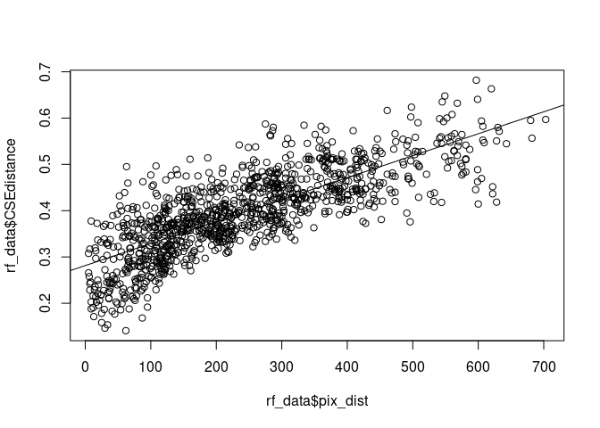<!-- -->

``` r
# Extract groups of variables by suffix
mean_vars   <- grep("_mean$", names(rf_data), value = TRUE)
median_vars <- grep("_median$", names(rf_data), value = TRUE)
mode_vars   <- grep("_mode$", names(rf_data), value = TRUE)
```

# 2. Build full Random Forest model

Note: Marked eval = FALSE to avoid re-running on knit

``` r
# Build full RF model
set.seed(1234)  # ensures reproducibility
rf_full <- randomForest(
  CSEdistance ~ .,
  data = rf_data,
  importance = TRUE,
  ntree = 500
)

print(rf_full)

importance(rf_full)
```

# 3. Mean-only pruning

## Compare mean versus median versus mode:

Note: Marked eval = FALSE to avoid re-running on knit

``` r
# Extract groups of variables by suffix
mean_vars   <- grep("_mean$", names(rf_data), value = TRUE)
median_vars <- grep("_median$", names(rf_data), value = TRUE)
mode_vars   <- grep("_mode$", names(rf_data), value = TRUE)

# Always include geographic distance
common_var <- "pix_dist"

# Build and run each model
set.seed(123438972)  # ensures reproducibility
rf_mean <- randomForest(CSEdistance ~ ., data = rf_data[, c("CSEdistance", common_var, mean_vars)], ntree = 500, importance = TRUE)
rf_median <- randomForest(CSEdistance ~ ., data = rf_data[, c("CSEdistance", common_var, median_vars)], ntree = 500, importance = TRUE)
rf_mode <- randomForest(CSEdistance ~ ., data = rf_data[, c("CSEdistance", common_var, mode_vars)], ntree = 500, importance = TRUE)

# Compare performance
c(mean = rf_mean$rsq[500] * 100,
  median = rf_median$rsq[500] * 100,
  mode = rf_mode$rsq[500] * 100)
```

Including mean of env variable along least cost paths performs the best,
adding median and mode does not greatly improve the model and increases
risks of over fitting…

## PCA of mean env predictor variables, patterns of autocorrelation?

``` r
# Run PCA on the subset of variables
pca_res <- prcomp(rf_data[mean_vars], scale. = TRUE)

# Quick summary of variance explained
summary(pca_res)
```

    ## Importance of components:
    ##                          PC1    PC2     PC3     PC4     PC5     PC6     PC7
    ## Standard deviation     3.922 1.8929 1.41176 0.92121 0.82331 0.71845 0.60506
    ## Proportion of Variance 0.641 0.1493 0.08304 0.03536 0.02824 0.02151 0.01525
    ## Cumulative Proportion  0.641 0.7903 0.87334 0.90870 0.93694 0.95845 0.97370
    ##                            PC8     PC9    PC10    PC11    PC12    PC13    PC14
    ## Standard deviation     0.54540 0.43062 0.31334 0.12881 0.11472 0.10062 0.07217
    ## Proportion of Variance 0.01239 0.00773 0.00409 0.00069 0.00055 0.00042 0.00022
    ## Cumulative Proportion  0.98610 0.99382 0.99791 0.99860 0.99915 0.99957 0.99979
    ##                           PC15    PC16    PC17    PC18    PC19    PC20     PC21
    ## Standard deviation     0.04574 0.03875 0.02555 0.02099 0.01165 0.01015 0.006646
    ## Proportion of Variance 0.00009 0.00006 0.00003 0.00002 0.00001 0.00000 0.000000
    ## Cumulative Proportion  0.99988 0.99994 0.99997 0.99999 0.99999 1.00000 1.000000
    ##                            PC22      PC23      PC24
    ## Standard deviation     0.004712 0.0004084 2.354e-07
    ## Proportion of Variance 0.000000 0.0000000 0.000e+00
    ## Cumulative Proportion  1.000000 1.0000000 1.000e+00

``` r
# Scree plot of variance explained
ve <- (pca_res$sdev^2) / sum(pca_res$sdev^2)
cumve <- cumsum(ve)
df_ve <- data.frame(PC = seq_along(ve), Var = ve*100, Cum = cumve*100)
ggplot(df_ve, aes(PC, Var)) +
  geom_line() + geom_point() +
  geom_text(aes(label = sprintf("%.1f", Var)), vjust = -0.6, size = 3) +
  labs(x = "Principal component", y = "Variance explained (%)") +
  theme_classic()
```

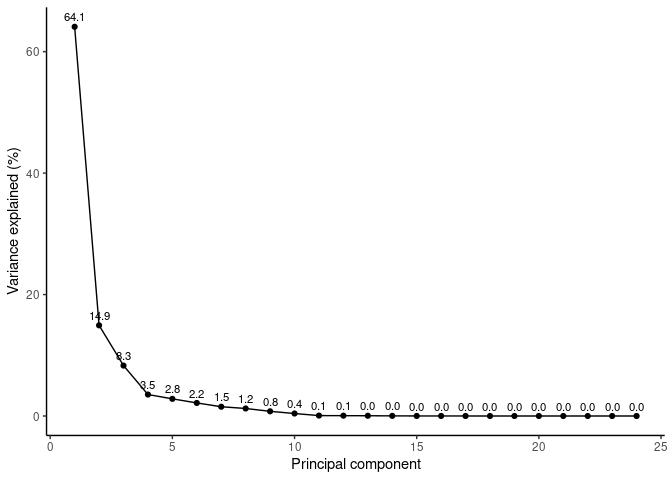<!-- -->

``` r
# PCA biplot with individuals (rows) and variables (arrows)
fviz_pca_biplot(pca_res,
                repel = TRUE, # avoid text overlap
                col.var = "steelblue", # variables
                col.ind = "gray30"    # individuals
)
```

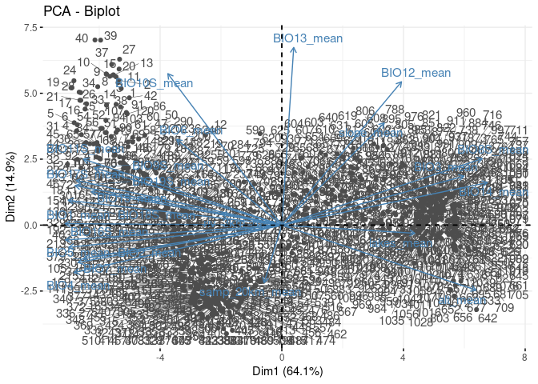<!-- -->

``` r
# PCA variables plot (correlation circle)
load <- as.data.frame(pca_res$rotation[, 1:2])
load$var <- rownames(load)
# circle helper
circle <- data.frame(
  x = cos(seq(0, 2*pi, length.out = 200)),
  y = sin(seq(0, 2*pi, length.out = 200))
)

ggplot() +
  geom_path(data = circle, aes(x, y), linewidth = 0.3) +
  geom_segment(data = load, aes(x = 0, y = 0, xend = PC1, yend = PC2),
               arrow = arrow(length = unit(0.15, "cm")), linewidth = 0.3) +
  geom_text(data = load, aes(PC1, PC2, label = var),
            hjust = 0.5, vjust = -0.5, size = 3) +
  coord_equal(xlim = c(-1,1), ylim = c(-1,1)) +
  labs(x = "PC1", y = "PC2") +
  theme_classic()
```

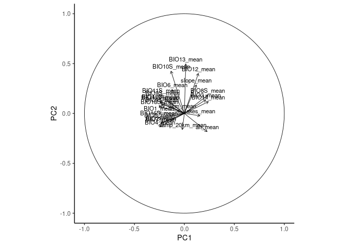<!-- -->

``` r
fviz_pca_var(pca_res,
             col.var = "contrib", # color by contribution
             gradient.cols = c("gray70", "steelblue", "darkblue"),
             repel = TRUE
)
```

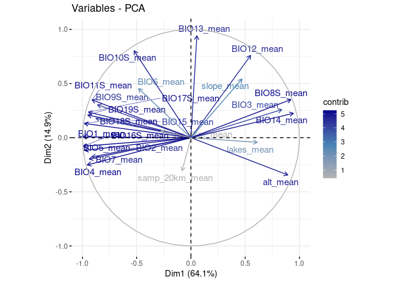<!-- -->

## (Optional) Prune more variables after narrowing to mean only?

``` r
# Plot variable importance
par(mar = c(5, 10, 2, 2))  # bottom, left, top, right
varImpPlot(rf_mean, main = "Mean Model Importance",cex = 0.6, pch = 19)

# Rank variables by %IncMSE (from tuned model)
imp <- importance(rf_mean)[, "%IncMSE"]
imp <- sort(imp, decreasing = TRUE)

# Multiple runs with N top predictors
# Store results
prune_results <- list()
n_list <- c(5:length(imp))

for (n in n_list) {
  top_vars <- names(imp)[1:n]
  formula_n <- as.formula(paste("CSEdistance ~", paste(top_vars, collapse = " + ")))
  
  set.seed(1234783645)
  rf_n <- randomForest(
    formula = formula_n,
    data = rf_data,
    ntree = 500,
    importance = TRUE
  )
  
  prune_results[[paste0("Top", n)]] <- rf_n
}

sapply(prune_results, function(mod) {
  c(OOB_MSE = mod$mse[500], VarExpl = mod$rsq[500] * 100)
})
```

% Variance Explained increases rapidly up to around 18 variables, after
which it plateaus.

OOB MSE decreases quickly early on, with minimal gains beyond the top
~18 predictors.

However, there are not too many more than 18 total, and many of the env
variables have similar node purity, so given the special nature of the
top 2 (geo dist and sampling density), I will leave all mean env
variables.

## (Optional) Scaling CSE

Note: I did also try scaling CSE before runnning RF as a different idea,
but performance of the full model did not improve, so no need to scale
CSE before modeling.

# 4. Final full model - (Tune random forest with mean variables)

Note: eval = FALSE to avoid re-running on knit

``` r
# Load data
V.table_full <- read.csv(file.path(input_dir, "Gff_cse_envCostPaths.csv"))

# estimate mean sampling density
mean(V.table_full$samp_20km_mean, na.rm = TRUE)

# Filter out western outlier "50-KB" 
V.table <- V.table_full %>%
  filter(Var1 != "50-KB", Var2 != "50-KB")

# Filter for within-cluster pairs AND geographic distance ≤ 100 km
#V.table <- V.table_full %>%
#  filter(Pop1_cluster == Pop2_cluster) %>%
#  filter(pix_dist <= 100)

# Create unique ID after filtering
V.table$id <- paste(V.table$Var1, V.table$Var2, sep = "_")

# Define site list
sites <- sort(unique(c(V.table$Var1, V.table$Var2)))

# How many rows of data for each?
table(V.table$Pop1_cluster)

# How many unique sites?
length(sites)

# Choose predictors for RF model (adjust names if necessary)
predictor_vars <- c("BIO1_mean","BIO2_mean","BIO3_mean","BIO4_mean", "BIO5_mean","BIO6_mean","BIO7_mean", "BIO8S_mean", "BIO9S_mean","BIO10S_mean", "BIO11S_mean","BIO12_mean", "BIO13_mean","BIO14_mean","BIO15_mean","BIO16S_mean","BIO17S_mean", "BIO18S_mean","BIO19S_mean","slope_mean","alt_mean", "lakes_mean","riv_3km_mean", "samp_20km_mean","pix_dist")

# Filter to modeling-relevant columns only
rf_mean_data <- V.table[, c("CSEdistance", predictor_vars)]

# Rename predictors by removing "_mean" for later projections
names(rf_mean_data) <- gsub("_mean$", "", names(rf_mean_data))

# Tune mtry (number of variables tried at each split)
set.seed(92834567)
rf_mean_full_tuned <- tuneRF(
  x = rf_mean_data[, -1],   # exclude response variable
  y = rf_mean_data$CSEdistance,
  ntreeTry = 500,
  stepFactor = 1.5,         # factor by which mtry is increased/decreased
  improve = 0.01,           # minimum improvement to continue search
  trace = TRUE,             # print progress
  plot = TRUE,              # plot OOB error vs mtry
  doBest = TRUE,             # return the model with lowest OOB error
  importance = TRUE
)


# Save the tuned random forest model to disk
saveRDS(rf_mean_full_tuned, file = file.path(results_dir, "rf_mean_full_tuned.rds"))

# Preserve as-is for projection
rf_final <- rf_mean_full_tuned
```

FYI: Later, to load the model back into R:
`rf_mean_full_tuned <- readRDS(file.path(results_dir, "rf_mean_full_tuned.rds"))`

\### Load full model from file

``` r
rf_full <- readRDS(file.path(results_dir, "rf_mean_full_tuned.rds"))

print(rf_full)
```

    ## 
    ## Call:
    ##  randomForest(x = x, y = y, mtry = res[which.min(res[, 2]), 1],      importance = TRUE) 
    ##                Type of random forest: regression
    ##                      Number of trees: 500
    ## No. of variables tried at each split: 12
    ## 
    ##           Mean of squared residuals: 0.001159808
    ##                     % Var explained: 85.7

``` r
importance(rf_full)
```

    ##             %IncMSE IncNodePurity
    ## BIO1      15.402725    0.08260644
    ## BIO2      13.973900    0.13417148
    ## BIO3      20.081142    0.49594070
    ## BIO4      19.971111    0.14142361
    ## BIO5      14.729129    0.09686819
    ## BIO6      18.780347    0.28761449
    ## BIO7      21.588124    0.12205648
    ## BIO8S     17.780629    0.11071230
    ## BIO9S     16.876518    0.16430456
    ## BIO10S    18.009074    0.08892864
    ## BIO11S    19.622665    0.18474855
    ## BIO12     14.317559    0.08642528
    ## BIO13     19.728394    0.16883174
    ## BIO14     14.588808    0.26422377
    ## BIO15     16.386966    0.18748348
    ## BIO16S    16.439604    0.08259274
    ## BIO17S    11.566631    0.11029099
    ## BIO18S     7.346078    0.07294360
    ## BIO19S    10.219341    0.09772391
    ## slope     16.515957    0.10049135
    ## alt       17.359818    0.10772336
    ## lakes      9.130651    0.10792335
    ## riv_3km   17.252330    0.12710960
    ## samp_20km 23.662285    1.28875961
    ## pix_dist  87.248679    4.07276605

## (Optional) Compare full and full tuned models (mean-only predictors)

Note: eval = FALSE to avoid re-running on knit

``` r
# Build full RF model
set.seed(10981234)  # ensures reproducibility
rf_mean_full <- randomForest(
  CSEdistance ~ .,
  data = rf_mean_data,
  importance = TRUE,
  ntree = 500
)

print(rf_mean_full)
importance(rf_mean_full)

print(rf_mean_full_tuned)
importance(rf_mean_full_tuned)

data.frame(
  Model = c("Full (default mtry)", paste("Tuned (mtry = ",rf_mean_full_tuned$mtry,")")),
  MSE = c(rf_mean_full$mse[rf_mean_full$ntree], rf_mean_full_tuned$mse[rf_mean_full_tuned$ntree]),
  Rsq = c(rf_mean_full$rsq[rf_mean_full$ntree], rf_mean_full_tuned$rsq[rf_mean_full_tuned$ntree])
)

# pad names to trick varImpPlot
rownames(rf_mean_full$importance) <- paste0("  ", rownames(rf_mean_full$importance), "  ")
rownames(rf_mean_full_tuned$importance) <- paste0("  ", rownames(rf_mean_full_tuned$importance), "  ")

# plot with varImpPlot
par(mar = c(5, 30, 2,2))  # bottom, left, top, right
varImpPlot(rf_mean_full, main = "Full Model Importance",cex = 0.6, pch = 19)
varImpPlot(rf_mean_full_tuned, main = "Tuned Full Model Importance",cex = 0.6, pch = 19)
```

The tuned model performs slightly better, but the gain may not be
meaningful… however, it does confirm that the model is stable and that
the mean-only predictors carry strong signal.

Top 18 mean-based predictors retain nearly all the explanatory power of
the original full model with 42 predictors.

# 5. IBD regression and IBD-residuals rf model (with residuals as response, drop pix_dist for predictor) - for projected map

## IBD regression

``` r
# Load raw data
V.table_full <- read.csv(file.path(input_dir, "Gff_cse_envCostPaths.csv"))

# estimate mean sampling density
mean(V.table_full$samp_20km_mean, na.rm = TRUE)
```

    ## [1] 1.027064e-11

``` r
# Filter out western outlier "50-KB" 
V.table <- V.table_full %>%
  filter(Var1 != "50-KB", Var2 != "50-KB")

# Create unique ID after filtering
V.table$id <- paste(V.table$Var1, V.table$Var2, sep = "_")

# Define site list
sites <- sort(unique(c(V.table$Var1, V.table$Var2)))

# How many rows of data for each?
table(V.table$Pop1_cluster)
```

    ## 
    ## north south 
    ##   595   496

``` r
# How many unique sites?
length(sites)
```

    ## [1] 67

``` r
# Choose predictors for RF model (adjust names if necessary)
predictor_vars <- c("BIO1_mean","BIO2_mean","BIO3_mean","BIO4_mean", "BIO5_mean","BIO6_mean","BIO7_mean", "BIO8S_mean", "BIO9S_mean","BIO10S_mean", "BIO11S_mean","BIO12_mean", "BIO13_mean","BIO14_mean","BIO15_mean","BIO16S_mean","BIO17S_mean", "BIO18S_mean","BIO19S_mean","slope_mean","alt_mean", "lakes_mean","riv_3km_mean") 

# ,"samp_20km_mean","pix_dist") # REMOVED

# Fit IBD model
lm_ibd <- lm(CSEdistance ~ pix_dist, data = V.table)
summary(lm_ibd)
```

    ## 
    ## Call:
    ## lm(formula = CSEdistance ~ pix_dist, data = V.table)
    ## 
    ## Residuals:
    ##       Min        1Q    Median        3Q       Max 
    ## -0.170128 -0.038628 -0.001543  0.036318  0.183730 
    ## 
    ## Coefficients:
    ##              Estimate Std. Error t value Pr(>|t|)    
    ## (Intercept) 2.814e-01  3.255e-03   86.45   <2e-16 ***
    ## pix_dist    4.746e-04  1.151e-05   41.22   <2e-16 ***
    ## ---
    ## Signif. codes:  0 '***' 0.001 '**' 0.01 '*' 0.05 '.' 0.1 ' ' 1
    ## 
    ## Residual standard error: 0.05633 on 1089 degrees of freedom
    ## Multiple R-squared:  0.6094, Adjusted R-squared:  0.609 
    ## F-statistic:  1699 on 1 and 1089 DF,  p-value: < 2.2e-16

``` r
# Add residuals to predictors table (V.table)
V.table$resid_ibd <- resid(lm_ibd)

# Filter and SAVE modeling-relevant columns of V.table
rf_mean_data <- V.table[, c("resid_ibd", predictor_vars)]
V.table_resid <- V.table[, c("Var1","Var2","resid_ibd", predictor_vars)]

# Write to file including residuals.
#write.csv(V.table_resid,file.path(input_dir, "Gff_cse_envCostPaths_residuals.csv"))

# Rename predictors by removing "_mean" for later projections
names(rf_mean_data) <- gsub("_mean$", "", names(rf_mean_data))

# Plot IBD linear model, CSE vs km, CSE vs log10(km)
colors <- c("north" = "#1f78b4", "south" = "#e66101")

plot(V.table$pix_dist, V.table$CSEdistance, pch = 19)
```

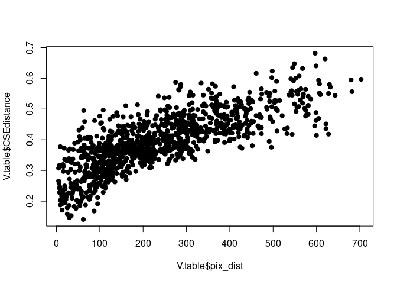<!-- -->

``` r
# raw geo dist

lm_ibd <- lm(CSEdistance ~ pix_dist, data = V.table)
summary(lm_ibd)
```

    ## 
    ## Call:
    ## lm(formula = CSEdistance ~ pix_dist, data = V.table)
    ## 
    ## Residuals:
    ##       Min        1Q    Median        3Q       Max 
    ## -0.170128 -0.038628 -0.001543  0.036318  0.183730 
    ## 
    ## Coefficients:
    ##              Estimate Std. Error t value Pr(>|t|)    
    ## (Intercept) 2.814e-01  3.255e-03   86.45   <2e-16 ***
    ## pix_dist    4.746e-04  1.151e-05   41.22   <2e-16 ***
    ## ---
    ## Signif. codes:  0 '***' 0.001 '**' 0.01 '*' 0.05 '.' 0.1 ' ' 1
    ## 
    ## Residual standard error: 0.05633 on 1089 degrees of freedom
    ## Multiple R-squared:  0.6094, Adjusted R-squared:  0.609 
    ## F-statistic:  1699 on 1 and 1089 DF,  p-value: < 2.2e-16

``` r
plot(V.table$pix_dist, V.table$CSEdistance, col = colors[ V.table$Pop1_cluster],pch = 19, xlab = "Geo. distance (km)", ylab = "Gen. distance (CSE)")
abline(lm_ibd)
```

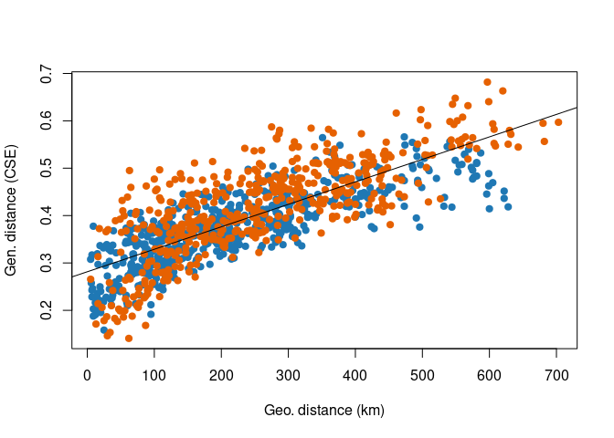<!-- -->

``` r
# log10 geo dist

lm_ibd_log <- lm(CSEdistance ~ log10(pix_dist), data = V.table)
summary(lm_ibd_log)
```

    ## 
    ## Call:
    ## lm(formula = CSEdistance ~ log10(pix_dist), data = V.table)
    ## 
    ## Residuals:
    ##       Min        1Q    Median        3Q       Max 
    ## -0.163873 -0.043257 -0.006829  0.040182  0.234622 
    ## 
    ## Coefficients:
    ##                  Estimate Std. Error t value Pr(>|t|)    
    ## (Intercept)     -0.040200   0.011552   -3.48 0.000521 ***
    ## log10(pix_dist)  0.191883   0.005024   38.19  < 2e-16 ***
    ## ---
    ## Signif. codes:  0 '***' 0.001 '**' 0.01 '*' 0.05 '.' 0.1 ' ' 1
    ## 
    ## Residual standard error: 0.05893 on 1089 degrees of freedom
    ## Multiple R-squared:  0.5726, Adjusted R-squared:  0.5722 
    ## F-statistic:  1459 on 1 and 1089 DF,  p-value: < 2.2e-16

``` r
plot(log10(V.table$pix_dist), V.table$CSEdistance, col = colors[ V.table$Pop1_cluster],pch = 19, xlab = "Log10 Geo. distance (km)", ylab = "Gen. distance (CSE)")
abline(lm_ibd_log)
```

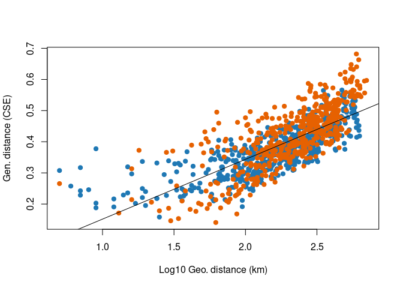<!-- -->

## Full random forest model with IBD residuals

Note: Marked eval = FALSE to avoid re-running on knit

``` r
# Tune mtry (number of variables tried at each split)
set.seed(92834567)
rf_resid_tuned <- tuneRF(
  x = rf_mean_data[, -1],   # exclude response variable
  y = rf_mean_data$resid_ibd,
  ntreeTry = 500,
  stepFactor = 1.5,         # factor by which mtry is increased/decreased
  improve = 0.01,           # minimum improvement to continue search
  trace = TRUE,             # print progress
  plot = TRUE,              # plot OOB error vs mtry
  doBest = TRUE,             # return the model with lowest OOB error
  importance = TRUE
)
print(rf_resid_tuned)
importance(rf_resid_tuned)
varImpPlot(rf_resid_tuned)

# Save the tuned random forest model to disk
saveRDS(rf_resid_tuned, file = file.path(results_dir, "rf_residuals.rds"))

# Preserve as-is for projection
rf_residuals <- rf_resid_tuned
rf_residuals$importance
```

## Load saved residuals model

``` r
rf_residuals <- readRDS(file.path(results_dir, "rf_residuals.rds"))
print(rf_residuals)
```

    ## 
    ## Call:
    ##  randomForest(x = x, y = y, mtry = res[which.min(res[, 2]), 1],      importance = TRUE) 
    ##                Type of random forest: regression
    ##                      Number of trees: 500
    ## No. of variables tried at each split: 7
    ## 
    ##           Mean of squared residuals: 0.001284575
    ##                     % Var explained: 59.45

# 6. Project from IBD-residuals model

## Build Projection

``` r
# Load env stack with named layers
env <- stack(file.path(data_dir, "processed", "env_stack.grd"))

# Load rdf of final model
rf_residuals <- readRDS(file.path(results_dir, "rf_residuals.rds"))
rf_residuals
```

    ## 
    ## Call:
    ##  randomForest(x = x, y = y, mtry = res[which.min(res[, 2]), 1],      importance = TRUE) 
    ##                Type of random forest: regression
    ##                      Number of trees: 500
    ## No. of variables tried at each split: 7
    ## 
    ##           Mean of squared residuals: 0.001284575
    ##                     % Var explained: 59.45

``` r
prediction_raster <- predict(env, rf_residuals, type = "response")

# Write Prediction Raster to file
writeRaster(prediction_raster, file.path(results_dir,"fullRF_residuals.tif"), format = "GTiff", overwrite = TRUE)
```

## Plot predicted IBD residuals

``` r
# Create base plot with viridis
plot(prediction_raster,
     col = viridis::magma(100),
     main = "Predicted CSE Distance",
     axes = FALSE,
     box = FALSE,
     legend.args = list(text = "IBD residuals", side = 3, line = 1, cex = 1))

# Overlay lakes in dark gray
lakes <- st_read(file.path(data_dir, "raw/ne_10m_lakes.shp"), quiet = TRUE)
lakes <- st_transform(lakes, crs = st_crs(prediction_raster))  # match CRS 
lakes <- st_make_valid(lakes) # fix geometries
r_ext <- st_as_sfc(st_bbox(prediction_raster)) # extent
st_crs(r_ext) <- st_crs(prediction_raster) # match CRS
lakes <- st_intersection(lakes, r_ext) # clip to extent
plot(st_geometry(lakes), col = "gray20", border = NA, add = TRUE)

# Overlay country outline
uganda <- rnaturalearth::ne_countries(continent = "Africa", scale = "medium", returnclass = "sf")
uganda <- st_intersection(uganda, r_ext) # clip to extent
plot(st_geometry(uganda), col = NA, border = "black", lwd = 1.2, add = TRUE)
```

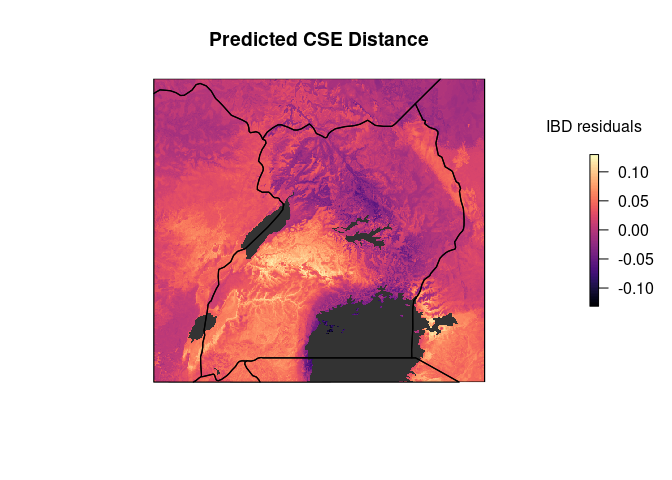<!-- -->

# 7. Scale residuals and SDM

## Scale 0-1, habitat suitability and inverse of predicted residuals

``` r
# Load raster layers
con_raster <- rast(file.path(results_dir, "fullRF_residuals.tif"))
fao <- rast(file.path(data_dir, "FAO_fuscipes_2001.tif"))
update <- rast(file.path(data_dir, "SDM_2018update.tif"))

# Match extent and resolution first
fao_crop <- crop(fao, update)
update_crop <- crop(update, fao_crop)
fao_resamp <- resample(fao_crop, update_crop)  # if needed to match resolution

# Combine
sdm_raw <- max(fao_resamp, update_crop, na.rm = TRUE)

# Crop to overlapping extent
sdm <- crop(sdm_raw, con_raster)
con <- crop(con_raster, sdm)

# Mask low-suitability areas
sdm[sdm <= 0.05] <- NA


# Rescale to 0–1
sdm_min <- global(sdm, "min", na.rm = TRUE)$min
sdm_max <- global(sdm, "max", na.rm = TRUE)$max
sdm <- (sdm - sdm_min) / (sdm_max - sdm_min)

# Mask to common suitable area
con <- mask(con, sdm)

# Rescale inverse of residuals to 0-1
con_min <- global(con, "min", na.rm = TRUE)$min
con_max <- global(con, "max", na.rm = TRUE)$max
con <- 1 - ((con - con_min) / (con_max - con_min))

# Convert back to raster for compatibility with bivariate.map function
sdm_r <- raster(sdm)
con_r <- raster(con)
```

## Plot scaled residuals and SDM

``` r
# Plot Genetic Connectivity (inverse residuals)
plot(con,
     col = rev(viridis::plasma(100)),  # high connectivity = dark
     main = "Genetic Connectivity (inverse residuals)",
     axes = FALSE, box = FALSE,
     legend.args = list(text = "Connectivity", side = 2, line = 2.5, cex = 0.8))
plot(st_geometry(lakes), col = "black", border = NA, add = TRUE)
plot(st_geometry(uganda), border = "black", lwd = 0.25, add = TRUE)
```

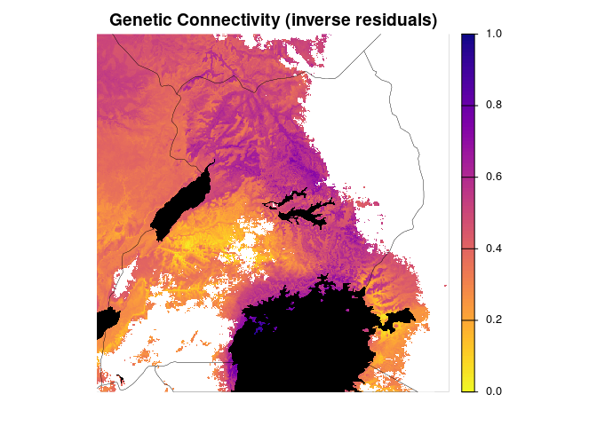<!-- -->

``` r
# Plot Habitat Suitability
plot(sdm,
     col = viridis::viridis(100),  # high suitability = dark
     main = "Habitat Suitability",
     axes = FALSE, box = FALSE,
     legend.args = list(text = "Suitability", side = 2, line = 2.5, cex = 0.8))
plot(st_geometry(lakes), col = "black", border = NA, add = TRUE)
plot(st_geometry(uganda), border = "black", lwd = 0.25, add = TRUE)
```

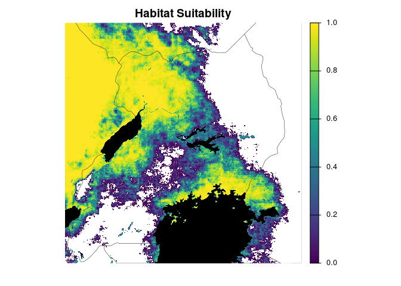<!-- -->

``` r
# Plot with custom colors

# Custom palettes based on Bishop et al.
connectivity_colors <- colorRampPalette(c("#FFFF00", "#FFA500", "#FF4500", "#700E40", "#2E003E"))(100)
suitability_colors  <- colorRampPalette(c("white", "lightblue", "blue4"))(100)     # white → light blue → dark blue

# Plot Genetic Connectivity (inverse residuals) with custom colors
plot(con,
     col = connectivity_colors,
     main = "Genetic Connectivity (inverse residuals)",
     axes = FALSE, box = FALSE,
     legend.args = list(text = "Connectivity", side = 2, line = 2.5, cex = 0.8))
plot(st_geometry(lakes), col = "black", border = NA, add = TRUE)
plot(st_geometry(uganda), border = "black", lwd = 0.25, add = TRUE)
```

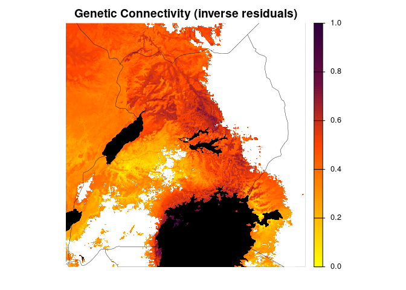<!-- -->

``` r
# Plot Habitat Suitability with custom colors
plot(sdm,
     col = suitability_colors,
     main = "Habitat Suitability",
     axes = FALSE, box = FALSE,
     legend.args = list(text = "Suitability", side = 2, line = 2.5, cex = 0.8))
plot(st_geometry(lakes), col = "black", border = NA, add = TRUE)
plot(st_geometry(uganda), border = "black", lwd = .25, add = TRUE)
```

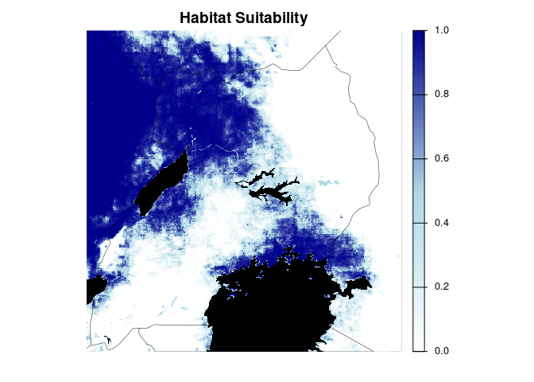<!-- -->
