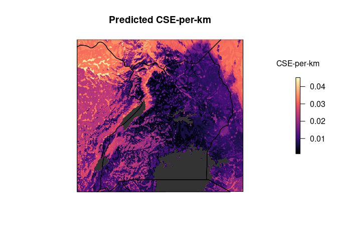
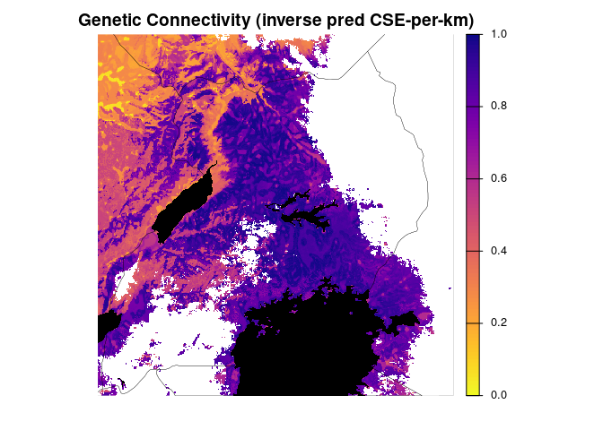
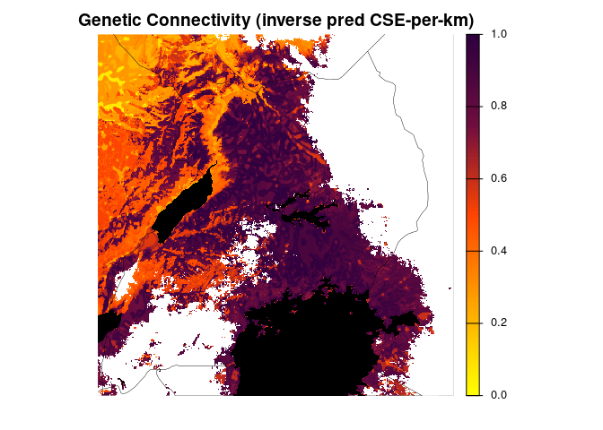
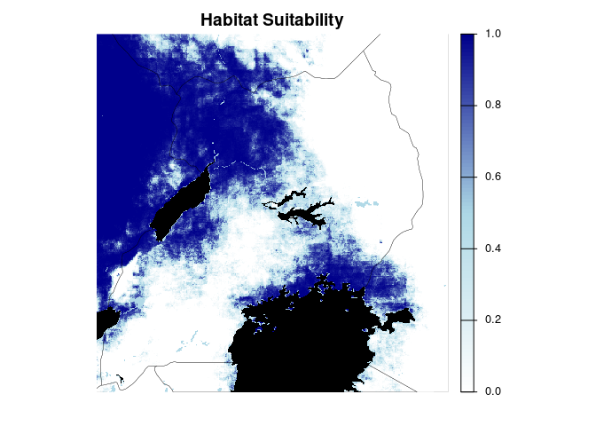

5c. RF model full - CSE per km (rate, LC lakes paths)
================
Norah Saarman
2026-03-09

- [Inputs](#inputs)
- [1. Prepare the data](#1-prepare-the-data)
- [2. CSE per km to find response
  variable](#2-cse-per-km-to-find-response-variable)
  - [Plot IBD linear model, CSE vs km, CSE vs
    log10(km)](#plot-ibd-linear-model-cse-vs-km-cse-vs-log10km)
- [3. Run CSE per km rf model (with CSE-per-km as response, drop
  pix_dist for
  predictor)](#3-run-cse-per-km-rf-model-with-cse-per-km-as-response-drop-pix_dist-for-predictor)
  - [Full random forest model with
    CSE/km](#full-random-forest-model-with-csekm)
    - [Load saved CSE-per-km model](#load-saved-cse-per-km-model)
- [4. Project predicted values from full CSE-per-km
  model](#4-project-predicted-values-from-full-cse-per-km-model)
  - [Build Projection](#build-projection)
  - [Plot predicted CSE-per-km](#plot-predicted-cse-per-km)
- [5. Scale and plot predicted connectivity (CSE-per-km) and
  SDM](#5-scale-and-plot-predicted-connectivity-cse-per-km-and-sdm)
  - [Scale 0-1, habitat suitability and inverse of predicted
    connectivity
    (CSE-per-km)](#scale-0-1-habitat-suitability-and-inverse-of-predicted-connectivity-cse-per-km)
  - [Plot scaled predicted CSE-per-km and
    SDM](#plot-scaled-predicted-cse-per-km-and-sdm)

RStudio Configuration:  
- **R version:** R 4.4.0 (Geospatial packages)  
- **Number of cores:** 4 (up to 32 available)  
- **Account:** saarman-np  
- **Partition:** saarman-shared-np (allows multiple simultaneous jobs)  
- **Memory per job:** 100G (cluster limit: 1000G total; avoid exceeding
half)  
\# Setup

``` r
# load only required packages
library(randomForest)
library(doParallel)
library(raster)
library(sf)
library(viridis)
library(dplyr)
library(terra)
library(sf)
library(classInt)
library(raster)
library(RColorBrewer)
library(ggplot2)
library(factoextra)   # for nice PCA plots
library(ggpubr)

# base directories
data_dir  <- "/uufs/chpc.utah.edu/common/home/saarman-group1/uganda-tsetse-LG/data"
input_dir <- "../input"
results_dir <- "/uufs/chpc.utah.edu/common/home/saarman-group1/uganda-tsetse-LG/results"

# read the combined CSE + coords table + pix_dist + Env variables
V.table <- read.csv(file.path(input_dir, "Gff_cse_envCostPaths.csv"),
                    header = TRUE)
# This was added only after completing LOPOCV...
# Filter out western outlier "50-KB" 
V.table <- V.table %>%
  filter(Var1 != "50-KB", Var2 != "50-KB")

# define coordinate reference system
crs_geo <- 4326     # EPSG code for WGS84

# simple mode helper
get_mode <- function(x) {
  ux <- unique(x[!is.na(x)])
  ux[ which.max(tabulate(match(x, ux))) ]
}

# setup running in parallel
cl <- makeCluster(4)
registerDoParallel(cl)
clusterExport(cl, "get_mode")
```

# Inputs

- `../input/Gff_cse_envCostPaths.csv` - Combined CSE table with
  coordinates (long1, lat1, long2, lat2), pix_dist = geographic distance
  in sum of pixels, and mean, median, mode of each Env parameter

# 1. Prepare the data

``` r
# Assign input, checking for any rows with NA
sum(!complete.cases(V.table))  # should return 0
```

    ## [1] 0

``` r
rf_data <- na.omit(V.table)    # should omit zero rows

# Confirm that CSEdistance is numeric
rf_data$CSEdistance <- as.numeric(rf_data$CSEdistance)

# Select variables: all predictors (mean, median, mode)  
predictor_vars <- c("pix_dist",                      # geo dist
  paste0("BIO", 1:7, "_mean"),                       # mean 
  paste0("BIO", 8:11, "S_mean"),                     # mean
  paste0("BIO", 12:15, "_mean"),                     # mean
  paste0("BIO", 16:19, "S_mean"),                    # mean
  "alt_mean", "slope_mean", "riv_3km_mean",          # mean
  "samp_20km_mean", "lakes_mean",                    # mean
  paste0("BIO", 1:7, "_median"),                     # median
  paste0("BIO", 8:11, "S_median"),                   # median
  paste0("BIO", 12:15, "_median"),                   # median
  paste0("BIO", 16:19, "S_median"),                  # median
  "alt_median", "slope_median", "riv_3km_median",    # median
  "samp_20km_median", "lakes_median",                # median
  paste0("BIO", 1:7, "_mode"),                       # mode
  paste0("BIO", 8:11, "S_mode"),                     # mode
  paste0("BIO", 12:15, "_mode"),                     # mode
  paste0("BIO", 16:19, "S_mode"),                    # mode
  "alt_mode", "slope_mode", "riv_3km_mode",          # mode
  "samp_20km_mode", "lakes_mode"                     # mode
)


# subset predictors that we want to use
rf_data <- rf_data[, c("CSEdistance", predictor_vars)]

g <- lm(rf_data$CSEdistance~rf_data$pix_dist)
plot(rf_data$pix_dist, rf_data$CSEdistance)
abline(g)
```

<!-- -->

``` r
# Extract groups of variables by suffix
mean_vars   <- grep("_mean$", names(rf_data), value = TRUE)
median_vars <- grep("_median$", names(rf_data), value = TRUE)
mode_vars   <- grep("_mode$", names(rf_data), value = TRUE)
```

# 2. CSE per km to find response variable

``` r
# Load raw data
V.table_full <- read.csv(file.path(input_dir, "Gff_cse_envCostPaths.csv"))

# estimate mean sampling density
mean(V.table_full$samp_20km_mean, na.rm = TRUE)
```

    ## [1] 1.027064e-11

``` r
# Filter out western outlier "50-KB" 
V.table <- V.table_full %>%
  filter(Var1 != "50-KB", Var2 != "50-KB")

# Create unique ID after filtering
V.table$id <- paste(V.table$Var1, V.table$Var2, sep = "_")

# Define site list
sites <- sort(unique(c(V.table$Var1, V.table$Var2)))

# How many rows of data for each?
table(V.table$Pop1_cluster)
```

    ## 
    ## north south 
    ##   595   496

``` r
# How many unique sites?
length(sites)
```

    ## [1] 67

``` r
# Choose predictors for RF model (adjust names if necessary)
predictor_vars <- c("BIO1_mean","BIO2_mean","BIO3_mean","BIO4_mean", "BIO5_mean","BIO6_mean","BIO7_mean", "BIO8S_mean", "BIO9S_mean","BIO10S_mean", "BIO11S_mean","BIO12_mean", "BIO13_mean","BIO14_mean","BIO15_mean","BIO16S_mean","BIO17S_mean", "BIO18S_mean","BIO19S_mean","slope_mean","alt_mean", "lakes_mean","riv_3km_mean") 

# ,"samp_20km_mean","pix_dist") # REMOVED

# Add CSE per pix_dist to predictors table (V.table)
V.table$CSE_per_km <- V.table$CSEdistance/V.table$pix_dist

# Filter modeling-relevant columns of V.table
rf_mean_data <- V.table[, c("CSE_per_km", predictor_vars)]

# Rename predictors by removing "_mean" for later projections
names(rf_mean_data) <- gsub("_mean$", "", names(rf_mean_data))
```

### Plot IBD linear model, CSE vs km, CSE vs log10(km)

``` r
# colors
colors <- c("north" = "#1f78b4", "south" = "#e66101")

# raw geo dist
lm_ibd <- lm(CSEdistance ~ pix_dist, data = V.table)
summary(lm_ibd)
```

    ## 
    ## Call:
    ## lm(formula = CSEdistance ~ pix_dist, data = V.table)
    ## 
    ## Residuals:
    ##       Min        1Q    Median        3Q       Max 
    ## -0.170128 -0.038628 -0.001543  0.036318  0.183730 
    ## 
    ## Coefficients:
    ##              Estimate Std. Error t value Pr(>|t|)    
    ## (Intercept) 2.814e-01  3.255e-03   86.45   <2e-16 ***
    ## pix_dist    4.746e-04  1.151e-05   41.22   <2e-16 ***
    ## ---
    ## Signif. codes:  0 '***' 0.001 '**' 0.01 '*' 0.05 '.' 0.1 ' ' 1
    ## 
    ## Residual standard error: 0.05633 on 1089 degrees of freedom
    ## Multiple R-squared:  0.6094, Adjusted R-squared:  0.609 
    ## F-statistic:  1699 on 1 and 1089 DF,  p-value: < 2.2e-16

``` r
plot(V.table$pix_dist, V.table$CSEdistance, col = colors[ V.table$Pop1_cluster],pch = 19, xlab = "Geo. distance (km)", ylab = "Gen. distance (CSE)")
abline(lm_ibd)
```

<!-- -->

``` r
# log10 geo dist
lm_ibd_log <- lm(CSEdistance ~ log10(pix_dist), data = V.table)
summary(lm_ibd_log)
```

    ## 
    ## Call:
    ## lm(formula = CSEdistance ~ log10(pix_dist), data = V.table)
    ## 
    ## Residuals:
    ##       Min        1Q    Median        3Q       Max 
    ## -0.163873 -0.043257 -0.006829  0.040182  0.234622 
    ## 
    ## Coefficients:
    ##                  Estimate Std. Error t value Pr(>|t|)    
    ## (Intercept)     -0.040200   0.011552   -3.48 0.000521 ***
    ## log10(pix_dist)  0.191883   0.005024   38.19  < 2e-16 ***
    ## ---
    ## Signif. codes:  0 '***' 0.001 '**' 0.01 '*' 0.05 '.' 0.1 ' ' 1
    ## 
    ## Residual standard error: 0.05893 on 1089 degrees of freedom
    ## Multiple R-squared:  0.5726, Adjusted R-squared:  0.5722 
    ## F-statistic:  1459 on 1 and 1089 DF,  p-value: < 2.2e-16

``` r
plot(log10(V.table$pix_dist), V.table$CSEdistance, col = colors[ V.table$Pop1_cluster],pch = 19, xlab = "Log10 Geo. distance (km)", ylab = "Gen. distance (CSE)")
abline(lm_ibd_log)
```

<!-- -->

# 3. Run CSE per km rf model (with CSE-per-km as response, drop pix_dist for predictor)

## Full random forest model with CSE/km

Note: Marked eval = FALSE to avoid re-running on knit

``` r
# Tune mtry (number of variables tried at each split)
set.seed(92834567)
rf_rate_tuned <- tuneRF(
  x = rf_mean_data[, -1],   # exclude response variable
  y = rf_mean_data$CSE_per_km,
  ntreeTry = 500,
  stepFactor = 1.5,         # factor by which mtry is increased/decreased
  improve = 0.01,           # minimum improvement to continue search
  trace = TRUE,             # print progress
  plot = TRUE,              # plot OOB error vs mtry
  doBest = TRUE,             # return the model with lowest OOB error
  importance = TRUE
)
print(rf_rate_tuned)
importance(rf_rate_tuned)
varImpPlot(rf_rate_tuned)

# Save the tuned random forest model to disk
saveRDS(rf_rate_tuned, file = file.path(results_dir, "rf_rate.rds"))

# Preserve as-is for projection
rf_rate <- rf_rate_tuned
rf_rate$importance
```

### Load saved CSE-per-km model

``` r
rf_rate <- readRDS(file.path(results_dir, "rf_rate.rds"))
print(rf_rate)
```

    ## 
    ## Call:
    ##  randomForest(x = x, y = y, mtry = res[which.min(res[, 2]), 1],      importance = TRUE) 
    ##                Type of random forest: regression
    ##                      Number of trees: 500
    ## No. of variables tried at each split: 7
    ## 
    ##           Mean of squared residuals: 8.085224e-06
    ##                     % Var explained: 56.38

``` r
print(rf_rate$importance)
```

    ##              %IncMSE IncNodePurity
    ## BIO1    1.736007e-06  0.0004988685
    ## BIO2    2.659362e-06  0.0007457887
    ## BIO3    3.798791e-06  0.0007902613
    ## BIO4    2.132549e-06  0.0002962381
    ## BIO5    3.031021e-06  0.0004772268
    ## BIO6    2.516587e-06  0.0006874733
    ## BIO7    1.568675e-06  0.0003683682
    ## BIO8S   4.272513e-06  0.0004045270
    ## BIO9S   3.122552e-06  0.0003983805
    ## BIO10S  4.692264e-06  0.0011432832
    ## BIO11S  2.955630e-06  0.0005213234
    ## BIO12   2.900105e-06  0.0003375686
    ## BIO13   5.025505e-06  0.0021910848
    ## BIO14   2.584525e-06  0.0007193777
    ## BIO15   5.537683e-06  0.0021090919
    ## BIO16S  2.147560e-06  0.0005728219
    ## BIO17S  1.348961e-06  0.0003222295
    ## BIO18S  2.233114e-06  0.0004847321
    ## BIO19S  1.271830e-06  0.0003694415
    ## slope   1.281090e-06  0.0010277648
    ## alt     2.705537e-06  0.0004986653
    ## lakes   2.869309e-06  0.0014337858
    ## riv_3km 6.976663e-06  0.0031744786

# 4. Project predicted values from full CSE-per-km model

## Build Projection

``` r
# Load env stack with named layers
env <- stack(file.path(data_dir, "processed", "env_stack.grd"))

# Neutralize sampling layer to average
env$samp_20km <- 1.027064e-11 #neutralize sampling bias

# Load rdf of final model
rf_predicted <- readRDS(file.path(results_dir, "rf_rate.rds"))
rf_predicted
```

    ## 
    ## Call:
    ##  randomForest(x = x, y = y, mtry = res[which.min(res[, 2]), 1],      importance = TRUE) 
    ##                Type of random forest: regression
    ##                      Number of trees: 500
    ## No. of variables tried at each split: 7
    ## 
    ##           Mean of squared residuals: 8.085224e-06
    ##                     % Var explained: 56.38

``` r
prediction_raster <- predict(env, rf_predicted, type = "response")

# Write Prediction Raster to file
writeRaster(prediction_raster, file.path(results_dir,"fullRF_rate.tif"), format = "GTiff", overwrite = TRUE)
```

## Plot predicted CSE-per-km

``` r
# Create base plot with viridis
plot(prediction_raster,
     col = viridis::magma(100),
     main = "Predicted CSE-per-km",
     axes = FALSE,
     box = FALSE,
     legend.args = list(text = "CSE-per-km", side = 3, line = 1, cex = 1))

# Overlay lakes in dark gray
lakes <- st_read(file.path(data_dir, "raw/ne_10m_lakes.shp"), quiet = TRUE)
lakes <- st_transform(lakes, crs = st_crs(prediction_raster))  # match CRS 
lakes <- st_make_valid(lakes) # fix geometries
r_ext <- st_as_sfc(st_bbox(prediction_raster)) # extent
st_crs(r_ext) <- st_crs(prediction_raster) # match CRS
lakes <- st_intersection(lakes, r_ext) # clip to extent
plot(st_geometry(lakes), col = "gray20", border = NA, add = TRUE)

# Overlay country outline
uganda <- rnaturalearth::ne_countries(continent = "Africa", scale = "medium", returnclass = "sf")
uganda <- st_intersection(uganda, r_ext) # clip to extent
plot(st_geometry(uganda), col = NA, border = "black", lwd = 1.2, add = TRUE)
```

<!-- -->

# 5. Scale and plot predicted connectivity (CSE-per-km) and SDM

## Scale 0-1, habitat suitability and inverse of predicted connectivity (CSE-per-km)

``` r
# Load raster layers
con_raster <- rast(file.path(results_dir, "fullRF_rate.tif"))
fao <- rast(file.path(data_dir, "FAO_fuscipes_2001.tif"))
update <- rast(file.path(data_dir, "SDM_2018update.tif"))

# Match extent and resolution first
fao_crop <- crop(fao, update)
update_crop <- crop(update, fao_crop)
fao_resamp <- resample(fao_crop, update_crop)  # if needed to match resolution

# Combine
sdm_raw <- max(fao_resamp, update_crop, na.rm = TRUE)

# Crop to overlapping extent
sdm <- crop(sdm_raw, con_raster)
con <- crop(con_raster, sdm)

# Mask low-suitability areas
sdm[sdm <= 0.05] <- NA


# Rescale to 0–1
sdm_min <- global(sdm, "min", na.rm = TRUE)$min
sdm_max <- global(sdm, "max", na.rm = TRUE)$max
sdm <- (sdm - sdm_min) / (sdm_max - sdm_min)

# Mask to common suitable area
con <- mask(con, sdm)

# Rescale inverse of prediction to 0-1
con_min <- global(con, "min", na.rm = TRUE)$min
con_max <- global(con, "max", na.rm = TRUE)$max
con <- 1 - ((con - con_min) / (con_max - con_min))

# Convert back to raster for compatibility with bivariate.map function
sdm_r <- raster(sdm)
con_r <- raster(con)
```

## Plot scaled predicted CSE-per-km and SDM

``` r
# Plot Genetic Connectivity (inverse predicted values)
plot(con,
     col = rev(viridis::plasma(100)),  # high connectivity = dark
     main = "Genetic Connectivity (inverse pred CSE-per-km)",
     axes = FALSE, box = FALSE,
     legend.args = list(text = "Connectivity", side = 2, line = 2.5, cex = 0.8))
plot(st_geometry(lakes), col = "black", border = NA, add = TRUE)
plot(st_geometry(uganda), border = "black", lwd = 0.25, add = TRUE)
```

<!-- -->

``` r
# Plot Habitat Suitability
plot(sdm,
     col = viridis::viridis(100),  # high suitability = dark
     main = "Habitat Suitability",
     axes = FALSE, box = FALSE,
     legend.args = list(text = "Suitability", side = 2, line = 2.5, cex = 0.8))
plot(st_geometry(lakes), col = "black", border = NA, add = TRUE)
plot(st_geometry(uganda), border = "black", lwd = 0.25, add = TRUE)
```

<!-- -->

``` r
# Plot with custom colors

# Custom palettes based on Bishop et al.
connectivity_colors <- colorRampPalette(c("#FFFF00", "#FFA500", "#FF4500", "#700E40", "#2E003E"))(100)
suitability_colors  <- colorRampPalette(c("white", "lightblue", "blue4"))(100)     # white → light blue → dark blue

# Plot Genetic Connectivity (inverse predicted) with custom colors
plot(con,
     col = connectivity_colors,
     main = "Genetic Connectivity (inverse pred CSE-per-km)",
     axes = FALSE, box = FALSE,
     legend.args = list(text = "Connectivity", side = 2, line = 2.5, cex = 0.8))
plot(st_geometry(lakes), col = "black", border = NA, add = TRUE)
plot(st_geometry(uganda), border = "black", lwd = 0.25, add = TRUE)
```

<!-- -->

``` r
# Plot Habitat Suitability with custom colors
plot(sdm,
     col = suitability_colors,
     main = "Habitat Suitability",
     axes = FALSE, box = FALSE,
     legend.args = list(text = "Suitability", side = 2, line = 2.5, cex = 0.8))
plot(st_geometry(lakes), col = "black", border = NA, add = TRUE)
plot(st_geometry(uganda), border = "black", lwd = .25, add = TRUE)
```

<!-- -->
