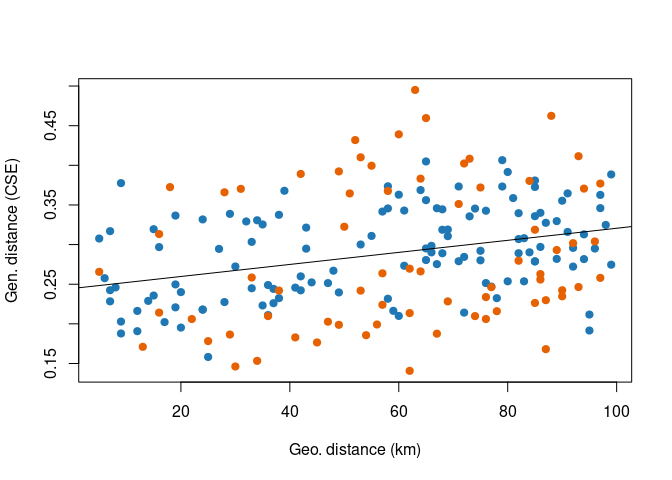
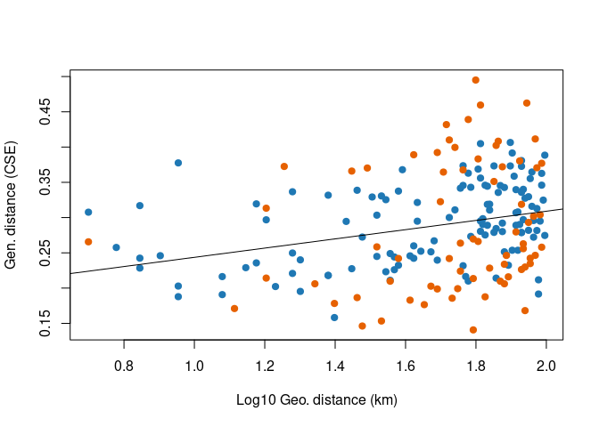
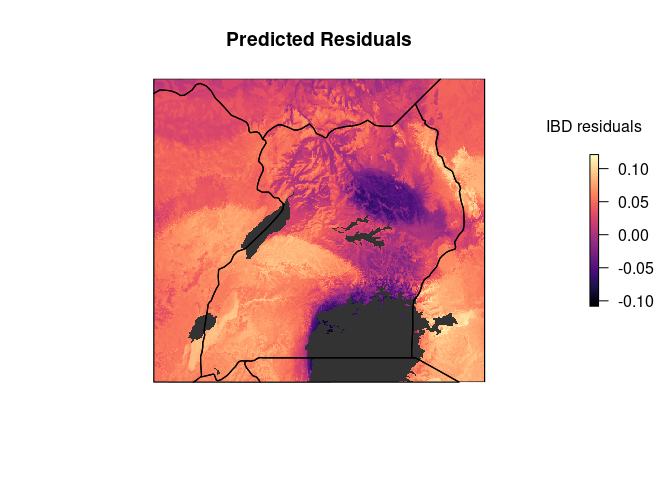
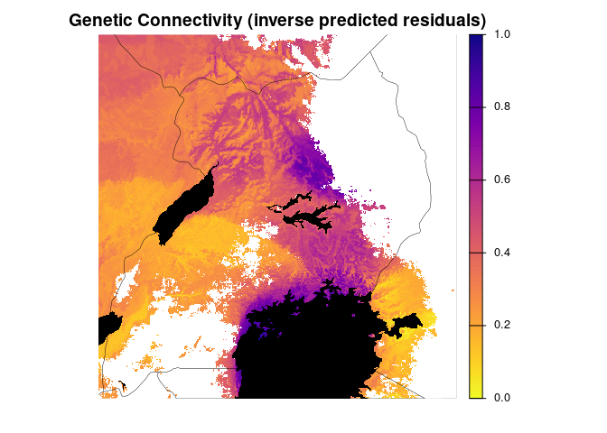
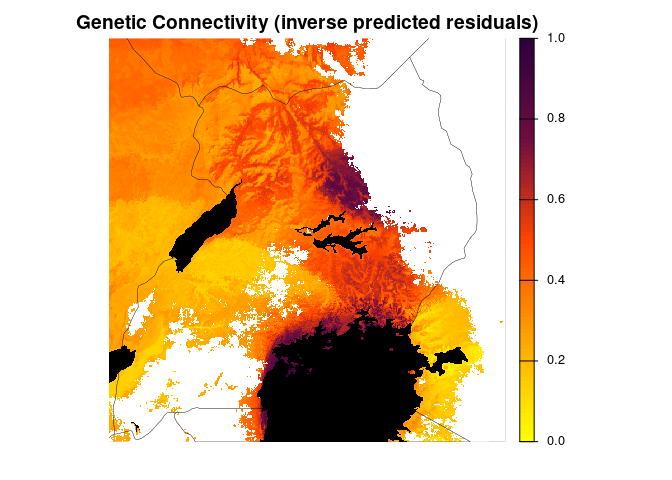
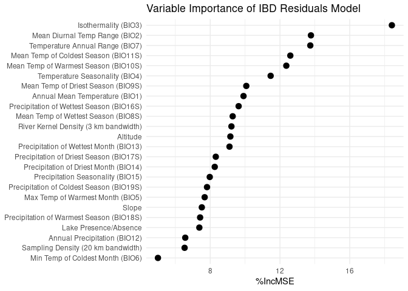
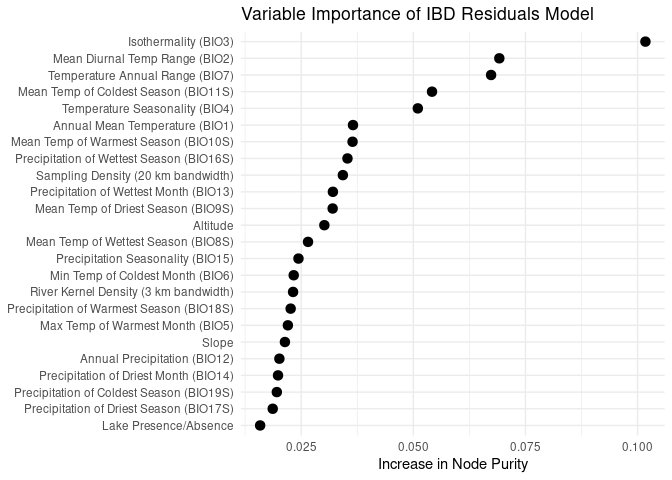

5b. RF model local (\<100 km) Residuals (IBD by using LC lakes paths)
================
Norah Saarman
2026-03-09

- [Inputs](#inputs)
- [1. Prepare the data](#1-prepare-the-data)
- [2. IBD regression to find
  residuals](#2-ibd-regression-to-find-residuals)
  - [Plot IBD linear model, CSE vs km, CSE vs
    log10(km)](#plot-ibd-linear-model-cse-vs-km-cse-vs-log10km)
- [3. Run IBD-residuals rf model (with residuals as response, drop
  pix_dist for
  predictor)](#3-run-ibd-residuals-rf-model-with-residuals-as-response-drop-pix_dist-for-predictor)
  - [Full random forest model with IBD
    residuals](#full-random-forest-model-with-ibd-residuals)
    - [Load saved (residuals) model](#load-saved-residuals-model)
- [4. Project predicted values from full IBD-residuals
  model](#4-project-predicted-values-from-full-ibd-residuals-model)
  - [Build Projection](#build-projection)
  - [Plot predicted residuals](#plot-predicted-residuals)
- [5. Scale and plot predicted connectivity (residuals) and
  SDM](#5-scale-and-plot-predicted-connectivity-residuals-and-sdm)
  - [Scale 0-1, habitat suitability and inverse of predicted
    connectivity
    (residuals)](#scale-0-1-habitat-suitability-and-inverse-of-predicted-connectivity-residuals)
  - [Plot scaled predicted residuals and
    SDM](#plot-scaled-predicted-residuals-and-sdm)
- [6. Variable importance plots](#6-variable-importance-plots)
  - [Percent Improvement MSE](#percent-improvement-mse)
  - [Node Purity](#node-purity)

RStudio Configuration:  
- **R version:** R 4.4.0 (Geospatial packages)  
- **Number of cores:** 4 (up to 32 available)  
- **Account:** saarman-np  
- **Partition:** saarman-np (allows multiple simultaneous jobs)  
- **Memory per job:** 100G (cluster limit: 1000G total; avoid exceeding
half)  
\# Setup

``` r
# load only required packages
library(randomForest)
library(doParallel)
library(raster)
library(sf)
library(viridis)
library(dplyr)
library(terra)
library(sf)
library(classInt)
library(raster)
library(RColorBrewer)
library(ggplot2)
library(factoextra)   # for nice PCA plots
library(ggpubr)

# base directories
data_dir  <- "/uufs/chpc.utah.edu/common/home/saarman-group1/uganda-tsetse-LG/data"
input_dir <- "../input"
results_dir <- "/uufs/chpc.utah.edu/common/home/saarman-group1/uganda-tsetse-LG/results"

# read the combined CSE + coords table + pix_dist + Env variables
V.table <- read.csv(file.path(input_dir, "Gff_cse_envCostPaths.csv"),
                    header = TRUE)

# This was added only after completing LOPOCV on full model...
# Filter out western outlier "50-KB" 
V.table <- V.table %>%
  filter(Var1 != "50-KB", Var2 != "50-KB")

# This is only for the RFModel100km runs...
# Filter out pairs with geographic distance >100 km
# based on results from Mantel Correlogram
V.table <- V.table %>%
  filter(pix_dist < 100)

# define coordinate reference system
crs_geo <- 4326     # EPSG code for WGS84

# simple mode helper
get_mode <- function(x) {
  ux <- unique(x[!is.na(x)])
  ux[ which.max(tabulate(match(x, ux))) ]
}

# setup running in parallel
cl <- makeCluster(4)
registerDoParallel(cl)
clusterExport(cl, "get_mode")
```

# Inputs

- `../input/Gff_cse_envCostPaths.csv` - Combined CSE table with
  coordinates (long1, lat1, long2, lat2), pix_dist = geographic distance
  in sum of pixels, and mean, median, mode of each Env parameter

# 1. Prepare the data

``` r
# Assign input, checking for any rows with NA
sum(!complete.cases(V.table))  # should return 0
```

    ## [1] 0

``` r
rf_data <- na.omit(V.table)    # should omit zero rows

# Confirm that CSEdistance is numeric
rf_data$CSEdistance <- as.numeric(rf_data$CSEdistance)

# Select variables: all predictors (mean, median, mode)  
predictor_vars <- c("pix_dist",                      # geo dist
  paste0("BIO", 1:7, "_mean"),                       # mean 
  paste0("BIO", 8:11, "S_mean"),                     # mean
  paste0("BIO", 12:15, "_mean"),                     # mean
  paste0("BIO", 16:19, "S_mean"),                    # mean
  "alt_mean", "slope_mean", "riv_3km_mean",          # mean
  "samp_20km_mean", "lakes_mean",                    # mean
  paste0("BIO", 1:7, "_median"),                     # median
  paste0("BIO", 8:11, "S_median"),                   # median
  paste0("BIO", 12:15, "_median"),                   # median
  paste0("BIO", 16:19, "S_median"),                  # median
  "alt_median", "slope_median", "riv_3km_median",    # median
  "samp_20km_median", "lakes_median",                # median
  paste0("BIO", 1:7, "_mode"),                       # mode
  paste0("BIO", 8:11, "S_mode"),                     # mode
  paste0("BIO", 12:15, "_mode"),                     # mode
  paste0("BIO", 16:19, "S_mode"),                    # mode
  "alt_mode", "slope_mode", "riv_3km_mode",          # mode
  "samp_20km_mode", "lakes_mode"                     # mode
)

# subset predictors that we want to use
rf_data <- rf_data[, c("CSEdistance", predictor_vars)]

g <- lm(rf_data$CSEdistance~rf_data$pix_dist)
plot(rf_data$pix_dist, rf_data$CSEdistance)
abline(g)
```

<!-- -->

``` r
# Extract groups of variables by suffix
mean_vars   <- grep("_mean$", names(rf_data), value = TRUE)
median_vars <- grep("_median$", names(rf_data), value = TRUE)
mode_vars   <- grep("_mode$", names(rf_data), value = TRUE)
```

# 2. IBD regression to find residuals

``` r
# estimate mean sampling density
mean(V.table$samp_20km_mean, na.rm = TRUE)
```

    ## [1] 1.550707e-11

``` r
# Create unique ID after filtering
V.table$id <- paste(V.table$Var1, V.table$Var2, sep = "_")

# Define site list
sites <- sort(unique(c(V.table$Var1, V.table$Var2)))

# How many rows of data for each?
table(V.table$Pop1_cluster)
```

    ## 
    ## north south 
    ##   124    70

``` r
# How many unique sites?
length(sites)
```

    ## [1] 66

``` r
# Choose predictors for RF model (all but pix_dist)
predictor_vars <- c("BIO1_mean","BIO2_mean","BIO3_mean","BIO4_mean", "BIO5_mean","BIO6_mean","BIO7_mean", "BIO8S_mean", "BIO9S_mean","BIO10S_mean", "BIO11S_mean","BIO12_mean", "BIO13_mean","BIO14_mean","BIO15_mean","BIO16S_mean","BIO17S_mean", "BIO18S_mean","BIO19S_mean","slope_mean","alt_mean", "lakes_mean","riv_3km_mean", "samp_20km_mean")
# "pix_dist") # REMOVED

# Fit IBD model
lm_ibd <- lm(CSEdistance ~ pix_dist, data = V.table)
summary(lm_ibd)
```

    ## 
    ## Call:
    ## lm(formula = CSEdistance ~ pix_dist, data = V.table)
    ## 
    ## Residuals:
    ##      Min       1Q   Median       3Q      Max 
    ## -0.15100 -0.04841 -0.01322  0.05346  0.20257 
    ## 
    ## Coefficients:
    ##              Estimate Std. Error t value Pr(>|t|)    
    ## (Intercept) 0.2445739  0.0114891  21.287  < 2e-16 ***
    ## pix_dist    0.0007605  0.0001800   4.224  3.7e-05 ***
    ## ---
    ## Signif. codes:  0 '***' 0.001 '**' 0.01 '*' 0.05 '.' 0.1 ' ' 1
    ## 
    ## Residual standard error: 0.06733 on 192 degrees of freedom
    ## Multiple R-squared:  0.08503,    Adjusted R-squared:  0.08026 
    ## F-statistic: 17.84 on 1 and 192 DF,  p-value: 3.704e-05

``` r
# Add residuals to predictors table (V.table)
V.table$resid_ibd <- resid(lm_ibd)

# Filter modeling-relevant columns of V.table
rf_mean_data <- V.table[, c("resid_ibd", predictor_vars)]

# Rename predictors by removing "_mean" for later projections
names(rf_mean_data) <- gsub("_mean$", "", names(rf_mean_data))
```

### Plot IBD linear model, CSE vs km, CSE vs log10(km)

``` r
# colors
colors <- c("north" = "#1f78b4", "south" = "#e66101")

# raw geo dist
lm_ibd <- lm(CSEdistance ~ pix_dist, data = V.table)
summary(lm_ibd)
```

    ## 
    ## Call:
    ## lm(formula = CSEdistance ~ pix_dist, data = V.table)
    ## 
    ## Residuals:
    ##      Min       1Q   Median       3Q      Max 
    ## -0.15100 -0.04841 -0.01322  0.05346  0.20257 
    ## 
    ## Coefficients:
    ##              Estimate Std. Error t value Pr(>|t|)    
    ## (Intercept) 0.2445739  0.0114891  21.287  < 2e-16 ***
    ## pix_dist    0.0007605  0.0001800   4.224  3.7e-05 ***
    ## ---
    ## Signif. codes:  0 '***' 0.001 '**' 0.01 '*' 0.05 '.' 0.1 ' ' 1
    ## 
    ## Residual standard error: 0.06733 on 192 degrees of freedom
    ## Multiple R-squared:  0.08503,    Adjusted R-squared:  0.08026 
    ## F-statistic: 17.84 on 1 and 192 DF,  p-value: 3.704e-05

``` r
plot(V.table$pix_dist, V.table$CSEdistance, col = colors[ V.table$Pop1_cluster],pch = 19, xlab = "Geo. distance (km)", ylab = "Gen. distance (CSE)")
abline(lm_ibd)
```

<!-- -->

``` r
# log10 geo dist
lm_ibd_log <- lm(CSEdistance ~ log10(pix_dist), data = V.table)
summary(lm_ibd_log)
```

    ## 
    ## Call:
    ## lm(formula = CSEdistance ~ log10(pix_dist), data = V.table)
    ## 
    ## Residuals:
    ##       Min        1Q    Median        3Q       Max 
    ## -0.154766 -0.050043 -0.009959  0.052188  0.199111 
    ## 
    ## Coefficients:
    ##                 Estimate Std. Error t value Pr(>|t|)    
    ## (Intercept)      0.17827    0.02791   6.387 1.25e-09 ***
    ## log10(pix_dist)  0.06539    0.01629   4.013 8.57e-05 ***
    ## ---
    ## Signif. codes:  0 '***' 0.001 '**' 0.01 '*' 0.05 '.' 0.1 ' ' 1
    ## 
    ## Residual standard error: 0.06761 on 192 degrees of freedom
    ## Multiple R-squared:  0.0774, Adjusted R-squared:  0.0726 
    ## F-statistic: 16.11 on 1 and 192 DF,  p-value: 8.573e-05

``` r
plot(log10(V.table$pix_dist), V.table$CSEdistance, col = colors[ V.table$Pop1_cluster],pch = 19, xlab = "Log10 Geo. distance (km)", ylab = "Gen. distance (CSE)")
abline(lm_ibd_log)
```

<!-- -->

# 3. Run IBD-residuals rf model (with residuals as response, drop pix_dist for predictor)

## Full random forest model with IBD residuals

``` r
# Tune mtry (number of variables tried at each split)
set.seed(92834)
rf_resid_tuned <- tuneRF(
  x = rf_mean_data[, -1],   # exclude response variable
  y = rf_mean_data$resid_ibd,
  ntreeTry = 500,
  stepFactor = 1.5,         # factor by which mtry is increased/decreased
  improve = 0.01,           # minimum improvement to continue search
  trace = TRUE,             # print progress
  plot = TRUE,              # plot OOB error vs mtry
  doBest = TRUE,             # return the model with lowest OOB error
  importance = TRUE
)
```

    ## mtry = 8  OOB error = 0.002097515 
    ## Searching left ...
    ## mtry = 6     OOB error = 0.002137282 
    ## -0.01895897 0.01 
    ## Searching right ...
    ## mtry = 12    OOB error = 0.002116381 
    ## -0.008994312 0.01

<!-- -->

``` r
print(rf_resid_tuned)
```

    ## 
    ## Call:
    ##  randomForest(x = x, y = y, mtry = res[which.min(res[, 2]), 1],      importance = TRUE) 
    ##                Type of random forest: regression
    ##                      Number of trees: 500
    ## No. of variables tried at each split: 8
    ## 
    ##           Mean of squared residuals: 0.00212717
    ##                     % Var explained: 52.59

``` r
importance(rf_resid_tuned)
```

    ##             %IncMSE IncNodePurity
    ## BIO1       9.909287    0.03654490
    ## BIO2      13.776213    0.06917382
    ## BIO3      18.418076    0.10175196
    ## BIO4      11.464906    0.05099966
    ## BIO5       7.681051    0.02202358
    ## BIO6       5.000972    0.02332806
    ## BIO7      13.739711    0.06733806
    ## BIO8S      9.287240    0.02651883
    ## BIO9S     10.068402    0.03201117
    ## BIO10S    12.363390    0.03644732
    ## BIO11S    12.593550    0.05416480
    ## BIO12      6.567615    0.02013201
    ## BIO13      9.104683    0.03206507
    ## BIO14      8.258536    0.01982788
    ## BIO15      7.972459    0.02438925
    ## BIO16S     9.629055    0.03531385
    ## BIO17S     8.318486    0.01864713
    ## BIO18S     7.419446    0.02264624
    ## BIO19S     7.815916    0.01956127
    ## slope      7.517311    0.02136747
    ## alt        9.154964    0.03015827
    ## lakes      7.375320    0.01584231
    ## riv_3km    9.215781    0.02318538
    ## samp_20km  6.529974    0.03428774

``` r
varImpPlot(rf_resid_tuned)
```

<!-- -->

``` r
# Save the tuned random forest model to disk
saveRDS(rf_resid_tuned, file = file.path(results_dir, "rf_residuals_100km.rds"))
```

### Load saved (residuals) model

``` r
# load saved model
rf_residuals <- readRDS(file.path(results_dir, "rf_residuals_100km.rds"))

#double check they look correct
print(rf_residuals)
```

    ## 
    ## Call:
    ##  randomForest(x = x, y = y, mtry = res[which.min(res[, 2]), 1],      importance = TRUE) 
    ##                Type of random forest: regression
    ##                      Number of trees: 500
    ## No. of variables tried at each split: 8
    ## 
    ##           Mean of squared residuals: 0.00212717
    ##                     % Var explained: 52.59

``` r
print(rf_residuals$importance)
```

    ##                %IncMSE IncNodePurity
    ## BIO1      7.331195e-04    0.03654490
    ## BIO2      1.138356e-03    0.06917382
    ## BIO3      1.251364e-03    0.10175196
    ## BIO4      4.713844e-04    0.05099966
    ## BIO5      3.561286e-04    0.02202358
    ## BIO6      9.741059e-05    0.02332806
    ## BIO7      9.726355e-04    0.06733806
    ## BIO8S     2.104349e-04    0.02651883
    ## BIO9S     3.989134e-04    0.03201117
    ## BIO10S    3.153953e-04    0.03644732
    ## BIO11S    7.878773e-04    0.05416480
    ## BIO12     1.237578e-04    0.02013201
    ## BIO13     2.307894e-04    0.03206507
    ## BIO14     1.785300e-04    0.01982788
    ## BIO15     1.824206e-04    0.02438925
    ## BIO16S    5.942328e-04    0.03531385
    ## BIO17S    2.121461e-04    0.01864713
    ## BIO18S    4.170561e-04    0.02264624
    ## BIO19S    2.373714e-04    0.01956127
    ## slope     1.279536e-04    0.02136747
    ## alt       3.258067e-04    0.03015827
    ## lakes     1.902675e-04    0.01584231
    ## riv_3km   1.286698e-04    0.02318538
    ## samp_20km 1.723472e-04    0.03428774

# 4. Project predicted values from full IBD-residuals model

## Build Projection

``` r
# Load env stack with named layers
env <- stack(file.path(data_dir, "processed", "env_stack.grd"))

# Neutralize sampling layer to average
env$samp_20km <- mean(V.table$samp_20km_mean, na.rm = TRUE) #neutralize sampling bias

# Load rdf of final model
rf_predicted <- readRDS(file.path(results_dir, "rf_residuals_100km.rds"))
rf_predicted
```

    ## 
    ## Call:
    ##  randomForest(x = x, y = y, mtry = res[which.min(res[, 2]), 1],      importance = TRUE) 
    ##                Type of random forest: regression
    ##                      Number of trees: 500
    ## No. of variables tried at each split: 8
    ## 
    ##           Mean of squared residuals: 0.00212717
    ##                     % Var explained: 52.59

``` r
prediction_raster <- predict(env, rf_predicted, type = "response")

# Write Prediction Raster to file
writeRaster(prediction_raster, file.path(results_dir,"fullRF_residuals.tif"), format = "GTiff", overwrite = TRUE)
```

## Plot predicted residuals

``` r
# Create base plot with viridis
plot(prediction_raster,
     col = viridis::magma(100),
     main = "Predicted Residuals",
     axes = FALSE,
     box = FALSE,
     legend.args = list(text = "IBD residuals", side = 3, line = 1, cex = 1))

# Overlay lakes in dark gray
lakes <- st_read(file.path(data_dir, "raw/ne_10m_lakes.shp"), quiet = TRUE)
lakes <- st_transform(lakes, crs = st_crs(prediction_raster))  # match CRS 
lakes <- st_make_valid(lakes) # fix geometries
r_ext <- st_as_sfc(st_bbox(prediction_raster)) # extent
st_crs(r_ext) <- st_crs(prediction_raster) # match CRS
lakes <- st_intersection(lakes, r_ext) # clip to extent
plot(st_geometry(lakes), col = "gray20", border = NA, add = TRUE)

# Overlay country outline
uganda <- rnaturalearth::ne_countries(continent = "Africa", scale = "medium", returnclass = "sf")
uganda <- st_intersection(uganda, r_ext) # clip to extent
plot(st_geometry(uganda), col = NA, border = "black", lwd = 1.2, add = TRUE)
```

<!-- -->

# 5. Scale and plot predicted connectivity (residuals) and SDM

## Scale 0-1, habitat suitability and inverse of predicted connectivity (residuals)

``` r
# Load raster layers
con_raster <- rast(file.path(results_dir, "fullRF_residuals.tif"))
fao <- rast(file.path(data_dir, "FAO_fuscipes_2001.tif"))
update <- rast(file.path(data_dir, "SDM_2018update.tif"))

# Match extent and resolution first
fao_crop <- crop(fao, update)
update_crop <- crop(update, fao_crop)
fao_resamp <- resample(fao_crop, update_crop)  # if needed to match resolution

# Combine
sdm_raw <- max(fao_resamp, update_crop, na.rm = TRUE)

# Crop to overlapping extent
sdm <- crop(sdm_raw, con_raster)
con <- crop(con_raster, sdm)

# Mask low-suitability areas
sdm[sdm <= 0.05] <- NA


# Rescale to 0–1
sdm_min <- global(sdm, "min", na.rm = TRUE)$min
sdm_max <- global(sdm, "max", na.rm = TRUE)$max
sdm <- (sdm - sdm_min) / (sdm_max - sdm_min)

# Mask to common suitable area
con <- mask(con, sdm)

# Rescale inverse of prediction to 0-1
con_min <- global(con, "min", na.rm = TRUE)$min
con_max <- global(con, "max", na.rm = TRUE)$max
con <- 1 - ((con - con_min) / (con_max - con_min))

# Convert back to raster for compatibility with bivariate.map function
sdm_r <- raster(sdm)
con_r <- raster(con)
```

## Plot scaled predicted residuals and SDM

``` r
# Plot Genetic Connectivity (inverse predicted values)
plot(con,
     col = rev(viridis::plasma(100)),  # high connectivity = dark
     main = "Genetic Connectivity (inverse predicted residuals)",
     axes = FALSE, box = FALSE,
     legend.args = list(text = "Connectivity", side = 2, line = 2.5, cex = 0.8))
plot(st_geometry(lakes), col = "black", border = NA, add = TRUE)
plot(st_geometry(uganda), border = "black", lwd = 0.25, add = TRUE)
```

<!-- -->

``` r
# Plot Habitat Suitability
plot(sdm,
     col = viridis::viridis(100),  # high suitability = dark
     main = "Habitat Suitability",
     axes = FALSE, box = FALSE,
     legend.args = list(text = "Suitability", side = 2, line = 2.5, cex = 0.8))
plot(st_geometry(lakes), col = "black", border = NA, add = TRUE)
plot(st_geometry(uganda), border = "black", lwd = 0.25, add = TRUE)
```

<!-- -->

``` r
# Plot with custom colors

# Custom palettes based on Bishop et al.
connectivity_colors <- colorRampPalette(c("#FFFF00", "#FFA500", "#FF4500", "#700E40", "#2E003E"))(100)
suitability_colors  <- colorRampPalette(c("white", "lightblue", "blue4"))(100)     # white → light blue → dark blue

# Plot Genetic Connectivity (inverse predicted) with custom colors
plot(con,
     col = connectivity_colors,
     main = "Genetic Connectivity (inverse predicted residuals)",
     axes = FALSE, box = FALSE,
     legend.args = list(text = "Connectivity", side = 2, line = 2.5, cex = 0.8))
plot(st_geometry(lakes), col = "black", border = NA, add = TRUE)
plot(st_geometry(uganda), border = "black", lwd = 0.25, add = TRUE)
```

<!-- -->

``` r
# Plot Habitat Suitability with custom colors
plot(sdm,
     col = suitability_colors,
     main = "Habitat Suitability",
     axes = FALSE, box = FALSE,
     legend.args = list(text = "Suitability", side = 2, line = 2.5, cex = 0.8))
plot(st_geometry(lakes), col = "black", border = NA, add = TRUE)
plot(st_geometry(uganda), border = "black", lwd = .25, add = TRUE)
```

<!-- -->

# 6. Variable importance plots

## Percent Improvement MSE

``` r
library(dplyr)
library(tibble)
library(ggplot2)
library(randomForest)

# Load full model (as opposed to LOPOCV later)
full_model <- rf_predicted 
full_imp <- importance(full_model, type = 1) %>%
  as.data.frame() %>%
  rownames_to_column("variable") %>%
  rename(IncMSE = `%IncMSE`) %>%
  mutate(model = "full")

# Define custom labels
label_map <- c(
  BIO1   = "Annual Mean Temperature (BIO1)",
  BIO2   = "Mean Diurnal Temp Range (BIO2)",
  BIO3   = "Isothermality (BIO3)",
  BIO4   = "Temperature Seasonality (BIO4)",
  BIO5   = "Max Temp of Warmest Month (BIO5)",
  BIO6   = "Min Temp of Coldest Month (BIO6)",
  BIO7   = "Temperature Annual Range (BIO7)",
  BIO8S  = "Mean Temp of Wettest Season (BIO8S)",
  BIO9S  = "Mean Temp of Driest Season (BIO9S)",
  BIO10S = "Mean Temp of Warmest Season (BIO10S)",
  BIO11S = "Mean Temp of Coldest Season (BIO11S)",
  BIO12  = "Annual Precipitation (BIO12)",
  BIO13  = "Precipitation of Wettest Month (BIO13)",
  BIO14  = "Precipitation of Driest Month (BIO14)",
  BIO15  = "Precipitation Seasonality (BIO15)",
  BIO16S = "Precipitation of Wettest Season (BIO16S)",
  BIO17S = "Precipitation of Driest Season (BIO17S)",
  BIO18S = "Precipitation of Warmest Season (BIO18S)",
  BIO19S = "Precipitation of Coldest Season (BIO19S)",
  slope  = "Slope",
  alt    = "Altitude",
  lakes  = "Lake Presence/Absence",
  riv_3km = "River Kernel Density (3 km bandwidth)",
  samp_20km = "Sampling Density (20 km bandwidth)",
  pix_dist = "Geographic Distance (km)"
)


# Order by full model's %IncMSE (top to bottom)
full_order <- full_imp %>%
  arrange(desc(IncMSE)) %>%
  pull(variable)

full_imp$variable <- factor(full_imp$variable, levels = rev(full_order))

# Plot
# pdf("../figures/VarImpPlot_residModel.pdf",width =6, height=6)
ggplot(full_imp, aes(x = variable, y = IncMSE)) +
  geom_point(data = filter(full_imp, model == "full"),
             color = "black", size = 3) +
  coord_flip() +
  scale_y_continuous(name = "%IncMSE") +
  scale_x_discrete(labels = label_map) +
  labs(x = NULL, title = "Variable Importance of IBD Residuals Model") +
  theme_minimal()
```

<!-- -->

``` r
#dev.off()
```

## Node Purity

``` r
library(dplyr)
library(tibble)
library(ggplot2)
library(randomForest)

# Load full model
full_model <- rf_predicted 

full_imp <- importance(full_model, type = 2) %>%
  as.data.frame() %>%
  rownames_to_column("variable") %>%
  mutate(model = "full")

# Define custom labels
label_map <- c(
  BIO1   = "Annual Mean Temperature (BIO1)",
  BIO2   = "Mean Diurnal Temp Range (BIO2)",
  BIO3   = "Isothermality (BIO3)",
  BIO4   = "Temperature Seasonality (BIO4)",
  BIO5   = "Max Temp of Warmest Month (BIO5)",
  BIO6   = "Min Temp of Coldest Month (BIO6)",
  BIO7   = "Temperature Annual Range (BIO7)",
  BIO8S  = "Mean Temp of Wettest Season (BIO8S)",
  BIO9S  = "Mean Temp of Driest Season (BIO9S)",
  BIO10S = "Mean Temp of Warmest Season (BIO10S)",
  BIO11S = "Mean Temp of Coldest Season (BIO11S)",
  BIO12  = "Annual Precipitation (BIO12)",
  BIO13  = "Precipitation of Wettest Month (BIO13)",
  BIO14  = "Precipitation of Driest Month (BIO14)",
  BIO15  = "Precipitation Seasonality (BIO15)",
  BIO16S = "Precipitation of Wettest Season (BIO16S)",
  BIO17S = "Precipitation of Driest Season (BIO17S)",
  BIO18S = "Precipitation of Warmest Season (BIO18S)",
  BIO19S = "Precipitation of Coldest Season (BIO19S)",
  slope  = "Slope",
  alt    = "Altitude",
  lakes  = "Lake Presence/Absence",
  riv_3km = "River Kernel Density (3 km bandwidth)",
  samp_20km = "Sampling Density (20 km bandwidth)",
  pix_dist = "Geographic Distance (km)"
)

# Order variables by node purity
full_order <- full_imp %>%
  arrange(desc(IncNodePurity)) %>%
  pull(variable)

full_imp$variable <- factor(full_imp$variable, levels = rev(full_order))

# Plot
ggplot(full_imp, aes(x = variable, y = IncNodePurity)) +
  geom_point(color = "black", size = 3) +
  coord_flip() +
  scale_y_continuous(name = "Increase in Node Purity") +
  scale_x_discrete(labels = label_map) +
  labs(x = NULL, title = "Variable Importance of IBD Residuals Model") +
  theme_minimal()
```

<!-- -->
