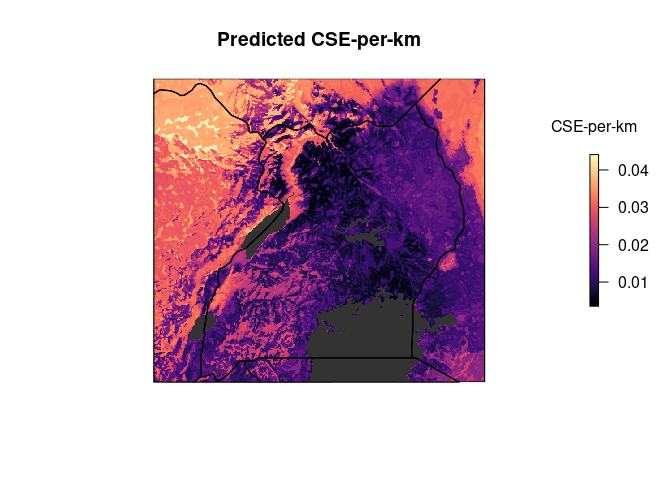
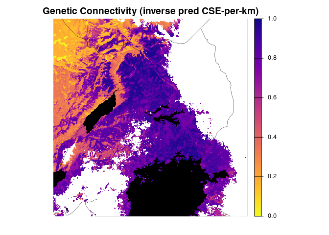
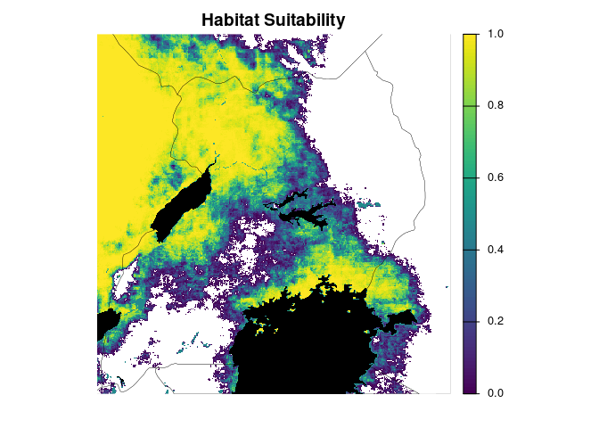
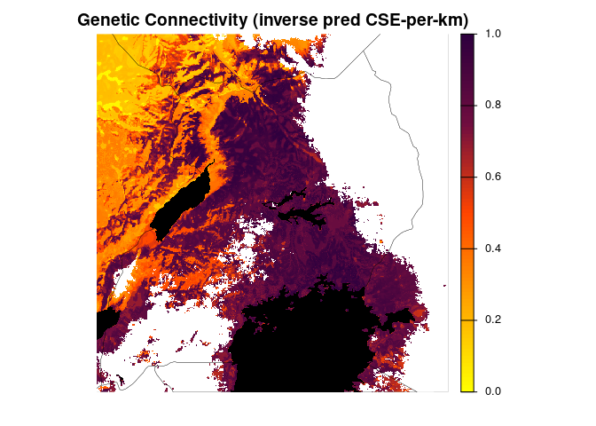
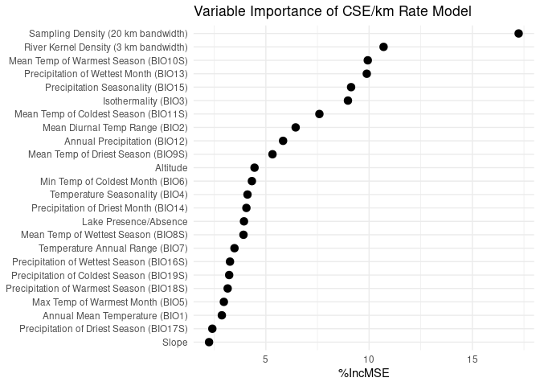
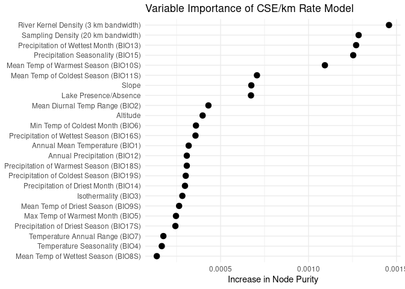

5c. RF model local (\<100 km) CSE per km (rate, LC lakes paths)
================
Norah Saarman
2026-03-09

- [Inputs](#inputs)
- [1. Prepare the data](#1-prepare-the-data)
- [2. CSE per km to find response
  variable](#2-cse-per-km-to-find-response-variable)
- [2. Run CSE per km rf model (with CSE-per-km as response, drop
  pix_dist for
  predictor)](#2-run-cse-per-km-rf-model-with-cse-per-km-as-response-drop-pix_dist-for-predictor)
  - [Full random forest model with CSE/km as a
    rate](#full-random-forest-model-with-csekm-as-a-rate)
    - [Load saved (CSE-per-km rate)
      model](#load-saved-cse-per-km-rate-model)
- [4. Project predicted values from full CSE-per-km rate
  model](#4-project-predicted-values-from-full-cse-per-km-rate-model)
  - [Build Projection](#build-projection)
  - [Plot predicted CSE-per-km](#plot-predicted-cse-per-km)
- [5. Scale and plot predicted connectivity (CSE-per-km) and
  SDM](#5-scale-and-plot-predicted-connectivity-cse-per-km-and-sdm)
  - [Scale 0-1, habitat suitability and inverse of predicted
    connectivity
    (CSE-per-km)](#scale-0-1-habitat-suitability-and-inverse-of-predicted-connectivity-cse-per-km)
  - [Plot scaled predicted CSE-per-km and
    SDM](#plot-scaled-predicted-cse-per-km-and-sdm)
  - [Percent Improvement MSE](#percent-improvement-mse)
  - [Node Purity](#node-purity)

RStudio Configuration:  
- **R version:** R 4.4.0 (Geospatial packages)  
- **Number of cores:** 4 (up to 32 available)  
- **Account:** saarman-np  
- **Partition:** saarman-np (allows multiple simultaneous jobs)  
- **Memory per job:** 100G (cluster limit: 1000G total; avoid exceeding
half)  
\# Setup

``` r
# load only required packages
library(randomForest)
library(doParallel)
library(raster)
library(sf)
library(viridis)
library(dplyr)
library(terra)
library(sf)
library(classInt)
library(raster)
library(RColorBrewer)
library(ggplot2)
library(factoextra)   # for nice PCA plots
library(ggpubr)

# base directories
data_dir  <- "/uufs/chpc.utah.edu/common/home/saarman-group1/uganda-tsetse-LG/data"
input_dir <- "../input"
results_dir <- "/uufs/chpc.utah.edu/common/home/saarman-group1/uganda-tsetse-LG/results"

# read the combined CSE + coords table + pix_dist + Env variables
V.table <- read.csv(file.path(input_dir, "Gff_cse_envCostPaths.csv"),
                    header = TRUE)

# This was added only after completing LOPOCV on full model...
# Filter out western outlier "50-KB" 
V.table <- V.table %>%
  filter(Var1 != "50-KB", Var2 != "50-KB")

# This is only for the RFModel100km runs...
# Filter out pairs with geographic distance >100 km
# based on results from Mantel Correlogram
V.table <- V.table %>%
  filter(pix_dist < 100)

# define coordinate reference system
crs_geo <- 4326     # EPSG code for WGS84

# simple mode helper
get_mode <- function(x) {
  ux <- unique(x[!is.na(x)])
  ux[ which.max(tabulate(match(x, ux))) ]
}

# setup running in parallel
cl <- makeCluster(4)
registerDoParallel(cl)
clusterExport(cl, "get_mode")
```

# Inputs

- `../input/Gff_cse_envCostPaths.csv` - Combined CSE table with
  coordinates (long1, lat1, long2, lat2), pix_dist = geographic distance
  in sum of pixels, and mean, median, mode of each Env parameter

# 1. Prepare the data

``` r
# Assign input, checking for any rows with NA
sum(!complete.cases(V.table))  # should return 0
```

    ## [1] 0

``` r
rf_data <- na.omit(V.table)    # should omit zero rows

# Confirm that CSEdistance is numeric
rf_data$CSEdistance <- as.numeric(rf_data$CSEdistance)

# Select variables: all predictors (mean, median, mode)  
predictor_vars <- c("pix_dist",                      # geo dist
  paste0("BIO", 1:7, "_mean"),                       # mean 
  paste0("BIO", 8:11, "S_mean"),                     # mean
  paste0("BIO", 12:15, "_mean"),                     # mean
  paste0("BIO", 16:19, "S_mean"),                    # mean
  "alt_mean", "slope_mean", "riv_3km_mean",          # mean
  "samp_20km_mean", "lakes_mean",                    # mean
  paste0("BIO", 1:7, "_median"),                     # median
  paste0("BIO", 8:11, "S_median"),                   # median
  paste0("BIO", 12:15, "_median"),                   # median
  paste0("BIO", 16:19, "S_median"),                  # median
  "alt_median", "slope_median", "riv_3km_median",    # median
  "samp_20km_median", "lakes_median",                # median
  paste0("BIO", 1:7, "_mode"),                       # mode
  paste0("BIO", 8:11, "S_mode"),                     # mode
  paste0("BIO", 12:15, "_mode"),                     # mode
  paste0("BIO", 16:19, "S_mode"),                    # mode
  "alt_mode", "slope_mode", "riv_3km_mode",          # mode
  "samp_20km_mode", "lakes_mode"                     # mode
)


# subset predictors that we want to use
rf_data <- rf_data[, c("CSEdistance", predictor_vars)]

g <- lm(rf_data$CSEdistance~rf_data$pix_dist)
plot(rf_data$pix_dist, rf_data$CSEdistance)
abline(g)
```

<!-- -->

``` r
# Extract groups of variables by suffix
mean_vars   <- grep("_mean$", names(rf_data), value = TRUE)
median_vars <- grep("_median$", names(rf_data), value = TRUE)
mode_vars   <- grep("_mode$", names(rf_data), value = TRUE)
```

# 2. CSE per km to find response variable

``` r
# estimate mean sampling density
mean(V.table$samp_20km_mean, na.rm = TRUE)
```

    ## [1] 1.550707e-11

``` r
# Create unique ID after filtering
V.table$id <- paste(V.table$Var1, V.table$Var2, sep = "_")

# Define site list
sites <- sort(unique(c(V.table$Var1, V.table$Var2)))

# How many rows of data for each?
table(V.table$Pop1_cluster)
```

    ## 
    ## north south 
    ##   124    70

``` r
# How many unique sites?
length(sites)
```

    ## [1] 66

``` r
# Choose predictors for RF model (all but pix_dist)
predictor_vars <- c("BIO1_mean","BIO2_mean","BIO3_mean","BIO4_mean", "BIO5_mean","BIO6_mean","BIO7_mean", "BIO8S_mean", "BIO9S_mean","BIO10S_mean", "BIO11S_mean","BIO12_mean", "BIO13_mean","BIO14_mean","BIO15_mean","BIO16S_mean","BIO17S_mean", "BIO18S_mean","BIO19S_mean","slope_mean","alt_mean", "lakes_mean","riv_3km_mean", "samp_20km_mean")

# "pix_dist") # REMOVED

# Add CSE per pix_dist to predictors table (V.table)
V.table$CSE_per_km <- V.table$CSEdistance/V.table$pix_dist

# Filter modeling-relevant columns of V.table
rf_mean_data <- V.table[, c("CSE_per_km", predictor_vars)]

# Rename predictors by removing "_mean" for later projections
names(rf_mean_data) <- gsub("_mean$", "", names(rf_mean_data))
```

# 2. Run CSE per km rf model (with CSE-per-km as response, drop pix_dist for predictor)

## Full random forest model with CSE/km as a rate

``` r
# Tune mtry (number of variables tried at each split)
set.seed(9283456)
rf_rate_tuned <- tuneRF(
  x = rf_mean_data[, -1],   # exclude response variable
  y = rf_mean_data$CSE_per_km,
  ntreeTry = 500,
  stepFactor = 1.5,         # factor by which mtry is increased/decreased
  improve = 0.01,           # minimum improvement to continue search
  trace = TRUE,             # print progress
  plot = TRUE,              # plot OOB error vs mtry
  doBest = TRUE,             # return the model with lowest OOB error
  importance = TRUE
)
```

    ## mtry = 8  OOB error = 4.5376e-05 
    ## Searching left ...
    ## mtry = 6     OOB error = 4.391504e-05 
    ## 0.03219667 0.01 
    ## mtry = 4     OOB error = 4.478896e-05 
    ## -0.01990026 0.01 
    ## Searching right ...
    ## mtry = 12    OOB error = 4.59169e-05 
    ## -0.04558477 0.01

-1.png)<!-- -->

``` r
print(rf_rate_tuned)
```

    ## 
    ## Call:
    ##  randomForest(x = x, y = y, mtry = res[which.min(res[, 2]), 1],      importance = TRUE) 
    ##                Type of random forest: regression
    ##                      Number of trees: 500
    ## No. of variables tried at each split: 6
    ## 
    ##           Mean of squared residuals: 4.337512e-05
    ##                     % Var explained: 40.74

``` r
importance(rf_rate_tuned)
```

    ##             %IncMSE IncNodePurity
    ## BIO1       2.869690  0.0003186618
    ## BIO2       6.443962  0.0004309764
    ## BIO3       8.976257  0.0002826639
    ## BIO4       4.111683  0.0001657881
    ## BIO5       2.967145  0.0002465349
    ## BIO6       4.325484  0.0003600246
    ## BIO7       3.481492  0.0001748914
    ## BIO8S      3.917256  0.0001374163
    ## BIO9S      5.322523  0.0002642838
    ## BIO10S     9.936441  0.0010928778
    ## BIO11S     7.593314  0.0007067737
    ## BIO12      5.834730  0.0003080689
    ## BIO13      9.887695  0.0012704941
    ## BIO14      4.058656  0.0002976531
    ## BIO15      9.128997  0.0012539530
    ## BIO16S     3.264346  0.0003574188
    ## BIO17S     2.408730  0.0002431621
    ## BIO18S     3.151553  0.0003080260
    ## BIO19S     3.224924  0.0003019958
    ## slope      2.249995  0.0006747087
    ## alt        4.452641  0.0003979612
    ## lakes      3.941525  0.0006728489
    ## riv_3km   10.701439  0.0014572271
    ## samp_20km 17.242160  0.0012846785

``` r
varImpPlot(rf_rate_tuned)
```

-2.png)<!-- -->

``` r
# Save the tuned random forest model to disk
saveRDS(rf_rate_tuned, file = file.path(results_dir, "rf_rate_100km.rds"))
```

### Load saved (CSE-per-km rate) model

``` r
# load saved model
rf_rate <- readRDS(file.path(results_dir, "rf_rate_100km.rds"))

#double check they look correct
print(rf_rate)
```

    ## 
    ## Call:
    ##  randomForest(x = x, y = y, mtry = res[which.min(res[, 2]), 1],      importance = TRUE) 
    ##                Type of random forest: regression
    ##                      Number of trees: 500
    ## No. of variables tried at each split: 6
    ## 
    ##           Mean of squared residuals: 4.337512e-05
    ##                     % Var explained: 40.74

``` r
print(rf_rate$importance)
```

    ##                %IncMSE IncNodePurity
    ## BIO1      2.509987e-06  0.0003186618
    ## BIO2      3.979002e-06  0.0004309764
    ## BIO3      5.131877e-06  0.0002826639
    ## BIO4      2.547965e-06  0.0001657881
    ## BIO5      1.322951e-06  0.0002465349
    ## BIO6      3.092921e-06  0.0003600246
    ## BIO7      1.892617e-06  0.0001748914
    ## BIO8S     1.006804e-06  0.0001374163
    ## BIO9S     2.737574e-06  0.0002642838
    ## BIO10S    1.039903e-05  0.0010928778
    ## BIO11S    8.151431e-06  0.0007067737
    ## BIO12     2.458746e-06  0.0003080689
    ## BIO13     1.128792e-05  0.0012704941
    ## BIO14     2.988629e-06  0.0002976531
    ## BIO15     9.391367e-06  0.0012539530
    ## BIO16S    1.921089e-06  0.0003574188
    ## BIO17S    3.006860e-06  0.0002431621
    ## BIO18S    3.040875e-06  0.0003080260
    ## BIO19S    3.619422e-06  0.0003019958
    ## slope     7.335562e-07  0.0006747087
    ## alt       5.744479e-06  0.0003979612
    ## lakes     9.508142e-07  0.0006728489
    ## riv_3km   1.209284e-05  0.0014572271
    ## samp_20km 1.533808e-05  0.0012846785

# 4. Project predicted values from full CSE-per-km rate model

## Build Projection

``` r
# Load env stack with named layers
env <- stack(file.path(data_dir, "processed", "env_stack.grd"))

# Neutralize sampling layer to average
env$samp_20km <- mean(V.table$samp_20km_mean, na.rm = TRUE) #neutralize sampling bias

# Load rdf of final model
rf_predicted <- readRDS(file.path(results_dir, "rf_rate_100km.rds"))
rf_predicted
```

    ## 
    ## Call:
    ##  randomForest(x = x, y = y, mtry = res[which.min(res[, 2]), 1],      importance = TRUE) 
    ##                Type of random forest: regression
    ##                      Number of trees: 500
    ## No. of variables tried at each split: 6
    ## 
    ##           Mean of squared residuals: 4.337512e-05
    ##                     % Var explained: 40.74

``` r
prediction_raster <- predict(env, rf_predicted, type = "response")

# Write Prediction Raster to file
writeRaster(prediction_raster, file.path(results_dir,"fullRF_rate.tif"), format = "GTiff", overwrite = TRUE)
```

## Plot predicted CSE-per-km

``` r
# Create base plot with viridis
plot(prediction_raster,
     col = viridis::magma(100),
     main = "Predicted CSE-per-km",
     axes = FALSE,
     box = FALSE,
     legend.args = list(text = "CSE-per-km", side = 3, line = 1, cex = 1))

# Overlay lakes in dark gray
lakes <- st_read(file.path(data_dir, "raw/ne_10m_lakes.shp"), quiet = TRUE)
lakes <- st_transform(lakes, crs = st_crs(prediction_raster))  # match CRS 
lakes <- st_make_valid(lakes) # fix geometries
r_ext <- st_as_sfc(st_bbox(prediction_raster)) # extent
st_crs(r_ext) <- st_crs(prediction_raster) # match CRS
lakes <- st_intersection(lakes, r_ext) # clip to extent
plot(st_geometry(lakes), col = "gray20", border = NA, add = TRUE)

# Overlay country outline
uganda <- rnaturalearth::ne_countries(continent = "Africa", scale = "medium", returnclass = "sf")
uganda <- st_intersection(uganda, r_ext) # clip to extent
plot(st_geometry(uganda), col = NA, border = "black", lwd = 1.2, add = TRUE)
```

<!-- -->

# 5. Scale and plot predicted connectivity (CSE-per-km) and SDM

## Scale 0-1, habitat suitability and inverse of predicted connectivity (CSE-per-km)

``` r
# Load raster layers
con_raster <- rast(file.path(results_dir, "fullRF_rate.tif"))
fao <- rast(file.path(data_dir, "FAO_fuscipes_2001.tif"))
update <- rast(file.path(data_dir, "SDM_2018update.tif"))

# Match extent and resolution first
fao_crop <- crop(fao, update)
update_crop <- crop(update, fao_crop)
fao_resamp <- resample(fao_crop, update_crop)  # if needed to match resolution

# Combine
sdm_raw <- max(fao_resamp, update_crop, na.rm = TRUE)

# Crop to overlapping extent
sdm <- crop(sdm_raw, con_raster)
con <- crop(con_raster, sdm)

# Mask low-suitability areas
sdm[sdm <= 0.05] <- NA


# Rescale to 0–1
sdm_min <- global(sdm, "min", na.rm = TRUE)$min
sdm_max <- global(sdm, "max", na.rm = TRUE)$max
sdm <- (sdm - sdm_min) / (sdm_max - sdm_min)

# Mask to common suitable area
con <- mask(con, sdm)

# Rescale inverse of prediction to 0-1
con_min <- global(con, "min", na.rm = TRUE)$min
con_max <- global(con, "max", na.rm = TRUE)$max
con <- 1 - ((con - con_min) / (con_max - con_min))

# Convert back to raster for compatibility with bivariate.map function
sdm_r <- raster(sdm)
con_r <- raster(con)
```

## Plot scaled predicted CSE-per-km and SDM

``` r
# Plot Genetic Connectivity (inverse predicted values)
plot(con,
     col = rev(viridis::plasma(100)),  # high connectivity = dark
     main = "Genetic Connectivity (inverse pred CSE-per-km)",
     axes = FALSE, box = FALSE,
     legend.args = list(text = "Connectivity", side = 2, line = 2.5, cex = 0.8))
plot(st_geometry(lakes), col = "black", border = NA, add = TRUE)
plot(st_geometry(uganda), border = "black", lwd = 0.25, add = TRUE)
```

<!-- -->

``` r
# Plot Habitat Suitability
plot(sdm,
     col = viridis::viridis(100),  # high suitability = dark
     main = "Habitat Suitability",
     axes = FALSE, box = FALSE,
     legend.args = list(text = "Suitability", side = 2, line = 2.5, cex = 0.8))
plot(st_geometry(lakes), col = "black", border = NA, add = TRUE)
plot(st_geometry(uganda), border = "black", lwd = 0.25, add = TRUE)
```

<!-- -->

``` r
# Plot with custom colors

# Custom palettes based on Bishop et al.
connectivity_colors <- colorRampPalette(c("#FFFF00", "#FFA500", "#FF4500", "#700E40", "#2E003E"))(100)
suitability_colors  <- colorRampPalette(c("white", "lightblue", "blue4"))(100)     # white → light blue → dark blue

# Plot Genetic Connectivity (inverse predicted) with custom colors
plot(con,
     col = connectivity_colors,
     main = "Genetic Connectivity (inverse pred CSE-per-km)",
     axes = FALSE, box = FALSE,
     legend.args = list(text = "Connectivity", side = 2, line = 2.5, cex = 0.8))
plot(st_geometry(lakes), col = "black", border = NA, add = TRUE)
plot(st_geometry(uganda), border = "black", lwd = 0.25, add = TRUE)
```

<!-- -->

``` r
# Plot Habitat Suitability with custom colors
plot(sdm,
     col = suitability_colors,
     main = "Habitat Suitability",
     axes = FALSE, box = FALSE,
     legend.args = list(text = "Suitability", side = 2, line = 2.5, cex = 0.8))
plot(st_geometry(lakes), col = "black", border = NA, add = TRUE)
plot(st_geometry(uganda), border = "black", lwd = .25, add = TRUE)
```

<!-- -->

## Percent Improvement MSE

``` r
library(dplyr)
library(tibble)
library(ggplot2)
library(randomForest)

# Load full model (as opposed to LOPOCV later)
full_model <- rf_predicted 
full_imp <- importance(full_model, type = 1) %>%
  as.data.frame() %>%
  rownames_to_column("variable") %>%
  rename(IncMSE = `%IncMSE`) %>%
  mutate(model = "full")

# Define custom labels
label_map <- c(
  BIO1   = "Annual Mean Temperature (BIO1)",
  BIO2   = "Mean Diurnal Temp Range (BIO2)",
  BIO3   = "Isothermality (BIO3)",
  BIO4   = "Temperature Seasonality (BIO4)",
  BIO5   = "Max Temp of Warmest Month (BIO5)",
  BIO6   = "Min Temp of Coldest Month (BIO6)",
  BIO7   = "Temperature Annual Range (BIO7)",
  BIO8S  = "Mean Temp of Wettest Season (BIO8S)",
  BIO9S  = "Mean Temp of Driest Season (BIO9S)",
  BIO10S = "Mean Temp of Warmest Season (BIO10S)",
  BIO11S = "Mean Temp of Coldest Season (BIO11S)",
  BIO12  = "Annual Precipitation (BIO12)",
  BIO13  = "Precipitation of Wettest Month (BIO13)",
  BIO14  = "Precipitation of Driest Month (BIO14)",
  BIO15  = "Precipitation Seasonality (BIO15)",
  BIO16S = "Precipitation of Wettest Season (BIO16S)",
  BIO17S = "Precipitation of Driest Season (BIO17S)",
  BIO18S = "Precipitation of Warmest Season (BIO18S)",
  BIO19S = "Precipitation of Coldest Season (BIO19S)",
  slope  = "Slope",
  alt    = "Altitude",
  lakes  = "Lake Presence/Absence",
  riv_3km = "River Kernel Density (3 km bandwidth)",
  samp_20km = "Sampling Density (20 km bandwidth)",
  pix_dist = "Geographic Distance (km)"
)


# Order by full model's %IncMSE (top to bottom)
full_order <- full_imp %>%
  arrange(desc(IncMSE)) %>%
  pull(variable)

full_imp$variable <- factor(full_imp$variable, levels = rev(full_order))

# Plot
# pdf("../figures/VarImpPlot_residModel.pdf",width =6, height=6)
ggplot(full_imp, aes(x = variable, y = IncMSE)) +
  geom_point(data = filter(full_imp, model == "full"),
             color = "black", size = 3) +
  coord_flip() +
  scale_y_continuous(name = "%IncMSE") +
  scale_x_discrete(labels = label_map) +
  labs(x = NULL, title = "Variable Importance of CSE/km Rate Model") +
  theme_minimal()
```

<!-- -->

``` r
#dev.off()
```

## Node Purity

``` r
library(dplyr)
library(tibble)
library(ggplot2)
library(randomForest)

# Load full model
full_model <- rf_predicted 

full_imp <- importance(full_model, type = 2) %>%
  as.data.frame() %>%
  rownames_to_column("variable") %>%
  mutate(model = "full")

# Define custom labels
label_map <- c(
  BIO1   = "Annual Mean Temperature (BIO1)",
  BIO2   = "Mean Diurnal Temp Range (BIO2)",
  BIO3   = "Isothermality (BIO3)",
  BIO4   = "Temperature Seasonality (BIO4)",
  BIO5   = "Max Temp of Warmest Month (BIO5)",
  BIO6   = "Min Temp of Coldest Month (BIO6)",
  BIO7   = "Temperature Annual Range (BIO7)",
  BIO8S  = "Mean Temp of Wettest Season (BIO8S)",
  BIO9S  = "Mean Temp of Driest Season (BIO9S)",
  BIO10S = "Mean Temp of Warmest Season (BIO10S)",
  BIO11S = "Mean Temp of Coldest Season (BIO11S)",
  BIO12  = "Annual Precipitation (BIO12)",
  BIO13  = "Precipitation of Wettest Month (BIO13)",
  BIO14  = "Precipitation of Driest Month (BIO14)",
  BIO15  = "Precipitation Seasonality (BIO15)",
  BIO16S = "Precipitation of Wettest Season (BIO16S)",
  BIO17S = "Precipitation of Driest Season (BIO17S)",
  BIO18S = "Precipitation of Warmest Season (BIO18S)",
  BIO19S = "Precipitation of Coldest Season (BIO19S)",
  slope  = "Slope",
  alt    = "Altitude",
  lakes  = "Lake Presence/Absence",
  riv_3km = "River Kernel Density (3 km bandwidth)",
  samp_20km = "Sampling Density (20 km bandwidth)",
  pix_dist = "Geographic Distance (km)"
)

# Order variables by node purity
full_order <- full_imp %>%
  arrange(desc(IncNodePurity)) %>%
  pull(variable)

full_imp$variable <- factor(full_imp$variable, levels = rev(full_order))

# Plot
ggplot(full_imp, aes(x = variable, y = IncNodePurity)) +
  geom_point(color = "black", size = 3) +
  coord_flip() +
  scale_y_continuous(name = "Increase in Node Purity") +
  scale_x_discrete(labels = label_map) +
  labs(x = NULL, title = "Variable Importance of CSE/km Rate Model") +
  theme_minimal()
```

<!-- -->
