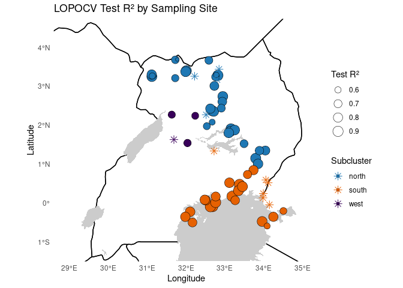
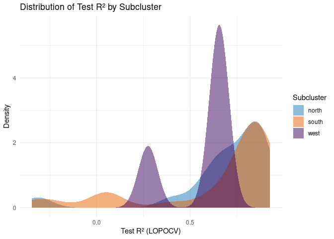
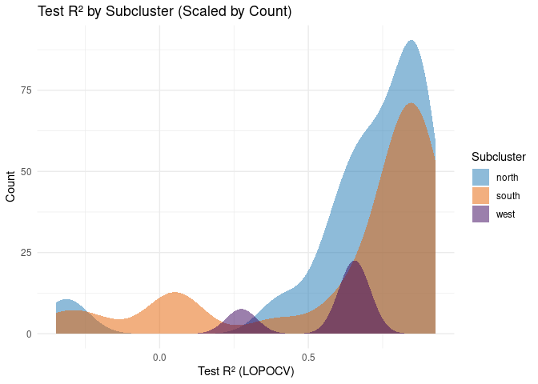
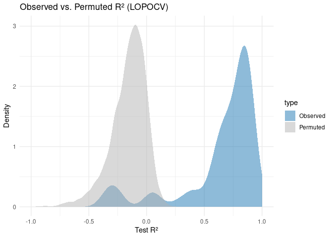

LOPOCV: Random Forest Cross-Validation
================
Norah Saarman
2025-06-18

- [Setup](#setup)
- [Inputs](#inputs)
- [Outputs](#outputs)
- [1. Load data and create Folds](#1-load-data-and-create-folds)
- [2. Test LOPOCV with first fold](#2-test-lopocv-with-first-fold)
- [3. Run LOPOCV in Parallel](#3-run-lopocv-in-parallel)
- [Visualize LOPOCV results](#visualize-lopocv-results)
- [Permutation test for LOPOCV R²](#permutation-test-for-lopocv-r²)
- [Compute Empirical p-values](#compute-empirical-p-values)

RStudio Configuration:  
- **R version:** R 4.4.0 (Geospatial packages)  
- **Number of cores:** 8 (up to 32 available)  
- **Account:** saarman-np  
- **Partition:** saarman-shared-np (allows multiple simultaneous jobs)  
- **Memory per job:** 200G (cluster limit: 1000G total; avoid exceeding
half)

# Setup

``` r
# load only required packages
library(dplyr)
library(readr)
library(randomForest)
library(doParallel)
library(ggplot2)
library(sf)
library(raster)
library(rnaturalearth)
library(rnaturalearthdata)

# Define Paths to directories
input_dir <- "../input"
results_dir <- "/uufs/chpc.utah.edu/common/home/saarman-group1/uganda-tsetse-LG/results"
output_dir <- file.path(results_dir, "lopocv")
dir.create(output_dir, showWarnings = FALSE)
```

# Inputs

- `../input/Gff_11loci_68sites_cse.csv` - Combined CSE table with
  coordinates (long1, lat1, long2, lat2)
- `../data_dir/processed/env_stack.grd` - Final raster stack for
  prediction including pix_dist

# Outputs

- `../results_dir/lopocv/` -

# 1. Load data and create Folds

``` r
# Load data
V.table_full <- read.csv(file.path(input_dir, "Gff_cse_envCostPaths.csv"))

# Filter out western outliers "50-KB" and "54-MS"
V.table <- V.table_full %>%
  filter(Var1 != "50-KB", Var2 != "50-KB")

# Filter for within-cluster pairs AND geographic distance ≤ 100 km
#V.table <- V.table_full %>%
#  filter(Pop1_cluster == Pop2_cluster) %>%
#  filter(pix_dist <= 100)

# Create unique ID after filtering
V.table$id <- paste(V.table$Var1, V.table$Var2, sep = "_")

# Define site list
sites <- sort(unique(c(V.table$Var1, V.table$Var2)))

# How many rows of data for each?
table(V.table$Pop1_cluster)
```

    ## 
    ## north south 
    ##   595   496

``` r
# How many unique sites?
length(sites)
```

    ## [1] 67

``` r
# Define top 18 mean predictors (adjust names if necessary)
predictor_vars <- c("pix_dist", "samp_20km_mean", "BIO3_mean", "BIO6_mean", "BIO15_mean","BIO13_mean", "BIO11S_mean", "BIO7_mean", "BIO1_mean", "BIO9S_mean","BIO12_mean", "alt_mean", "BIO18S_mean", "BIO4_mean", "BIO2_mean","slope_mean", "BIO10S_mean", "riv_3km_mean")

# (Optional) Remove samp_20km_mean... Define top 17 mean predictors (adjust names if necessary)
# predictor_vars <- c("pix_dist", "BIO3_mean", "BIO6_mean", "BIO15_mean","BIO13_mean", "BIO11S_mean", "BIO7_mean", "BIO1_mean", "BIO9S_mean","BIO12_mean", "alt_mean", "BIO18S_mean", "BIO4_mean", "BIO2_mean","slope_mean", "BIO10S_mean", "riv_3km_mean")

# Filter to modeling-relevant columns only
V.model <- V.table[, c("CSEdistance", predictor_vars)]
```

# 2. Test LOPOCV with first fold

``` r
# Pick a random site for the test fold
set.seed(1298373)
i <- sample(length(sites), 1)
site <- sites[i]
cat(sprintf("Testing fold %02d with site = %s\n", i, site))
```

    ## Testing fold 33 with site = 46-PT

``` r
# Split into test and train rows
test_rows  <- V.table %>% filter(Var1 == site | Var2 == site)
train_rows <- V.table %>% filter(!(Var1 == site | Var2 == site))

# Add row indices for matching with V.model
test_idx  <- which(V.table$id %in% test_rows$id)
train_idx <- which(V.table$id %in% train_rows$id)

# Create modeling input frames
train_df <- V.model[train_idx, ]
test_df  <- V.model[test_idx, ]

# Train RF model (no tuning)
set.seed(42)
rf_model <- randomForest(
  CSEdistance ~ .,
  data = train_df,
  ntree = 500,
  importance = TRUE
)

# Predict and calculate metrics
pred_train <- predict(rf_model, newdata = train_df)
pred_test  <- predict(rf_model, newdata = test_df)

rsq   <- tail(rf_model$rsq, 1)
rmse  <- sqrt(mean((pred_test - test_df$CSEdistance)^2))
mae   <- mean(abs(pred_test - test_df$CSEdistance))
cor1  <- cor(pred_train, train_df$CSEdistance)
cor2  <- cor(pred_test, test_df$CSEdistance)

# Extract variable importance
imp <- as.data.frame(importance(rf_model))
imp_mse <- setNames(as.list(imp[, "%IncMSE"]), paste0("IncMSE_", rownames(imp)))
imp_purity <- setNames(as.list(imp[, "IncNodePurity"]), paste0("NodePurity_", rownames(imp)))

# Save model
saveRDS(rf_model, file.path(output_dir, sprintf("rf_model_%02d.rds", i)))

# Save extended metrics
write_csv(
  data.frame(
    site = site,
    rsq = rsq,
    rmse = rmse,
    mae = mae,
    cor_train = cor1,
    cor_test = cor2,
    imp_mse,
    imp_purity
  ),
  file.path(output_dir, sprintf("metrics_fold_%02d.csv", i))
)

rf_model
```

    ## 
    ## Call:
    ##  randomForest(formula = CSEdistance ~ ., data = train_df, ntree = 500,      importance = TRUE) 
    ##                Type of random forest: regression
    ##                      Number of trees: 500
    ## No. of variables tried at each split: 6
    ## 
    ##           Mean of squared residuals: 0.001182991
    ##                     % Var explained: 85.41

``` r
varImpPlot(rf_model)
```

<!-- -->

``` r
cat(sprintf("Fold %02d completed and saved.\n", i))
```

    ## Fold 33 completed and saved.

# 3. Run LOPOCV in Parallel

\*\* NOTE:\*\* eval = FALSE so that skips on knit

``` r
# Parallel setup
n_cores <- 8
cl <- makeCluster(n_cores)
registerDoParallel(cl)

# Run LOPOCV with foreach
metrics_all <- foreach(i = seq_along(sites), .combine = rbind, .packages = c("dplyr", "randomForest", "readr")) %dopar% {

  # Identify current test site
  site <- sites[i]
  
  # Identify rows where site appears as Var1 or Var2 (test set)
  test_rows  <- V.table %>% filter(Var1 == site | Var2 == site)
  
  # All other rows go into the training set
  train_rows <- V.table %>% filter(!(Var1 == site | Var2 == site))

  # Use precomputed pair IDs to match rows in V.model
  test_idx  <- which(V.table$id %in% test_rows$id)
  train_idx <- which(V.table$id %in% train_rows$id)

  # Subset predictor data to match training/testing rows
  train_df <- V.model[train_idx, ]
  test_df  <- V.model[test_idx, ]

  # Train Random Forest model (fixed ntree and default mtry)
  set.seed(42)
  rf_model <- randomForest(
    CSEdistance ~ .,
    data = train_df,
    ntree = 500,
    importance = TRUE
  )

  # Predict on both train and test sets
  pred_train <- predict(rf_model, newdata = train_df)
  pred_test  <- predict(rf_model, newdata = test_df)

  # Calculate model performance metrics
  ss_res_test  <- sum((test_df$CSEdistance - pred_test)^2)
  ss_tot_test  <- sum((test_df$CSEdistance - mean(test_df$CSEdistance))^2)
  rsq_test     <- 1 - (ss_res_test / ss_tot_test)

  ss_res_train <- sum((train_df$CSEdistance - pred_train)^2)
  ss_tot_train <- sum((train_df$CSEdistance - mean(train_df$CSEdistance))^2)
  rsq_train    <- 1 - (ss_res_train / ss_tot_train)

  rmse         <- sqrt(mean((pred_test - test_df$CSEdistance)^2))
  mae          <- mean(abs(pred_test - test_df$CSEdistance))
  cor_train    <- cor(pred_train, train_df$CSEdistance)
  cor_test     <- cor(pred_test, test_df$CSEdistance)

  # Extract variable importance measures
  imp <- as.data.frame(importance(rf_model))
  imp_mse <- setNames(as.list(imp[, "%IncMSE"]), paste0("IncMSE_", rownames(imp)))
  imp_purity <- setNames(as.list(imp[, "IncNodePurity"]), paste0("NodePurity_", rownames(imp)))

  # Save Random Forest model for this fold
  saveRDS(rf_model, file.path(output_dir, sprintf("rf_model_%02d.rds", i)))

  # Save fold-specific metrics to CSV
  write_csv(
    data.frame(
      site = site,
      rsq_train = rsq_train,
      rsq_test = rsq_test,
      rmse = rmse,
      mae = mae,
      cor_train = cor_train,
      cor_test = cor_test,
      imp_mse,
      imp_purity
    ),
    file.path(output_dir, sprintf("metrics_fold_%02d.csv", i))
  )

  # Return full metrics as a row in combined results
  data.frame(
    site = site,
    rsq_train = rsq_train,
    rsq_test = rsq_test,
    rmse = rmse,
    mae = mae,
    cor_train = cor_train,
    cor_test = cor_test,
    imp_mse,
    imp_purity
  )
}

# Stop cluster
stopCluster(cl)

# Write summary CSV
write.csv(metrics_all, file.path(output_dir, "LOPOCV_summary.csv"), row.names = FALSE)

# Write summary CSV again within GitHub
write.csv(metrics_all, "../results/LOPOCV_summary.csv", row.names = FALSE)

metrics_all 
```

# Visualize LOPOCV results

Plot and summarize metrics, especially RSQ_test, try to figure out what
could be reducing accuracy

``` r
# Load LOPOCV summary if not already in memory
if (!exists("metrics_all")) {
  metrics_all <- read.csv("../results/LOPOCV_summary.csv")
}

# Load raster for extent
altitude <- raster::raster(file.path(
  "/uufs/chpc.utah.edu/common/home/saarman-group1/uganda-tsetse-LG/data/processed",
  "altitude_1KMmedian_MERIT_UgandaClip.tif"
))
crs(altitude) <- 4326

# Load site metadata including subcluster
indinfo <- read.delim("../input/Gff_11loci_allsites_indinfo.txt")
site_clusters <- indinfo %>%
  dplyr::select(Site = SiteCode, Subcluster = SiteMajCluster) %>%
  distinct()

# Build site metadata from V.table and join with subclusters and metrics
site_metadata <- V.table %>%
  dplyr::select(Site = Var1, Latitude = lat1, Longitude = long1) %>%
  distinct() %>%
  left_join(site_clusters, by = "Site") %>%
  left_join(metrics_all, by = c("Site" = "site")) %>%
  mutate(Symbol = ifelse(rsq_test < 0.5, "low", "circle")) %>%
  arrange(desc(rsq_test))

# Extract map extent
r_ext <- extent(altitude)
xlim <- c(r_ext@xmin, r_ext@xmax)
ylim <- c(r_ext@ymin, r_ext@ymax)

# Natural Earth background
uganda <- ne_countries(scale = "medium", continent = "Africa", returnclass = "sf") %>% st_transform(4326)
lakes <- ne_download(scale = 10, type = "lakes", category = "physical", returnclass = "sf") %>% st_transform(4326)
```

    ## Reading layer `ne_10m_lakes' from data source `/tmp/Rtmpgd4Hmi/ne_10m_lakes.shp' using driver `ESRI Shapefile'
    ## Simple feature collection with 1355 features and 41 fields
    ## Geometry type: MULTIPOLYGON
    ## Dimension:     XY
    ## Bounding box:  xmin: -165.9656 ymin: -50.66967 xmax: 177.1544 ymax: 81.95521
    ## Geodetic CRS:  WGS 84

``` r
# Plot LOPOCV R² by site
ggplot() +
  geom_sf(data = uganda, fill = NA, color = "black", linewidth = 0.5) +
  geom_sf(data = lakes, fill = "gray80", color = NA) +

  geom_point(data = filter(site_metadata, Symbol == "circle"),
             aes(x = Longitude, y = Latitude, size = rsq_test, fill = Subcluster),
             shape = 21, color = "black", stroke = 0.3) +

  geom_point(data = filter(site_metadata, Symbol == "low"),
             aes(x = Longitude, y = Latitude, color = Subcluster),
             shape = 8, size = 3) +

  scale_fill_manual(name = "Subcluster", values = c("north" = "#1f78b4", "south" = "#e66101", "west" = "#39005A")) +
  scale_color_manual(name = "Subcluster", values = c("north" = "#1f78b4", "south" = "#e66101", "west" = "#39005A")) +
  scale_size_continuous(name = "Test R²", range = c(2, 6)) +
  coord_sf(xlim = xlim, ylim = ylim, expand = FALSE) +
  theme_minimal() +
  theme(panel.grid = element_blank()) +
  labs(title = "LOPOCV Test R² by Sampling Site", x = "Longitude", y = "Latitude")
```

<!-- -->

``` r
# Overlapping density plot
ggplot(site_metadata, aes(x = rsq_test, fill = Subcluster)) +
  geom_density(alpha = 0.5, color = NA) +
  scale_fill_manual(values = c("north" = "#1f78b4", "south" = "#e66101", "west" = "#39005A")) +
  theme_minimal() +
  labs(title = "Distribution of Test R² by Subcluster",
       x = "Test R² (LOPOCV)", y = "Density")
```

<!-- -->

``` r
# Overlapping count plot
ggplot(site_metadata, aes(x = rsq_test, fill = Subcluster)) +
  geom_density(alpha = 0.5, color = NA, position = "identity", aes(y = ..count..)) +
  scale_fill_manual(values = c("north" = "#1f78b4", "south" = "#e66101", "west" = "#39005A")) +
  theme_minimal() +
  labs(title = "Test R² by Subcluster (Scaled by Count)",
       x = "Test R² (LOPOCV)",
       y = "Count")
```

    ## Warning: The dot-dot notation (`..count..`) was deprecated in ggplot2 3.4.0.
    ## ℹ Please use `after_stat(count)` instead.
    ## This warning is displayed once every 8 hours.
    ## Call `lifecycle::last_lifecycle_warnings()` to see where this warning was
    ## generated.

<!-- -->

Which sites are performing worst?

``` r
# Identify worst-performing sites by subcluster
site_metadata[site_metadata$Subcluster == "north" & site_metadata$rsq_test < 0.5, c("Site","rsq_test","Subcluster")]
```

    ##      Site   rsq_test Subcluster
    ## 55 17-LAG  0.4305866      north
    ## 57 14-OKS  0.3844193      north
    ## 63  21-KT -0.2937794      north
    ## 64 31-ACA -0.3329004      north

``` r
site_metadata[site_metadata$Subcluster == "west" & site_metadata$rsq_test < 0.5, c("Site","rsq_test","Subcluster")]
```

    ##     Site  rsq_test Subcluster
    ## 58 54-MS 0.2746946       west

``` r
site_metadata[site_metadata$Subcluster == "south" & site_metadata$rsq_test < 0.5, c("Site","rsq_test","Subcluster")]
```

    ##      Site    rsq_test Subcluster
    ## 56  78-OK  0.39022729      south
    ## 59 82-BON  0.07053032      south
    ## 60 81-BUD  0.06737164      south
    ## 61  79-BU  0.01569260      south
    ## 62  72-JN -0.23478394      south
    ## 65  76-TB -0.34779055      south

My notes from my analysis on Model Design and Diagnostic Attempts Jun
20, 2025:

I tried removing sampling effort as a predictor:  
- Result: Worsened performance in west, no benefit in north/south.

I tried subdividing by subclusters (K=3):  
- Result: Lower R² overall due to smaller training sets.

I tried filtering by geographic distance:  
- Result: Worsened performance due to fewer training pairs.

I tested exclusion of site 50-KB:  
- Result: **Improved** performance in west.

I also tested removing site 54-MS:  
- Result: No benefit, and it actually reduced accuracy in neighboring
KAF.

Final decision:  
- Stick with K=2 major clusters (north / south).  
- Keep all intra-cluster pairs (no geodist pruning).  
- Just exclude 50-KB as a clear spatial outlier.  
- Use subclusters only for interpretation, not model restriction.

# Permutation test for LOPOCV R²

GOAL: Create a 67 x 100 matrix where each cell is the rsq_test value for
one LOPOCV fold (site) under a permuted response (CSEdistance)

``` r
# Set number of permutations
n_perm <- 100

# Preallocate matrix for results
rsq_null <- matrix(NA, nrow = length(sites), ncol = n_perm)
rownames(rsq_null) <- sites
colnames(rsq_null) <- paste0("perm_", seq_len(n_perm))

# Load required packages
library(foreach)
library(doParallel)

# Set up parallel backend
cl <- makeCluster(8)
registerDoParallel(cl)

# Run permutations
rsq_null <- foreach(p = 1:n_perm, .combine = cbind, .packages = c("randomForest", "dplyr")) %dopar% {
  set.seed(500 + p)  # unique seed for reproducibility

  # Shuffle response column while preserving order
  V.model_perm <- V.model
  V.model_perm$CSEdistance <- sample(V.model_perm$CSEdistance)

  # Store R² for each site (LOPOCV)
  rsq_perm <- numeric(length(sites))

  for (i in seq_along(sites)) {
    site <- sites[i]

    # Identify test/train indices
    test_ids  <- V.table$id[V.table$Var1 == site | V.table$Var2 == site]
    test_idx  <- which(V.table$id %in% test_ids)
    train_idx <- which(!V.table$id %in% test_ids)

    train_df <- V.model_perm[train_idx, ]
    test_df  <- V.model_perm[test_idx, ]

    # Fit Random Forest on permuted response
    rf_model <- randomForest(CSEdistance ~ ., data = train_df, ntree = 500)

    # Predict and compute test R²
    pred_test <- predict(rf_model, newdata = test_df)
    ss_res <- sum((test_df$CSEdistance - pred_test)^2)
    ss_tot <- sum((test_df$CSEdistance - mean(test_df$CSEdistance))^2)
    rsq_test <- 1 - (ss_res / ss_tot)

    # Store
    rsq_perm[i] <- rsq_test
  }

  # Return as column for this permutation
  rsq_perm
}

# Stop cluster
stopCluster(cl)

# Save matrix to file for later use
write.csv(rsq_null, file.path(output_dir, "rsq_LOPOCV_null_matrix.csv"), row.names = TRUE)
write.csv(rsq_null, "../results/rsq_LOPOCV_null_matrix.csv", row.names = TRUE)

# Done
message("Permutation matrix created and saved.")
```

# Compute Empirical p-values

GOAL: Run wilcox.test() for each column of rsq_null, just like we did
using the signed-rank statistic in the previous message. This gives you
a distribution of test statistics (or p-values), from which you compute
an empirical p-value:

Compares observed R² values to the mean R² across columns (permutated
replicate).

Compare the distribution of observed R² values (from real LOPOCV) to
those from the permuted data

``` r
# Load permuted R² matrix and convert to long format
rsq_null_mat <- as.matrix(read.csv("../results/rsq_LOPOCV_null_matrix.csv"))
rsq_null_long <- as.vector(rsq_null_mat)
rsq_obs <- metrics_all$rsq_test

# Build data frame for plotting
plot_df_rsq <- data.frame(
  rsq = c(rsq_obs, rsq_null_long),
  type = c(rep("Observed", length(rsq_obs)),
           rep("Permuted", length(rsq_null_long)))
)

# Plot density comparison
ggplot(plot_df_rsq, aes(x = rsq, fill = type)) +
  geom_density(alpha = 0.5, color = NA) +
  scale_fill_manual(values = c("Observed" = "#1f78b4", "Permuted" = "gray70")) +
  xlim(-1, 1) +
  theme_minimal() +
  labs(title = "Observed vs. Permuted R² (LOPOCV)",
       x = "Test R²",
       y = "Density")
```

    ## Warning: Removed 76 rows containing non-finite outside the scale range
    ## (`stat_density()`).

<!-- -->

Calculate a Wilcoxon signed-rank statistic for each column (permuted
replicate) and a one-sided p-value as the proportion of permuted
statistics ≥ observed.

``` r
# Vector of observed R² values (length = number of folds)
rsq_obs <- metrics_all$rsq_test

# Matrix of permuted R² values: rows = folds, columns = permutations
rsq_null_mat <- as.matrix(read.csv("../results/rsq_LOPOCV_null_matrix.csv"))

# Function to compute signed rank statistic for a single permuted replicate
signed_rank_stat <- function(null_rsq) {
  # Remove any rows with missing observed values
  non_na_idx <- !is.na(rsq_obs) & !is.na(null_rsq)
  obs <- rsq_obs[non_na_idx]
  null <- null_rsq[non_na_idx]
  
  # Calculate signed ranks
  diffs <- obs - null
  signed_ranks <- rank(abs(diffs)) * sign(diffs)
  sum(signed_ranks)
}

# Observed signed-rank statistic (using observed vs. permuted mean)
obs_stat <- signed_rank_stat(rowMeans(rsq_null_mat, na.rm = TRUE))

# Null distribution of signed-rank stats across permutations
perm_stats <- apply(rsq_null_mat, 2, signed_rank_stat)

# Empirical p-value (one-sided: observed > permuted)
p_val <- mean(perm_stats <= obs_stat)

# Output
cat(sprintf("Empirical p-value (Wilcoxon signed-rank test across folds): %.4f\n", p_val))
```

    ## Empirical p-value (Wilcoxon signed-rank test across folds): 0.0099

More detail on the Empirical P-values via Permutation:

- **rsq_null_mat is a matrix:**

  - Rows = folds

  - Columns = permutation replicates

- For each column of rsq_null_mat (i.e., one permutation replicate):

  - Compute a signed-rank statistic comparing rsq_obs to that column.

  - Compare your observed signed-rank stat (vs. the mean of permuted R²)
    to the distribution of stats from those permutation columns.

  - The empirical p-value is the fraction of permuted stats ≥ the
    observed stat → a one-sided test asking how often is the permuted
    result as strong or stronger than the real one?
