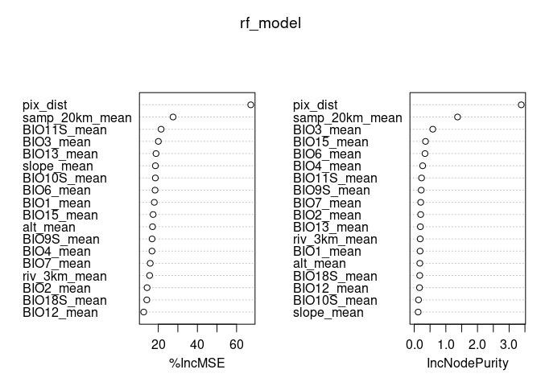

LOPOCV: Random Forest Cross-Validation
================
Norah Saarman
2025-06-18

- [Setup](#setup)
- [Inputs](#inputs)
- [Outputs](#outputs)
- [1. Create Fold Files](#1-create-fold-files)
- [2. Test LOPOCV with first fold](#2-test-lopocv-with-first-fold)
- [3. Run LOPOCV in Parallel](#3-run-lopocv-in-parallel)

RStudio Configuration:  
- **R version:** R 4.4.0 (Geospatial packages)  
- **Number of cores:** 8 (up to 32 available)  
- **Account:** saarman-np  
- **Partition:** saarman-shared-np (allows multiple simultaneous jobs)  
- **Memory per job:** 200G (cluster limit: 1000G total; avoid exceeding
half)

# Setup

``` r
# load only required packages
library(dplyr)
library(readr)
library(randomForest)
library(doParallel)

# Define Paths to directories
input_dir <- "../input"
results_dir <- "/uufs/chpc.utah.edu/common/home/saarman-group1/uganda-tsetse-LG/results"
output_dir <- file.path(results_dir, "lopocv")
dir.create(output_dir, showWarnings = FALSE)
```

# Inputs

- `../input/Gff_11loci_68sites_cse.csv` - Combined CSE table with
  coordinates (long1, lat1, long2, lat2)
- `../data_dir/processed/env_stack.grd` - Final raster stack for
  prediction including pix_dist

# Outputs

- `../results_dir/lopocv/` -

# 1. Create Fold Files

``` r
# Load data
V.table <- read.csv(file.path(input_dir, "Gff_cse_envCostPaths.csv"))
V.table$id <- paste(V.table$Var1, V.table$Var2, sep = "_")

# Define site list
sites <- sort(unique(c(V.table$Var1, V.table$Var2)))

# Define top 18 mean predictors (adjust names if necessary)
predictor_vars <- c("pix_dist", "samp_20km_mean", "BIO3_mean", "BIO6_mean", "BIO15_mean","BIO13_mean", "BIO11S_mean", "BIO7_mean", "BIO1_mean", "BIO9S_mean","BIO12_mean", "alt_mean", "BIO18S_mean", "BIO4_mean", "BIO2_mean","slope_mean", "BIO10S_mean", "riv_3km_mean")

# Filter to modeling-relevant columns only
V.model <- V.table[, c("CSEdistance", predictor_vars)]
```

# 2. Test LOPOCV with first fold

``` r
# Pick a random site for the test fold
set.seed(1298373)
i <- sample(length(sites), 1)
site <- sites[i]
cat(sprintf("Testing fold %02d with site = %s\n", i, site))
```

    ## Testing fold 33 with site = 46-PT

``` r
# Split into test and train rows
test_rows  <- V.table %>% filter(Var1 == site | Var2 == site)
train_rows <- V.table %>% filter(!(Var1 == site | Var2 == site))

# Add row indices for matching with V.model
test_idx  <- which(V.table$id %in% test_rows$id)
train_idx <- which(V.table$id %in% train_rows$id)

# Create modeling input frames
train_df <- V.model[train_idx, ]
test_df  <- V.model[test_idx, ]

# Train RF model (no tuning)
set.seed(42)
rf_model <- randomForest(
  CSEdistance ~ .,
  data = train_df,
  ntree = 500,
  importance = TRUE
)

# Predict and calculate metrics
pred_train <- predict(rf_model, newdata = train_df)
pred_test  <- predict(rf_model, newdata = test_df)

rsq   <- tail(rf_model$rsq, 1)
rmse  <- sqrt(mean((pred_test - test_df$CSEdistance)^2))
mae   <- mean(abs(pred_test - test_df$CSEdistance))
cor1  <- cor(pred_train, train_df$CSEdistance)
cor2  <- cor(pred_test, test_df$CSEdistance)

# Extract variable importance
imp <- as.data.frame(importance(rf_model))
imp_mse <- setNames(as.list(imp[, "%IncMSE"]), paste0("IncMSE_", rownames(imp)))
imp_purity <- setNames(as.list(imp[, "IncNodePurity"]), paste0("NodePurity_", rownames(imp)))

# Save model
saveRDS(rf_model, file.path(output_dir, sprintf("rf_model_%02d.rds", i)))

# Save extended metrics
write_csv(
  data.frame(
    site = site,
    rsq = rsq,
    rmse = rmse,
    mae = mae,
    cor_train = cor1,
    cor_test = cor2,
    imp_mse,
    imp_purity
  ),
  file.path(output_dir, sprintf("metrics_fold_%02d.csv", i))
)

rf_model
```

    ## 
    ## Call:
    ##  randomForest(formula = CSEdistance ~ ., data = train_df, ntree = 500,      importance = TRUE) 
    ##                Type of random forest: regression
    ##                      Number of trees: 500
    ## No. of variables tried at each split: 6
    ## 
    ##           Mean of squared residuals: 0.001193633
    ##                     % Var explained: 86.06

``` r
varImpPlot(rf_model)
```

<!-- -->

``` r
cat(sprintf("Fold %02d completed and saved.\n", i))
```

    ## Fold 33 completed and saved.

# 3. Run LOPOCV in Parallel

\*\* NOTE:\*\* eval = FALSE so that skips on knit

``` r
# Parallel setup
n_cores <- 8
cl <- makeCluster(n_cores)
registerDoParallel(cl)

# Run LOPOCV with foreach
metrics_all <- foreach(i = seq_along(sites), .combine = rbind, .packages = c("dplyr", "randomForest", "readr")) %dopar% {
  site <- sites[i]
  
  # Split into test and train rows using V.table
  test_rows  <- V.table %>% filter(Var1 == site | Var2 == site)
  train_rows <- V.table %>% filter(!(Var1 == site | Var2 == site))

  # Find row indices for matching with V.model
  test_idx  <- which(V.table$id %in% test_rows$id)
  train_idx <- which(V.table$id %in% train_rows$id)

  # Subset modeling data
  train_df <- V.model[train_idx, ]
  test_df  <- V.model[test_idx, ]

  # Train model
  set.seed(42)
  rf_model <- randomForest(
    CSEdistance ~ .,
    data = train_df,
    ntree = 500,
    importance = TRUE
  )

  # Predict
  pred_train <- predict(rf_model, newdata = train_df)
  pred_test  <- predict(rf_model, newdata = test_df)

  # Metrics
  rsq   <- tail(rf_model$rsq, 1)
  rmse  <- sqrt(mean((pred_test - test_df$CSEdistance)^2))
  mae   <- mean(abs(pred_test - test_df$CSEdistance))
  cor1  <- cor(pred_train, train_df$CSEdistance)
  cor2  <- cor(pred_test, test_df$CSEdistance)
  imp <- as.data.frame(importance(rf_model))
  imp_mse <- setNames(as.list(imp[, "%IncMSE"]), paste0("IncMSE_", rownames(imp)))
  imp_purity <- setNames(as.list(imp[, "IncNodePurity"]), paste0("NodePurity_", rownames(imp)))

  # Save model
  saveRDS(rf_model, file.path(output_dir, sprintf("rf_model_%02d.rds", i)))

  # Save extended metrics to CSV
  write_csv(
  data.frame(
    site = site,
    rsq = rsq,
    rmse = rmse,
    mae = mae,
    cor_train = cor1,
    cor_test = cor2,
    imp_mse,
    imp_purity
  ),
  file.path(output_dir, sprintf("metrics_fold_%02d.csv", i))
)


# Combine metrics and importance into single return object
data.frame(
  site = site,
  rsq = rsq,
  rmse = rmse,
  mae = mae,
  cor_train = cor1,
  cor_test = cor2,
  imp_mse,
  imp_purity
)
}


# Stop cluster
stopCluster(cl)

# Write summary CSV
write.csv(metrics_all, file.path(output_dir, "LOPOCV_summary.csv"), row.names = FALSE)

metrics_all
```
