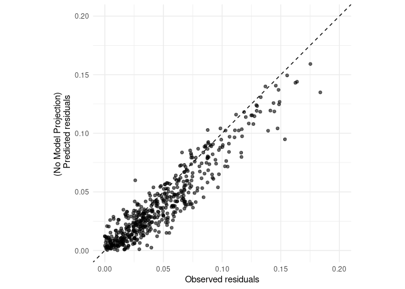

LOPOCV: Random Forest Cross-Validation with IBD-residuals
================
Norah Saarman
2025-09-03

- [Setup](#setup)
- [1. Load data and create Folds](#1-load-data-and-create-folds)
- [2. Test LOPOCV with first fold](#2-test-lopocv-with-first-fold)
- [3. Leave-one-point-out Cross
  Validation](#3-leave-one-point-out-cross-validation)
  - [Run LOPOCV](#run-lopocv)
  - [Visualize LOPOCV results](#visualize-lopocv-results)
  - [Which sites are performing
    worst?](#which-sites-are-performing-worst)
- [4. Permutation test for LOPOCV R²](#4-permutation-test-for-lopocv-r²)
  - [LOPOCV on permuted residual
    models](#lopocv-on-permuted-residual-models)
  - [Compare Distributions](#compare-distributions)
  - [Wilcoxon signed-rank statistic](#wilcoxon-signed-rank-statistic)
- [5. Plot LOPOCV and permutated LOPOCV
  side-by-side](#5-plot-lopocv-and-permutated-lopocv-side-by-side)
- [7. Variable importance plot](#7-variable-importance-plot)
  - [IncNodePurity:](#incnodepurity)
  - [Abrev Percent Improvement MSE](#abrev-percent-improvement-mse)

RStudio Configuration:  
- **R version:** R 4.4.0 (Geospatial packages)  
- **Number of cores:** 8 (up to 32 available)  
- **Account:** saarman-np  
- **Partition:** saarman-shared-np (allows multiple simultaneous jobs)  
- **Memory per job:** 200G (cluster limit: 1000G total; avoid exceeding
half)

# Setup

``` r
# load only required packages
library(dplyr)
library(readr)
library(randomForest)
library(doParallel)
library(ggplot2)
library(sf)
library(raster)
library(rnaturalearth)
library(rnaturalearthdata)
library(randomForest)
library(tidyverse)

# Define Paths to directories
input_dir <- "../input"
results_dir <- "/uufs/chpc.utah.edu/common/home/saarman-group1/uganda-tsetse-LG/results"
output_dir <- file.path(results_dir, "lopocv")
#dir.create(output_dir, showWarnings = FALSE)
scratch_dir <- "/scratch/general/vast/u6036559"

# Load data
V.table_full <- read.csv(file.path(input_dir, "Gff_cse_envCostPaths.csv"))

# Filter out western outlier "50-KB" 
V.table_full <- V.table_full %>%
  filter(Var1 != "50-KB", Var2 != "50-KB")
```

# 1. Load data and create Folds

``` r
# Load data specific to residuals
V.table <- read.csv(file.path(input_dir, "Gff_cse_envCostPaths_residuals.csv"),header=TRUE)

# Create unique ID after filtering
V.table$id <- paste(V.table$Var1, V.table$Var2, sep = "_")

# Define site list
sites <- sort(unique(c(V.table$Var1, V.table$Var2)))

# How many rows of data for each?
table(V.table$Pop1_cluster)
```

    ## < table of extent 0 >

``` r
# How many unique sites?
length(sites)
```

    ## [1] 67

``` r
# Choose predictors for RF model (adjust names if necessary)
predictor_vars <- c("BIO1_mean","BIO2_mean","BIO3_mean","BIO4_mean", "BIO5_mean","BIO6_mean","BIO7_mean", "BIO8S_mean", "BIO9S_mean","BIO10S_mean", "BIO11S_mean","BIO12_mean", "BIO13_mean","BIO14_mean","BIO15_mean","BIO16S_mean","BIO17S_mean", "BIO18S_mean","BIO19S_mean","slope_mean","alt_mean", "lakes_mean","riv_3km_mean")

# Filter to modeling-relevant columns only
V.model <- V.table[, c("resid_ibd", predictor_vars)]
```

# 2. Test LOPOCV with first fold

``` r
# Pick a random site for the test fold
set.seed(1298373)
i <- sample(length(sites), 1)
site <- sites[i]
cat(sprintf("Testing fold %02d with site = %s\n", i, site))
```

    ## Testing fold 33 with site = 46-PT

``` r
# Split into test and train rows
test_rows  <- V.table %>% filter(Var1 == site | Var2 == site)
train_rows <- V.table %>% filter(!(Var1 == site | Var2 == site))

# Add row indices for matching with V.model
test_idx  <- which(V.table$id %in% test_rows$id)
train_idx <- which(V.table$id %in% train_rows$id)

# Create modeling input frames
train_df <- V.model[train_idx, ]
test_df  <- V.model[test_idx, ]

# Train RF model (no tuning)
set.seed(42)
rf_model <- randomForest(
  resid_ibd ~ .,
  data = train_df,
  ntree = 500,
  importance = TRUE
)

# Predict and calculate metrics
pred_train <- predict(rf_model, newdata = train_df)
pred_test  <- predict(rf_model, newdata = test_df)

rsq   <- tail(rf_model$rsq, 1)
rmse  <- sqrt(mean((pred_test - test_df$resid_ibd)^2))
mae   <- mean(abs(pred_test - test_df$resid_ibd))
cor1  <- cor(pred_train, train_df$resid_ibd)
cor2  <- cor(pred_test, test_df$resid_ibd)

# Extract variable importance
imp <- as.data.frame(importance(rf_model))
imp_mse <- setNames(as.list(imp[, "%IncMSE"]), paste0("IncMSE_", rownames(imp)))
imp_purity <- setNames(as.list(imp[, "IncNodePurity"]), paste0("NodePurity_", rownames(imp)))

# Save model
saveRDS(rf_model, file.path(output_dir, sprintf("rf_resid_model_%02d.rds", i)))

# Save extended metrics
write_csv(
  data.frame(
    site = site,
    rsq = rsq,
    rmse = rmse,
    mae = mae,
    cor_train = cor1,
    cor_test = cor2,
    imp_mse,
    imp_purity
  ),
  file.path(output_dir, sprintf("metrics_fold_%02d.csv", i))
)

varImpPlot(rf_model)
```

<!-- -->

``` r
cat(sprintf("Fold %02d completed and saved.\n", i))
```

    ## Fold 33 completed and saved.

# 3. Leave-one-point-out Cross Validation

## Run LOPOCV

**NOTE:** eval = FALSE so that it skips on knit

``` r
# Parallel setup
n_cores <- 8
cl <- makeCluster(n_cores)
registerDoParallel(cl)

# Run LOPOCV with foreach
metrics_all <- foreach(i = seq_along(sites), .combine = rbind, .packages = c("dplyr", "randomForest", "readr")) %dopar% {

  # Identify current test site
  site <- sites[i]
  
  # Identify rows where site appears as Var1 or Var2 (test set)
  test_rows  <- V.table %>% filter(Var1 == site | Var2 == site)
  
  # All other rows go into the training set
  train_rows <- V.table %>% filter(!(Var1 == site | Var2 == site))

  # Use precomputed pair IDs to match rows in V.model
  test_idx  <- which(V.table$id %in% test_rows$id)
  train_idx <- which(V.table$id %in% train_rows$id)

  # Subset predictor data to match training/testing rows
  train_df <- V.model[train_idx, ]
  test_df  <- V.model[test_idx, ]

  # Train Random Forest model (fixed ntree and default mtry)
  set.seed(42)
  rf_model <- randomForest(
    resid_ibd ~ .,
    data = train_df,
    ntree = 500,
    importance = TRUE
  )

  # Predict on both train and test sets
  pred_train <- predict(rf_model, newdata = train_df)
  pred_test  <- predict(rf_model, newdata = test_df)

  # Calculate model performance metrics
  ss_res_test  <- sum((test_df$resid_ibd - pred_test)^2)
  ss_tot_test  <- sum((test_df$resid_ibd - mean(test_df$resid_ibd))^2)
  rsq_test     <- 1 - (ss_res_test / ss_tot_test)

  ss_res_train <- sum((train_df$resid_ibd - pred_train)^2)
  ss_tot_train <- sum((train_df$resid_ibd - mean(train_df$resid_ibd))^2)
  rsq_train    <- 1 - (ss_res_train / ss_tot_train)

  rmse         <- sqrt(mean((pred_test - test_df$resid_ibd)^2))
  mae          <- mean(abs(pred_test - test_df$resid_ibd))
  cor_train    <- cor(pred_train, train_df$resid_ibd)
  cor_test     <- cor(pred_test, test_df$resid_ibd)

  # Extract variable importance measures
  imp <- as.data.frame(importance(rf_model))
  imp_mse <- setNames(as.list(imp[, "%IncMSE"]), paste0("IncMSE_", rownames(imp)))
  imp_purity <- setNames(as.list(imp[, "IncNodePurity"]), paste0("NodePurity_", rownames(imp)))

  # Save Random Forest model for this fold
  saveRDS(rf_model, file.path(output_dir, sprintf("rf_resid_model_%02d.rds", i)))

  # Save fold-specific metrics to CSV
  write_csv(
    data.frame(
      site = site,
      rsq_train = rsq_train,
      rsq_test = rsq_test,
      rmse = rmse,
      mae = mae,
      cor_train = cor_train,
      cor_test = cor_test,
      imp_mse,
      imp_purity
    ),
    file.path(output_dir, sprintf("metrics_fold_%02d.csv", i))
  )

  # Return full metrics as a row in combined results
  data.frame(
    site = site,
    rsq_train = rsq_train,
    rsq_test = rsq_test,
    rmse = rmse,
    mae = mae,
    cor_train = cor_train,
    cor_test = cor_test,
    imp_mse,
    imp_purity
  )
}

# Stop cluster
stopCluster(cl)

# Write summary CSV
write.csv(metrics_all, file.path(output_dir, "LOPOCV_resid_summary.csv"), row.names = FALSE)

# Write summary CSV again within GitHub
write.csv(metrics_all, "../results/LOPOCV_resid_summary.csv", row.names = FALSE)
```

## Visualize LOPOCV results

Plot and summarize metrics, especially RSQ_test, try to figure out what
could be reducing accuracy

``` r
# Load LOPOCV summary
metrics_all <- read.csv("../results/LOPOCV_resid_summary.csv")

# Load raster for extent
altitude <- raster::raster(file.path(
  "/uufs/chpc.utah.edu/common/home/saarman-group1/uganda-tsetse-LG/data/processed",
  "altitude_1KMmedian_MERIT_UgandaClip.tif"
))
crs(altitude) <- 4326

# Load site metadata including subcluster
indinfo <- read.delim("../input/Gff_11loci_allsites_indinfo.txt")
site_clusters <- indinfo %>%
  dplyr::select(Site = SiteCode, Subcluster = SiteMajCluster) %>%
  distinct()

# Build site metadata from V.table and join with subclusters and metrics
site_metadata <- V.table_full %>%
  dplyr::select(Site = Var1, Latitude = lat1, Longitude = long1) %>%
  distinct() %>%
  left_join(site_clusters, by = "Site") %>%
  left_join(metrics_all, by = c("Site" = "site")) %>%
  mutate(Symbol = ifelse(rsq_test < 0.3, "low", "circle")) %>%
  arrange(desc(rsq_test))

# Extract map extent
r_ext <- extent(altitude)
xlim <- c(r_ext@xmin, r_ext@xmax)
ylim <- c(r_ext@ymin, r_ext@ymax)

# Natural Earth background
uganda <- ne_countries(scale = "medium", continent = "Africa", returnclass = "sf") %>% st_transform(4326)
lakes <- ne_download(scale = 10, type = "lakes", category = "physical", returnclass = "sf") %>% st_transform(4326)
```

    ## Reading 'ne_10m_lakes.zip' from naturalearth...

``` r
# Plot LOPOCV R² by site
ggplot() +
  geom_sf(data = uganda, fill = NA, color = "black", linewidth = 0.1) +
  geom_sf(data = lakes, fill = "black", color = NA) +

  geom_point(data = filter(site_metadata, Symbol == "circle"),
             aes(x = Longitude, y = Latitude, size = rsq_test, fill = Subcluster),
             shape = 21, color = "black", stroke = 0.3) +

  geom_point(data = filter(site_metadata, Symbol == "low"),
             aes(x = Longitude, y = Latitude, fill = Subcluster),
             shape = 21, color = "black", stroke = 0.3, size = 1) +

  scale_fill_manual(name = "Subcluster", values = c("north" = "#1f78b4", "south" = "#e66101", "west" = "#39005A")) +
  scale_color_manual(name = "Subcluster", values = c("north" = "#1f78b4", "south" = "#e66101", "west" = "#39005A")) +
  scale_size_continuous(name = "LOPOCV \n Test R²", range = c(1, 9), limits = c(0.3, 1), breaks = c(0.4, 0.5,0.6,0.7,0.8,0.9)) +
  coord_sf(xlim = xlim, ylim = ylim, expand = FALSE) +
  theme_minimal() +
  theme(panel.grid = element_blank()) +
  labs(title = "LOPOCV Test R² by Sampling Site", x = "Longitude", y = "Latitude")
```

<!-- -->

``` r
# Overlapping density plot
ggplot(site_metadata, aes(x = rsq_test, fill = Subcluster)) +
  geom_density(alpha = 0.5, color = NA) +
  scale_fill_manual(values = c("north" = "#1f78b4", "south" = "#e66101", "west" = "#39005A")) +
  theme_minimal() +
  labs(title = "Distribution of Test R² by Subcluster",
       x = "Test R² (LOPOCV)", y = "Density")
```

<!-- -->

``` r
# Overlapping count plot
ggplot(site_metadata, aes(x = rsq_test, fill = Subcluster)) +
  geom_density(alpha = 0.5, color = NA, position = "identity", aes(y = ..count..)) +
  scale_fill_manual(values = c("north" = "#1f78b4", "south" = "#e66101", "west" = "#39005A")) +
  theme_minimal() +
  labs(title = "Test R² by Subcluster (Scaled by Count)",
       x = "Test R² (LOPOCV)",
       y = "Count (Count/100 for Permutations)")
```

<!-- -->

``` r
# reassign Cluster
site_metadata$Cluster <- site_metadata$Subcluster
site_metadata$Cluster[site_metadata$Subcluster == "west"]  <- "south"

# Plot LOPOCV R² by site just N/S
ggplot() +
  geom_sf(data = uganda, fill = NA, color = "black", linewidth = 0.1) +
  geom_sf(data = lakes, fill = "black", color = NA) +

  geom_point(data = filter(site_metadata, Symbol == "circle"),
             aes(x = Longitude, y = Latitude, size = rsq_test, fill = Cluster),
             shape = 21, color = "black", stroke = 0.3) +

  geom_point(data = filter(site_metadata, Symbol == "low"),
             aes(x = Longitude, y = Latitude, fill = Cluster),
             shape = 21, color = "black", size = 1, stroke = 0.3) +

  scale_fill_manual(name = "Cluster", values = c("north" = "#1f78b4", "south" = "#e66101")) +
  scale_color_manual(name = "Cluster", values = c("north" = "#1f78b4", "south" = "#e66101")) +
  scale_size_continuous(name = "LOPOCV \n Test R²", range = c(1, 9), limits = c(0.3, 1), breaks = c(0.4, 0.5,0.6,0.7,0.8,0.9)) +
  coord_sf(xlim = xlim, ylim = ylim, expand = FALSE) +
  theme_minimal() +
  theme(panel.grid = element_blank()) +
  labs(title = "LOPOCV Test R² by Site", x = "Longitude", y = "Latitude")
```

<!-- -->

``` r
# Overlapping density plot just S/N
ggplot(site_metadata, aes(x = rsq_test, fill = Cluster)) +
  geom_density(alpha = 0.5, color = NA) +
  scale_fill_manual(values = c("north" = "#1f78b4", "south" = "#e66101")) +
  theme_minimal() +
  labs(title = "Distribution of Test R² by Subcluster",
       x = "Test R² (LOPOCV)", y = "Density")
```

<!-- -->

``` r
# Overlapping count plot just S/N
ggplot(site_metadata, aes(x = rsq_test, fill = Cluster)) +
  geom_density(alpha = 0.5, color = NA, position = "identity", aes(y = ..count..)) +
  scale_fill_manual(values = c("north" = "#1f78b4", "south" = "#e66101")) +
  theme_minimal() +
  labs(title = "Test R² by Subcluster (Scaled by Count)",
       x = "Test R² (LOPOCV)",
       y = "Count (Count/100 for Permutations)")
```

<!-- -->

``` r
# Save site_metadata for future use
#write.csv(site_metadata, "../results/site_metadata.csv", row.names = FALSE)
```

## Which sites are performing worst?

``` r
# Identify worst-performing sites by subcluster
site_metadata[site_metadata$Subcluster == "north" & site_metadata$rsq_test < 0.5, c("Site","rsq_test","Subcluster")]
```

    ##      Site    rsq_test Subcluster
    ## 21 03-DUK  0.47341826      north
    ## 22  43-OS  0.45056901      north
    ## 26 30-OLE  0.41143081      north
    ## 27 27-OCA  0.41038223      north
    ## 28 40-KAG  0.40733998      north
    ## 29 10-PAG  0.40048509      north
    ## 30  47-BK  0.38094495      north
    ## 31 01-AIN  0.37727917      north
    ## 35  08-MY  0.29207717      north
    ## 37 09-ORB  0.23154665      north
    ## 38  37-OT  0.21750573      north
    ## 39 25-CHU  0.21096788      north
    ## 41  26-OG  0.16961825      north
    ## 43 07-OSG  0.12780912      north
    ## 44 22-OMI  0.05187656      north
    ## 46  33-AP  0.02398784      north
    ## 50 15-NGO -0.08930523      north
    ## 52  44-MK -0.21020450      north
    ## 53 45-BKD -0.23748948      north
    ## 54 18-BOL -0.31320611      north
    ## 55 32-APU -0.39116859      north
    ## 57 20-TUM -0.42301136      north
    ## 58 14-OKS -0.43016440      north
    ## 63 17-LAG -1.96908490      north
    ## 64 31-ACA -2.31114561      north
    ## 65  21-KT -3.50145241      north

``` r
site_metadata[site_metadata$Subcluster == "west" & site_metadata$rsq_test < 0.5, c("Site","rsq_test","Subcluster")]
```

    ##      Site    rsq_test Subcluster
    ## 42  52-KR  0.14508669       west
    ## 45  51-MF  0.03584766       west
    ## 51 55-KAF -0.13254866       west
    ## 61  54-MS -0.75458204       west

``` r
site_metadata[site_metadata$Subcluster == "south" & site_metadata$rsq_test < 0.5, c("Site","rsq_test","Subcluster")]
```

    ##      Site    rsq_test Subcluster
    ## 20  60-NA  0.48440065      south
    ## 23  66-BY  0.44586807      south
    ## 24  64-KL  0.43689254      south
    ## 25  59-EB  0.43665338      south
    ## 32  71-BD  0.34477289      south
    ## 33  83-ND  0.33701854      south
    ## 34 85-KSS  0.30755464      south
    ## 36 73-IGG  0.24722127      south
    ## 40 86-SUB  0.18337672      south
    ## 47  78-OK  0.01604934      south
    ## 48  58-SS -0.05821398      south
    ## 49  79-BU -0.08773964      south
    ## 56 82-BON -0.39829943      south
    ## 59  76-TB -0.66462395      south
    ## 60 81-BUD -0.75194445      south
    ## 62  72-JN -1.42911807      south

My notes from my analysis on Model Design and Diagnostic Attempts Jun
20, 2025:

I tried removing sampling effort as a predictor:  
- Result: Worsened performance in west, no benefit in north/south.

I tried subdividing by subclusters (K=3):  
- Result: Lower R² overall due to smaller training sets.

I tried filtering by geographic distance:  
- Result: Worsened performance due to fewer training pairs.

I tested exclusion of site 50-KB:  
- Result: **Improved** performance in west.

I also tested removing site 54-MS:  
- Result: No benefit, and it actually reduced accuracy in neighboring
KAF.

Final decision:  
- Stick with K=2 major clusters (north / south).  
- Keep all intra-cluster pairs (no geodist pruning).  
- Just exclude 50-KB as a clear spatial outlier.  
- Use subclusters only for interpretation, not model restriction.

# 4. Permutation test for LOPOCV R²

## LOPOCV on permuted residual models

GOAL: Create a 67 x 100 matrix where each cell is the rsq_test value for
one LOPOCV fold (site) under a permuted response (resid_ibd).

``` r
# Set number of permutations
n_perm <- 100

# Preallocate matrix for results
rsq_null <- matrix(NA, nrow = length(sites), ncol = n_perm)
rownames(rsq_null) <- sites
colnames(rsq_null) <- paste0("perm_", seq_len(n_perm))

# Load required packages
library(foreach)
library(doParallel)

# Set up parallel backend
cl <- makeCluster(8)
registerDoParallel(cl)

# Run permutations
rsq_null <- foreach(p = 1:n_perm, .combine = cbind, .packages = c("randomForest", "dplyr")) %dopar% {
  set.seed(500 + p)  # unique seed for reproducibility

  # Shuffle response column while preserving order
  V.model_perm <- V.model
  V.model_perm$resid_ibd <- sample(V.model_perm$resid_ibd)

  # Store R² for each site (LOPOCV)
  rsq_perm <- numeric(length(sites))

  for (i in seq_along(sites)) {
    site <- sites[i]

    # Identify test/train indices
    test_ids  <- V.table$id[V.table$Var1 == site | V.table$Var2 == site]
    test_idx  <- which(V.table$id %in% test_ids)
    train_idx <- which(!V.table$id %in% test_ids)

    train_df <- V.model_perm[train_idx, ]
    test_df  <- V.model_perm[test_idx, ]

    # Fit Random Forest on permuted response
    rf_model <- randomForest(resid_ibd ~ ., data = train_df, ntree = 500)
    
    # Save RF model for this permutation–fold pair for spatial eval
    saveRDS(rf_model, file.path(scratch_dir, 
          sprintf("rf_resid_model_perm_%02d_fold_%02d.rds",p,i)))

    # Predict and compute test R²
    pred_test <- predict(rf_model, newdata = test_df)
    ss_res <- sum((test_df$resid_ibd - pred_test)^2)
    ss_tot <- sum((test_df$resid_ibd - mean(test_df$resid_ibd))^2)
    rsq_test <- 1 - (ss_res / ss_tot)

    # Store
    rsq_perm[i] <- rsq_test
  }

  # Return as column for this permutation
  rsq_perm
}

# Stop cluster
stopCluster(cl)

# Save matrix to file for later use
write.csv(rsq_null, file.path(output_dir, "rsq_LOPOCV_resid_null_matrix.csv"), row.names = TRUE)
write.csv(rsq_null, "../results/rsq_LOPOCV_resid_null_matrix.csv", row.names = TRUE)

# Done
message("Permutation matrix created and saved.")
```

## Compare Distributions

Compare the distribution of observed R² values (from real LOPOCV) to
those from the permuted data

``` r
# Load permuted R² matrix and convert to long format
rsq_null_mat <- as.matrix(read.csv("../results/rsq_LOPOCV_resid_null_matrix.csv"))
rsq_null_long <- as.vector(rsq_null_mat)
rsq_obs <- metrics_all$rsq_test

# Build data frame for plotting
plot_df_rsq <- data.frame(
  rsq = c(rsq_obs, rsq_null_long),
  type = c(rep("Observed", length(rsq_obs)),
           rep("Permuted", length(rsq_null_long)))
)

# Plot density comparison
ggplot(plot_df_rsq, aes(x = rsq, fill = type)) +
  geom_density(alpha = 0.5, color = NA) +
  scale_fill_manual(values = c("Observed" = "#1f78b4", "Permuted" = "gray70")) +
  xlim(-1, 1) +
  theme_minimal() +
  labs(title = "Observed vs. Permuted R² (LOPOCV)",
       x = "Test R²",
       y = "Density")
```

    ## Warning: Removed 78 rows containing non-finite outside the scale range
    ## (`stat_density()`).

<!-- -->

## Wilcoxon signed-rank statistic

GOAL: Calculate a Wilcoxon signed-rank statistic for each column
(permuted replicate) and a one-sided p-value as the proportion of
permuted statistics ≥ observed.

``` r
# Vector of observed R² values (length = number of folds)
metrics_all <- read.csv(file.path("../results/LOPOCV_resid_summary.csv"))
rsq_obs <- as.numeric(metrics_all$rsq_test)

# Matrix of permuted R² values: rows = folds, columns = permutations
rsq_null_raw <- read.csv("../results/rsq_LOPOCV_resid_null_matrix.csv", row.names = 1)
rsq_null_mat <- apply(rsq_null_raw, 2, as.numeric)
rownames(rsq_null_mat) <- rownames(rsq_null_raw)

# Function to compute signed-rank statistic between two vectors
signed_rank_stat <- function(a, b) {
  non_na_idx <- !is.na(a) & !is.na(b)
  diffs <- a[non_na_idx] - b[non_na_idx]
  signed_ranks <- rank(abs(diffs)) * sign(diffs)
  sum(signed_ranks)
}

# Null distribution of signed-rank stats: compare each permutation vs. observed
perm_stats <- apply(rsq_null_mat, 2, function(null_col) signed_rank_stat(rsq_obs, null_col))

# Observed vs. true null (here: 0 vector or permuted mean — pick based on test framing)
# Here’s the fair approach: compare to 0 vector (i.e., test if observed > null overall)
obs_stat <- signed_rank_stat(rsq_obs, rep(0, length(rsq_obs)))

# One-sided p-value: how many permuted stats < observed
p_val <- mean(perm_stats <= obs_stat)

cat(sprintf("Empirical p-value (Wilcoxon signed-rank): %.4f\n", p_val))
```

    ## Empirical p-value (Wilcoxon signed-rank): 0.0000

# 5. Plot LOPOCV and permutated LOPOCV side-by-side

``` r
# Define region based on SiteMajCluster
Gff <- read.csv("../input/Gff_11loci_allsites_indinfo.txt", header=TRUE, sep = "\t")
north_sites <- unique(Gff$SiteCode[Gff$SiteMajCluster == "north"])

# Load observed rsq 
rsq_obs <- read.csv("../results/LOPOCV_resid_summary.csv")
rsq_obs_df <- data.frame("site" =  rsq_obs$site, "rsq" = rsq_obs$rsq_test)
rsq_obs_df$cluster <- ifelse(rsq_obs_df$site %in% north_sites, "north", "south")
rsq_obs_df$type <- "Observed"

# Load permuted rsq
rsq_null <- read.csv("../results/rsq_LOPOCV_resid_null_matrix.csv")
rsq_null_df <- data.frame("site"= rsq_obs_df$site, "cluster" = rsq_obs_df$cluster)
rsq_null_df <- cbind(rsq_null_df,rsq_null[,-1])


# Stack all 100 columns into one long column
rsq_null_long <- reshape2::melt(rsq_null_df, id.vars = c("site", "cluster"), variable.name = "perm", value.name = "rsq")
rsq_null_long$type <- "Permuted"
  
# Combine
rsq_plot_df <- rbind(rsq_obs_df, rsq_null_long[,-3])

# Plot
ggplot(rsq_plot_df, aes(x = rsq, fill = interaction(type, cluster))) +
  geom_density(
    data = subset(rsq_plot_df, type == "Observed"),
    aes(y = ..count..), alpha = 0.6, color = NA, 
    position = "identity", trim = FALSE
  ) +
  geom_density(
    data = subset(rsq_plot_df, type == "Permuted"),
    aes(y = ..count.. / 100), alpha = 0.3, color = NA, 
    position = "identity", trim = FALSE
  ) +
  scale_fill_manual(
    name = "Cluster",
    values = c(
      "Observed.north" = "#1f78b4",
      "Observed.south" = "#e66101",
      "Permuted.north" = "#2c3e50",      # dark slate blue
      "Permuted.south" = "#4e342e"       # dark orange-black
    ),
    labels = c(
      "Observed.north" = "north",
      "Observed.south" = "south",
      "Permuted.north" = "Permuted north",
      "Permuted.south" = "Permuted south"
    )
  ) +
  coord_cartesian(xlim = c(-1, 1)) +
  theme_minimal() +
  labs(
    title = "Test R² by Cluster with Permuted Overlay (Counts Scaled)",
    x = "Test R² (LOPOCV)",
    y = "Count (Count/100 for Permutations)"
  )
```

<!-- -->

``` r
library(dplyr)
library(tidyr)
library(purrr)

# Build densities per group with fixed domain [-1, 1]
dens_df <- rsq_plot_df %>%
  mutate(group = interaction(type, cluster, drop = TRUE)) %>%
  group_split(group) %>%
  map_dfr(function(df) {
    x <- df$rsq
    this_type <- unique(df$type)
    this_cluster <- unique(df$cluster)

    # weights so permuted counts are scaled by /100 like your plot
    w <- if (identical(this_type, "Permuted")) 1/100 else 1

    d <- density(x, from = -1, to = 1, n = 2048, na.rm = TRUE)
    # convert density to count-like scale comparable to ..count..
    tibble(
      rsq     = d$x,
      y       = d$y * length(x) * w,
      type    = this_type,
      cluster = this_cluster
    )
  })

# Plot using precomputed densities
ggplot(dens_df, aes(x = rsq, y = y, fill = interaction(type, cluster))) +
  geom_area(alpha = 0.6, position = "identity", color = NA,
            data = subset(dens_df, type == "Observed")) +
  geom_area(alpha = 0.3, position = "identity", color = NA,
            data = subset(dens_df, type == "Permuted")) +
  scale_fill_manual(
    name = "Cluster",
    values = c(
      "Observed.north" = "#1f78b4",
      "Observed.south" = "#e66101",
      "Permuted.north" = "#2c3e50",
      "Permuted.south" = "#4e342e"
    ),
    labels = c(
      "Observed.north" = "north",
      "Observed.south" = "south",
      "Permuted.north" = "Permuted north",
      "Permuted.south" = "Permuted south"
    )
  ) +
  coord_cartesian(xlim = c(-1, 1)) +
  theme_minimal() +
  labs(
    title = "Test R^2 by Cluster with Permuted Overlay (Counts Scaled)",
    x = "Test R^2 (LOPOCV)",
    y = "Count (Count/100 for Permutations)"
  )
```

<!-- --> \# 6.
Plot Full Model: Predicted vs Observed

``` r
# Load full RF model trained on V.model (non-spatial)
rf_resid_model_raw <- readRDS(file.path(results_dir, "rf_residuals.rds"))
rownames(rf_resid_model_raw$importance) # predictor variables used in final model
```

    ##  [1] "BIO1"    "BIO2"    "BIO3"    "BIO4"    "BIO5"    "BIO6"    "BIO7"   
    ##  [8] "BIO8S"   "BIO9S"   "BIO10S"  "BIO11S"  "BIO12"   "BIO13"   "BIO14"  
    ## [15] "BIO15"   "BIO16S"  "BIO17S"  "BIO18S"  "BIO19S"  "slope"   "alt"    
    ## [22] "lakes"   "riv_3km"

``` r
# Rename predictors by removing "_mean" for later projections
names(V.model) <- gsub("_mean$", "", names(V.model))

# Predict on full data
pred_all <- predict(rf_resid_model_raw, newdata = V.model[,-1])
obs_all <- V.model[,1]
# Plot predicted vs observed
ggplot(data.frame(obs = obs_all, pred = pred_all), aes(x = obs, y = pred)) +
  geom_point(alpha = 0.6) +
  geom_abline(slope = 1, intercept = 0, linetype = "dashed") +
  coord_equal() +
  xlim(0, .2) +
  ylim(0, .2) +
  theme_minimal() +
  labs(x = "Observed residuals", y = "(No Model Projection) \n Predicted residuals")
```

    ## Warning: Removed 581 rows containing missing values or values outside the scale range
    ## (`geom_point()`).

<!-- -->

# 7. Variable importance plot

## IncNodePurity:

``` r
# Load full model
full_model <- readRDS(file.path(results_dir, "rf_residuals.rds"))
full_imp <- importance(full_model, type = 2) %>%
  as.data.frame() %>%
  rownames_to_column("variable") %>%
  mutate(model = "full")

# Load LOPOCV models
lopocv_imp <- map_df(1:67, function(fold_idx) {
  rf_model <- readRDS(sprintf("%s/lopocv/rf_resid_model_%02d.rds", results_dir, fold_idx))
  imp <- importance(rf_model, type = 2)
  data.frame(
    variable = rownames(imp),
    IncNodePurity = imp[,1],
    model = paste0("fold_", fold_idx)
  )
}) %>%
  mutate(variable = str_replace(variable, "_mean$", ""))

# Combine
all_imp <- bind_rows(
  full_imp %>% rename(IncNodePurity = `IncNodePurity`),
  lopocv_imp
)

# Define custom labels
label_map <- c(
  BIO1   = "Annual Mean Temperature (BIO1)",
  BIO2   = "Mean Diurnal Temp Range (BIO2)",
  BIO3   = "Isothermality (BIO3)",
  BIO4   = "Temperature Seasonality (BIO4)",
  BIO5   = "Max Temp of Warmest Month (BIO5)",
  BIO6   = "Min Temp of Coldest Month (BIO6)",
  BIO7   = "Temperature Annual Range (BIO7)",
  BIO8S  = "Mean Temp of Wettest Season (BIO8S)",
  BIO9S  = "Mean Temp of Driest Season (BIO9S)",
  BIO10S = "Mean Temp of Warmest Season (BIO10S)",
  BIO11S = "Mean Temp of Coldest Season (BIO11S)",
  BIO12  = "Annual Precipitation (BIO12)",
  BIO13  = "Precipitation of Wettest Month (BIO13)",
  BIO14  = "Precipitation of Driest Month (BIO14)",
  BIO15  = "Precipitation Seasonality (BIO15)",
  BIO16S = "Precipitation of Wettest Season (BIO16S)",
  BIO17S = "Precipitation of Driest Season (BIO17S)",
  BIO18S = "Precipitation of Warmest Season (BIO18S)",
  BIO19S = "Precipitation of Coldest Season (BIO19S)",
  slope  = "Slope",
  alt    = "Altitude",
  lakes  = "Lake Presence/Absence",
  riv_3km= "River Kernel Density (3 km bandwidth)"
)

# Step 1: Get variable order based on full model
full_order <- all_imp %>%
  filter(model == "full") %>%
  arrange(desc(IncNodePurity)) %>%
  pull(variable)


# Step 2: Reverse it to go from highest (top of plot) to lowest (bottom)
all_imp$variable <- factor(all_imp$variable, levels = rev(full_order))

# Step 3: Plot
ggplot(all_imp, aes(x = variable, y = IncNodePurity)) +
  geom_point(data = filter(all_imp, model != "full"),
             aes(group = model), color = "grey70", alpha = 0.4, size = 2) +
  geom_point(data = filter(all_imp, model == "full"),
             color = "black", size = 3) +
  coord_flip() +
  scale_y_continuous(name = "IncNodePurity") +
  scale_x_discrete(labels = label_map) +
  labs(x = NULL, title = "Variable Importance in Genetic Connectivity Model") +
  theme_minimal()
```

<!-- -->
\## Percent Improvement MSE

``` r
# Load full model
full_model <- readRDS(file.path(results_dir, "rf_residuals.rds"))
full_imp <- importance(full_model, type = 1) %>%
  as.data.frame() %>%
  rownames_to_column("variable") %>%
  rename(IncMSE = `%IncMSE`) %>%
  mutate(model = "full")

# Load LOPOCV models
lopocv_imp <- map_df(1:67, function(fold_idx) {
  rf_model <- readRDS(sprintf("%s/lopocv/rf_resid_model_%02d.rds", results_dir, fold_idx))
  imp <- importance(rf_model, type = 1)
  data.frame(
    variable = rownames(imp),
    IncMSE = imp[,1],
    model = paste0("fold_", fold_idx)
  )
}) %>%
  mutate(variable = str_replace(variable, "_mean$", ""))

# Combine
all_imp <- bind_rows(full_imp, lopocv_imp)

# Define custom labels
label_map <- c(
  BIO1   = "Annual Mean Temperature (BIO1)",
  BIO2   = "Mean Diurnal Temp Range (BIO2)",
  BIO3   = "Isothermality (BIO3)",
  BIO4   = "Temperature Seasonality (BIO4)",
  BIO5   = "Max Temp of Warmest Month (BIO5)",
  BIO6   = "Min Temp of Coldest Month (BIO6)",
  BIO7   = "Temperature Annual Range (BIO7)",
  BIO8S  = "Mean Temp of Wettest Season (BIO8S)",
  BIO9S  = "Mean Temp of Driest Season (BIO9S)",
  BIO10S = "Mean Temp of Warmest Season (BIO10S)",
  BIO11S = "Mean Temp of Coldest Season (BIO11S)",
  BIO12  = "Annual Precipitation (BIO12)",
  BIO13  = "Precipitation of Wettest Month (BIO13)",
  BIO14  = "Precipitation of Driest Month (BIO14)",
  BIO15  = "Precipitation Seasonality (BIO15)",
  BIO16S = "Precipitation of Wettest Season (BIO16S)",
  BIO17S = "Precipitation of Driest Season (BIO17S)",
  BIO18S = "Precipitation of Warmest Season (BIO18S)",
  BIO19S = "Precipitation of Coldest Season (BIO19S)",
  slope  = "Slope",
  alt    = "Altitude",
  lakes  = "Lake Presence/Absence",
  riv_3km= "River Kernel Density (3 km bandwidth)"
)

# Order by full model's %IncMSE (top to bottom)
full_order <- all_imp %>%
  filter(model == "full") %>%
  arrange(desc(IncMSE)) %>%
  pull(variable)

all_imp$variable <- factor(all_imp$variable, levels = rev(full_order))

# Plot
#pdf("../figures/VarImpPlot.pdf",width =6, height=6)
ggplot(all_imp, aes(x = variable, y = IncMSE)) +
  geom_point(data = filter(all_imp, model != "full"),
             aes(group = model), color = "grey70", alpha = 0.4, size = 2) +
  geom_point(data = filter(all_imp, model == "full"),
             color = "black", size = 3) +
  coord_flip() +
  scale_y_continuous(name = "%IncMSE") +
  scale_x_discrete(labels = label_map) +
  labs(x = NULL, title = "Variable Importance") +
  theme_minimal()
```

<!-- -->

``` r
#dev.off()
```

## Abrev Percent Improvement MSE

``` r
# Load full model
full_model <- readRDS(file.path(results_dir, "rf_residuals.rds"))
full_imp <- importance(full_model, type = 1) %>%
  as.data.frame() %>%
  rownames_to_column("variable") %>%
  rename(IncMSE = `%IncMSE`) %>%
  mutate(model = "full")

# Load LOPOCV models
lopocv_imp <- map_df(1:67, function(fold_idx) {
  rf_model <- readRDS(sprintf("%s/lopocv/rf_resid_model_%02d.rds", results_dir, fold_idx))
  imp <- importance(rf_model, type = 1)
  data.frame(
    variable = rownames(imp),
    IncMSE = imp[,1],
    model = paste0("fold_", fold_idx)
  )
}) %>%
  mutate(variable = str_replace(variable, "_mean$", ""))

# Combine
all_imp <- bind_rows(full_imp, lopocv_imp)

# Define custom labels
label_map <- c(
  BIO1   = "BIO1",
  BIO2   = "BIO2",
  BIO3   = "BIO3",
  BIO4   = "BIO4",
  BIO5   = "BIO5",
  BIO6   = "BIO6",
  BIO7   = "BIO7",
  BIO8S  = "BIO8S",
  BIO9S  = "BIO9S",
  BIO10S = "BIO10S",
  BIO11S = "BIO11S",
  BIO12  = "BIO12",
  BIO13  = "BIO13",
  BIO14  = "BIO14",
  BIO15  = "BIO15",
  BIO16S = "BIO16S",
  BIO17S = "BIO17S",
  BIO18S = "BIO18S",
  BIO19S = "BIO19S",
  slope  = "Slope",
  alt    = "Altitude",
  lakes  = "Lakes",
  riv_3km= "Rivers"
)

# Order by full model's %IncMSE (top to bottom)
full_order <- all_imp %>%
  filter(model == "full") %>%
  arrange(desc(IncMSE)) %>%
  pull(variable)

all_imp$variable <- factor(all_imp$variable, levels = rev(full_order))

# Plot
#pdf("../figures/VarImpPlot_abrev.pdf",width =3, height=6)
ggplot(all_imp, aes(x = variable, y = IncMSE)) +
  geom_point(data = filter(all_imp, model != "full"),
             aes(group = model), color = "grey70", alpha = 0.4, size = 2) +
  geom_point(data = filter(all_imp, model == "full"),
             color = "black", size = 3) +
  coord_flip() +
  scale_y_continuous(name = "%IncMSE") +
  scale_x_discrete(labels = label_map) +
  labs(x = NULL, title = "Variable Importance") +
  theme_minimal()
```

<!-- -->

``` r
#dev.off()
```
