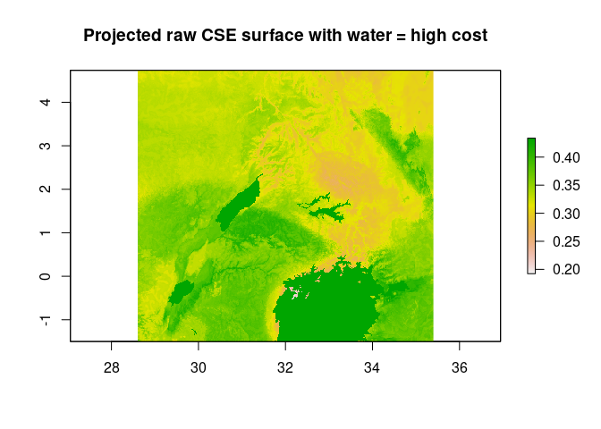
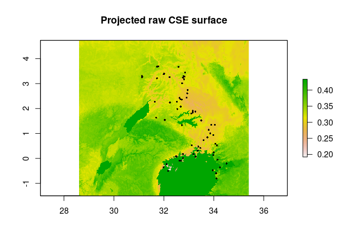
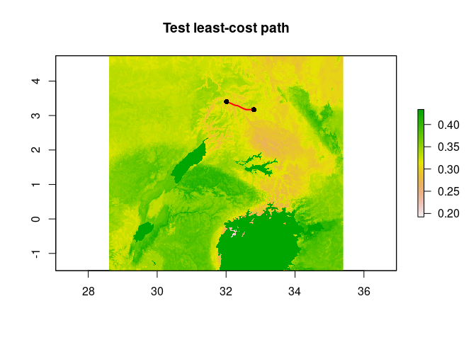
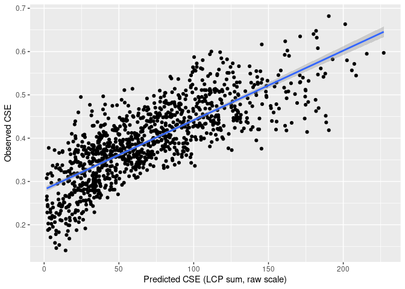
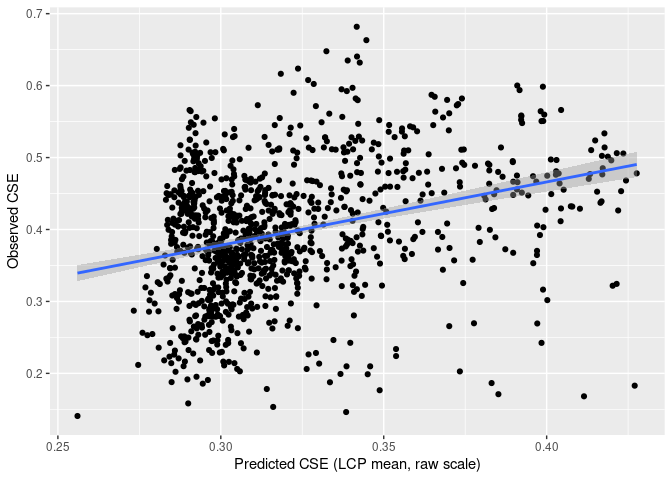
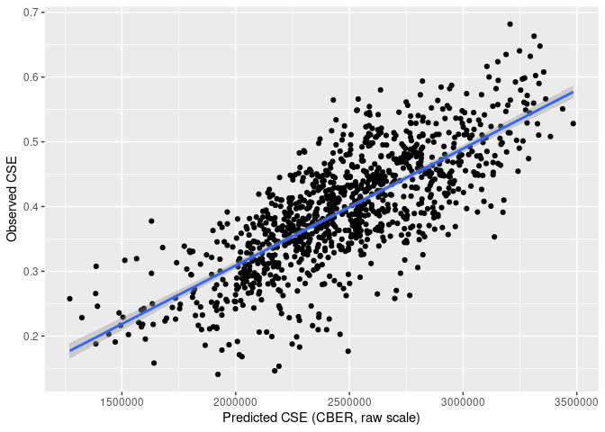

Spatial Evaluation - Full RF model of raw CSE
================
Norah Saarman
2026-04-01

- [Setup](#setup)
  - [Load libraries](#load-libraries)
  - [Inputs](#inputs)
  - [Outputs](#outputs)
- [Step 0: Script Outline](#step-0-script-outline)
- [Step 1: Inputs](#step-1-inputs)
- [Step 2: Check raster alignment and assign high cost to
  water](#step-2-check-raster-alignment-and-assign-high-cost-to-water)
- [Step 3: Prepare pair table, site objects, and transition
  object](#step-3-prepare-pair-table-site-objects-and-transition-object)
- [Step 4: Sanity checks](#step-4-sanity-checks)
- [Step 5: Compute least-cost paths in parallel (once) and save
  output](#step-5-compute-least-cost-paths-in-parallel-once-and-save-output)
- [Step 7: Extract predicted CSE values along LCPs and calculate mean
  and
  sum](#step-7-extract-predicted-cse-values-along-lcps-and-calculate-mean-and-sum)
- [Step 8: Compute circuit-based effective resistance
  (CBER)](#step-8-compute-circuit-based-effective-resistance-cber)
- [Step 9: Combine LCP and CBER
  results](#step-9-combine-lcp-and-cber-results)
- [Step 10: Calculate evaluation metrics from
  eval_results](#step-10-calculate-evaluation-metrics-from-eval_results)
- [This script should be followed
  by:](#this-script-should-be-followed-by)

RStudio Configuration:  
- **R version:** R 4.4.0 (Geospatial packages)  
- **Number of cores:** 16 (up to 32 available)  
- **Account:** saarman-np  
- **Partition:** saarman-np (allows multiple simultaneous jobs
automatically now)  
- **Memory per job:** 400G (cluster limit: 1000G total; avoid exceeding
half)

# Setup

## Load libraries

``` r
# load only required packages
library(doParallel)
library(foreach)
library(raster)
library(gdistance)
library(sf)
library(dplyr)
library(ggplot2)
library(rnaturalearth)
library(rnaturalearthdata)
```

## Inputs

- `../input/Gff_cse_envCostPaths.csv` - Combined CSE table with
  coordinates (long1, lat1, long2, lat2), same input used for building
  model.
- `../results_dir/fullRF_CSE.tif` - Final full model projected estimates
  of CSE at 1 pixel geodist.
- `../data_dir/processed/lake_binary.tif` \# binary lake mask (1 =
  water, 0 = land)

## Outputs

Major outputs from this script are saved in two locations:  
**Small text outputs saved to results_dir within git repo:** -
`spatial_eval_rawCSE_LCPpred.csv` Pairwise least-cost path summaries for
each site pair: LCP_mean, LCP_sum. - `spatial_eval_rawCSE_cber.csv`
Pairwise circuit-based effective resistance (CBER) values for each site
pair. - `spatial_eval_rawCSE_predictions.csv` Combined pairwise
evaluation table containing observed CSE and spatial predictions for
each site pair: CSE, LCP_mean, LCP_sum, CBER. -
`spatial_eval_rawCSE_eval_metrics.csv` Summary table of evaluation
metrics for each spatial summary method (LCP_mean, LCP_sum, CBER): RMSE,
R², MSE, MAE, Correlation.

**Large or reusable outputs saved to results_dir_big:** -
`least_cost_paths/LC_paths_fullRF_rawCSE.shp` Saved least-cost-path
spatial lines for all evaluated site pairs. This is a reusable spatial
output and does not need to be recomputed unless the resistance surface
changes. - `spatial_eval_rawCSE_LCPpred.csv` Backup copy of least-cost
path summaries. - `spatial_eval_rawCSE_cber.csv` Backup copy of
circuit-based effective resistance (CBER) results. -
`spatial_eval_rawCSE_predictions.rds` R object version of the combined
evaluation table (eval_results) for quick reloading in later scripts. -
`spatial_eval_rawCSE_predictions.csv` Backup copy of the combined
evaluation table saved in the large-results directory. -
`spatial_eval_rawCSE_predictions_calibrated.rds` R object version of the
evaluation table with calibrated predictions (eval_df), including
LCP_mean_cal, LCP_sum_cal, and CBER_cal. -
`spatial_eval_rawCSE_eval_metrics.rds` R object version of the
evaluation metrics table (metrics_df) for quick reloading in later
scripts. - `spatial_eval_rawCSE_eval_metrics.csv` Backup copy of the
evaluation metrics table saved in the large-results directory.

# Step 0: Script Outline

This is a screening step (full model only). Use the fitted full model to
compare candidate response formulations and spatial summaries.

Response formulations to compare:  
- raw CSE (this script, 7a)  
- residuals from simple IBD model (script 7b)  
- CSE/km (script 7c)

**For this script (7a):**  
Run spatial evaluation across the raw CSE resistance surface (projected
estimates of raw CSE at 1 pixel geodist) to estimate evaluation metrics
by 3 methods:  
1. Mean across least-cost path (mean LCP)  
2. Sum across least-cost path (sum LCP)  
3. Circuit-based effective resistance (CBER)

Metrics to calculate for this screening step:

Primary metrics:  
1. correlation (Correlation here answers: does the method recover
relative ordering?) 2. R² (1 − SSE/SST, after correcting for scale
mismatch)

Secondary evaluation metrics:  
3. RMSE (after correcting for scale mismatch) 4. MSE (after correcting
for scale mismatch) 5. MAE(after correcting for scale mismatch)

NOTE: RMSE, MSE, MAE, and R2 after scaling answer: after correcting for
simple scale mismatch, how well does the method recover observed CSE?).
These screening metrics are used only to decide which response
formulation and spatial summary to carry forward into the final LOPOCV
validation framework and permutation-based significance testing.

IDEA: LCP and CBER might serve as starting points for a next iteration
of resistance optimization. Especially CBER. Current density (circuit
theory) – longer-term idea:  
- Would show where movement concentrates across the landscape, and
identify broad corridors, alternative routes, and pinch points.  
- More biologically realistic than a single LCP because it integrates
multiple possible paths… This would extend the current LCP-based spatial
evaluation toward a more biologically realistic representation of
multi-route dispersal and provide a natural next step beyond the Bishop
et al. and Pless et al. random-forest LCTA framework.  
- Not implemented here because gdistance::commuteDistance() only returns
pairwise effective resistance, not current maps, and true current
density would require a Circuitscape-style current-flow analysis using
the RF-derived resistance surface. - We would then need to figure out a
way to weight the original predictive surfaces in a meaningful way based
on the current-flow density for the next iteration of the model.  
- So, for now, I’ll use CBER as a screening summary alongside mean LCP
and sum LCP. Keep current density as a future extension if the
circuit-based approach looks promising.

# Step 1: Inputs

``` r
# Define Paths to directories
input_dir <- "../input"
data_dir  <- "/uufs/chpc.utah.edu/common/home/saarman-group1/uganda-tsetse-LG/data"
results_dir_big <- "/uufs/chpc.utah.edu/common/home/saarman-group1/uganda-tsetse-LG/results/"
results_dir <- "../results/"

# define coordinate reference system
crs_geo <- 4326     # EPSG code for WGS84

######################################
# What surface are you using?
surf_file  <- file.path(results_dir_big, "fullRF_CSE.tif")
########################################

lake_file  <- file.path(data_dir, "processed", "lake_binary.tif")

cse_file   <- file.path("..", "input", "Gff_cse_envCostPaths.csv")

# Read pairwise CSE table
cse_df <- read.csv(cse_file)
# This was added only after completing LOPOCV...
# Filter out western outlier "50-KB" 
cse_df <- cse_df %>%
  filter(Var1 != "50-KB", Var2 != "50-KB")


# Read projected raw CSE surface
cse_surface <- raster(surf_file)

# Read lake mask
lake_mask <- raster(lake_file)
```

# Step 2: Check raster alignment and assign high cost to water

``` r
if (!compareRaster(cse_surface, lake_mask,
                   extent = TRUE, rowcol = TRUE,
                   crs = TRUE, res = TRUE,
                   stopiffalse = FALSE)) {
  lake_mask <- projectRaster(lake_mask, cse_surface, method = "ngb")
}

# Inspect projected raw CSE values before altering water cells
summary(values(cse_surface))
```

    ##    Min. 1st Qu.  Median    Mean 3rd Qu.    Max. 
    ##  0.1877  0.3098  0.3323  0.3322  0.3608  0.4338

``` r
# Keep water traversible but very costly (max value from model)
cse_surface[lake_mask[] == 1] <- max(values(cse_surface))

# Check again after assigning lakes
summary(values(cse_surface))
```

    ##    Min. 1st Qu.  Median    Mean 3rd Qu.    Max. 
    ##  0.1922  0.3204  0.3386  0.3487  0.3728  0.4338

``` r
# Quick plot
plot(cse_surface, main = "Projected raw CSE surface with water = high cost")
```

<!-- -->

``` r
# Check column names of cse_df
names(cse_df)
```

    ##  [1] "Var1"             "Var2"             "CSEdistance"      "lat1"            
    ##  [5] "long1"            "lat2"             "long2"            "Pop1_cluster"    
    ##  [9] "Pop2_cluster"     "pix_dist"         "BIO1_mean"        "BIO2_mean"       
    ## [13] "BIO3_mean"        "BIO4_mean"        "BIO5_mean"        "BIO6_mean"       
    ## [17] "BIO7_mean"        "BIO8S_mean"       "BIO9S_mean"       "BIO10S_mean"     
    ## [21] "BIO11S_mean"      "BIO12_mean"       "BIO13_mean"       "BIO14_mean"      
    ## [25] "BIO15_mean"       "BIO16S_mean"      "BIO17S_mean"      "BIO18S_mean"     
    ## [29] "BIO19S_mean"      "alt_mean"         "slope_mean"       "riv_3km_mean"    
    ## [33] "samp_20km_mean"   "lakes_mean"       "BIO1_median"      "BIO2_median"     
    ## [37] "BIO3_median"      "BIO4_median"      "BIO5_median"      "BIO6_median"     
    ## [41] "BIO7_median"      "BIO8S_median"     "BIO9S_median"     "BIO10S_median"   
    ## [45] "BIO11S_median"    "BIO12_median"     "BIO13_median"     "BIO14_median"    
    ## [49] "BIO15_median"     "BIO16S_median"    "BIO17S_median"    "BIO18S_median"   
    ## [53] "BIO19S_median"    "alt_median"       "slope_median"     "riv_3km_median"  
    ## [57] "samp_20km_median" "lakes_median"     "BIO1_mode"        "BIO2_mode"       
    ## [61] "BIO3_mode"        "BIO4_mode"        "BIO5_mode"        "BIO6_mode"       
    ## [65] "BIO7_mode"        "BIO8S_mode"       "BIO9S_mode"       "BIO10S_mode"     
    ## [69] "BIO11S_mode"      "BIO12_mode"       "BIO13_mode"       "BIO14_mode"      
    ## [73] "BIO15_mode"       "BIO16S_mode"      "BIO17S_mode"      "BIO18S_mode"     
    ## [77] "BIO19S_mode"      "alt_mode"         "slope_mode"       "riv_3km_mode"    
    ## [81] "samp_20km_mode"   "lakes_mode"

# Step 3: Prepare pair table, site objects, and transition object

Diagonal movement is allowed in the 16-way transition matrix, and
conductance is corrected for geographic distance, with
geoCorrection(type = “c”), so diagonal steps are appropriately penalized
relative to orthogonal steps.

``` r
# keep only within-cluster comparisons, matching your earlier workflow
cse_df <- cse_df %>%
  filter(Pop1_cluster == Pop2_cluster) %>%
  mutate(
    id  = paste(Var1, Var2, sep = "_"),
    CSE = CSEdistance
  )

# unique site coordinates from both columns
sites_coords <- bind_rows(
  cse_df %>% dplyr::select(Site = Var1, lon = long1, lat = lat1),
  cse_df %>% dplyr::select(Site = Var2, lon = long2, lat = lat2)
) %>%
  distinct()

# convert to sf and then to SpatialPoints in raster CRS
sites_df <- st_as_sf(sites_coords, coords = c("lon", "lat"), crs = crs_geo) %>%
  st_transform(crs(cse_surface))

sites_sp <- as(sites_df, "Spatial")

# lookup index for site names
site_index <- setNames(seq_len(nrow(sites_df)), sites_coords$Site)

# pair table for evaluation
site_pairs <- cse_df %>%
  dplyr::select(Var1, Var2, id, CSE) %>%
  distinct()

# treat projected raw CSE as local resistance
resistance_rast <- cse_surface

# protect against zero or negative values before inversion
min_pos <- min(values(resistance_rast)[values(resistance_rast) > 0], na.rm = TRUE)
resistance_rast[resistance_rast <= 0] <- min_pos

# convert resistance to conductance for gdistance
conductance_rast <- 1 / resistance_rast

# transition object:
# directions = 16 allows diagonal/extended neighborhood movement
tr <- transition(conductance_rast, transitionFunction = mean, directions = 16)

# correction for least-cost paths
# geoCorrection(type = "c") corrects with longer diagonal
tr_lcp <- geoCorrection(tr, type = "c")

# correction for circuit / random-walk distances
# geoCorrection(type = "r") corrects for random walk
tr_cber <- geoCorrection(tr, type = "r")
```

# Step 4: Sanity checks

``` r
nrow(cse_df)
```

    ## [1] 1091

``` r
nrow(site_pairs)
```

    ## [1] 1091

``` r
nrow(sites_coords)
```

    ## [1] 67

``` r
head(site_pairs)
```

    ##     Var1   Var2            id       CSE
    ## 1 01-AIN 02-GAN 01-AIN_02-GAN 0.2424627
    ## 2 01-AIN 03-DUK 01-AIN_03-DUK 0.3169412
    ## 3 02-GAN 03-DUK 02-GAN_03-DUK 0.3076377
    ## 4 03-DUK 07-OSG 03-DUK_07-OSG 0.4064882
    ## 5 02-GAN 07-OSG 02-GAN_07-OSG 0.3732382
    ## 6 01-AIN 07-OSG 01-AIN_07-OSG 0.3726589

``` r
plot(cse_surface, main = "Projected raw CSE surface")
plot(sites_sp, add = TRUE, pch = 16, cex = 0.5)
```

<!-- -->

# Step 5: Compute least-cost paths in parallel (once) and save output

Test one path first:

``` r
# Test one least-cost path before parallel run
i <- site_index[site_pairs$Var1[100]]
j <- site_index[site_pairs$Var2[100]]

test_path <- shortestPath(tr_lcp, sites_sp[i, ], sites_sp[j, ], output = "SpatialLines")

plot(cse_surface, main = "Test least-cost path")
lines(test_path, col = "red", lwd = 2)
points(sites_sp[c(i, j), ], pch = 16)
```

<!-- --> Run
full loop:

``` r
output_dir <- file.path(results_dir_big, "least_cost_paths")
dir.create(output_dir, showWarnings = FALSE)

# Set number of cores and register cluster
n_cores <- 16
cl <- makeCluster(n_cores)
registerDoParallel(cl)

paths_list <- foreach(k = 1:nrow(site_pairs),
                      .packages = c("gdistance", "sp", "sf")) %dopar% {

  i <- site_index[site_pairs$Var1[k]]
  j <- site_index[site_pairs$Var2[k]]

  path <- tryCatch({
    shortestPath(tr_lcp, sites_sp[i, ], sites_sp[j, ], output = "SpatialLines")
  }, error = function(e) NULL)

  if (!is.null(path)) {
    path_sf <- st_as_sf(path)
    path_sf$Var1 <- site_pairs$Var1[k]
    path_sf$Var2 <- site_pairs$Var2[k]
    path_sf$id   <- site_pairs$id[k]
    return(path_sf)
  } else {
    return(NULL)
  }
}

stopCluster(cl)

# drop NULLs and combine
paths_list <- paths_list[!sapply(paths_list, is.null)]
paths_sf <- do.call(rbind, paths_list)

# assign CRS and transform back to geographic coordinates for saving
st_crs(paths_sf) <- st_crs(cse_surface)
paths_sf <- st_transform(paths_sf, crs = st_crs(crs_geo))

# join observed CSE values
paths_sf <- left_join(paths_sf, site_pairs, by = "id")

# save paths
st_write(paths_sf,
         file.path(output_dir, "LC_paths_fullRF_rawCSE.shp"),
         delete_layer = TRUE)
```

    ## Deleting layer `LC_paths_fullRF_rawCSE' using driver `ESRI Shapefile'
    ## Writing layer `LC_paths_fullRF_rawCSE' to data source 
    ##   `/uufs/chpc.utah.edu/common/home/saarman-group1/uganda-tsetse-LG/results//least_cost_paths/LC_paths_fullRF_rawCSE.shp' using driver `ESRI Shapefile'
    ## Writing 1091 features with 6 fields and geometry type Line String.

# Step 7: Extract predicted CSE values along LCPs and calculate mean and sum

``` r
# if needed later, reload:
paths_sf <- st_read(file.path(results_dir_big, "least_cost_paths", "LC_paths_fullRF_rawCSE.shp"), quiet = TRUE)

# transform paths to raster CRS for extraction
paths_extract <- st_transform(paths_sf, crs = crs(cse_surface))

# extract raster values along each path
path_vals <- raster::extract(cse_surface, as(paths_extract, "Spatial"))

# summarize values along each least-cost path
lcp_summary <- data.frame(
  id = paths_extract$id,
  LCP_mean = sapply(path_vals, function(x) {
    if (is.null(x) || all(is.na(x))) NA_real_ else mean(x, na.rm = TRUE)
  }),
  LCP_sum = sapply(path_vals, function(x) {
    if (is.null(x) || all(is.na(x))) NA_real_ else sum(x, na.rm = TRUE)
  })
)

# join back to pair table
LCP_results <- site_pairs %>%
  left_join(lcp_summary, by = "id")


summary(LCP_results$LCP_mean)
```

    ##    Min. 1st Qu.  Median    Mean 3rd Qu.    Max. 
    ##  0.2560  0.2970  0.3096  0.3200  0.3339  0.4276

``` r
summary(LCP_results$LCP_sum)
```

    ##    Min. 1st Qu.  Median    Mean 3rd Qu.    Max. 
    ##   1.716  36.219  64.318  71.369 100.138 227.064

``` r
# Save LCP output as text file in results directories
write.csv(LCP_results,file.path(results_dir, "spatial_eval_rawCSE_LCPpred.csv"), row.names = FALSE)

write.csv(LCP_results,file.path(results_dir_big, "spatial_eval_rawCSE_LCPpred.csv"), row.names = FALSE)
```

# Step 8: Compute circuit-based effective resistance (CBER)

Test one CBER calculation first:

``` r
# test one CBER calculation first
i <- site_index[site_pairs$Var1[1]]
j <- site_index[site_pairs$Var2[1]]

dmat_test <- commuteDistance(tr_cber, sites_sp[c(i, j), ])

as.numeric(dmat_test)[1] # returns the single number for pair
```

    ## [1] 1596873

Run as a loop sequentially, also save output from steps 6-8 to file
again…

``` r
library(doParallel)
library(foreach)
library(gdistance)
library(sp)

# number of cores
n_cores <- 16

# on Linux/CHPC, FORK is usually more efficient for large objects like tr_cber
cl <- parallel::makeForkCluster(n_cores)
doParallel::registerDoParallel(cl)

# optional: quick test outside parallel
i <- site_index[site_pairs$Var1[1]]
j <- site_index[site_pairs$Var2[1]]

dmat_test <- commuteDistance(tr_cber, sites_sp[c(i, j), ])
as.numeric(dmat_test)[1]
```

    ## [1] 1596873

``` r
# parallel loop across all 1091 pairs
cber_results <- foreach(
  k = seq_len(nrow(site_pairs)),
  .combine = rbind,
  .packages = c("gdistance", "sp")
) %dopar% {
  
  site1 <- site_pairs$Var1[k]
  site2 <- site_pairs$Var2[k]
  pair_id <- site_pairs$id[k]
  
  i <- site_index[site1]
  j <- site_index[site2]
  
  # compute commute distance for the pair
  dmat <- commuteDistance(tr_cber, sites_sp[c(i, j), ])
  
  # extract the single numeric value from the dist object
  cber_val <- as.numeric(dmat)[1]
  
  data.frame(
    Var1 = site1,
    Var2 = site2,
    id   = pair_id,
    CBER = cber_val
  )
}

# stop cluster
stopCluster(cl)

# inspect
head(cber_results)
```

    ##     Var1   Var2            id    CBER
    ## 1 01-AIN 02-GAN 01-AIN_02-GAN 1596873
    ## 2 01-AIN 03-DUK 01-AIN_03-DUK 1512439
    ## 3 02-GAN 03-DUK 02-GAN_03-DUK 1386251
    ## 4 03-DUK 07-OSG 03-DUK_07-OSG 2236234
    ## 5 02-GAN 07-OSG 02-GAN_07-OSG 2241443
    ## 6 01-AIN 07-OSG 01-AIN_07-OSG 2239248

``` r
str(cber_results)
```

    ## 'data.frame':    1091 obs. of  4 variables:
    ##  $ Var1: chr  "01-AIN" "01-AIN" "02-GAN" "03-DUK" ...
    ##  $ Var2: chr  "02-GAN" "03-DUK" "03-DUK" "07-OSG" ...
    ##  $ id  : chr  "01-AIN_02-GAN" "01-AIN_03-DUK" "02-GAN_03-DUK" "03-DUK_07-OSG" ...
    ##  $ CBER: num  1596873 1512439 1386251 2236234 2241443 ...

``` r
# save output in results directories
write.csv(cber_results,file.path(results_dir, "spatial_eval_rawCSE_cber.csv"), row.names = FALSE)

write.csv(cber_results,file.path(results_dir_big, "spatial_eval_rawCSE_cber.csv"), row.names = FALSE)
```

# Step 9: Combine LCP and CBER results

``` r
# load and bind your existing evaluation data
library(dplyr)

# load the LCP sum and mean results you just computed
LCP_results <- read.csv(file.path(results_dir, "spatial_eval_rawCSE_LCPpred.csv"))

# load the CBER results you just computed
cber_results <- read.csv(file.path(results_dir, "spatial_eval_rawCSE_cber.csv"))

# bind CBER and LCP results
eval_results <- LCP_results %>%
  left_join(
    cber_results %>% select(id, CBER),
    by = "id"
  )

# Save results output as RDS for later ease of loading
saveRDS(
  eval_results,
  file.path(results_dir_big, "spatial_eval_rawCSE_predictions.rds")
)
```

# Step 10: Calculate evaluation metrics from eval_results

``` r
library(dplyr)
library(ggplot2)

# Start eval_df from eval_results
eval_df <- eval_results

# Fit linear calibration and return calibrated predictions
calibrate_pred <- function(obs, pred) {
  keep <- complete.cases(obs, pred)
  df <- data.frame(obs = obs[keep], pred = pred[keep])
  
  fit <- lm(obs ~ pred, data = df)
  
  out <- rep(NA_real_, length(obs))
  out[keep] <- predict(fit, newdata = data.frame(pred = pred[keep]))
  out
}

# Create calibrated predictions
eval_df$LCP_sum_cal  <- calibrate_pred(eval_df$CSE, eval_df$LCP_sum)
eval_df$LCP_mean_cal <- calibrate_pred(eval_df$CSE, eval_df$LCP_mean)
eval_df$CBER_cal     <- calibrate_pred(eval_df$CSE, eval_df$CBER)

# Plots: raw predicted vs observed, with fitted line
plot1 <- ggplot(eval_df, aes(x = LCP_sum, y = CSE)) +
  geom_point() +
  geom_smooth(method = "lm") +
  labs(
    x = "Predicted CSE (LCP sum, raw scale)",
    y = "Observed CSE"
  )
plot1
```

    ## `geom_smooth()` using formula = 'y ~ x'

<!-- -->

``` r
plot2 <- ggplot(eval_df, aes(x = LCP_mean, y = CSE)) +
  geom_point() +
  geom_smooth(method = "lm") +
  labs(
    x = "Predicted CSE (LCP mean, raw scale)",
    y = "Observed CSE"
  )
plot2
```

    ## `geom_smooth()` using formula = 'y ~ x'

<!-- -->

``` r
plot3 <- ggplot(eval_df, aes(x = CBER, y = CSE)) +
  geom_point() +
  geom_smooth(method = "lm") +
  labs(
    x = "Predicted CSE (CBER, raw scale)",
    y = "Observed CSE"
  )
plot3
```

    ## `geom_smooth()` using formula = 'y ~ x'

<!-- -->

``` r
# Calculate formal metrics
# Correlation is calculated on raw predictions because it is scale-invariant
# Error metrics and R2 are calculated on calibrated predictions
calc_metrics <- function(obs, pred_raw, pred_cal) {
  keep <- complete.cases(obs, pred_raw, pred_cal)
  obs      <- obs[keep]
  pred_raw <- pred_raw[keep]
  pred_cal <- pred_cal[keep]
  
  sse  <- sum((obs - pred_cal)^2)
  sst  <- sum((obs - mean(obs))^2)
  mse  <- mean((obs - pred_cal)^2)
  rmse <- sqrt(mse)
  mae  <- mean(abs(obs - pred_cal))
  rsq  <- 1 - (sse / sst)
  corr <- cor(obs, pred_raw)
  
  data.frame(
    n = length(obs),
    MSE = mse,
    RMSE = rmse,
    MAE = mae,
    RSQ = rsq,
    Correlation = corr
  )
}

metrics_df <- bind_rows(
  calc_metrics(eval_df$CSE, eval_df$LCP_mean, eval_df$LCP_mean_cal) %>%
    mutate(method = "LCP_mean"),
  
  calc_metrics(eval_df$CSE, eval_df$LCP_sum, eval_df$LCP_sum_cal) %>%
    mutate(method = "LCP_sum"),
  
  calc_metrics(eval_df$CSE, eval_df$CBER, eval_df$CBER_cal) %>%
    mutate(method = "CBER")
) %>%
  dplyr::select(method, everything())

# Print metrics
print(metrics_df)
```

    ##     method    n         MSE       RMSE        MAE       RSQ Correlation
    ## 1 LCP_mean 1091 0.007288414 0.08537221 0.06685447 0.1012543   0.3182048
    ## 2  LCP_sum 1091 0.003114933 0.05581158 0.04540066 0.6158928   0.7847884
    ## 3     CBER 1091 0.003508397 0.05923172 0.04633363 0.5673741   0.7532424

``` r
# Save outputs
saveRDS(
  metrics_df,
  file.path(results_dir_big, "spatial_eval_rawCSE_eval_metrics.rds")
)

write.csv(
  metrics_df,
  file.path(results_dir_big, "spatial_eval_rawCSE_eval_metrics.csv"),
  row.names = FALSE
)

write.csv(
  metrics_df,
  file.path(results_dir, "spatial_eval_rawCSE_eval_metrics.csv"),
  row.names = FALSE
)
```

# This script should be followed by:

First, 7b-7f. Choose one response formulation and spatial summary.

Then, after selecting the best response formulation and spatial summary:

Run the final validation framework, full LOPOCV evaluation, including:  
- non-spatial evaluation  
- spatial evaluation (mean LCP, sum LCP, or CBER depending on screening
results)  
- Calculate final metrics on held-out data (RMSE, R², MSE, MAE,
correlation)

Permutation test for inference  
- Run ~100 permutations where the response is randomized.

For each permutation:  
- rerun the full LOPOCV workflow  
- recompute spatial predictions  
- calculate the same evaluation metrics  
Compare observed metrics (especially RMSE and R²) to the permutation
distribution to test whether predictive performance is better than
expected by chance.
