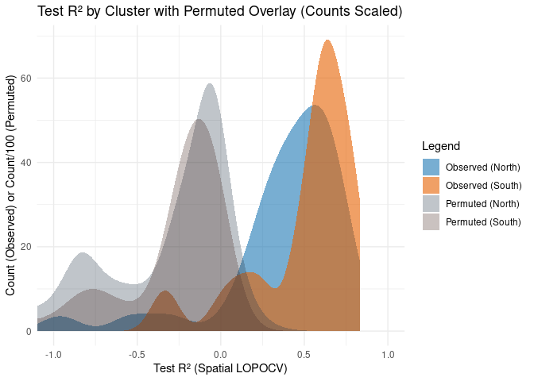

LOPOCV: Spatial Cross-Validation
================
Norah Saarman
2025-06-18

- [Setup](#setup)
- [Inputs](#inputs)
- [Outputs](#outputs)
- [1. Precompute: extract environmental data along each path
  once](#1-precompute-extract-environmental-data-along-each-path-once)
- [2. Spatial R² on full model](#2-spatial-r²-on-full-model)
  - [2a. Using full model least-cost
    paths](#2a-using-full-model-least-cost-paths)
    - [IBD intercept and slope with least-cost
      paths](#ibd-intercept-and-slope-with-least-cost-paths)
    - [Spatial R² on full model based on raw
      CSE](#spatial-r²-on-full-model-based-on-raw-cse)
  - [2b. (Optional) Using lakes least-cost paths model was trained
    on](#2b-optional-using-lakes-least-cost-paths-model-was-trained-on)
    - [Lake paths: IBD intercept, just playing
      around…](#lake-paths-ibd-intercept-just-playing-around)
    - [Lake paths: Spatial R² on full model based on raw
      CSE](#lake-paths-spatial-r²-on-full-model-based-on-raw-cse)
  - [2c. (Optional) Spatial R² on full model based on Scaled CSE
    (SCSE)](#2c-optional-spatial-r²-on-full-model-based-on-scaled-cse-scse)
  - [2d. (Optional) Spatial R² raw CSE with sampling effort
    neutralized](#2d-optional-spatial-r²-raw-cse-with-sampling-effort-neutralized)
- [3. Spatial LOPOCV with IBD
  adjustment](#3-spatial-lopocv-with-ibd-adjustment)
  - [Cross Validation (Spatial
    Leave-one-point-out)](#cross-validation-spatial-leave-one-point-out)
  - [Visualize Spatial LOPOCV
    results](#visualize-spatial-lopocv-results)
- [4. Permutation test for spatial LOPOCV
  R²](#4-permutation-test-for-spatial-lopocv-r²)
  - [Spatial LOPOCV on permuted
    models](#spatial-lopocv-on-permuted-models)
  - [Compare Distributions](#compare-distributions)
  - [Wilcoxon signed-rank statistic](#wilcoxon-signed-rank-statistic)
- [5. Plot Spatial LOPOCV and permutated Spatial LOPOCV
  side-by-side](#5-plot-spatial-lopocv-and-permutated-spatial-lopocv-side-by-side)

RStudio Configuration:  
- **R version:** R 4.4.0 (Geospatial packages)  
- **Number of cores:** 8 (up to 32 available)  
- **Account:** saarman-np  
- **Partition:** saarman-shared-np (allows multiple simultaneous jobs)  
- **Memory per job:** 200G (cluster limit: 1000G total; avoid exceeding
half)

# Setup

``` r
# load only required packages
library(doParallel)
library(foreach)
library(raster)
library(gdistance)
library(sf)
library(dplyr)
library(randomForest)
library(rnaturalearth)
library(rnaturalearthdata)
library(ggplot2)

# Define Paths to directories
data_dir  <- "/uufs/chpc.utah.edu/common/home/saarman-group1/uganda-tsetse-LG/data"
results_dir <- "/uufs/chpc.utah.edu/common/home/saarman-group1/uganda-tsetse-LG/results/"
output_dir <- paste0(results_dir,"/lopocv_spatial")
#dir.create(output_dir, showWarnings = FALSE)
scratch_dir <- "/scratch/general/vast/u6036559"

# define coordinate reference system
crs_geo <- 4326     # EPSG code for WGS84

# define ggplot2 extent
xlim <- c(28.6, 35.4)
ylim <- c(-1.500000 , 4.733333)

# Input: shape file of least-cost paths (already filtered to 67 sites and has CSEdistance)
lcp_sf <- st_read(file.path(results_dir, "LC_paths_fullRF.shp"))
st_crs(lcp_sf) <- crs_geo

# Build list of unique sites from Var1 and Var2
sites <- sort(unique(c(lcp_sf$Var1, lcp_sf$Var2)))

# Set up parallel backend
n_cores <- 8
cl <- makeCluster(n_cores)
registerDoParallel(cl)
```

# Inputs

- `../input/Gff_11loci_68sites_cse.csv` - Combined CSE table with
  coordinates (long1, lat1, long2, lat2)
- `../results_dir/fullRF_CSE_resistance.tif` - Final full model
  projected resistance surface
- `../results_dir/LC_paths_fullRF.shp"` -
- `../data_dir/processed/env_stack.grd` - Final prediction env stack
  with named layers (18 variables) env \<- stack(file.path(
- `../results_dir/lopocv/rf_model_01.rds` - 67 LOPOCV rf models leaving
  one point out

# Outputs

- `../results_dir/spatial_predictions.csv` - Spatial lopocv predicted
  geodist, CSE_per_unit, predicted CSE
- `../results_dir/spatial_eval.csv` - Spatial lopocv evaluation metrics

# 1. Precompute: extract environmental data along each path once

**NOTE:** eval = FALSE so that it skips on knit

``` r
# Input: raster of env parameters for prediction
env <- stack(file.path(data_dir, "processed", "env_stack.grd"))
names(env) <-  c("BIO1_mean", "BIO2_mean", "BIO3_mean", "BIO4_mean", "BIO5_mean", "BIO6_mean", "BIO7_mean", "BIO8S_mean","BIO9S_mean", "BIO10S_mean", "BIO11S_mean", "BIO12_mean", "BIO13_mean", "BIO14_mean", "BIO15_mean", "BIO16S_mean","BIO17S_mean", "BIO18S_mean", "BIO19S_mean", "alt_mean","slope_mean", "riv_3km_mean","samp_20km_mean","lakes_mean","pix_dist")
crs(env) <- crs_geo
pix_dist <- env$pix_dist
crs(pix_dist) <- crs_geo

# Parallel extraction of environmental values for each path
path_env_list <- foreach(i = 1:nrow(lcp_sf), .packages = c("raster", "sf")) %dopar% {
  path_geom <- st_geometry(lcp_sf[i, ]) |> as("Spatial")
  env_vals <- extract(env, path_geom)[[1]]
  if (is.null(env_vals)) return(NULL)
  as.data.frame(env_vals)
}
names(path_env_list) <- lcp_sf$id

# Stop parallel backend
stopCluster(cl)

# Save result
saveRDS(path_env_list, file.path(output_dir, "path_env_list.rds"))
```

# 2. Spatial R² on full model

## 2a. Using full model least-cost paths

### IBD intercept and slope with least-cost paths

``` r
# Load prepared file of least-cost paths (already filtered to 67 sites and has CSEdistance)
lcp_sf <- st_read(file.path(results_dir, "LC_paths_fullRF.shp")) # full model
```

    ## Reading layer `LC_paths_fullRF' from data source 
    ##   `/uufs/chpc.utah.edu/common/home/saarman-group1/uganda-tsetse-LG/results/LC_paths_fullRF.shp' 
    ##   using driver `ESRI Shapefile'
    ## Simple feature collection with 1026 features and 4 fields
    ## Geometry type: LINESTRING
    ## Dimension:     XY
    ## Bounding box:  xmin: 31.12083 ymin: -0.5958333 xmax: 34.5125 ymax: 3.695833
    ## Geodetic CRS:  WGS 84

``` r
st_crs(lcp_sf) <- crs_geo # Set CRS

# Reproject to a CRS with meter units (e.g. UTM zone 36N for Uganda)
lcp_proj <- st_transform(lcp_sf, crs = 32636)  # EPSG 32636 = WGS84 / UTM zone 36N

# Calculate length in meters
lcp_proj$Length_m <- st_length(lcp_proj)

# Convert to km (assuming each pixel = 1 km = 1000 m)
lcp_proj$geo_dist <- as.numeric(lcp_proj$Length_m) / 1000
lcp_proj$CSE <- as.numeric(lcp_sf$CSE)

# View
head(lcp_proj[, c("Length_m", "geo_dist","CSE")])
```

    ## Simple feature collection with 6 features and 3 fields
    ## Geometry type: LINESTRING
    ## Dimension:     XY
    ## Bounding box:  xmin: 291193.3 ymin: 355169.3 xmax: 358797.2 ymax: 365411.2
    ## Projected CRS: WGS 84 / UTM zone 36N
    ##        Length_m  geo_dist       CSE                       geometry
    ## 1  5529.668 [m]  5.529668 0.2424627 LINESTRING (291203.6 365411...
    ## 2  4125.732 [m]  4.125732 0.3169412 LINESTRING (291203.6 365411...
    ## 3  2613.334 [m]  2.613334 0.3076377 LINESTRING (291193.3 359881...
    ## 4 67275.450 [m] 67.275450 0.4064882 LINESTRING (293049.3 361721...
    ## 5 68695.057 [m] 68.695057 0.3732382 LINESTRING (291193.3 359881...
    ## 6 69993.862 [m] 69.993862 0.3726589 LINESTRING (291203.6 365411...

``` r
# Load cluster info
Gff <- read.csv("../input/Gff_11loci_allsites_indinfo.txt", sep = "\t", header = TRUE)
region_lookup <- setNames(Gff$SiteMajCluster, Gff$SiteCode)

# Assign region to each path based on Var1
lcp_proj$region <- region_lookup[as.character(lcp_proj$Var1)]

# Fit IBD models by region
ibd_north <- lm(CSE ~ geo_dist, data = subset(lcp_proj, region == "north"))
ibd_south <- lm(CSE ~ geo_dist, data = subset(lcp_proj, region == "south"))

# Report slope and intercept
cat("North:\n  Intercept =", coef(ibd_north)[1], "\n  Slope =", coef(ibd_north)[2], "\n")
```

    ## North:
    ##   Intercept = 0.2682473 
    ##   Slope = 0.0006906193

``` r
cat("South:\n  Intercept =", coef(ibd_south)[1], "\n  Slope =", coef(ibd_south)[2], "\n")
```

    ## South:
    ##   Intercept = 0.2760973 
    ##   Slope = 0.0007359793

### Spatial R² on full model based on raw CSE

``` r
# Load full model
rf_model_full <- readRDS(file.path(results_dir, "rf_mean18_tuned.rds"))

# Load pre-extracted path-level env data
path_env_list <- readRDS(file.path(output_dir, "path_env_list.rds"))
env <- stack(file.path(data_dir, "processed", "env_stack.grd"))

# Load prepared file of least-cost paths (already filtered to 67 sites and has CSEdistance)
lcp_sf <- st_read(file.path(results_dir, "LC_paths_fullRF.shp"))
```

    ## Reading layer `LC_paths_fullRF' from data source 
    ##   `/uufs/chpc.utah.edu/common/home/saarman-group1/uganda-tsetse-LG/results/LC_paths_fullRF.shp' 
    ##   using driver `ESRI Shapefile'
    ## Simple feature collection with 1026 features and 4 fields
    ## Geometry type: LINESTRING
    ## Dimension:     XY
    ## Bounding box:  xmin: 31.12083 ymin: -0.5958333 xmax: 34.5125 ymax: 3.695833
    ## Geodetic CRS:  WGS 84

``` r
st_crs(lcp_sf) <- crs_geo # Set CRS
fullmodel_preds <- data.frame() # Initialize output

# Define region based on Var1 
Gff <- read.csv("../input/Gff_11loci_allsites_indinfo.txt", header=TRUE, sep = "\t")
north_sites <- Gff$SiteCode[Gff$SiteMajCluster == "north"]

# Initialize output again
fullmodel_preds <- data.frame()

# Loop over all path pairs
for (row in seq_len(nrow(lcp_sf))) {
  pair_id <- lcp_sf$id[row]
  env_path <- path_env_list[[pair_id]]
  names(env_path) <-  c("BIO1", "BIO2", "BIO3", "BIO4", "BIO5", "BIO6", "BIO7", "BIO8S","BIO9S", "BIO10S", "BIO11S", "BIO12", "BIO13", "BIO14", "BIO15", "BIO16S","BIO17S", "BIO18S", "BIO19S", "alt","slope", "riv_3km","samp_20km","lakes","pix_dist")
  #env_path$samp_20km <- 1.027064e-11 # neutralize sampling bias = commented out
  if (is.null(env_path) || nrow(env_path) == 0 || all(!complete.cases(env_path))) next

  pred_vals <- predict(rf_model_full, newdata = env_path)
  geo_dist <- sum(env_path$pix_dist, na.rm = TRUE)
  pred_mean <- sum(pred_vals, na.rm = TRUE) / geo_dist

  # Assign region (example: based on Var1)
  site1 <- lcp_sf$Var1[row]
  region <- if (site1 %in% north_sites) "North" else "South"

  # Use region-specific intercept and slope
  if (region == "North") {
    intercept <- 0.2682473 
    slope <- 0.0006906193 
  } else {
    intercept <- 0.2760973 
    slope <- 0.0007359793 
  }

  pred_CSE_IBD <- intercept + slope * geo_dist + pred_mean

  fullmodel_preds <- rbind(fullmodel_preds, data.frame(
    id = pair_id,
    Var1 = site1,
    Var2 = lcp_sf$Var2[row],
    Region = region,
    true_CSE = lcp_sf$CSE[row],
    pred_CSE = pred_mean,
    pred_IBD = pred_CSE_IBD
  ))
}

eval_metrics <- function(true, predicted) {
  resids <- true - predicted
  ss_res <- sum(resids^2, na.rm = TRUE)
  ss_tot <- sum((true - mean(true, na.rm = TRUE))^2, na.rm = TRUE)
  rsq <- 1 - ss_res / ss_tot
  rmse <- sqrt(mean(resids^2, na.rm = TRUE))
  mae <- mean(abs(resids), na.rm = TRUE)
  cor_val <- cor(true, predicted, use = "complete.obs")
  data.frame(R2 = rsq, RMSE = rmse, MAE = mae, Correlation = cor_val)
}

metrics_pred_only <- eval_metrics(fullmodel_preds$true_CSE, fullmodel_preds$pred_CSE)
metrics_pred_only
```

    ##           R2      RMSE      MAE Correlation
    ## 1 -0.8382249 0.1222578 0.101548    0.576957

``` r
ggplot(fullmodel_preds, aes(x = true_CSE, y = pred_CSE)) +
  geom_point(alpha = 0.6) +
  geom_abline(slope = 1, intercept = 0, linetype = "dashed") +
  coord_equal() +
  xlim(0, 1.2) +
  ylim(0, 1.2) +
  theme_minimal() +
  labs(title = "Predicted vs Observed CSE (CSE)",
       x = "Observed CSE", y = "Predicted CSE (path-mean)")
```

<!-- -->

``` r
metrics_IBD_adjusted <- eval_metrics(fullmodel_preds$true_CSE, fullmodel_preds$pred_IBD)
metrics_IBD_adjusted
```

    ##          R2      RMSE       MAE Correlation
    ## 1 -13.91925 0.3482978 0.3430325   0.8610319

``` r
ggplot(fullmodel_preds, aes(x = true_CSE, y = pred_IBD)) +
  geom_point(alpha = 0.6) +
  geom_abline(slope = 1, intercept = 0, linetype = "dashed") +
  coord_equal() +
  xlim(0, 1.2) +
  ylim(0, 1.2) +
  theme_minimal() +
  labs(title = "Predicted vs Observed CSE (CSE)",
       x = "Observed CSE", y = "Predicted CSE (IBD-adjusted)")
```

<!-- -->

``` r
# Post-hoc linear calibration
cal_model <- lm(true_CSE ~ pred_IBD, data = fullmodel_preds)
summary(cal_model)
```

    ## 
    ## Call:
    ## lm(formula = true_CSE ~ pred_IBD, data = fullmodel_preds)
    ## 
    ## Residuals:
    ##       Min        1Q    Median        3Q       Max 
    ## -0.123948 -0.032583 -0.001239  0.033390  0.129733 
    ## 
    ## Coefficients:
    ##              Estimate Std. Error t value Pr(>|t|)    
    ## (Intercept) -0.096013   0.009142  -10.50   <2e-16 ***
    ## pred_IBD     0.664470   0.012264   54.18   <2e-16 ***
    ## ---
    ## Signif. codes:  0 '***' 0.001 '**' 0.01 '*' 0.05 '.' 0.1 ' ' 1
    ## 
    ## Residual standard error: 0.0459 on 1024 degrees of freedom
    ## Multiple R-squared:  0.7414, Adjusted R-squared:  0.7411 
    ## F-statistic:  2935 on 1 and 1024 DF,  p-value: < 2.2e-16

``` r
fullmodel_preds$pred_CSE_calibrated <- predict(cal_model)

metrics_IBD_calibrated <- eval_metrics(fullmodel_preds$true_CSE, fullmodel_preds$pred_CSE_calibrated)
metrics_IBD_calibrated 
```

    ##          R2       RMSE        MAE Correlation
    ## 1 0.7413759 0.04585764 0.03742565   0.8610319

``` r
ggplot(fullmodel_preds, aes(x = true_CSE, y = pred_CSE_calibrated)) +
  geom_point(alpha = 0.6) +
  geom_abline(slope = 1, intercept = 0, linetype = "dashed") +
  coord_equal() +
  xlim(0, 1.2) +
  ylim(0, 1.2) +
  theme_minimal() +
  labs(title = "Predicted vs Observed CSE (CSE)",
       x = "Observed CSE", y = "Predicted CSE (IBD-adjusted-calibrated)")
```

<!-- -->

## 2b. (Optional) Using lakes least-cost paths model was trained on

### Lake paths: IBD intercept, just playing around…

``` r
# assumes shape file of lake least-cost paths have already been created
lcp_sf <- st_read(file.path(data_dir,"processed","LC_paths.shp"), quiet=TRUE)

st_crs(lcp_sf) <- crs_geo # Set CRS

# Reproject to a CRS with meter units (e.g. UTM zone 36N for Uganda)
lcp_proj <- st_transform(lcp_sf, crs = 32636)  # EPSG 32636 = WGS84 / UTM zone 36N

# Calculate length in meters
lcp_proj$Length_m <- st_length(lcp_proj)

# Convert to km (assuming each pixel = 1 km = 1000 m)
lcp_proj$geo_dist <- as.numeric(lcp_proj$Length_m) / 1000
lcp_proj$CSE <- as.numeric(lcp_sf$CSE)

# View
head(lcp_proj[, c("Length_m", "geo_dist","CSE")])
```

    ## Simple feature collection with 6 features and 3 fields
    ## Geometry type: LINESTRING
    ## Dimension:     XY
    ## Bounding box:  xmin: 291193.3 ymin: 355169.3 xmax: 358797.2 ymax: 365411.2
    ## Projected CRS: WGS 84 / UTM zone 36N
    ##        Length_m  geo_dist       CSE                       geometry
    ## 1  5529.668 [m]  5.529668 0.2424627 LINESTRING (291203.6 365411...
    ## 2  4125.732 [m]  4.125732 0.3169412 LINESTRING (291203.6 365411...
    ## 3  2613.334 [m]  2.613334 0.3076377 LINESTRING (291193.3 359881...
    ## 4 67272.087 [m] 67.272087 0.4064882 LINESTRING (293049.3 361721...
    ## 5 68692.546 [m] 68.692546 0.3732382 LINESTRING (291193.3 359881...
    ## 6 69989.097 [m] 69.989097 0.3726589 LINESTRING (291203.6 365411...

``` r
# Load cluster info
Gff <- read.csv("../input/Gff_11loci_allsites_indinfo.txt", sep = "\t", header = TRUE)
region_lookup <- setNames(Gff$SiteMajCluster, Gff$SiteCode)

# Assign region to each path based on Var1
lcp_proj$region <- region_lookup[as.character(lcp_proj$Var1)]

# Fit IBD models by region
ibd_north <- lm(CSE ~ geo_dist, data = subset(lcp_proj, region == "north"))
ibd_south <- lm(CSE ~ geo_dist, data = subset(lcp_proj, region == "south"))

# Report slope and intercept
cat("North:\n  Intercept =", coef(ibd_north)[1], "\n  Slope =", coef(ibd_north)[2], "\n")
```

    ## North:
    ##   Intercept = 0.2739629 
    ##   Slope = 0.0006404124

``` r
cat("South:\n  Intercept =", coef(ibd_south)[1], "\n  Slope =", coef(ibd_south)[2], "\n")
```

    ## South:
    ##   Intercept = 0.2805912 
    ##   Slope = 0.0007154012

### Lake paths: Spatial R² on full model based on raw CSE

``` r
# Load full model
rf_model_full <- readRDS(file.path(results_dir, "rf_mean18_tuned.rds"))

# Load pre-extracted path-level env data
path_env_list <- readRDS(file.path(output_dir, "path_env_list.rds"))
env <- stack(file.path(data_dir, "processed", "env_stack.grd"))

# Load prepared file of least-cost paths (already filtered to 67 sites and has CSEdistance)
lcp_sf <- st_read(file.path(results_dir, "LC_paths_fullRF.shp"))
```

    ## Reading layer `LC_paths_fullRF' from data source 
    ##   `/uufs/chpc.utah.edu/common/home/saarman-group1/uganda-tsetse-LG/results/LC_paths_fullRF.shp' 
    ##   using driver `ESRI Shapefile'
    ## Simple feature collection with 1026 features and 4 fields
    ## Geometry type: LINESTRING
    ## Dimension:     XY
    ## Bounding box:  xmin: 31.12083 ymin: -0.5958333 xmax: 34.5125 ymax: 3.695833
    ## Geodetic CRS:  WGS 84

``` r
st_crs(lcp_sf) <- crs_geo # Set CRS
fullmodel_preds <- data.frame() # Initialize output

# Define region based on Var1 
Gff <- read.csv("../input/Gff_11loci_allsites_indinfo.txt", header=TRUE, sep = "\t")
north_sites <- Gff$SiteCode[Gff$SiteMajCluster == "north"]

# Initialize output again
fullmodel_preds <- data.frame()

# Loop over all path pairs
for (row in seq_len(nrow(lcp_sf))) {
  pair_id <- lcp_sf$id[row]
  env_path <- path_env_list[[pair_id]]
  names(env_path) <-  c("BIO1", "BIO2", "BIO3", "BIO4", "BIO5", "BIO6", "BIO7", "BIO8S","BIO9S", "BIO10S", "BIO11S", "BIO12", "BIO13", "BIO14", "BIO15", "BIO16S","BIO17S", "BIO18S", "BIO19S", "alt","slope", "riv_3km","samp_20km","lakes","pix_dist")
  #env_path$samp_20km <- 1.027064e-11 # neutralize sampling bias = commented out
  if (is.null(env_path) || nrow(env_path) == 0 || all(!complete.cases(env_path))) next

  pred_vals <- predict(rf_model_full, newdata = env_path)
  geo_dist <- sum(env_path$pix_dist, na.rm = TRUE)
  pred_mean <- sum(pred_vals, na.rm = TRUE) / geo_dist

  # Assign region (example: based on Var1)
  site1 <- lcp_sf$Var1[row]
  region <- if (site1 %in% north_sites) "North" else "South"

  # Use region-specific intercept and slope
  if (region == "North") {
    intercept <- 0.2739629 
    slope <- 0.0006404124
  } else {
    intercept <- 0.2805912 
    slope <- 0.0007154012  
  }

  pred_CSE_IBD <- intercept + slope * geo_dist + pred_mean

  fullmodel_preds <- rbind(fullmodel_preds, data.frame(
    id = pair_id,
    Var1 = site1,
    Var2 = lcp_sf$Var2[row],
    Region = region,
    true_CSE = lcp_sf$CSE[row],
    pred_CSE = pred_mean,
    pred_IBD = pred_CSE_IBD
  ))
}

eval_metrics <- function(true, predicted) {
  resids <- true - predicted
  ss_res <- sum(resids^2, na.rm = TRUE)
  ss_tot <- sum((true - mean(true, na.rm = TRUE))^2, na.rm = TRUE)
  rsq <- 1 - ss_res / ss_tot
  rmse <- sqrt(mean(resids^2, na.rm = TRUE))
  mae <- mean(abs(resids), na.rm = TRUE)
  cor_val <- cor(true, predicted, use = "complete.obs")
  data.frame(R2 = rsq, RMSE = rmse, MAE = mae, Correlation = cor_val)
}

metrics_pred_only <- eval_metrics(fullmodel_preds$true_CSE, fullmodel_preds$pred_CSE)
metrics_pred_only
```

    ##           R2      RMSE      MAE Correlation
    ## 1 -0.8382249 0.1222578 0.101548    0.576957

``` r
ggplot(fullmodel_preds, aes(x = true_CSE, y = pred_CSE)) +
  geom_point(alpha = 0.6) +
  geom_abline(slope = 1, intercept = 0, linetype = "dashed") +
  coord_equal() +
  xlim(0, 1.2) +
  ylim(0, 1.2) +
  theme_minimal() +
  labs(title = "Predicted vs Observed CSE (CSE)",
       x = "Observed CSE", y = "Predicted CSE (path-mean)")
```

<!-- -->

``` r
metrics_IBD_adjusted <- eval_metrics(fullmodel_preds$true_CSE, fullmodel_preds$pred_IBD)
metrics_IBD_adjusted
```

    ##          R2      RMSE       MAE Correlation
    ## 1 -13.61836 0.3447677 0.3399255   0.8623911

``` r
ggplot(fullmodel_preds, aes(x = true_CSE, y = pred_IBD)) +
  geom_point(alpha = 0.6) +
  geom_abline(slope = 1, intercept = 0, linetype = "dashed") +
  coord_equal() +
  xlim(0, 1.2) +
  ylim(0, 1.2) +
  theme_minimal() +
  labs(title = "Predicted vs Observed CSE (CSE)",
       x = "Observed CSE", y = "Predicted CSE (IBD-adjusted)")
```

<!-- -->

``` r
# Post-hoc linear calibration
cal_model <- lm(true_CSE ~ pred_IBD, data = fullmodel_preds)
summary(cal_model)
```

    ## 
    ## Call:
    ## lm(formula = true_CSE ~ pred_IBD, data = fullmodel_preds)
    ## 
    ## Residuals:
    ##       Min        1Q    Median        3Q       Max 
    ## -0.127859 -0.032613 -0.000686  0.032429  0.128596 
    ## 
    ## Coefficients:
    ##              Estimate Std. Error t value Pr(>|t|)    
    ## (Intercept) -0.111968   0.009376  -11.94   <2e-16 ***
    ## pred_IBD     0.689050   0.012640   54.51   <2e-16 ***
    ## ---
    ## Signif. codes:  0 '***' 0.001 '**' 0.01 '*' 0.05 '.' 0.1 ' ' 1
    ## 
    ## Residual standard error: 0.04569 on 1024 degrees of freedom
    ## Multiple R-squared:  0.7437, Adjusted R-squared:  0.7435 
    ## F-statistic:  2972 on 1 and 1024 DF,  p-value: < 2.2e-16

``` r
fullmodel_preds$pred_CSE_calibrated <- predict(cal_model)

metrics_IBD_calibrated <- eval_metrics(fullmodel_preds$true_CSE, fullmodel_preds$pred_CSE_calibrated)
metrics_IBD_calibrated 
```

    ##          R2       RMSE        MAE Correlation
    ## 1 0.7437185 0.04564949 0.03707898   0.8623911

``` r
ggplot(fullmodel_preds, aes(x = true_CSE, y = pred_CSE_calibrated)) +
  geom_point(alpha = 0.6) +
  geom_abline(slope = 1, intercept = 0, linetype = "dashed") +
  coord_equal() +
  xlim(0, 1.2) +
  ylim(0, 1.2) +
  theme_minimal() +
  labs(title = "Predicted vs Observed CSE (CSE)",
       x = "Observed CSE", y = "Predicted CSE (IBD-adjusted-calibrated)")
```

<!-- -->

## 2c. (Optional) Spatial R² on full model based on Scaled CSE (SCSE)

``` r
rf_model_full <- readRDS(file.path(results_dir, "rf_scaled_tuned.rds"))

# Load pre-extracted path-level env data
path_env_list <- readRDS(file.path(output_dir, "path_env_list.rds"))
env <- stack(file.path(data_dir, "processed", "env_stack.grd"))

# Load prepared file of least-cost paths (already filtered to 67 sites and has CSEdistance)
lcp_sf <- st_read(file.path(results_dir, "LC_paths_fullRF.shp"))
st_crs(lcp_sf) <- crs_geo
names(lcp_sf)
max_CSE <- max(lcp_sf$CSE, na.rm = TRUE)
lcp_sf$CSE_scaled <- lcp_sf$CSE / max_CSE

# Initialize output
fullmodel_preds <- data.frame()

# replace CSE with CSE_scaled

# Define region based on Var1 
Gff <- read.csv("../input/Gff_11loci_allsites_indinfo.txt", header=TRUE, sep = "\t")
north_sites <- Gff$SiteCode[Gff$SiteMajCluster == "north"]

# Initialize output again
fullmodel_preds <- data.frame()

# Loop over all path pairs
for (row in seq_len(nrow(lcp_sf))) {
  pair_id <- lcp_sf$id[row]
  env_path <- path_env_list[[pair_id]]
  names(env_path) <-  c("BIO1", "BIO2", "BIO3", "BIO4", "BIO5", "BIO6", "BIO7", "BIO8S","BIO9S", "BIO10S", "BIO11S", "BIO12", "BIO13", "BIO14", "BIO15", "BIO16S","BIO17S", "BIO18S", "BIO19S", "alt","slope", "riv_3km","samp_20km","lakes","pix_dist")
  #env_path$samp_20km <- 1.027064e-11 # neutralize sampling bias = commented out
  if (is.null(env_path) || nrow(env_path) == 0 || all(!complete.cases(env_path))) next

  pred_vals <- predict(rf_model_full, newdata = env_path)
  geo_dist <- sum(env_path$pix_dist, na.rm = TRUE)
  pred_mean <- sum(pred_vals, na.rm = TRUE) / geo_dist

  # Assign region (example: based on Var1)
  site1 <- lcp_sf$Var1[row]
  region <- if (site1 %in% north_sites) "North" else "South"

             
  # Use region-specific intercept and slope
  if (region == "North") {
    intercept <- 0.402927
    slope <- 0.000943
  } else {
    intercept <- 0.429903
    slope <- 0.001222
  }

  pred_CSE_IBD <- intercept + slope * geo_dist + pred_mean

  fullmodel_preds <- rbind(fullmodel_preds, data.frame(
    id = pair_id,
    Var1 = site1,
    Var2 = lcp_sf$Var2[row],
    Region = region,
    true_CSE = lcp_sf$CSE_scaled[row],
    pred_CSE = pred_mean,
    pred_IBD = pred_CSE_IBD
  ))
}


eval_metrics <- function(true, predicted) {
  resids <- true - predicted
  ss_res <- sum(resids^2, na.rm = TRUE)
  ss_tot <- sum((true - mean(true, na.rm = TRUE))^2, na.rm = TRUE)
  rsq <- 1 - ss_res / ss_tot
  rmse <- sqrt(mean(resids^2, na.rm = TRUE))
  mae <- mean(abs(resids), na.rm = TRUE)
  cor_val <- cor(true, predicted, use = "complete.obs")
  data.frame(R2 = rsq, RMSE = rmse, MAE = mae, Correlation = cor_val)
}

metrics_pred_only <- eval_metrics(fullmodel_preds$true_CSE, fullmodel_preds$pred_CSE)
metrics_pred_only

ggplot(fullmodel_preds, aes(x = true_CSE, y = pred_CSE)) +
  geom_point(alpha = 0.6) +
  geom_abline(slope = 1, intercept = 0, linetype = "dashed") +
  coord_equal() +
  xlim(0, 1.7) +
  ylim(0, 1.7) +
  theme_minimal() +
  labs(title = "Predicted vs Observed Scaled CSE (SCSE)",
       x = "Observed SCSE", y = "Predicted SCSE (path-mean)")

metrics_IBD_adjusted <- eval_metrics(fullmodel_preds$true_CSE, fullmodel_preds$pred_IBD)
metrics_IBD_adjusted

ggplot(fullmodel_preds, aes(x = true_CSE, y = pred_IBD)) +
  geom_point(alpha = 0.6) +
  geom_abline(slope = 1, intercept = 0, linetype = "dashed") +
  coord_equal() +
  xlim(0, 1.7) +
  ylim(0, 1.7) +
  theme_minimal() +
  labs(title = "Predicted vs Observed Scaled CSE (SCSE)",
       x = "Observed SCSE", y = "Predicted SCSE (IBD-adjusted)")

# Post-hoc linear calibration
cal_model <- lm(true_CSE ~ pred_IBD, data = fullmodel_preds)
summary(cal_model)
fullmodel_preds$pred_CSE_calibrated <- predict(cal_model)

metrics_IBD_calibrated <- eval_metrics(fullmodel_preds$true_CSE, fullmodel_preds$pred_CSE_calibrated)
metrics_IBD_calibrated 

ggplot(fullmodel_preds, aes(x = true_CSE, y = pred_CSE_calibrated)) +
  geom_point(alpha = 0.6) +
  geom_abline(slope = 1, intercept = 0, linetype = "dashed") +
  coord_equal() +
  xlim(0, 1.2) +
  ylim(0, 1.2) +
  theme_minimal() +
  labs(title = "Predicted vs Observed Scaled CSE (SCSE)",
       x = "Observed SCSE", y = "Predicted SCSE (IBD-adjusted-calibrated)")
```

The scaled CSE performs only very slighly better… so I will not scale
CSE for the main study.

Specifically:  
- Raw CSE already performs almost as well, and is easier to explain and
justify.  
- Scaling CSE provides only a very small gain (ΔR² ≈ 0.0061), with
slight trade-offs in RMSE and MAE (lower error in models built with raw
CSE). The correlation is already strong (≥0.84) in both cases.  
- Scaling CSE obscures interpretation.

## 2d. (Optional) Spatial R² raw CSE with sampling effort neutralized

Sampling effort was retained during spatial evaluation due to its
predictive value for CSE. Below we show that replacing
env_path\$samp_20km values with mean sampling density does not improve
the model’s predictive performance.

``` r
# Load full model
rf_model_full <- readRDS(file.path(results_dir, "rf_mean18_tuned.rds"))

# Load pre-extracted path-level env data
path_env_list <- readRDS(file.path(output_dir, "path_env_list.rds"))
env <- stack(file.path(data_dir, "processed", "env_stack.grd"))

# Load prepared file of least-cost paths (already filtered to 67 sites and has CSEdistance)
lcp_sf <- st_read(file.path(results_dir, "LC_paths_fullRF.shp"))
st_crs(lcp_sf) <- crs_geo# Initialize output
fullmodel_preds <- data.frame()

# Define region based on Var1 
Gff <- read.csv("../input/Gff_11loci_allsites_indinfo.txt", header=TRUE, sep = "\t")
north_sites <- Gff$SiteCode[Gff$SiteMajCluster == "north"]

# Initialize output again
fullmodel_preds <- data.frame()

# Loop over all path pairs
for (row in seq_len(nrow(lcp_sf))) {
  pair_id <- lcp_sf$id[row]
  env_path <- path_env_list[[pair_id]]
  names(env_path) <-  c("BIO1", "BIO2", "BIO3", "BIO4", "BIO5", "BIO6", "BIO7", "BIO8S","BIO9S", "BIO10S", "BIO11S", "BIO12", "BIO13", "BIO14", "BIO15", "BIO16S","BIO17S", "BIO18S", "BIO19S", "alt","slope", "riv_3km","samp_20km","lakes","pix_dist")
  env_path$samp_20km <- 1.027064e-11 # neutralize sampling bias 
  if (is.null(env_path) || nrow(env_path) == 0 || all(!complete.cases(env_path))) next

  pred_vals <- predict(rf_model_full, newdata = env_path)
  geo_dist <- as.numeric(st_length(st_transform(lcp_sf[row, ], crs = 32636))) / 1000
  pred_mean <- sum(pred_vals, na.rm = TRUE) / geo_dist

  # Assign region (example: based on Var1)
  site1 <- lcp_sf$Var1[row]
  region <- if (site1 %in% north_sites) "North" else "South"

  # Use region-specific intercept and slope
  if (region == "North") {
    intercept <- 0.2747140
    slope <- 0.0006429
  } else {
    intercept <- 0.2931063
    slope <- 0.0008329
  }

  pred_CSE_IBD <- intercept + slope * geo_dist + pred_mean

  fullmodel_preds <- rbind(fullmodel_preds, data.frame(
    id = pair_id,
    Var1 = site1,
    Var2 = lcp_sf$Var2[row],
    Region = region,
    true_CSE = lcp_sf$CSE[row],
    pred_CSE = pred_mean,
    pred_IBD = pred_CSE_IBD
  ))
}

eval_metrics <- function(true, predicted) {
  resids <- true - predicted
  ss_res <- sum(resids^2, na.rm = TRUE)
  ss_tot <- sum((true - mean(true, na.rm = TRUE))^2, na.rm = TRUE)
  rsq <- 1 - ss_res / ss_tot
  rmse <- sqrt(mean(resids^2, na.rm = TRUE))
  mae <- mean(abs(resids), na.rm = TRUE)
  cor_val <- cor(true, predicted, use = "complete.obs")
  data.frame(R2 = rsq, RMSE = rmse, MAE = mae, Correlation = cor_val)
}

metrics_pred_only <- eval_metrics(fullmodel_preds$true_CSE, fullmodel_preds$pred_CSE)
metrics_pred_only

ggplot(fullmodel_preds, aes(x = true_CSE, y = pred_CSE)) +
  geom_point(alpha = 0.6) +
  geom_abline(slope = 1, intercept = 0, linetype = "dashed") +
  coord_equal() +
  xlim(0, 1.2) +
  ylim(0, 1.2) +
  theme_minimal() +
  labs(title = "Predicted vs Observed CSE (CSE)",
       x = "Observed CSE", y = "Predicted CSE (path-mean neutralized")

metrics_IBD_adjusted <- eval_metrics(fullmodel_preds$true_CSE, fullmodel_preds$pred_IBD)
metrics_IBD_adjusted

ggplot(fullmodel_preds, aes(x = true_CSE, y = pred_IBD)) +
  geom_point(alpha = 0.6) +
  geom_abline(slope = 1, intercept = 0, linetype = "dashed") +
  coord_equal() +
  xlim(0, 1.2) +
  ylim(0, 1.2) +
  theme_minimal() +
  labs(title = "Predicted vs Observed CSE (CSE)",
       x = "Observed CSE", y = "Predicted CSE (IBD-adjusted-neutralized)")

# Post-hoc linear calibration
cal_model <- lm(true_CSE ~ pred_IBD, data = fullmodel_preds)
summary(cal_model)
fullmodel_preds$pred_CSE_calibrated <- predict(cal_model)

metrics_IBD_calibrated <- eval_metrics(fullmodel_preds$true_CSE, fullmodel_preds$pred_CSE_calibrated)
metrics_IBD_calibrated 

ggplot(fullmodel_preds, aes(x = true_CSE, y = pred_CSE_calibrated)) +
  geom_point(alpha = 0.6) +
  geom_abline(slope = 1, intercept = 0, linetype = "dashed") +
  coord_equal() +
  xlim(0, 1.2) +
  ylim(0, 1.2) +
  theme_minimal() +
  labs(title = "Predicted vs Observed CSE (CSE)",
       x = "Observed CSE", y = "Predicted CSE (IBD-adjusted-calibrated-neutralized)")
```

# 3. Spatial LOPOCV with IBD adjustment

Conceptual Integration of IBD Adjustment into **Spatial LOPOCV** 1.
LOPOCV pipeline now… For each LOPOCV fold:  
- Train a model leaving out one site. - Predict CSE across paths
involving that site. - Sum/Mean predictions across each path →
predicted_CSE. - Compare to true_CSE.

2.  Why IBD adjustment is needed  

- During **spatial evaluation**, the full model shows consistent under-
  or over-estimation because the effect of geographic distance is
  removed in the prediction raster (due to nullified pix_dist,
  geographic distance is always ZERO).
- This leads to systematic bias, which you correct post hoc using linear
  IBD models.

3.  How to Apply IBD Adjustment to **Spatial LOPOCV**… For each LOPOCV
    fold:

- Train a model leaving out one site, already done.
- Compute least-cost-paths from full model, already done.
- Predict CSE across paths involving that site.
- Mean pixel-level predictions across each path → pred_mean
- Note: Mean is the same as per-unit predicted CSE, raw_sum of
  prediction / geo_dist  
- Compute total geographic distance –\> geo_dist = sum of pix_dist along
  path  
- Adjust: Use geo_dist to apply IBD adjustment where pred_mean is acting
  as the residuals for the IBD linear model:
  - Determine region (e.g., north or south) based on site location
  - Use region-specific IBD model (intercept & slope) to get: pred_IBD =
    intercept + slope \* geo_dist + pred_mean
- Calibrate: Fit the calibration model using the training predictions
  only:  
- lm(true_CSE ~ pred_IBD, data = training_df)
- Apply the calibration model to the testing predictions only.
- Evaluate R²/RMSE/MAE using the calibrated predictions (calibration was
  estimated with training paths only, and applied to testing paths
  only).

**NOTE:** I wonder if training the model on the residuals from the IBD
analysis as the response variable instead of raw CSE may be a more
straight forward way to deal with geographic distance, although you
would loose the ability to understand impact of geographic distance in
the overall RF model, and so may get lower performance in the
non-spatial evaluations. Something to think about!!!

## Cross Validation (Spatial Leave-one-point-out)

**NOTE:** eval = FALSE so that it skips on knit

``` r
# Spatial LOPOCV with IBD adjustment and per-fold calibration
n_cores <- 8
cl <- makeCluster(n_cores)
registerDoParallel(cl)

# Load inputs
path_env_list <- readRDS(file.path(output_dir, "path_env_list.rds"))
lcp_sf <- st_read(file.path(results_dir, "LC_paths_fullRF.shp"))
st_crs(lcp_sf) <- crs_geo

# Define northern sites
Gff <- read.csv("../input/Gff_11loci_allsites_indinfo.txt", sep = "\t")
north_sites <- Gff$SiteCode[Gff$SiteMajCluster == "north"]

# Output storage
metrics_calibrated <- foreach(fold_idx = seq_along(sites), .combine = rbind,
  .packages = c("dplyr", "randomForest","sf")) %dopar% {

    library(sf)
  rf_model <- readRDS(sprintf("%s/lopocv/rf_model_%02d.rds", results_dir, fold_idx))
  test_site <- sites[fold_idx]
  fold_df <- data.frame()

  for (row in seq_len(nrow(lcp_sf))) {
    pair_id <- lcp_sf$id[row]
    env_path <- path_env_list[[pair_id]]
    if (is.null(env_path) || nrow(env_path) == 0 || all(!complete.cases(env_path))) next

    pred_vals <- predict(rf_model, newdata = env_path)
    geo_dist <- as.numeric(st_length(st_transform(lcp_sf[row, ], crs = 32636))) / 1000
    pred_mean <- sum(pred_vals, na.rm = TRUE) / geo_dist

    site1 <- lcp_sf$Var1[row]
    region <- if (site1 %in% north_sites) "North" else "South"

  # Use region-specific intercept and slope
  if (region == "North") {
    intercept <- 0.2682473 
    slope <- 0.0006906193 
  } else {
    intercept <- 0.2760973 
    slope <- 0.0007359793 
  }

    pred_IBD <- intercept + slope * geo_dist + pred_mean

    fold_df <- rbind(fold_df, data.frame(
      Fold = fold_idx,
      Var1 = site1,
      Var2 = lcp_sf$Var2[row],
      id = pair_id,
      geo_dist = geo_dist,
      region = region,
      true_CSE = lcp_sf$CSE[row],
      pred_CSE = pred_mean,
      pred_IBD = pred_IBD
    ))
  }

  test_ids <- fold_df$id[fold_df$Var1 == test_site | fold_df$Var2 == test_site]
  train_df <- fold_df[!fold_df$id %in% test_ids, ]
  test_df  <- fold_df[fold_df$id %in% test_ids, ]

  cal_model <- lm(true_CSE ~ pred_IBD, data = train_df)
  test_df$pred_CSE_calibrated <- predict(cal_model, newdata = test_df)

  ss_res <- sum((test_df$true_CSE - test_df$pred_CSE_calibrated)^2, na.rm = TRUE)
  ss_tot <- sum((test_df$true_CSE - mean(test_df$true_CSE, na.rm = TRUE))^2)
  rsq <- 1 - ss_res / ss_tot
  rmse <- sqrt(mean((test_df$true_CSE - test_df$pred_CSE_calibrated)^2, na.rm = TRUE))
  mae <- mean(abs(test_df$true_CSE - test_df$pred_CSE_calibrated), na.rm = TRUE)
  cor_val <- cor(test_df$true_CSE, test_df$pred_CSE_calibrated, use = "complete.obs")

  data.frame(
    site = test_site,
    rsq_test = rsq,
    rmse = rmse,
    mae = mae,
    cor_test = cor_val
  )
}

stopCluster(cl)

# Save
write.csv(metrics_calibrated, file.path(results_dir, "spatial_LOPOCV_calibrated_summary.csv"), row.names = FALSE)

write.csv(metrics_calibrated, file.path("../results/spatial_LOPOCV_calibrated_summary.csv"), row.names = FALSE)
```

## Visualize Spatial LOPOCV results

``` r
# Load LOPOCV summary if not already in memory
metrics_all <- read.csv(file.path(results_dir, "spatial_LOPOCV_calibrated_summary.csv"))

# Load raster for extent
altitude <- raster::raster(file.path(
  "/uufs/chpc.utah.edu/common/home/saarman-group1/uganda-tsetse-LG/data/processed",
  "altitude_1KMmedian_MERIT_UgandaClip.tif"
))
crs(altitude) <- 4326

# Load site metadata including subcluster
indinfo <- read.delim("../input/Gff_11loci_allsites_indinfo.txt")
site_clusters <- indinfo %>%
  dplyr::select(Site = SiteCode, Subcluster = SiteMajCluster) %>%
  distinct()

# Build site metadata from V.table and join with subclusters and metrics
# Load V.table (after filtering)
V.table_full <- read.csv("../input/Gff_cse_envCostPaths.csv")
V.table <- V.table_full %>%
  filter(Var1 != "50-KB", Var2 != "50-KB") %>%
  filter(Pop1_cluster == Pop2_cluster) %>%
  mutate(id = paste(Var1, Var2, sep = "_"))
site_metadata <- V.table %>%
  dplyr::select(Site = Var1, Latitude = lat1, Longitude = long1) %>%
  distinct() %>%
  left_join(site_clusters, by = "Site") %>%
  left_join(metrics_all, by = c("Site" = "site")) %>%
  mutate(Symbol = ifelse(rsq_test < 0.5, "low", "circle")) %>%
  arrange(desc(rsq_test))

# Extract map extent
r_ext <- extent(altitude)
xlim <- c(r_ext@xmin, r_ext@xmax)
ylim <- c(r_ext@ymin, r_ext@ymax)

# Natural Earth background
uganda <- ne_countries(scale = "medium", continent = "Africa", returnclass = "sf") %>% st_transform(4326)
lakes <- ne_download(scale = 10, type = "lakes", category = "physical", returnclass = "sf") %>% st_transform(4326)
```

    ## Reading layer `ne_10m_lakes' from data source `/tmp/Rtmp9S8Fak/ne_10m_lakes.shp' using driver `ESRI Shapefile'
    ## Simple feature collection with 1355 features and 41 fields
    ## Geometry type: MULTIPOLYGON
    ## Dimension:     XY
    ## Bounding box:  xmin: -165.9656 ymin: -50.66967 xmax: 177.1544 ymax: 81.95521
    ## Geodetic CRS:  WGS 84

``` r
# Plot LOPOCV R² by site
ggplot() +
  geom_sf(data = uganda, fill = NA, color = "black", linewidth = 0.5) +
  geom_sf(data = lakes, fill = "gray80", color = NA) +

  geom_point(data = filter(site_metadata, Symbol == "circle"),
             aes(x = Longitude, y = Latitude, size = rsq_test, fill = Subcluster),
             shape = 21, color = "black", stroke = 0.3) +

  geom_point(data = filter(site_metadata, Symbol == "low"),
             aes(x = Longitude, y = Latitude, color = Subcluster),
             shape = 8, size = 3) +

  scale_fill_manual(name = "Subcluster", values = c("north" = "#1f78b4", "south" = "#e66101", "west" = "#39005A")) +
  scale_color_manual(name = "Subcluster", values = c("north" = "#1f78b4", "south" = "#e66101", "west" = "#39005A")) +
  scale_size_continuous(name = "Test R²", range = c(2, 6)) +
  coord_sf(xlim = xlim, ylim = ylim, expand = FALSE) +
  theme_minimal() +
  theme(panel.grid = element_blank()) +
  labs(title = "Spatial LOPOCV Test R² by Site", x = "Longitude", y = "Latitude")
```

<!-- -->

``` r
# Overlapping density plot
ggplot(site_metadata, aes(x = rsq_test, fill = Subcluster)) +
  geom_density(alpha = 0.5, color = NA) +
  scale_fill_manual(values = c("north" = "#1f78b4", "south" = "#e66101", "west" = "#39005A")) +
  theme_minimal() +
  labs(title = "Distribution of Test R² by Subcluster",
       x = "Test R² (Spatial LOPOCV)", y = "Density")
```

<!-- -->

``` r
# Overlapping count plot
ggplot(site_metadata, aes(x = rsq_test, fill = Subcluster)) +
  geom_density(alpha = 0.5, color = NA, position = "identity", aes(y = ..count..)) +
  scale_fill_manual(values = c("north" = "#1f78b4", "south" = "#e66101", "west" = "#39005A")) +
  theme_minimal() +
  labs(title = "Test R² by Subcluster (Scaled by Count)",
       x = "Test R² (Spatial LOPOCV)",
       y = "Count")
```

    ## Warning: The dot-dot notation (`..count..`) was deprecated in ggplot2 3.4.0.
    ## ℹ Please use `after_stat(count)` instead.
    ## This warning is displayed once every 8 hours.
    ## Call `lifecycle::last_lifecycle_warnings()` to see where this warning was
    ## generated.

<!-- -->

``` r
# reassign Cluster
site_metadata$Cluster <- site_metadata$Subcluster
site_metadata$Cluster[site_metadata$Subcluster == "west"]  <- "south"

# Plot LOPOCV R² by site just N/S
ggplot() +
  geom_sf(data = uganda, fill = NA, color = "black", linewidth = 0.5) +
  geom_sf(data = lakes, fill = "gray80", color = NA) +

  geom_point(data = filter(site_metadata, Symbol == "circle"),
             aes(x = Longitude, y = Latitude, size = rsq_test, fill = Cluster),
             shape = 21, color = "black", stroke = 0.3) +

  geom_point(data = filter(site_metadata, Symbol == "low"),
             aes(x = Longitude, y = Latitude, color = Cluster),
             shape = 8, size = 3) +

  scale_fill_manual(name = "Cluster", values = c("north" = "#1f78b4", "south" = "#e66101")) +
  scale_color_manual(name = "Cluster", values = c("north" = "#1f78b4", "south" = "#e66101")) +
  scale_size_continuous(name = "Test R²", range = c(2, 6)) +
  coord_sf(xlim = xlim, ylim = ylim, expand = FALSE) +
  theme_minimal() +
  theme(panel.grid = element_blank()) +
  labs(title = "Spatial LOPOCV Test R² by Site", x = "Longitude", y = "Latitude")
```

<!-- -->

``` r
# Overlapping density plot just S/N
ggplot(site_metadata, aes(x = rsq_test, fill = Cluster)) +
  geom_density(alpha = 0.5, color = NA) +
  scale_fill_manual(values = c("north" = "#1f78b4", "south" = "#e66101")) +
  theme_minimal() +
  labs(title = "Distribution of Test R² by Cluster",
       x = "Test R² (Spatial LOPOCV)", y = "Density")
```

<!-- -->

``` r
# Overlapping count plot just S/N
ggplot(site_metadata, aes(x = rsq_test, fill = Cluster)) +
  geom_density(alpha = 0.5, color = NA, position = "identity", aes(y = ..count..)) +
  scale_fill_manual(values = c("north" = "#1f78b4", "south" = "#e66101")) +
  theme_minimal() +
  labs(title = "Test R² by Cluster (Scaled by Count)",
       x = "Test R² (Spatial LOPOCV)",
       y = "Count")
```

<!-- -->

# 4. Permutation test for spatial LOPOCV R²

GOAL: Create a 67 x 100 matrix where each cell is the rsq_test value for
one LOPOCV fold (site) under a permuted response (CSEdistance)

## Spatial LOPOCV on permuted models

**NOTE:** eval = FALSE so that it skips on knit

``` r
n_cores <- 8
cl <- makeCluster(n_cores)
registerDoParallel(cl)

# Load inputs
path_env_list <- readRDS(file.path(output_dir, "path_env_list.rds"))
lcp_sf <- st_read(file.path(results_dir, "LC_paths_fullRF.shp"))
st_crs(lcp_sf) <- crs_geo

# Build list of unique sites from Var1 and Var2
sites <- sort(unique(c(lcp_sf$Var1, lcp_sf$Var2)))

# Define northern sites
Gff <- read.csv("../input/Gff_11loci_allsites_indinfo.txt", sep = "\t")
north_sites <- Gff$SiteCode[Gff$SiteMajCluster == "north"]

metrics_perm_list <- foreach(p = 1:100, .packages = c("dplyr", "randomForest","sf")) %dopar% {
  metrics_all <- data.frame()

  library(sf)
  
  # Permute CSE and recompute IBD model using same seed as before
  set.seed(500 + p)
  lcp_sf$CSE_perm <- sample(lcp_sf$CSE)

  # Compute permuted-region-specific IBD
  region_lookup <- setNames(Gff$SiteMajCluster, Gff$SiteCode)
  lcp_sf$region <- region_lookup[as.character(lcp_sf$Var1)]
  lcp_sf$geo_dist <- as.numeric(st_length(st_transform(lcp_sf, crs = 32636))) / 1000
  
  ibd_north <- lm(CSE_perm ~ geo_dist, data = subset(lcp_sf, region == "north"))
  ibd_south <- lm(CSE_perm ~ geo_dist, data = subset(lcp_sf, region == "south"))
  
  ibd_params <- list(
    north = list(intercept = coef(ibd_north)[1], slope = coef(ibd_north)[2]),
    south = list(intercept = coef(ibd_south)[1], slope = coef(ibd_south)[2])
  )
  
  for (fold_idx in seq_along(sites)) {
    rf_model <- readRDS(sprintf("/scratch/general/vast/u6036559/rf_model_perm_%02d_fold_%02d.rds", p, fold_idx))
    test_site <- sites[fold_idx]
    fold_df <- data.frame()
    
    for (row in seq_len(nrow(lcp_sf))) {
      pair_id <- lcp_sf$id[row]
      env_path <- path_env_list[[pair_id]]
      if (is.null(env_path) || nrow(env_path) == 0 || all(!complete.cases(env_path))) next

      pred_vals <- predict(rf_model, newdata = env_path)
      geo_dist <- as.numeric(st_length(st_transform(lcp_sf[row, ], crs = 32636))) / 1000
      pred_mean <- sum(pred_vals, na.rm = TRUE) / geo_dist

      site1 <- lcp_sf$Var1[row]
      region <- if (site1 %in% north_sites) "North" else "South"

      # Use region-specific intercept and slope
      params <- ibd_params[[tolower(region)]]
      intercept <- params$intercept
      slope <- params$slope

      pred_IBD <- intercept + slope * geo_dist + pred_mean

      fold_df <- rbind(fold_df, data.frame(
        Fold = fold_idx,
        Var1 = site1,
        Var2 = lcp_sf$Var2[row],
        id = pair_id,
        geo_dist = geo_dist,
        region = region,
        true_CSE = lcp_sf$CSE[row],
        pred_CSE = pred_mean,
        pred_IBD = pred_IBD
      ))
    }

    test_ids <- fold_df$id[fold_df$Var1 == test_site | fold_df$Var2 == test_site]
    train_df <- fold_df[!fold_df$id %in% test_ids, ]
    test_df  <- fold_df[fold_df$id %in% test_ids, ]

    cal_model <- lm(true_CSE ~ pred_IBD, data = train_df)
    test_df$pred_CSE_calibrated <- predict(cal_model, newdata = test_df)

    ss_res <- sum((test_df$true_CSE - test_df$pred_CSE_calibrated)^2, na.rm = TRUE)
    ss_tot <- sum((test_df$true_CSE - mean(test_df$true_CSE, na.rm = TRUE))^2)
    rsq_test <- 1 - ss_res / ss_tot
    rmse <- sqrt(mean((test_df$true_CSE - test_df$pred_CSE_calibrated)^2, na.rm = TRUE))
    mae <- mean(abs(test_df$true_CSE - test_df$pred_CSE_calibrated), na.rm = TRUE)
    cor_val <- cor(test_df$true_CSE, test_df$pred_CSE_calibrated, use = "complete.obs")

    metrics_all <- rbind(metrics_all, data.frame(
      permutation = p,
      site = test_site,
      rsq_test = rsq_test,
      rmse = rmse,
      mae = mae,
      cor_test = cor_val
    ))
  }

  write.csv(metrics_all,
            file.path(output_dir, sprintf("spatial_perm_LOPOCV_calibrated_%03d.csv", p)),
            row.names = FALSE)

  return(NULL)
}

stopCluster(cl)
message("Calibrated permutation-based spatial LOPOCV complete.")

# Combine into rsq matrix
n_sites <- length(sites)
n_perms <- 100
rsq_null_spatial <- matrix(NA, nrow = n_sites, ncol = n_perms)
rownames(rsq_null_spatial) <- sites
colnames(rsq_null_spatial) <- paste0("perm_", 1:n_perms)

for (p in 1:n_perms) {
  perm_file <- file.path(output_dir, sprintf("spatial_perm_LOPOCV_calibrated_%03d.csv", p))
  if (!file.exists(perm_file)) {
    warning(sprintf("File missing: %s", perm_file))
    next
  }

  df <- read.csv(perm_file)
  df <- df[match(sites, df$site), ]
  rsq_null_spatial[, p] <- df$rsq_test
}

write.csv(rsq_null_spatial, file.path(output_dir, "rsq_spatial_LOPOCV_calibrated_null_matrix.csv"), row.names = TRUE)
write.csv(rsq_null_spatial, "../results/rsq_spatial_LOPOCV_calibrated_null_matrix.csv", row.names = TRUE)

message("Calibrated 67 x 100 spatial R² null matrix saved.")
```

## Compare Distributions

Plot the distribution of observed/permuted R² values

``` r
# Load permuted R² matrix and convert to long format
rsq_null_spatial_mat <- as.matrix(read.csv("../results/rsq_spatial_LOPOCV_calibrated_null_matrix.csv"))
rsq_null_spatial_long <- as.numeric(as.vector(rsq_null_spatial_mat))
```

    ## Warning: NAs introduced by coercion

``` r
# Load LOPOCV summary if not already in memory
metrics_all <- read.csv(file.path("../results/spatial_LOPOCV_calibrated_summary.csv"))
rsq_obs <- as.numeric(metrics_all$rsq_test)

# Build data frame for plotting
plot_df_rsq <- data.frame(
  rsq = c(rsq_obs, rsq_null_spatial_long),
  type = c(rep("Observed", length(rsq_obs)),
           rep("Permuted", length(rsq_null_spatial_long)))
)

# Plot density comparison
ggplot(plot_df_rsq, aes(x = rsq, fill = type)) +
  geom_density(alpha = 0.5, color = NA) +
  scale_fill_manual(values = c("Observed" = "#1f78b4", "Permuted" = "gray70")) +
  xlim(-1, 1) +
  theme_minimal() +
  labs(title = "Observed vs. Permuted R² (LOPOCV)",
       x = "Test R²",
       y = "Density")
```

    ## Warning: Removed 1094 rows containing non-finite outside the scale range
    ## (`stat_density()`).

<!-- -->

## Wilcoxon signed-rank statistic

GOAL: Calculate a Wilcoxon signed-rank statistic for each column
(permuted replicate) and a one-sided p-value as the proportion of
permuted statistics ≥ observed.

``` r
# Vector of observed R² values (length = number of folds)
metrics_all <- read.csv(file.path("../results/spatial_LOPOCV_calibrated_summary.csv"))
rsq_obs <- as.numeric(metrics_all$rsq_test)

# Matrix of permuted R² values: rows = folds, columns = permutations
rsq_null_raw <- read.csv("../results/rsq_spatial_LOPOCV_calibrated_null_matrix.csv", row.names = 1)
rsq_null_mat <- apply(rsq_null_raw, 2, as.numeric)
rownames(rsq_null_mat) <- rownames(rsq_null_raw)


# Function to compute signed-rank statistic between two vectors
signed_rank_stat <- function(a, b) {
  non_na_idx <- !is.na(a) & !is.na(b)
  diffs <- a[non_na_idx] - b[non_na_idx]
  signed_ranks <- rank(abs(diffs)) * sign(diffs)
  sum(signed_ranks)
}

# Null distribution of signed-rank stats: compare each permutation vs. observed
perm_stats <- apply(rsq_null_mat, 2, function(null_col) signed_rank_stat(rsq_obs, null_col))

# Observed vs. true null (here: 0 vector or permuted mean — pick based on test framing)
# Here’s the fair approach: compare to 0 vector (i.e., test if observed > null overall)
obs_stat <- signed_rank_stat(rsq_obs, rep(0, length(rsq_obs)))

# One-sided p-value: how many permuted stats < observed
p_val <- mean(perm_stats <= obs_stat)

cat(sprintf("Empirical p-value (Wilcoxon signed-rank): %.4f\n", p_val))
```

    ## Empirical p-value (Wilcoxon signed-rank): 0.0000

# 5. Plot Spatial LOPOCV and permutated Spatial LOPOCV side-by-side

``` r
# Define region based on SiteMajCluster
Gff <- read.csv("../input/Gff_11loci_allsites_indinfo.txt", header=TRUE, sep = "\t")
north_sites <- unique(Gff$SiteCode[Gff$SiteMajCluster == "north"])

# Load observed rsq 
rsq_obs <- read.csv("../results/spatial_LOPOCV_calibrated_summary.csv")
rsq_obs_df <- data.frame("site" =  rsq_obs$site, "rsq" = rsq_obs$rsq_test)
rsq_obs_df$cluster <- ifelse(rsq_obs_df$site %in% north_sites, "north", "south")
rsq_obs_df$type <- "Observed"

# Load permuted rsq
rsq_null <- read.csv("../results/rsq_spatial_LOPOCV_calibrated_null_matrix.csv")
rsq_null_df <- data.frame("site"= rsq_obs_df$site, "cluster" = rsq_obs_df$cluster)
rsq_null_df <- cbind(rsq_null_df,rsq_null[,-1])


# Stack all 100 columns into one long column
rsq_null_long <- reshape2::melt(rsq_null_df, id.vars = c("site", "cluster"), variable.name = "perm", value.name = "rsq")
rsq_null_long$type <- "Permuted"
  
# Combine
rsq_plot_df <- rbind(rsq_obs_df, rsq_null_long[,-3])

# Plot
ggplot(rsq_plot_df, aes(x = rsq, fill = interaction(type, cluster))) +
  geom_density(
    data = subset(rsq_plot_df, type == "Observed"),
    aes(y = ..count..), alpha = 0.6, color = NA, position = "identity"
  ) +
  geom_density(
    data = subset(rsq_plot_df, type == "Permuted"),
    aes(y = ..count.. / 100), alpha = 0.3, color = NA, position = "identity"
  ) +
  scale_fill_manual(
    name = "Legend",
    values = c(
      "Observed.north" = "#1f78b4",
      "Observed.south" = "#e66101",
      "Permuted.north" = "#2c3e50",      # dark slate blue
      "Permuted.south" = "#4e342e"       # dark orange-black
    ),
    labels = c(
      "Observed.north" = "Observed (North)",
      "Observed.south" = "Observed (South)",
      "Permuted.north" = "Permuted (North)",
      "Permuted.south" = "Permuted (South)"
    )
  ) +
  coord_cartesian(xlim = c(-1, 1)) +
  theme_minimal() +
  labs(
    title = "Test R² by Cluster with Permuted Overlay (Counts Scaled)",
    x = "Test R² (Spatial LOPOCV)",
    y = "Count (Observed) or Count/100 (Permuted)"
  )
```

<!-- -->
