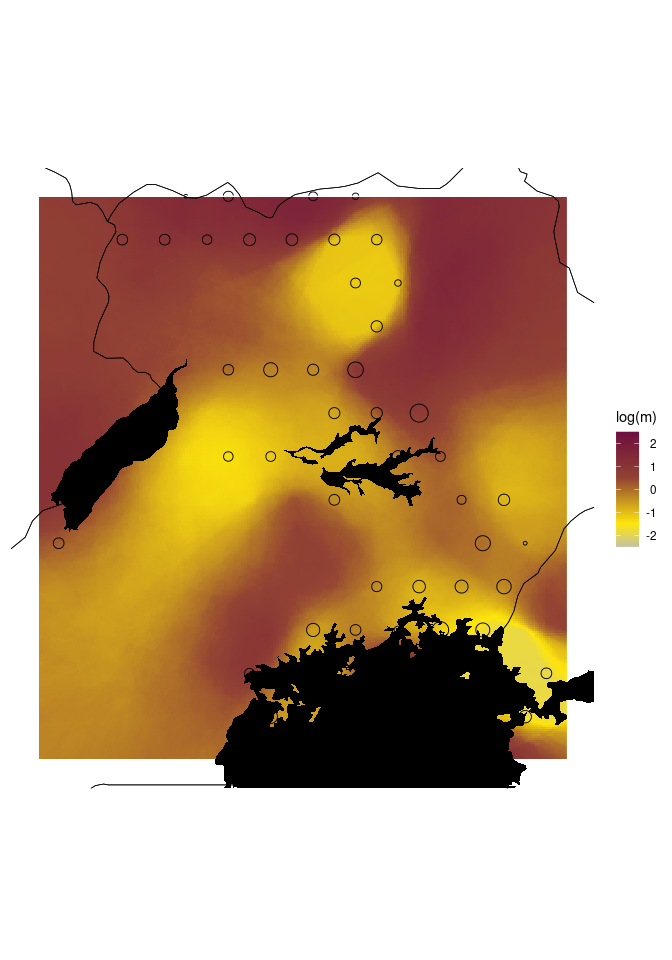

09_EEMS_results
================
Norah Saarman
2026-03-05

- [EEMS input:](#eems-input)
  - [Basic params file](#basic-params-file)
- [EEMS results:](#eems-results)
- [Load packages:](#load-packages)
- [Set directories](#set-directories)
- [Make plots of the standard
  surfaces](#make-plots-of-the-standard-surfaces)

## EEMS input:

**Path:**
`/uufs/chpc.utah.edu/common/home/saarman-group1/uganda-tsetse-LG/input`

EEMS_params.ini EEMS.coord EEMS.ind2deme EEMS.outer EEMS.sites

### Basic params file

datapath =
/uufs/chpc.utah.edu/common/home/u6036559/git/uganda-tsetse-LG/input/EEMS
mcmcpath =
/uufs/chpc.utah.edu/common/home/saarman-group1/uganda-tsetse-LG/results/EEMS_results/run3
nIndiv = 2374 nSites = 11 diploid = 1 nDemes = 200 numMCMCIter = 300000
numBurnIter = 100000 numThinIter = 999 seed = 234

## EEMS results:

**Run 1 Path:**
`/uufs/chpc.utah.edu/common/home/saarman-group1/uganda-tsetse-LG/results/EEMS_results/run1`
200 demes, 49 observed/populated demes, seed = 1772671234

**Run 2 Path:**
`/uufs/chpc.utah.edu/common/home/saarman-group1/uganda-tsetse-LG/results/EEMS_results/run2`
200 demes, 49 observed/populated demes, seed = 2

**Run 3 Path:**
`/uufs/chpc.utah.edu/common/home/saarman-group1/uganda-tsetse-LG/results/EEMS_results/run2`
200 demes, 49 observed/populated demes, seed = 234

Install packages for plotting output in R:
remotes::install_github(“dipetkov/rEEMSplots2”)

# Load packages:

``` r
library(reemsplots2)
library(fields)
```

    ## Loading required package: spam

    ## Spam version 2.11-1 (2025-01-20) is loaded.
    ## Type 'help( Spam)' or 'demo( spam)' for a short introduction 
    ## and overview of this package.
    ## Help for individual functions is also obtained by adding the
    ## suffix '.spam' to the function name, e.g. 'help( chol.spam)'.

    ## 
    ## Attaching package: 'spam'

    ## The following objects are masked from 'package:base':
    ## 
    ##     backsolve, forwardsolve

    ## Loading required package: viridisLite

    ## Loading required package: RColorBrewer

    ## 
    ## Try help(fields) to get started.

``` r
library(RColorBrewer)
library(maps)
library(viridis)
```

    ## 
    ## Attaching package: 'viridis'

    ## The following object is masked from 'package:maps':
    ## 
    ##     unemp

``` r
library(sf)
```

    ## Linking to GEOS 3.10.2, GDAL 3.4.1, PROJ 8.2.1; sf_use_s2() is TRUE

``` r
library(viridis)
library(dplyr)
```

    ## 
    ## Attaching package: 'dplyr'

    ## The following objects are masked from 'package:stats':
    ## 
    ##     filter, lag

    ## The following objects are masked from 'package:base':
    ## 
    ##     intersect, setdiff, setequal, union

``` r
library(terra)
```

    ## terra 1.8.60

    ## 
    ## Attaching package: 'terra'

    ## The following object is masked from 'package:fields':
    ## 
    ##     describe

``` r
library(sf)
library(classInt)
library(ggplot2)
```

# Set directories

``` r
run1 <- "/uufs/chpc.utah.edu/common/home/saarman-group1/uganda-tsetse-LG/results/EEMS_results/run1"
data_dir  <- "/uufs/chpc.utah.edu/common/home/saarman-group1/uganda-tsetse-LG/data"
input_dir <- "../input"
results_dir <- "/uufs/chpc.utah.edu/common/home/saarman-group1/uganda-tsetse-LG/results"
```

# Make plots of the standard surfaces

Plot: (i) posterior mean migration surface, (ii) posterior mean
diversity surface, (iii) residuals surface, plus the observed deme
points.

``` r
# Load shape files with sf
lakes   <- st_read(file.path(data_dir, "raw/ne_10m_lakes.shp"), quiet = TRUE)
uganda  <- rnaturalearth::ne_countries(scale = "medium", returnclass = "sf", continent = "Africa")

# make sure everything is same CRS as the EEMS plot (usually WGS84)
lakes_sf  <- st_transform(lakes, 4326)
uganda_sf <- st_transform(uganda, 4326)

# Custom palette #1 based on Bishop et al.
connectivity_colors <- (colorRampPalette(c("#c5c3a7","#ffe60c","#c79620", "#934334","#802839", "#6f0f40"))(100)) #"#d6ce7c"
suitability_colors  <- colorRampPalette(c("lightgray", "#7fabb9","#3c94c8","#595379","#54306a"))(100)  #"#617189"

# Raw m and q matrix
m <- as.matrix(read.table(paste0(run1, "/mcmcmrates.txt"), sep = "\t"))
q <- as.matrix(read.table(paste0(run1, "/mcmcqrates.txt"), sep = "\t"))

# Make plots with automated functions
plots1 <- make_eems_plots(
  mcmcpath   = run1,
  longlat    = TRUE,
  eems_colors = connectivity_colors,
  add_outline = TRUE,
  add_demes   = TRUE
)
```

    ## Warning: `as_data_frame()` was deprecated in tibble 2.0.0.
    ## ℹ Please use `as_tibble()` (with slightly different semantics) to convert to a
    ##   tibble, or `as.data.frame()` to convert to a data frame.
    ## ℹ The deprecated feature was likely used in the reemsplots2 package.
    ##   Please report the issue at <https://github.com/dipetkov/eems/issues>.
    ## This warning is displayed once every 8 hours.
    ## Call `lifecycle::last_lifecycle_warnings()` to see where this warning was
    ## generated.

    ## Warning: The `x` argument of `as_tibble.matrix()` must have unique column names if
    ## `.name_repair` is omitted as of tibble 2.0.0.
    ## ℹ Using compatibility `.name_repair`.
    ## ℹ The deprecated feature was likely used in the tibble package.
    ##   Please report the issue at <https://github.com/tidyverse/tibble/issues>.
    ## This warning is displayed once every 8 hours.
    ## Call `lifecycle::last_lifecycle_warnings()` to see where this warning was
    ## generated.

    ## Warning: `data_frame()` was deprecated in tibble 1.1.0.
    ## ℹ Please use `tibble()` instead.
    ## ℹ The deprecated feature was likely used in the reemsplots2 package.
    ##   Please report the issue at <https://github.com/dipetkov/eems/issues>.
    ## This warning is displayed once every 8 hours.
    ## Call `lifecycle::last_lifecycle_warnings()` to see where this warning was
    ## generated.

    ## Joining with `by = join_by(id)`
    ## New names:
    ## Generate effective migration surface (posterior mean of m rates). See
    ## plots$mrates01 and plots$mrates02.
    ## Generate effective diversity surface (posterior mean of q rates). See
    ## plots$qrates01 and plots$qrates02.
    ## Generate average dissimilarities within and between demes. See plots$rdist01,
    ## plots$rdist02 and plots$rdist03.
    ## Generate posterior probability trace. See plots$pilog01.

``` r
plots1$mrates01 +
  geom_sf(data = lakes_sf, fill = "black", color = NA, inherit.aes = FALSE) +
  geom_sf(data = uganda_sf, fill = NA, color = "black", linewidth = 0.25, inherit.aes = FALSE)
```

    ## Coordinate system already present. Adding new coordinate system, which will
    ## replace the existing one.

    ## Warning: The `guide` argument in `scale_*()` cannot be `FALSE`. This was deprecated in
    ## ggplot2 3.3.4.
    ## ℹ Please use "none" instead.
    ## ℹ The deprecated feature was likely used in the reemsplots2 package.
    ##   Please report the issue at <https://github.com/dipetkov/eems/issues>.
    ## This warning is displayed once every 8 hours.
    ## Call `lifecycle::last_lifecycle_warnings()` to see where this warning was
    ## generated.

    ## Warning: Removed 1028 rows containing missing values or values outside the scale range
    ## (`geom_tile()`).

<!-- -->
