5 RF model full – raw CSE (1st LC lakes paths)
================
Norah Saarman
2026-04-20

- [Directories](#directories)
- [Inputs](#inputs)
- [1. Prepare the data](#1-prepare-the-data)
- [2. Build full Random Forest model](#2-build-full-random-forest-model)
- [3. Mean-only pruning](#3-mean-only-pruning)
  - [Compare mean versus median versus
    mode:](#compare-mean-versus-median-versus-mode)
  - [PCA of mean env predictor variables, patterns of
    autocorrelation?](#pca-of-mean-env-predictor-variables-patterns-of-autocorrelation)
  - [(Optional) Prune more variables after narrowing to mean
    only?](#optional-prune-more-variables-after-narrowing-to-mean-only)
  - [(Optional) Scaling CSE](#optional-scaling-cse)
- [4. Final full model - (Tune random forest with mean
  variables)](#4-final-full-model---tune-random-forest-with-mean-variables)
  - [Choose final predictor
    variables](#choose-final-predictor-variables)
  - [Full random forest model with raw
    CSE](#full-random-forest-model-with-raw-cse)
    - [Load saved (raw CSE) model](#load-saved-raw-cse-model)
  - [(Optional) Compare full and full tuned models (mean-only
    predictors)](#optional-compare-full-and-full-tuned-models-mean-only-predictors)
- [5. Project predicted values from full CSE
  model](#5-project-predicted-values-from-full-cse-model)
  - [Build Projection](#build-projection)
  - [Plot predicted CSE](#plot-predicted-cse)
- [6. Scale and plot predicted connectivity (CSE) and
  SDM](#6-scale-and-plot-predicted-connectivity-cse-and-sdm)
  - [Scale 0-1, habitat suitability and inverse of predicted
    connectivity
    (CSE)](#scale-0-1-habitat-suitability-and-inverse-of-predicted-connectivity-cse)
  - [Plot scaled predicted CSE and
    SDM](#plot-scaled-predicted-cse-and-sdm)
- [7. Variable importance plots](#7-variable-importance-plots)
  - [Percent Improvement MSE](#percent-improvement-mse)
  - [Node Purity](#node-purity)
- [8. PCA pruned variables to explore variable
  importance](#8-pca-pruned-variables-to-explore-variable-importance)
  - [Run pruned model](#run-pruned-model)
  - [Variable importance](#variable-importance)

RStudio Configuration:  
- **R version:** R 4.4.0 (Geospatial packages)  
- **Number of cores:** 4 (up to 32 available)  
- **Account:** saarman-np  
- **Partition:** saarman-np (allows multiple simultaneous jobs
automatically now)  
- **Memory per job:** 100G (cluster limit: 1000G total; avoid exceeding
half)  
\# Setup

``` r
# load only required packages
library(randomForest)
library(doParallel)
library(raster)
library(sf)
library(viridis)
library(dplyr)
library(terra)
library(sf)
library(classInt)
library(raster)
library(RColorBrewer)
library(ggplot2)
library(factoextra)   # for nice PCA plots
library(ggpubr)
```

## Directories

``` r
# base directories
data_dir  <- "/uufs/chpc.utah.edu/common/home/saarman-group1/uganda-tsetse-LG/data"
input_dir <- "../input"
results_dir <- "/uufs/chpc.utah.edu/common/home/saarman-group1/uganda-tsetse-LG/results"

# read the combined CSE + coords table + pix_dist + Env variables
V.table <- read.csv(file.path(input_dir, "Gff_cse_envCostPaths.csv"),
                    header = TRUE)
# This was added only after completing LOPOCV...
# Filter out western outlier "50-KB" 
V.table <- V.table %>%
  filter(Var1 != "50-KB", Var2 != "50-KB")

# define coordinate reference system
crs_geo <- 4326     # EPSG code for WGS84

# simple mode helper
get_mode <- function(x) {
  ux <- unique(x[!is.na(x)])
  ux[ which.max(tabulate(match(x, ux))) ]
}

# setup running in parallel
cl <- makeCluster(4)
registerDoParallel(cl)
clusterExport(cl, "get_mode")
```

# Inputs

- `../input/Gff_cse_envCostPaths.csv` - Combined CSE table with
  coordinates (long1, lat1, long2, lat2), pix_dist = geographic distance
  in sum of pixels, and mean, median, mode of each Env parameter

# 1. Prepare the data

``` r
# Assign input, checking for any rows with NA
sum(!complete.cases(V.table))  # should return 0
```

    ## [1] 0

``` r
rf_data <- na.omit(V.table)    # should omit zero rows

# Confirm that CSEdistance is numeric
rf_data$CSEdistance <- as.numeric(rf_data$CSEdistance)

# Select variables: all predictors (mean, median, mode)  
predictor_vars <- c("pix_dist",                      # geo dist
  paste0("BIO", 1:7, "_mean"),                       # mean 
  paste0("BIO", 8:11, "S_mean"),                     # mean
  paste0("BIO", 12:15, "_mean"),                     # mean
  paste0("BIO", 16:19, "S_mean"),                    # mean
  "alt_mean", "slope_mean", "riv_3km_mean",          # mean
  "samp_20km_mean", "lakes_mean",                    # mean
  paste0("BIO", 1:7, "_median"),                     # median
  paste0("BIO", 8:11, "S_median"),                   # median
  paste0("BIO", 12:15, "_median"),                   # median
  paste0("BIO", 16:19, "S_median"),                  # median
  "alt_median", "slope_median", "riv_3km_median",    # median
  "samp_20km_median", "lakes_median",                # median
  paste0("BIO", 1:7, "_mode"),                       # mode
  paste0("BIO", 8:11, "S_mode"),                     # mode
  paste0("BIO", 12:15, "_mode"),                     # mode
  paste0("BIO", 16:19, "S_mode"),                    # mode
  "alt_mode", "slope_mode", "riv_3km_mode",          # mode
  "samp_20km_mode", "lakes_mode"                     # mode
)


# subset predictors that we want to use
rf_data <- rf_data[, c("CSEdistance", predictor_vars)]

g <- lm(rf_data$CSEdistance~rf_data$pix_dist)
plot(rf_data$pix_dist, rf_data$CSEdistance)
abline(g)
```

<!-- -->

``` r
# Extract groups of variables by suffix
mean_vars   <- grep("_mean$", names(rf_data), value = TRUE)
median_vars <- grep("_median$", names(rf_data), value = TRUE)
mode_vars   <- grep("_mode$", names(rf_data), value = TRUE)
```

# 2. Build full Random Forest model

Note: Marked eval = FALSE to avoid re-running on knit

``` r
# Build full RF model
set.seed(1234)  # ensures reproducibility
rf_full <- randomForest(
  CSEdistance ~ .,
  data = rf_data,
  importance = TRUE,
  ntree = 500
)

print(rf_full)

importance(rf_full)
```

# 3. Mean-only pruning

## Compare mean versus median versus mode:

Note: Marked eval = FALSE to avoid re-running on knit

``` r
# Extract groups of variables by suffix
mean_vars   <- grep("_mean$", names(rf_data), value = TRUE)
median_vars <- grep("_median$", names(rf_data), value = TRUE)
mode_vars   <- grep("_mode$", names(rf_data), value = TRUE)

# Always include geographic distance
common_var <- "pix_dist"

# Build and run each model
set.seed(123438972)  # ensures reproducibility
rf_mean <- randomForest(CSEdistance ~ ., data = rf_data[, c("CSEdistance", common_var, mean_vars)], ntree = 500, importance = TRUE)
rf_median <- randomForest(CSEdistance ~ ., data = rf_data[, c("CSEdistance", common_var, median_vars)], ntree = 500, importance = TRUE)
rf_mode <- randomForest(CSEdistance ~ ., data = rf_data[, c("CSEdistance", common_var, mode_vars)], ntree = 500, importance = TRUE)

# Compare performance
c(mean = rf_mean$rsq[500] * 100,
  median = rf_median$rsq[500] * 100,
  mode = rf_mode$rsq[500] * 100)
```

Including mean of env variable along least cost paths performs the best,
adding median and mode does not greatly improve the model and increases
risks of over fitting…

## PCA of mean env predictor variables, patterns of autocorrelation?

``` r
# subset and rename variables before PCA
rf_subset <- rf_data[mean_vars]
colnames(rf_subset) <- gsub("_mean$", "", colnames(rf_subset))

# Run PCA
pca_res <- prcomp(rf_subset, scale. = TRUE)

# Quick summary of variance explained
summary(pca_res)
```

    ## Importance of components:
    ##                          PC1    PC2     PC3     PC4     PC5     PC6     PC7
    ## Standard deviation     3.922 1.8929 1.41176 0.92121 0.82331 0.71845 0.60506
    ## Proportion of Variance 0.641 0.1493 0.08304 0.03536 0.02824 0.02151 0.01525
    ## Cumulative Proportion  0.641 0.7903 0.87334 0.90870 0.93694 0.95845 0.97370
    ##                            PC8     PC9    PC10    PC11    PC12    PC13    PC14
    ## Standard deviation     0.54540 0.43062 0.31334 0.12881 0.11472 0.10062 0.07217
    ## Proportion of Variance 0.01239 0.00773 0.00409 0.00069 0.00055 0.00042 0.00022
    ## Cumulative Proportion  0.98610 0.99382 0.99791 0.99860 0.99915 0.99957 0.99979
    ##                           PC15    PC16    PC17    PC18    PC19    PC20     PC21
    ## Standard deviation     0.04574 0.03875 0.02555 0.02099 0.01165 0.01015 0.006646
    ## Proportion of Variance 0.00009 0.00006 0.00003 0.00002 0.00001 0.00000 0.000000
    ## Cumulative Proportion  0.99988 0.99994 0.99997 0.99999 0.99999 1.00000 1.000000
    ##                            PC22      PC23      PC24
    ## Standard deviation     0.004712 0.0004084 2.354e-07
    ## Proportion of Variance 0.000000 0.0000000 0.000e+00
    ## Cumulative Proportion  1.000000 1.0000000 1.000e+00

``` r
# Scree plot of variance explained
ve <- (pca_res$sdev^2) / sum(pca_res$sdev^2)
cumve <- cumsum(ve)
df_ve <- data.frame(PC = seq_along(ve), Var = ve*100, Cum = cumve*100)
ggplot(df_ve, aes(PC, Var)) +
  geom_line() + geom_point() +
  geom_text(aes(label = sprintf("%.1f", Var)), vjust = -0.6, size = 3) +
  labs(x = "Principal component", y = "Variance explained (%)") +
  theme_classic()
```

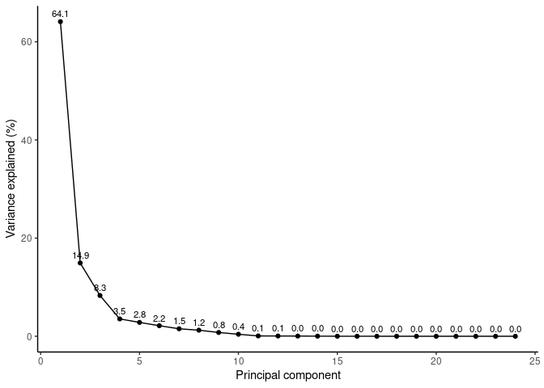<!-- -->

``` r
# PCA biplot with individuals (rows) and variables (arrows)
fviz_pca_biplot(pca_res,
                repel = TRUE, # avoid text overlap
                col.var = "steelblue", # variables
                col.ind = "gray30"    # individuals
)
```

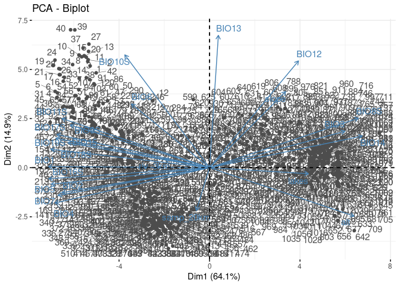<!-- -->

``` r
# PCA variables plot (correlation circle)
load <- as.data.frame(pca_res$rotation[, 1:2])
load$var <- rownames(load)

# circle helper
circle <- data.frame(
  x = cos(seq(0, 2*pi, length.out = 200)),
  y = sin(seq(0, 2*pi, length.out = 200))
)

ggplot() +
  geom_path(data = circle, aes(x, y), linewidth = 0.3) +
  geom_segment(data = load, aes(x = 0, y = 0, xend = PC1, yend = PC2),
               arrow = arrow(length = unit(0.15, "cm")), linewidth = 0.3) +
  geom_text(data = load, aes(PC1, PC2, label = var),
            hjust = 0.5, vjust = -0.5, size = 3) +
  coord_equal(xlim = c(-1,1), ylim = c(-1,1)) +
  labs(x = "PC1", y = "PC2") +
  theme_classic()
```

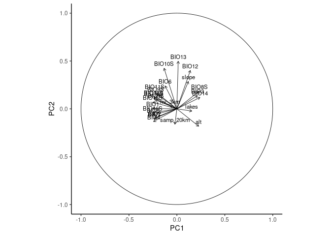<!-- -->

``` r
fviz_pca_var(pca_res,
             col.var = "contrib", # color by contribution
             gradient.cols = c("gray70", "steelblue", "darkblue"),
             repel = TRUE
)
```

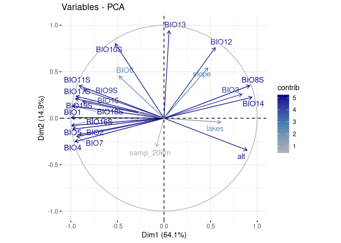<!-- -->

## (Optional) Prune more variables after narrowing to mean only?

``` r
# Plot variable importance
par(mar = c(5, 10, 2, 2))  # bottom, left, top, right
varImpPlot(rf_mean, main = "Mean Model Importance",cex = 0.6, pch = 19)

# Rank variables by %IncMSE (from tuned model)
imp <- importance(rf_mean)[, "%IncMSE"]
imp <- sort(imp, decreasing = TRUE)

# Multiple runs with N top predictors
# Store results
prune_results <- list()
n_list <- c(5:length(imp))

for (n in n_list) {
  top_vars <- names(imp)[1:n]
  formula_n <- as.formula(paste("CSEdistance ~", paste(top_vars, collapse = " + ")))
  
  set.seed(1234783645)
  rf_n <- randomForest(
    formula = formula_n,
    data = rf_data,
    ntree = 500,
    importance = TRUE
  )
  
  prune_results[[paste0("Top", n)]] <- rf_n
}

sapply(prune_results, function(mod) {
  c(OOB_MSE = mod$mse[500], VarExpl = mod$rsq[500] * 100)
})
```

% Variance Explained increases rapidly up to around 18 variables, after
which it plateaus.

OOB MSE decreases quickly early on, with minimal gains beyond the top
~18 predictors.

However, there are not too many more than 18 total, and many of the env
variables have similar node purity, so given the special nature of the
top 2 (geo dist and sampling density), I will leave all mean env
variables.

## (Optional) Scaling CSE

Note: I did also try scaling CSE before runnning RF as a different idea,
but performance of the full model did not improve, so no need to scale
CSE before modeling.

# 4. Final full model - (Tune random forest with mean variables)

## Choose final predictor variables

``` r
# Load data
V.table_full <- read.csv(file.path(input_dir, "Gff_cse_envCostPaths.csv"))

# estimate mean sampling density
mean(V.table_full$samp_20km_mean, na.rm = TRUE)
```

    ## [1] 1.027064e-11

``` r
# Filter out western outlier "50-KB" 
V.table <- V.table_full %>%
  filter(Var1 != "50-KB", Var2 != "50-KB")

# Filter for within-cluster pairs AND geographic distance ≤ 100 km
#V.table <- V.table_full %>%
#  filter(Pop1_cluster == Pop2_cluster) %>%
#  filter(pix_dist <= 100)

# Create unique ID after filtering
V.table$id <- paste(V.table$Var1, V.table$Var2, sep = "_")

# Define site list
sites <- sort(unique(c(V.table$Var1, V.table$Var2)))

# How many rows of data for each?
table(V.table$Pop1_cluster)
```

    ## 
    ## north south 
    ##   595   496

``` r
# How many unique sites?
length(sites)
```

    ## [1] 67

``` r
# Choose predictors for RF model (adjust names if necessary)
predictor_vars <- c("BIO1_mean","BIO2_mean","BIO3_mean","BIO4_mean", "BIO5_mean","BIO6_mean","BIO7_mean", "BIO8S_mean", "BIO9S_mean","BIO10S_mean", "BIO11S_mean","BIO12_mean", "BIO13_mean","BIO14_mean","BIO15_mean","BIO16S_mean","BIO17S_mean", "BIO18S_mean","BIO19S_mean","slope_mean","alt_mean", "lakes_mean","riv_3km_mean", "samp_20km_mean","pix_dist")

# Filter to modeling-relevant columns only
rf_mean_data <- V.table[, c("CSEdistance", predictor_vars)]

# Rename predictors by removing "_mean" for later projections
names(rf_mean_data) <- gsub("_mean$", "", names(rf_mean_data))
```

## Full random forest model with raw CSE

``` r
# Tune mtry (number of variables tried at each split)
set.seed(92834567)
rf_mean_full_tuned <- tuneRF(
  x = rf_mean_data[, -1],   # exclude response variable
  y = rf_mean_data$CSEdistance,
  ntreeTry = 500,
  stepFactor = 1.5,         # factor by which mtry is increased/decreased
  improve = 0.01,           # minimum improvement to continue search
  trace = TRUE,             # print progress
  plot = TRUE,              # plot OOB error vs mtry
  doBest = TRUE,             # return the model with lowest OOB error
  importance = TRUE
)

print(rf_mean_full_tuned)
importance(rf_mean_full_tuned)
varImpPlot(rf_mean_full_tuned)

# Save the tuned random forest model to disk
saveRDS(rf_mean_full_tuned, file = file.path(results_dir, "rf_mean_full_tuned.rds"))
```

FYI: Later, to load the model back into R:
`rf_mean_full_tuned <- readRDS(file.path(results_dir, "rf_mean_full_tuned.rds"))`

### Load saved (raw CSE) model

``` r
# load saved model
rf_full <- readRDS(file.path(results_dir, "rf_mean_full_tuned.rds"))

#double check they look correct
print(rf_full)
```

    ## 
    ## Call:
    ##  randomForest(x = x, y = y, mtry = res[which.min(res[, 2]), 1],      importance = TRUE) 
    ##                Type of random forest: regression
    ##                      Number of trees: 500
    ## No. of variables tried at each split: 12
    ## 
    ##           Mean of squared residuals: 0.001159808
    ##                     % Var explained: 85.7

``` r
print(rf_full$importance)
```

    ##                %IncMSE IncNodePurity
    ## BIO1      0.0001632526    0.08260644
    ## BIO2      0.0003014225    0.13417148
    ## BIO3      0.0015371814    0.49594070
    ## BIO4      0.0002384781    0.14142361
    ## BIO5      0.0001917286    0.09686819
    ## BIO6      0.0005759119    0.28761449
    ## BIO7      0.0002275212    0.12205648
    ## BIO8S     0.0002500370    0.11071230
    ## BIO9S     0.0003935809    0.16430456
    ## BIO10S    0.0001925266    0.08892864
    ## BIO11S    0.0004299928    0.18474855
    ## BIO12     0.0001587739    0.08642528
    ## BIO13     0.0003142826    0.16883174
    ## BIO14     0.0005473538    0.26422377
    ## BIO15     0.0003653509    0.18748348
    ## BIO16S    0.0001619166    0.08259274
    ## BIO17S    0.0003270565    0.11029099
    ## BIO18S    0.0002432277    0.07294360
    ## BIO19S    0.0002768421    0.09772391
    ## slope     0.0001573800    0.10049135
    ## alt       0.0002650561    0.10772336
    ## lakes     0.0002521603    0.10792335
    ## riv_3km   0.0001432166    0.12710960
    ## samp_20km 0.0015702706    1.28875961
    ## pix_dist  0.0074908937    4.07276605

## (Optional) Compare full and full tuned models (mean-only predictors)

Note: eval = FALSE to avoid re-running on knit

``` r
# Build full RF model
set.seed(10981234)  # ensures reproducibility
rf_mean_full <- randomForest(
  CSEdistance ~ .,
  data = rf_mean_data,
  importance = TRUE,
  ntree = 500
)

print(rf_mean_full)
importance(rf_mean_full)

print(rf_mean_full_tuned)
importance(rf_mean_full_tuned)

data.frame(
  Model = c("Full (default mtry)", paste("Tuned (mtry = ",rf_mean_full_tuned$mtry,")")),
  MSE = c(rf_mean_full$mse[rf_mean_full$ntree], rf_mean_full_tuned$mse[rf_mean_full_tuned$ntree]),
  Rsq = c(rf_mean_full$rsq[rf_mean_full$ntree], rf_mean_full_tuned$rsq[rf_mean_full_tuned$ntree])
)

# pad names to trick varImpPlot
rownames(rf_mean_full$importance) <- paste0("  ", rownames(rf_mean_full$importance), "  ")
rownames(rf_mean_full_tuned$importance) <- paste0("  ", rownames(rf_mean_full_tuned$importance), "  ")

# plot with varImpPlot
par(mar = c(5, 30, 2,2))  # bottom, left, top, right
varImpPlot(rf_mean_full, main = "Full Model Importance",cex = 0.6, pch = 19)
varImpPlot(rf_mean_full_tuned, main = "Tuned Full Model Importance",cex = 0.6, pch = 19)
```

Results from optional comparison: The tuned model performs slightly
better, but the gain may not be meaningful… however, it does confirm
that the model is stable and that the mean-only predictors carry strong
signal.

Top 18 mean-based predictors retain nearly all the explanatory power of
the original full model with 42 predictors.

# 5. Project predicted values from full CSE model

## Build Projection

``` r
# Load env stack with named layers
env <- stack(file.path(data_dir, "processed", "env_stack.grd"))

# Neutralize sampling layer to average
env$samp_20km <- 1.027064e-11 #neutralize sampling bias

# Load rdf of final model
rf_predicted <- readRDS(file.path(results_dir, "rf_mean_full_tuned.rds"))
rf_predicted
```

    ## 
    ## Call:
    ##  randomForest(x = x, y = y, mtry = res[which.min(res[, 2]), 1],      importance = TRUE) 
    ##                Type of random forest: regression
    ##                      Number of trees: 500
    ## No. of variables tried at each split: 12
    ## 
    ##           Mean of squared residuals: 0.001159808
    ##                     % Var explained: 85.7

``` r
prediction_raster <- predict(env, rf_predicted, type = "response")

# Write Prediction Raster to file
writeRaster(prediction_raster, file.path(results_dir,"fullRF_CSE.tif"), format = "GTiff", overwrite = TRUE)
```

## Plot predicted CSE

``` r
# Create base plot with viridis
plot(prediction_raster,
     col = viridis::magma(100),
     main = "Predicted CSE Distance",
     axes = FALSE,
     box = FALSE,
     legend.args = list(text = "CSE", side = 3, line = 1, cex = 1))

# Overlay lakes in dark gray
lakes <- st_read(file.path(data_dir, "raw/ne_10m_lakes.shp"), quiet = TRUE)
lakes <- st_transform(lakes, crs = st_crs(prediction_raster))  # match CRS 
lakes <- st_make_valid(lakes) # fix geometries
r_ext <- st_as_sfc(st_bbox(prediction_raster)) # extent
st_crs(r_ext) <- st_crs(prediction_raster) # match CRS
lakes <- st_intersection(lakes, r_ext) # clip to extent
plot(st_geometry(lakes), col = "gray20", border = NA, add = TRUE)

# Overlay country outline
uganda <- rnaturalearth::ne_countries(continent = "Africa", scale = "medium", returnclass = "sf")
uganda <- st_intersection(uganda, r_ext) # clip to extent
plot(st_geometry(uganda), col = NA, border = "black", lwd = 1.2, add = TRUE)
```

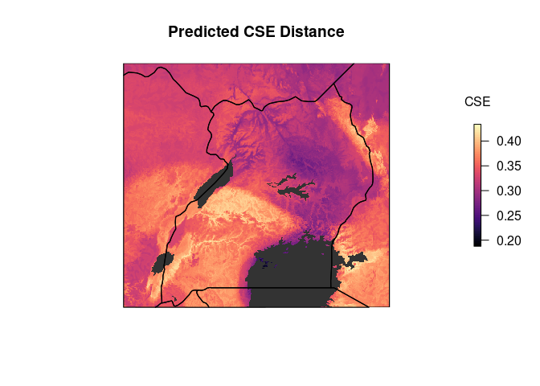<!-- -->

# 6. Scale and plot predicted connectivity (CSE) and SDM

## Scale 0-1, habitat suitability and inverse of predicted connectivity (CSE)

``` r
# Load raster layers
con_raster <- rast(file.path(results_dir, "fullRF_CSE.tif"))
fao <- rast(file.path(data_dir, "FAO_fuscipes_2001.tif"))
update <- rast(file.path(data_dir, "SDM_2018update.tif"))

# Match extent and resolution first
fao_crop <- crop(fao, update)
update_crop <- crop(update, fao_crop)
fao_resamp <- resample(fao_crop, update_crop)  # if needed to match resolution

# Combine
sdm_raw <- max(fao_resamp, update_crop, na.rm = TRUE)

# Crop to overlapping extent
sdm <- crop(sdm_raw, con_raster)
con <- crop(con_raster, sdm)

# Mask low-suitability areas
sdm[sdm <= 0.05] <- NA


# Rescale to 0–1
sdm_min <- global(sdm, "min", na.rm = TRUE)$min
sdm_max <- global(sdm, "max", na.rm = TRUE)$max
sdm <- (sdm - sdm_min) / (sdm_max - sdm_min)

# Mask to common suitable area
con <- mask(con, sdm)

# Rescale inverse of prediction to 0-1
con_min <- global(con, "min", na.rm = TRUE)$min
con_max <- global(con, "max", na.rm = TRUE)$max
con <- 1 - ((con - con_min) / (con_max - con_min))

# Convert back to raster for compatibility with bivariate.map function
sdm_r <- raster(sdm)
con_r <- raster(con)
```

## Plot scaled predicted CSE and SDM

``` r
# Plot Genetic Connectivity (inverse predicted values)
plot(con,
     col = rev(viridis::plasma(100)),  # high connectivity = dark
     main = "Genetic Connectivity (inverse predicted CSE)",
     axes = FALSE, box = FALSE,
     legend.args = list(text = "Connectivity", side = 2, line = 2.5, cex = 0.8))
plot(st_geometry(lakes), col = "black", border = NA, add = TRUE)
plot(st_geometry(uganda), border = "black", lwd = 0.25, add = TRUE)
```

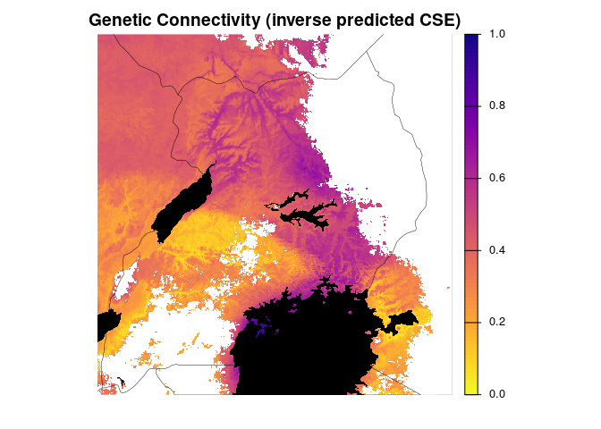<!-- -->

``` r
# Plot Habitat Suitability
plot(sdm,
     col = viridis::viridis(100),  # high suitability = dark
     main = "Habitat Suitability",
     axes = FALSE, box = FALSE,
     legend.args = list(text = "Suitability", side = 2, line = 2.5, cex = 0.8))
plot(st_geometry(lakes), col = "black", border = NA, add = TRUE)
plot(st_geometry(uganda), border = "black", lwd = 0.25, add = TRUE)
```

<!-- -->

``` r
# Plot with custom colors

# Custom palettes based on Bishop et al.
connectivity_colors <- colorRampPalette(c("#FFFF00", "#FFA500", "#FF4500", "#700E40", "#2E003E"))(100)
suitability_colors  <- colorRampPalette(c("white", "lightblue", "blue4"))(100)     # white → light blue → dark blue

# Plot Genetic Connectivity (inverse predicted) with custom colors
plot(con,
     col = connectivity_colors,
     main = "Genetic Connectivity (inverse predicted CSE)",
     axes = FALSE, box = FALSE,
     legend.args = list(text = "Connectivity", side = 2, line = 2.5, cex = 0.8))
plot(st_geometry(lakes), col = "black", border = NA, add = TRUE)
plot(st_geometry(uganda), border = "black", lwd = 0.25, add = TRUE)
```

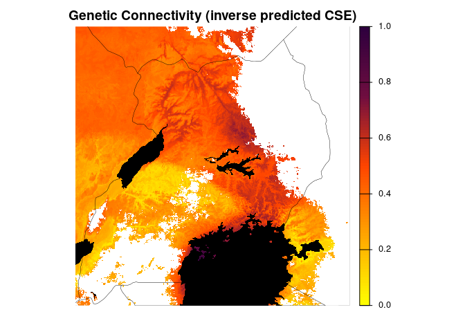<!-- -->

``` r
# Plot Habitat Suitability with custom colors
plot(sdm,
     col = suitability_colors,
     main = "Habitat Suitability",
     axes = FALSE, box = FALSE,
     legend.args = list(text = "Suitability", side = 2, line = 2.5, cex = 0.8))
plot(st_geometry(lakes), col = "black", border = NA, add = TRUE)
plot(st_geometry(uganda), border = "black", lwd = .25, add = TRUE)
```

<!-- -->

# 7. Variable importance plots

## Percent Improvement MSE

``` r
library(dplyr)
library(tibble)
library(ggplot2)
library(randomForest)

# Load full model (as opposed to LOPOCV later)
full_model <- rf_predicted 
full_imp <- importance(full_model, type = 1) %>%
  as.data.frame() %>%
  rownames_to_column("variable") %>%
  rename(IncMSE = `%IncMSE`) %>%
  mutate(model = "full")

# Define custom labels
label_map <- c(
  BIO1   = "Annual Mean Temperature (BIO1)",
  BIO2   = "Mean Diurnal Temp Range (BIO2)",
  BIO3   = "Isothermality (BIO3)",
  BIO4   = "Temperature Seasonality (BIO4)",
  BIO5   = "Max Temp of Warmest Month (BIO5)",
  BIO6   = "Min Temp of Coldest Month (BIO6)",
  BIO7   = "Temperature Annual Range (BIO7)",
  BIO8S  = "Mean Temp of Wettest Season (BIO8S)",
  BIO9S  = "Mean Temp of Driest Season (BIO9S)",
  BIO10S = "Mean Temp of Warmest Season (BIO10S)",
  BIO11S = "Mean Temp of Coldest Season (BIO11S)",
  BIO12  = "Annual Precipitation (BIO12)",
  BIO13  = "Precipitation of Wettest Month (BIO13)",
  BIO14  = "Precipitation of Driest Month (BIO14)",
  BIO15  = "Precipitation Seasonality (BIO15)",
  BIO16S = "Precipitation of Wettest Season (BIO16S)",
  BIO17S = "Precipitation of Driest Season (BIO17S)",
  BIO18S = "Precipitation of Warmest Season (BIO18S)",
  BIO19S = "Precipitation of Coldest Season (BIO19S)",
  slope  = "Slope",
  alt    = "Altitude",
  lakes  = "Lake Presence/Absence",
  riv_3km = "River Kernel Density (3 km bandwidth)",
  samp_20km = "Sampling Density (20 km bandwidth)",
  pix_dist = "Geographic Distance (km)"
)


# Order by full model's %IncMSE (top to bottom)
full_order <- full_imp %>%
  arrange(desc(IncMSE)) %>%
  pull(variable)

full_imp$variable <- factor(full_imp$variable, levels = rev(full_order))

# Plot
# pdf("../figures/VarImpPlot_residModel.pdf",width =6, height=6)
ggplot(full_imp, aes(x = variable, y = IncMSE)) +
  geom_point(data = filter(full_imp, model == "full"),
             color = "black", size = 3) +
  coord_flip() +
  scale_y_continuous(name = "%IncMSE") +
  scale_x_discrete(labels = label_map) +
  labs(x = NULL, title = "Variable Importance of Raw CSE Model") +
  theme_minimal()
```

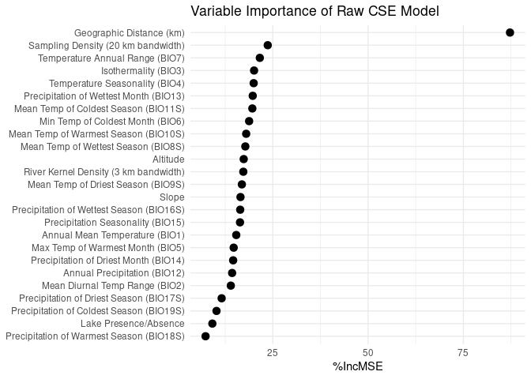<!-- -->

``` r
#dev.off()
```

## Node Purity

``` r
library(dplyr)
library(tibble)
library(ggplot2)
library(randomForest)

# Load full model
full_model <- rf_predicted 

full_imp <- importance(full_model, type = 2) %>%
  as.data.frame() %>%
  rownames_to_column("variable") %>%
  mutate(model = "full")

# Define custom labels
label_map <- c(
  BIO1   = "Annual Mean Temperature (BIO1)",
  BIO2   = "Mean Diurnal Temp Range (BIO2)",
  BIO3   = "Isothermality (BIO3)",
  BIO4   = "Temperature Seasonality (BIO4)",
  BIO5   = "Max Temp of Warmest Month (BIO5)",
  BIO6   = "Min Temp of Coldest Month (BIO6)",
  BIO7   = "Temperature Annual Range (BIO7)",
  BIO8S  = "Mean Temp of Wettest Season (BIO8S)",
  BIO9S  = "Mean Temp of Driest Season (BIO9S)",
  BIO10S = "Mean Temp of Warmest Season (BIO10S)",
  BIO11S = "Mean Temp of Coldest Season (BIO11S)",
  BIO12  = "Annual Precipitation (BIO12)",
  BIO13  = "Precipitation of Wettest Month (BIO13)",
  BIO14  = "Precipitation of Driest Month (BIO14)",
  BIO15  = "Precipitation Seasonality (BIO15)",
  BIO16S = "Precipitation of Wettest Season (BIO16S)",
  BIO17S = "Precipitation of Driest Season (BIO17S)",
  BIO18S = "Precipitation of Warmest Season (BIO18S)",
  BIO19S = "Precipitation of Coldest Season (BIO19S)",
  slope  = "Slope",
  alt    = "Altitude",
  lakes  = "Lake Presence/Absence",
  riv_3km = "River Kernel Density (3 km bandwidth)",
  samp_20km = "Sampling Density (20 km bandwidth)",
  pix_dist = "Geographic Distance (km)"
)

# Order variables by node purity
full_order <- full_imp %>%
  arrange(desc(IncNodePurity)) %>%
  pull(variable)

full_imp$variable <- factor(full_imp$variable, levels = rev(full_order))

# Plot
ggplot(full_imp, aes(x = variable, y = IncNodePurity)) +
  geom_point(color = "black", size = 3) +
  coord_flip() +
  scale_y_continuous(name = "Increase in Node Purity") +
  scale_x_discrete(labels = label_map) +
  labs(x = NULL, title = "Variable Importance of Raw CSE Model") +
  theme_minimal()
```

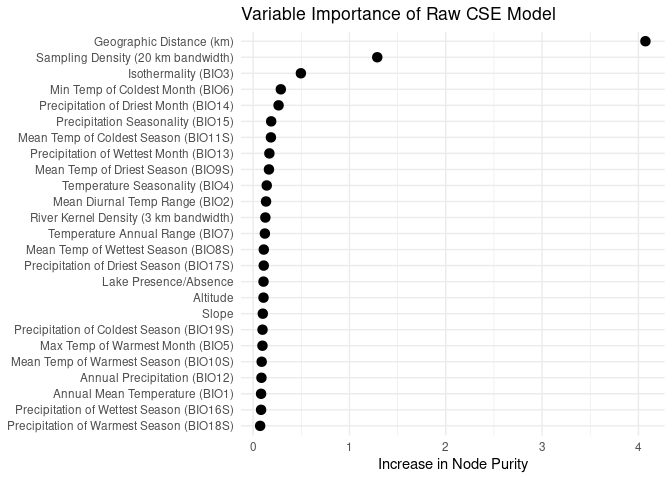<!-- -->

# 8. PCA pruned variables to explore variable importance

## Run pruned model

``` r
# Load data
V.table_full <- read.csv(file.path(input_dir, "Gff_cse_envCostPaths.csv"))

# estimate mean sampling density
mean(V.table_full$samp_20km_mean, na.rm = TRUE)
```

    ## [1] 1.027064e-11

``` r
# Filter out western outlier "50-KB" 
V.table <- V.table_full %>%
  filter(Var1 != "50-KB", Var2 != "50-KB")

# Filter for within-cluster pairs AND geographic distance ≤ 100 km
#V.table <- V.table_full %>%
#  filter(Pop1_cluster == Pop2_cluster) %>%
#  filter(pix_dist <= 100)

# Create unique ID after filtering
V.table$id <- paste(V.table$Var1, V.table$Var2, sep = "_")

# Define site list
sites <- sort(unique(c(V.table$Var1, V.table$Var2)))

# How many rows of data for each?
table(V.table$Pop1_cluster)
```

    ## 
    ## north south 
    ##   595   496

``` r
# How many unique sites?
length(sites)
```

    ## [1] 67

``` r
# Choose predictors for RF model (adjust names if necessary)
predictor_vars <- c("BIO3_mean","BIO4_mean","BIO7_mean", "BIO11S_mean", "BIO13_mean","slope_mean","alt_mean", "lakes_mean","riv_3km_mean", "samp_20km_mean","pix_dist")

# Filter to modeling-relevant columns only
rf_mean_data <- V.table[, c("CSEdistance", predictor_vars)]

# Rename predictors by removing "_mean" for later projections
names(rf_mean_data) <- gsub("_mean$", "", names(rf_mean_data))

# Tune mtry (number of variables tried at each split)
set.seed(92834567)

rf_mean_pcapruned_tuned <- tuneRF(
  x = rf_mean_data[, -1],   # exclude response variable
  y = rf_mean_data$CSEdistance,
  ntreeTry = 500,
  stepFactor = 1.5,         # factor by which mtry is increased/decreased
  improve = 0.01,           # minimum improvement to continue search
  trace = TRUE,             # print progress
  plot = TRUE,              # plot OOB error vs mtry
  doBest = TRUE,             # return the model with lowest OOB error
  importance = TRUE
)
```

    ## mtry = 3  OOB error = 0.001201753 
    ## Searching left ...
    ## mtry = 2     OOB error = 0.001266155 
    ## -0.05358984 0.01 
    ## Searching right ...
    ## mtry = 4     OOB error = 0.001182687 
    ## 0.01586495 0.01 
    ## mtry = 6     OOB error = 0.001164252 
    ## 0.01558754 0.01 
    ## mtry = 9     OOB error = 0.001199824 
    ## -0.03055359 0.01

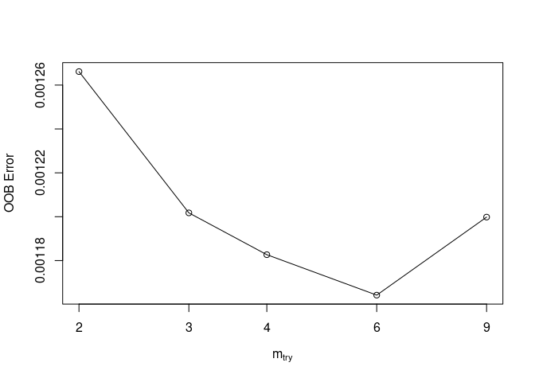<!-- -->

``` r
print(rf_mean_pcapruned_tuned)
```

    ## 
    ## Call:
    ##  randomForest(x = x, y = y, mtry = res[which.min(res[, 2]), 1],      importance = TRUE) 
    ##                Type of random forest: regression
    ##                      Number of trees: 500
    ## No. of variables tried at each split: 6
    ## 
    ##           Mean of squared residuals: 0.001177704
    ##                     % Var explained: 85.48

``` r
importance(rf_mean_pcapruned_tuned)
```

    ##            %IncMSE IncNodePurity
    ## BIO3      31.09694     0.6633338
    ## BIO4      29.00780     0.3260843
    ## BIO7      36.76577     0.3491370
    ## BIO11S    30.06047     0.4480731
    ## BIO13     30.33539     0.3133014
    ## slope     21.14116     0.1822154
    ## alt       28.60231     0.3312492
    ## lakes     12.25125     0.1550735
    ## riv_3km   20.83758     0.2063074
    ## samp_20km 30.48908     1.6003861
    ## pix_dist  99.75679     4.1926504

``` r
varImpPlot(rf_mean_pcapruned_tuned)
```

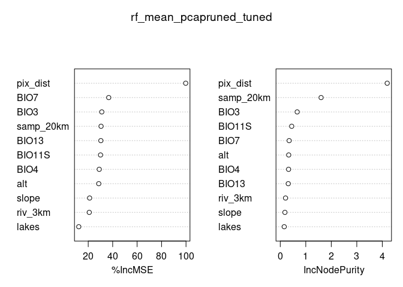<!-- -->

``` r
#save RDS of pca-pruned model
saveRDS(rf_mean_pcapruned_tuned, file = file.path(results_dir, "rf_mean_pcapruned_tuned.rds"))
```

## Variable importance

``` r
# Load pcapruned model
pcapruned_model <- readRDS(file.path(results_dir, "rf_mean_pcapruned_tuned.rds"))

pcapruned_imp <- importance(pcapruned_model, type = 1) %>%
  as.data.frame() %>%
  rownames_to_column("variable") %>%
  rename(IncMSE = `%IncMSE`) %>%
  mutate(model = "pcapruned")

# Define custom labels
label_map <- c(
  BIO3   = "Isothermality (BIO3)",
  BIO4   = "Temperature Seasonality (BIO4)",
  BIO7   = "Temperature Annual Range (BIO7)",
  BIO11S = "Mean Temp of Coldest Season (BIO11S)",
  BIO13  = "Precipitation of Wettest Month (BIO13)",
  slope  = "Slope",
  alt    = "Altitude",
  lakes  = "Lake Presence/Absence",
  riv_3km = "River Kernel Density (3 km bandwidth)",
  samp_20km = "Sampling Density (20 km bandwidth)",
  pix_dist = "Geographic Distance (km)"
)


# Order by pcapruned model's %IncMSE (top to bottom)
pcapruned_order <- pcapruned_imp %>%
  arrange(desc(IncMSE)) %>%
  pull(variable)

pcapruned_imp$variable <- factor(pcapruned_imp$variable, levels = rev(pcapruned_order))

# Plot
# pdf("../figures/VarImpPlot_residModel.pdf",width =6, height=6)
ggplot(pcapruned_imp, aes(x = variable, y = IncMSE)) +
  geom_point(data = filter(pcapruned_imp, model == "pcapruned"),
             color = "black", size = 3) +
  coord_flip() +
  scale_y_continuous(name = "%IncMSE") +
  scale_x_discrete(labels = label_map) +
  labs(x = NULL, title = "Variable Importance of Raw CSE Model") +
  theme_minimal()
```

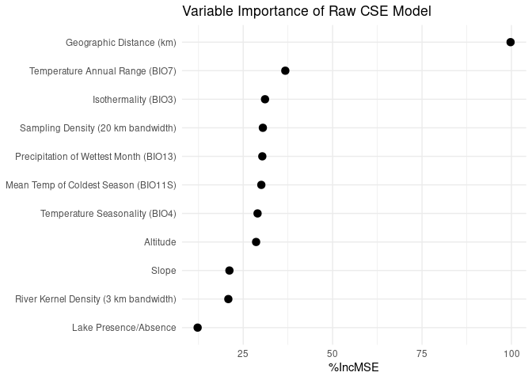<!-- -->

``` r
#dev.off()


pcapruned_imp <- importance(pcapruned_model, type = 2) %>%
  as.data.frame() %>%
  rownames_to_column("variable") %>%
  mutate(model = "pcapruned")

# Define custom labels
label_map <- c(
  BIO3   = "Isothermality (BIO3)",
  BIO4   = "Temperature Seasonality (BIO4)",
  BIO7   = "Temperature Annual Range (BIO7)",
  BIO11S = "Mean Temp of Coldest Season (BIO11S)",
  BIO13  = "Precipitation of Wettest Month (BIO13)",
  slope  = "Slope",
  alt    = "Altitude",
  lakes  = "Lake Presence/Absence",
  riv_3km = "River Kernel Density (3 km bandwidth)",
  samp_20km = "Sampling Density (20 km bandwidth)",
  pix_dist = "Geographic Distance (km)"
)

# Order variables by node purity
pcapruned_order <- pcapruned_imp %>%
  arrange(desc(IncNodePurity)) %>%
  pull(variable)

pcapruned_imp$variable <- factor(pcapruned_imp$variable, levels = rev(pcapruned_order))

# Plot
ggplot(pcapruned_imp, aes(x = variable, y = IncNodePurity)) +
  geom_point(color = "black", size = 3) +
  coord_flip() +
  scale_y_continuous(name = "Increase in Node Purity") +
  scale_x_discrete(labels = label_map) +
  labs(x = NULL, title = "Variable Importance of Raw CSE Model") +
  theme_minimal()
```

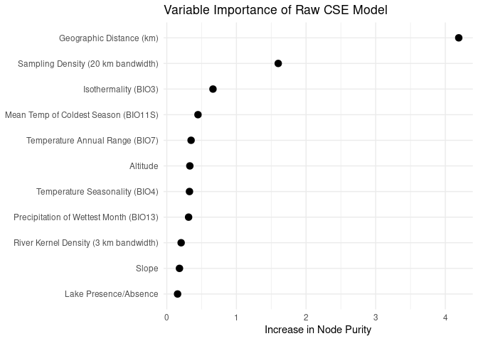<!-- -->
