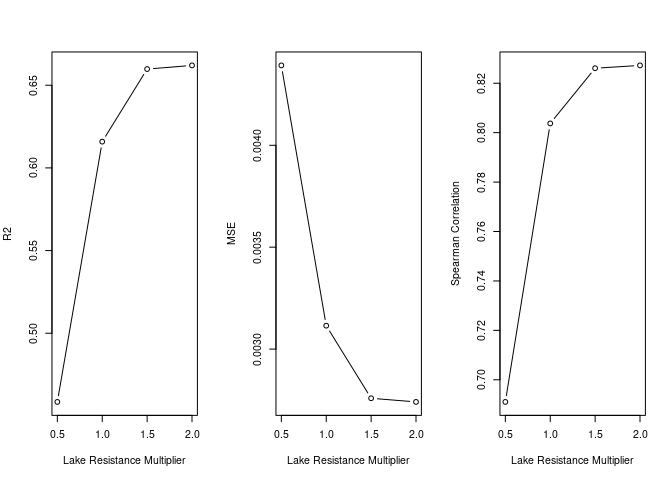

Spatial Evaluation - Lake Resistance Sensitivity
================
Norah Saarman
2026-08-14

- [Load libraries](#load-libraries)
- [Overview](#overview)
- [Step 1. Inputs](#step-1-inputs)
- [Step 2. Prepare site pairs and helper
  functions](#step-2-prepare-site-pairs-and-helper-functions)
- [Step 3. Prepare lake resistance
  values](#step-3-prepare-lake-resistance-values)
- [Step 4. Loop through lake resistance
  multipliers](#step-4-loop-through-lake-resistance-multipliers)
- [Step 5. Summarize results](#step-5-summarize-results)
- [Step 6. Compare with final
  analysis](#step-6-compare-with-final-analysis)
- [Step 7. Visualize](#step-7-visualize)
- [Conclusion](#conclusion)

RStudio Configuration:  
- **R version:** R 4.4.0 (Geospatial packages)  
- **Number of cores:** 4 (up to 32 available)  
- **Account:** saarman-np  
- **Partition:** saarman-np (now auto allows multiple simultaneous
jobs)  
- **Memory per job:** 100G (cluster limit: 1000G total; avoid exceeding
half)

## Load libraries

``` r
library(doParallel)
```

    ## Loading required package: foreach

    ## Loading required package: iterators

    ## Loading required package: parallel

``` r
library(foreach)
library(raster)
```

    ## Loading required package: sp

``` r
library(gdistance)
```

    ## Loading required package: igraph

    ## 
    ## Attaching package: 'igraph'

    ## The following object is masked from 'package:raster':
    ## 
    ##     union

    ## The following objects are masked from 'package:stats':
    ## 
    ##     decompose, spectrum

    ## The following object is masked from 'package:base':
    ## 
    ##     union

    ## Loading required package: Matrix

    ## 
    ## Attaching package: 'gdistance'

    ## The following object is masked from 'package:igraph':
    ## 
    ##     normalize

``` r
library(sf)
```

    ## Linking to GEOS 3.10.2, GDAL 3.4.1, PROJ 8.2.1; sf_use_s2() is TRUE

``` r
library(dplyr)
```

    ## 
    ## Attaching package: 'dplyr'

    ## The following objects are masked from 'package:igraph':
    ## 
    ##     as_data_frame, groups, union

    ## The following objects are masked from 'package:raster':
    ## 
    ##     intersect, select, union

    ## The following objects are masked from 'package:stats':
    ## 
    ##     filter, lag

    ## The following objects are masked from 'package:base':
    ## 
    ##     intersect, setdiff, setequal, union

``` r
library(ggplot2)
library(rnaturalearth)
library(rnaturalearthdata)
```

    ## 
    ## Attaching package: 'rnaturalearthdata'

    ## The following object is masked from 'package:rnaturalearth':
    ## 
    ##     countries110

``` r
library(randomForest)
```

    ## randomForest 4.7-1.2

    ## Type rfNews() to see new features/changes/bug fixes.

    ## 
    ## Attaching package: 'randomForest'

    ## The following object is masked from 'package:ggplot2':
    ## 
    ##     margin

    ## The following object is masked from 'package:dplyr':
    ## 
    ##     combine

# Overview

This supplementary sensitivity analysis evaluates the resistance value
assigned to lake cells during least-cost-path-based spatial evaluation
of the final projected CSE surface.

The final analysis assigns lake cells a resistance equal to the maximum
predicted CSE value of the projected surface. Here, all other aspects of
the spatial evaluation are held constant while lake resistance is set to
0.5, 1, 1.5, or 2 times the maximum predicted CSE.

# Step 1. Inputs

``` r
# Define Paths to directories
input_dir <- "../input"
data_dir  <- "/uufs/chpc.utah.edu/common/home/saarman-group1/uganda-tsetse-LG/data"
results_dir_big <- "/uufs/chpc.utah.edu/common/home/saarman-group1/uganda-tsetse-LG/results/"
results_dir <- "../results/"

# output directory
lake_screen_dir <- file.path(
  results_dir_big,
  "lake_resistance_screening_LCPsum"
)

# define coordinate reference system
crs_geo <- 4326

# Final projected CSE surface
surf_file <- file.path(results_dir_big, "fullRF_CSE.tif")

# Lake mask
lake_file <- file.path(data_dir, "processed", "lake_binary.tif")

# Pairwise CSE table
cse_file <- file.path("..", "input", "Gff_cse_envCostPaths.csv")

# Read pairwise CSE table
cse_df <- read.csv(cse_file)

# Same filtering as final analysis
cse_df <- cse_df %>%
  filter(Var1 != "50-KB", Var2 != "50-KB")

# Read projected raw CSE surface
cse_surface_base <- raster(surf_file)

# Read lake mask
lake_mask <- raster(lake_file)
```

# Step 2. Prepare site pairs and helper functions

``` r
# keep only within-cluster comparisons
cse_df_eval <- cse_df %>%
  filter(Pop1_cluster == Pop2_cluster) %>%
  mutate(
    id  = paste(Var1, Var2, sep = "_"),
    CSE = CSEdistance
  )

# unique site coordinates
sites_coords <- bind_rows(
  cse_df_eval %>%
    dplyr::select(Site = Var1, lon = long1, lat = lat1),
  cse_df_eval %>%
    dplyr::select(Site = Var2, lon = long2, lat = lat2)
) %>%
  distinct()

# pair table
site_pairs <- cse_df_eval %>%
  dplyr::select(Var1, Var2, id, CSE) %>%
  distinct()

# calibration function
calibrate_pred <- function(obs, pred) {
  keep <- complete.cases(obs, pred)
  df <- data.frame(obs = obs[keep], pred = pred[keep])
  fit <- lm(obs ~ pred, data = df)

  out <- rep(NA_real_, length(obs))
  out[keep] <- predict(fit, newdata = data.frame(pred = pred[keep]))
  out
}

# metrics function
# correlation uses raw predictions
# RSQ and error metrics use calibrated predictions
calc_metrics <- function(obs, pred_raw, pred_cal) {
  keep <- complete.cases(obs, pred_raw, pred_cal)

  obs      <- obs[keep]
  pred_raw <- pred_raw[keep]
  pred_cal <- pred_cal[keep]

  sse  <- sum((obs - pred_cal)^2)
  sst  <- sum((obs - mean(obs))^2)
  mse  <- mean((obs - pred_cal)^2)
  rmse <- sqrt(mse)
  mae  <- mean(abs(obs - pred_cal))
  rsq  <- 1 - (sse / sst)
  corr <- cor(obs, pred_raw, method = "spearman")

  data.frame(
    n = length(obs),
    MSE = mse,
    RMSE = rmse,
    MAE = mae,
    RSQ = rsq,
    Correlation = corr
  )
}
```

# Step 3. Prepare lake resistance values

``` r
lake_multipliers <- c(0.5, 1, 1.5, 2)

# align lake mask if needed
if (!compareRaster(
  cse_surface_base,
  lake_mask,
  extent = TRUE,
  rowcol = TRUE,
  crs = TRUE,
  res = TRUE,
  stopiffalse = FALSE
)) {
  lake_mask_use <- projectRaster(
    lake_mask,
    cse_surface_base,
    method = "ngb"
  )
} else {
  lake_mask_use <- lake_mask
}

# maximum predicted CSE before modifying lake cells
surface_max <- max(
  values(cse_surface_base),
  na.rm = TRUE
)

surface_max
```

# Step 4. Loop through lake resistance multipliers

``` r
# output directory
lake_screen_dir <- file.path(
  results_dir_big,
  "lake_resistance_screening_LCPsum"
)

dir.create(
  lake_screen_dir,
  showWarnings = FALSE,
  recursive = TRUE
)

all_metrics <- list()

n_cores <- 16
cl <- makeCluster(n_cores)
registerDoParallel(cl)

for (mult in lake_multipliers) {

  cat("\n----------------------------\n")
  cat("Lake resistance multiplier:", mult, "\n")
  cat("----------------------------\n")

  # modify lake resistance only
  cse_surface <- cse_surface_base
  lake_resistance <- mult * surface_max
  cse_surface[lake_mask_use[] == 1] <- lake_resistance

  # prepare sites in raster CRS
  sites_df <- st_as_sf(
    sites_coords,
    coords = c("lon", "lat"),
    crs = crs_geo
  ) %>%
    st_transform(crs(cse_surface))

  sites_sp <- as(sites_df, "Spatial")

  site_index <- setNames(
    seq_len(nrow(sites_df)),
    sites_coords$Site
  )

  # build transition object
  resistance_rast <- cse_surface

  min_pos <- min(
    values(resistance_rast)[values(resistance_rast) > 0],
    na.rm = TRUE
  )

  resistance_rast[resistance_rast <= 0] <- min_pos

  conductance_rast <- 1 / resistance_rast

  tr <- transition(
    conductance_rast,
    transitionFunction = mean,
    directions = 16
  )

  tr_lcp <- geoCorrection(
    tr,
    type = "c"
  )

  # recompute least-cost paths
  paths_list <- foreach(
    ii = seq_len(nrow(site_pairs)),
    .packages = c("gdistance", "sp", "sf")
  ) %dopar% {

    i <- site_index[site_pairs$Var1[ii]]
    j <- site_index[site_pairs$Var2[ii]]

    path <- tryCatch(
      {
        shortestPath(
          tr_lcp,
          sites_sp[i, ],
          sites_sp[j, ],
          output = "SpatialLines"
        )
      },
      error = function(e) NULL
    )

    if (!is.null(path)) {
      path_sf <- st_as_sf(path)
      path_sf$id <- site_pairs$id[ii]
      return(path_sf)
    } else {
      return(NULL)
    }
  }

  paths_list <- paths_list[!sapply(paths_list, is.null)]

  paths_sf <- do.call(rbind, paths_list)
  st_crs(paths_sf) <- st_crs(cse_surface)

  # extract values along paths
  path_vals <- raster::extract(
    cse_surface,
    as(paths_sf, "Spatial")
  )

  lcp_summary <- data.frame(
    id = paths_sf$id,
    LCP_sum = sapply(
      path_vals,
      function(x) {
        if (is.null(x) || all(is.na(x))) {
          NA_real_
        } else {
          sum(x, na.rm = TRUE)
        }
      }
    )
  )

  # combine and calibrate
  eval_results <- site_pairs %>%
    left_join(lcp_summary, by = "id")

  eval_results$LCP_sum_cal <- calibrate_pred(
    eval_results$CSE,
    eval_results$LCP_sum
  )

  # calculate metrics
  metrics_mult <- calc_metrics(
    obs = eval_results$CSE,
    pred_raw = eval_results$LCP_sum,
    pred_cal = eval_results$LCP_sum_cal
  ) %>%
    mutate(
      lake_multiplier = mult,
      lake_resistance = lake_resistance,
      method = "LCP_sum"
    ) %>%
    dplyr::select(
      lake_multiplier,
      lake_resistance,
      method,
      everything()
    )

  # save pairwise output
  write.csv(
    eval_results,
    file.path(
      lake_screen_dir,
      paste0("eval_results_lake_", mult, "x.csv")
    ),
    row.names = FALSE
  )

  # save metrics
  write.csv(
    metrics_mult,
    file.path(
      lake_screen_dir,
      paste0("eval_metrics_lake_", mult, "x.csv")
    ),
    row.names = FALSE
  )

  all_metrics[[paste0("lake_", mult, "x")]] <- metrics_mult
}

stopCluster(cl)
```

# Step 5. Summarize results

``` r
lake_summary <- bind_rows(all_metrics)

write.csv(
  lake_summary,
  file.path(
    lake_screen_dir,
    "lake_resistance_comparison_metrics_LCPsum.csv"
  ),
  row.names = FALSE
)

lake_summary
```

# Step 6. Compare with final analysis

The lake multiplier of 1 corresponds to the value used in the final
spatial evaluation.

``` r
lake_summary <- read.csv(file.path(
    lake_screen_dir,
    "lake_resistance_comparison_metrics_LCPsum.csv"
  ))

baseline <- lake_summary %>%
  filter(lake_multiplier == 1)

lake_summary_relative <- lake_summary %>%
  mutate(
    delta_Correlation = Correlation - baseline$Correlation,
    delta_RSQ = RSQ - baseline$RSQ,
    delta_RMSE = RMSE - baseline$RMSE,
    delta_MAE = MAE - baseline$MAE
  )

lake_summary_relative
```

    ##   lake_multiplier lake_resistance  method    n         MSE       RMSE
    ## 1             0.5       0.2169009 LCP_sum 1091 0.004391793 0.06627061
    ## 2             1.0       0.4338018 LCP_sum 1091 0.003114933 0.05581158
    ## 3             1.5       0.6507027 LCP_sum 1091 0.002758874 0.05252498
    ## 4             2.0       0.8676035 LCP_sum 1091 0.002740965 0.05235422
    ##          MAE       RSQ Correlation delta_Correlation   delta_RSQ   delta_RMSE
    ## 1 0.05341737 0.4584411   0.6910518       -0.11268576 -0.15745171  0.010459027
    ## 2 0.04540066 0.6158928   0.8037375        0.00000000  0.00000000  0.000000000
    ## 3 0.04211561 0.6597989   0.8260684        0.02233085  0.04390614 -0.003286596
    ## 4 0.04176063 0.6620074   0.8272099        0.02347236  0.04611455 -0.003457357
    ##      delta_MAE
    ## 1  0.008016704
    ## 2  0.000000000
    ## 3 -0.003285055
    ## 4 -0.003640033

# Step 7. Visualize

``` r
par(mfrow = c(1, 3))

plot(
  lake_summary$lake_multiplier,
  lake_summary$RSQ,
  type = "b",
  xlab = "Lake Resistance Multiplier",
  ylab = "R2"
)

plot(
  lake_summary$lake_multiplier,
  lake_summary$MSE,
  type = "b",
  xlab = "Lake Resistance Multiplier",
  ylab = "MSE"
)

plot(
  lake_summary$lake_multiplier,
  lake_summary$Correlation,
  type = "b",
  xlab = "Lake Resistance Multiplier",
  ylab = "Spearman Correlation"
)
```

<!-- -->

``` r
par(mfrow = c(1, 1))
```

# Conclusion

Model performance was sensitive to low lake resistance but stabilized as
lake resistance increased. Assigning lake cells 0.5 times the maximum
predicted terrestrial resistance reduced performance (R2 = 0.46;
Spearman’s r = 0.69), whereas the value used in the final analysis,
equal to the maximum terrestrial resistance, produced substantially
higher performance (R2 = 0.62; Spearman’s r = 0.80). Increasing lake
resistance to 1.5 or 2 times the maximum produced only modest additional
improvement, with performance reaching a plateau (R2 = 0.66; Spearman’s
r = 0.83 for both).
