LOPOCV: Random Forest (Internal) and Spatial Cross-Validation
================
Norah Saarman
2026-04-27

- [Setup](#setup)
  - [Overview of script](#overview-of-script)
  - [Inputs](#inputs)
  - [Outputs](#outputs)
  - [Libraries](#libraries)
  - [Directory Paths](#directory-paths)
- [LOPOCV](#lopocv)
  - [Chunk 1: Set up folds of the cross
    validation](#chunk-1-set-up-folds-of-the-cross-validation)
  - [Chunk 2: Test LOPOCV with first
    fold](#chunk-2-test-lopocv-with-first-fold)
  - [Chunk 3: RF models for each fold of
    LOPOCV](#chunk-3-rf-models-for-each-fold-of-lopocv)
  - [Chunk 4: Calculate metrics](#chunk-4-calculate-metrics)
  - [Chunk 5: Visualize Pooled and Fold-level Metrics (Spearman instead
    of
    RSQ)](#chunk-5-visualize-pooled-and-fold-level-metrics-spearman-instead-of-rsq)
  - [Chunk 6: Plot Full Model: Predicted vs
    Observed](#chunk-6-plot-full-model-predicted-vs-observed)
  - [Chunk 7: Variable importance with pca-pruned env. variable
    importance](#chunk-7-variable-importance-with-pca-pruned-env-variable-importance)
    - [%IncMSE](#incmse)
    - [NodePurity](#nodepurity)
- [Spatial LOPOCV:](#spatial-lopocv)
  - [Chunk 8: Spatial eval. on existing
    LOPOCV](#chunk-8-spatial-eval-on-existing-lopocv)
  - [Chunk 9: Evaluative metrics](#chunk-9-evaluative-metrics)
  - [Chunk 10: Plot spatial eval of
    LOPOCV](#chunk-10-plot-spatial-eval-of-lopocv)

# Setup

RStudio Configuration:  
- **R version:** R 4.4.0 (Geospatial packages)  
- **Number of cores:** 16 (up to 32 available)  
- **Account:** saarman-np  
- **Partition:** saarman-np (allows multiple simultaneous jobs
automatically now)  
- **Memory per job:** 400G (cluster limit: 1000G total; avoid exceeding
half)

## Overview of script

Although model configuration and projection parameters were selected
based on full-model performance (RSQ), during LOPOCV, some held-out
folds exhibited limited variance in observed CSE, making fold-specific
RSQ unstable. We therefore report fold-level performance using Spearman
and Pearson correlation alongside RMSE and MAE, which provide more
robust summaries under these conditions.

Emphasis should be on Spearman’s Correlation because it weighs correct
ranking more heavily than Pearsons, as it is calculated based on the
rank order of data points rather than their raw numerical values.

## Inputs

- `../input/Gff_11loci_68sites_cse.csv` - Combined CSE table with
  coordinates (long1, lat1, long2, lat2)
- `../results_dir/fullRF_CSE_resistance.tif` - Final full model
  projected resistance surface
- `../results_dir/LC_paths_fullRF.shp"` -
- `../data_dir/processed/env_stack.grd` - Final prediction env stack
  with named layers (18 variables) env \<- stack(file.path(
- `../results_dir/lopocv/rf_model_01.rds` - 67 LOPOCV rf models leaving
  one point out

## Outputs

- `../results_dir/lopocv/` - rf_model_01.rds to rf_model_67.rds for each
  fold of LOPOCV  
- `../results_dir/lopocv_spatial_LCPsum_k/` - Spatial lopocv predictions
  and metrics for each fold 1-67
- `../results_dir/spatial_LOPOCV_LCPsum_k1_summary.csv` - Spatial lopocv
  evaluation metrics

## Libraries

``` r
# load only required packages
library(doParallel)
library(foreach)
library(raster)
library(gdistance)
library(sf)
library(dplyr)
library(randomForest)
library(readr)
library(ggplot2)
library(sp)
library(tidyverse)
library(rnaturalearth)
library(rnaturalearthdata)
library(reshape2)
```

## Directory Paths

LOPOCV directories

``` r
input_dir <- "../input"
data_dir  <- "/uufs/chpc.utah.edu/common/home/saarman-group1/uganda-tsetse-LG/data"
results_dir <- "/uufs/chpc.utah.edu/common/home/saarman-group1/uganda-tsetse-LG/results/"
# define coordinate reference system
crs_geo <- 4326     # EPSG code for WGS84

# define ggplot2 extent
xlim <- c(28.6, 35.4)
ylim <- c(-1.500000 , 4.733333)

# Input: shape file of least-cost paths (already filtered to 67 sites and has CSEdistance)
lcp_sf <- st_read(file.path(results_dir, "LC_paths_fullRF.shp"))
```

    ## Reading layer `LC_paths_fullRF' from data source 
    ##   `/uufs/chpc.utah.edu/common/home/saarman-group1/uganda-tsetse-LG/results/LC_paths_fullRF.shp' 
    ##   using driver `ESRI Shapefile'
    ## Simple feature collection with 1026 features and 4 fields
    ## Geometry type: LINESTRING
    ## Dimension:     XY
    ## Bounding box:  xmin: 31.12083 ymin: -0.5958333 xmax: 34.5125 ymax: 3.695833
    ## Geodetic CRS:  WGS 84

``` r
st_crs(lcp_sf) <- crs_geo

# Build list of unique sites from Var1 and Var2
sites <- sort(unique(c(lcp_sf$Var1, lcp_sf$Var2)))

# Main LOPOCV output directory
output_dir <- file.path(results_dir, "lopocv")
#dir.create(output_dir, showWarnings = FALSE)

# Spatial output directory
spatial_output_dir <- file.path(results_dir, "lopocv_spatial_LCPsum_k1")

if (!dir.exists(spatial_output_dir)) {
  dir.create(spatial_output_dir, recursive = TRUE)
}
```

# LOPOCV

## Chunk 1: Set up folds of the cross validation

``` r
# Load data
V.table_full <- read.csv(file.path(input_dir, "Gff_cse_envCostPaths.csv"))

# estimate mean sampling density
mean(V.table_full$samp_20km_mean, na.rm = TRUE)
```

    ## [1] 1.027064e-11

``` r
# Filter out western outlier "50-KB" 
V.table <- V.table_full %>%
  filter(Var1 != "50-KB", Var2 != "50-KB")

# Filter for within-cluster pairs AND geographic distance ≤ 100 km
#V.table <- V.table_full %>%
#  filter(Pop1_cluster == Pop2_cluster) %>%
#  filter(pix_dist <= 100)

# Create unique ID after filtering
V.table$id <- paste(V.table$Var1, V.table$Var2, sep = "_")

# Define site list
sites <- sort(unique(c(V.table$Var1, V.table$Var2)))

# How many rows of data for each?
table(V.table$Pop1_cluster)
```

    ## 
    ## north south 
    ##   595   496

``` r
# How many unique sites?
length(sites)
```

    ## [1] 67

``` r
# Choose predictors for RF model (adjust names if necessary)
predictor_vars <- c("BIO1_mean","BIO2_mean","BIO3_mean","BIO4_mean", "BIO5_mean","BIO6_mean","BIO7_mean", "BIO8S_mean", "BIO9S_mean","BIO10S_mean", "BIO11S_mean","BIO12_mean", "BIO13_mean","BIO14_mean","BIO15_mean","BIO16S_mean","BIO17S_mean", "BIO18S_mean","BIO19S_mean","slope_mean","alt_mean", "lakes_mean","riv_3km_mean", "samp_20km_mean","pix_dist")

# Filter to modeling-relevant columns only
V.model <- V.table[, c("CSEdistance", predictor_vars)]
```

## Chunk 2: Test LOPOCV with first fold

``` r
# Pick a random site for the test fold
set.seed(1298373)
i <- sample(length(sites), 1)
site <- sites[i]
cat(sprintf("Testing fold %02d with site = %s\n", i, site))
```

    ## Testing fold 33 with site = 46-PT

``` r
# Split into test and train rows
test_rows  <- V.table %>% filter(Var1 == site | Var2 == site)
train_rows <- V.table %>% filter(!(Var1 == site | Var2 == site))

# Add row indices for matching with V.model
test_idx  <- which(V.table$id %in% test_rows$id)
train_idx <- which(V.table$id %in% train_rows$id)

# Create modeling input frames
train_df <- V.model[train_idx, ]
test_df  <- V.model[test_idx, ]

# Train RF model (no tuning)
set.seed(42)
rf_model <- randomForest(
  CSEdistance ~ .,
  data = train_df,
  ntree = 500,
  importance = TRUE
)

# Predict and calculate metrics
pred_train <- predict(rf_model, newdata = train_df)
pred_test  <- predict(rf_model, newdata = test_df)

rsq   <- tail(rf_model$rsq, 1)
rmse  <- sqrt(mean((pred_test - test_df$CSEdistance)^2))
mae   <- mean(abs(pred_test - test_df$CSEdistance))
cor1  <- cor(pred_train, train_df$CSEdistance)
cor2  <- cor(pred_test, test_df$CSEdistance)

varImpPlot(rf_model)
```

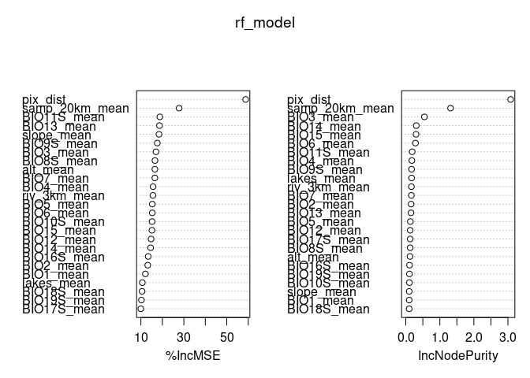<!-- -->

``` r
cat(sprintf("Fold %02d completed.\n", i))
```

    ## Fold 33 completed.

## Chunk 3: RF models for each fold of LOPOCV

**NOTE:** eval = FALSE so that it skips on knit

``` r
# Parallel setup
n_cores <- 8
cl <- makeCluster(n_cores)
registerDoParallel(cl)

# Run LOPOCV with foreach
foreach(
  i = seq_along(sites),
  .packages = c("dplyr", "randomForest")
) %dopar% {

  # Identify current test site
  site <- sites[i]

  # Identify rows where site appears as Var1 or Var2 (test set)
  test_rows <- V.table %>% filter(Var1 == site | Var2 == site)

  # All other rows go into the training set
  train_rows <- V.table %>% filter(!(Var1 == site | Var2 == site))

  # Use precomputed pair IDs to match rows in V.model
  test_idx  <- which(V.table$id %in% test_rows$id)
  train_idx <- which(V.table$id %in% train_rows$id)

  # Subset predictor data to match training/testing rows
  train_df <- V.model[train_idx, ]
  test_df  <- V.model[test_idx, ]

  # Train Random Forest model (fixed ntree and default mtry)
  set.seed(42)
  rf_model <- randomForest(
    CSEdistance ~ .,
    data = train_df,
    ntree = 500,
    importance = TRUE
  )

  # Save Random Forest model for this fold
  saveRDS(rf_model, file.path(output_dir, sprintf("rf_model_%02d.rds", i)))

  NULL
}

stopCluster(cl)
```

## Chunk 4: Calculate metrics

This chunk:  
- Helpers for LOPOCV Evaluative metrics - computes all metrics -
Spearman replaces RSQ - computes pooled R² and other metrics (new
improvement) - Plots and summarizes metrics

Helpers:

``` r
calibrate_pred <- function(obs_train, pred_train, pred_test, return_fit = FALSE) {
  keep <- complete.cases(obs_train, pred_train)
  df <- data.frame(obs = obs_train[keep], pred = pred_train[keep])
  fit <- lm(obs ~ pred, data = df)

  out <- rep(NA_real_, length(pred_test))
  keep_test <- complete.cases(pred_test)
  out[keep_test] <- predict(fit, newdata = data.frame(pred = pred_test[keep_test]))

  if (return_fit) {
    list(
      pred_cal = out,
      fit = fit
    )
  } else {
    out
  }
}

calc_metrics <- function(obs, pred) {
  keep <- complete.cases(obs, pred)

  obs  <- obs[keep]
  pred <- pred[keep]

  mse      <- mean((obs - pred)^2)
  rmse     <- sqrt(mse)
  mae      <- mean(abs(obs - pred))
  pearson  <- cor(obs, pred, method = "pearson")
  spearman <- cor(obs, pred, method = "spearman")

  data.frame(
    n = length(obs),
    MSE = mse,
    RMSE = rmse,
    MAE = mae,
    Pearson = pearson,
    Spearman = spearman
  )
}
```

Run in loop

``` r
# -----------------------------------
# Step 1: generate fold-level predictions from saved .rds models
# -----------------------------------
for (i in seq_along(sites)) {

  site <- sites[i]

  # original
  # fold_eval_file  <- file.path(results_dir, sprintf("lopocv_eval_fold_%02d.csv", i))
  fold_eval_file  <- file.path(results_dir, sprintf("lopocv_eval_fold_%02d_v2.csv", i))

  fold_model_file <- file.path(output_dir, sprintf("rf_model_%02d.rds", i))

  if (!file.exists(fold_model_file)) {
    warning(sprintf("Missing model file: %s", fold_model_file))
    next
  }

  test_rows  <- V.table %>% filter(Var1 == site | Var2 == site)
  train_rows <- V.table %>% filter(!(Var1 == site | Var2 == site))

  test_idx  <- which(V.table$id %in% test_rows$id)
  train_idx <- which(V.table$id %in% train_rows$id)

  train_df <- V.model[train_idx, ]
  test_df  <- V.model[test_idx, ]

  rf_model <- readRDS(fold_model_file)

  train_obs <- train_df$CSEdistance
  test_obs  <- test_df$CSEdistance

  train_df <- train_df %>% dplyr::select(-CSEdistance)
  test_df  <- test_df %>% dplyr::select(-CSEdistance)

  # This code only needed if there are "_mean" remaining in the model predictor variable names
  #names(train_df) <- paste0(names(train_df), "_mean")
  #names(test_df)  <- paste0(names(test_df), "_mean")
  #names(train_df)[names(train_df) == "pix_dist_mean"] <- "pix_dist"
  #names(test_df)[names(test_df) == "pix_dist_mean"] <- "pix_dist"

  stopifnot(identical(names(train_df), attr(rf_model$terms, "term.labels")))
  stopifnot(identical(names(test_df), attr(rf_model$terms, "term.labels")))

  pred_train <- predict(rf_model, newdata = train_df)
  pred_test  <- predict(rf_model, newdata = test_df)

  cal_obj <- calibrate_pred(
    obs_train = train_obs,
    pred_train = pred_train,
    pred_test = pred_test,
    return_fit = TRUE
  )

  pred_test_cal <- cal_obj$pred_cal
  cal_coef <- coef(cal_obj$fit)

  eval_df <- data.frame(
    Var1 = test_rows$Var1,
    Var2 = test_rows$Var2,
    id = test_rows$id,
    CSE = test_obs,
    pred_raw = pred_test,
    pred_cal = pred_test_cal,
    cal_intercept = unname(cal_coef[1]),
    cal_slope = unname(cal_coef[2])
  )

  write.csv(eval_df, fold_eval_file, row.names = FALSE)
}

# -----------------------------------
# Step 2: calculate fold-level metrics
# -----------------------------------
for (i in seq_along(sites)) {

  site <- sites[i]

  # original
  # fold_eval_file    <- file.path(results_dir, sprintf("lopocv_eval_fold_%02d.csv", i))
  fold_eval_file    <- file.path(results_dir, sprintf("lopocv_eval_fold_%02d_v2.csv", i))

  # original
  # fold_metrics_file <- file.path(results_dir, sprintf("metrics_fold_%02d.csv", i))
  fold_metrics_file <- file.path(results_dir, sprintf("metrics_fold_%02d_v2.csv", i))

  fold_model_file   <- file.path(output_dir, sprintf("rf_model_%02d.rds", i))

  if (!file.exists(fold_eval_file)) {
    warning(sprintf("Missing eval file: %s", fold_eval_file))
    next
  }

  if (!file.exists(fold_model_file)) {
    warning(sprintf("Missing model file: %s", fold_model_file))
    next
  }

  df <- read.csv(fold_eval_file)
  rf_model <- readRDS(fold_model_file)

  metrics_k <- calc_metrics(
    obs = df$CSE,
    pred = df$pred_cal
  ) %>%
    mutate(
      site = site,
      cal_intercept = df$cal_intercept[1],
      cal_slope = df$cal_slope[1],
      mean_residual = mean(df$CSE - df$pred_cal, na.rm = TRUE)
    ) %>%
    dplyr::select(site, cal_intercept, cal_slope, mean_residual, everything())

  imp <- as.data.frame(importance(rf_model))
  imp_mse <- setNames(as.list(imp[, "%IncMSE"]), paste0("IncMSE_", rownames(imp)))
  imp_purity <- setNames(as.list(imp[, "IncNodePurity"]), paste0("NodePurity_", rownames(imp)))

  metrics_k <- bind_cols(
    metrics_k,
    as.data.frame(imp_mse),
    as.data.frame(imp_purity)
  )

  write.csv(metrics_k, fold_metrics_file, row.names = FALSE)
}

# -----------------------------------
# Step 3: combine fold metrics
# -----------------------------------
metric_files <- list.files(
  results_dir,
  pattern = "^metrics_fold_[0-9]{2}_v2\\.csv$",
  full.names = TRUE
)

metrics_all <- bind_rows(lapply(metric_files, read.csv)) %>%
  mutate(site = factor(site, levels = sites)) %>%
  arrange(site)

# original
# write.csv(metrics_all, file.path(results_dir, "LOPOCV_summary.csv"), row.names = FALSE)
write.csv(metrics_all, file.path(results_dir, "LOPOCV_summary_v2.csv"), row.names = FALSE)

print(metrics_all)

# -----------------------------------
# Step 4: pooled metrics across all folds
# -----------------------------------
eval_files <- list.files(
  results_dir,
  pattern = "^lopocv_eval_fold_[0-9]{2}_v2\\.csv$",
  full.names = TRUE
)

eval_all <- bind_rows(lapply(eval_files, read.csv))

keep_all <- complete.cases(eval_all$CSE, eval_all$pred_cal)

obs_all  <- eval_all$CSE[keep_all]
pred_all <- eval_all$pred_cal[keep_all]

R2_cv <- 1 - sum((obs_all - pred_all)^2) / sum((obs_all - mean(obs_all))^2)

pooled_summary <- data.frame(
  n = length(obs_all),
  pooled_R2 = R2_cv,
  pooled_Pearson = cor(obs_all, pred_all, method = "pearson"),
  pooled_Spearman = cor(obs_all, pred_all, method = "spearman"),
  pooled_RMSE = sqrt(mean((obs_all - pred_all)^2)),
  pooled_MAE = mean(abs(obs_all - pred_all))
)

# original
# write.csv(pooled_summary, file.path(results_dir, "LOPOCV_pooled_summary.csv"), row.names = FALSE)
write.csv(pooled_summary, file.path(results_dir, "LOPOCV_pooled_summary_v2.csv"), row.names = FALSE)

print(pooled_summary)

# -----------------------------------
# Step 5: summarize calibration slopes and intercepts
# -----------------------------------
calibration_summary <- metrics_all %>%
  summarise(
    slope_mean = mean(cal_slope, na.rm = TRUE),
    slope_sd   = sd(cal_slope, na.rm = TRUE),
    slope_min  = min(cal_slope, na.rm = TRUE),
    slope_max  = max(cal_slope, na.rm = TRUE),
    int_mean   = mean(cal_intercept, na.rm = TRUE),
    int_sd     = sd(cal_intercept, na.rm = TRUE),
    int_min    = min(cal_intercept, na.rm = TRUE),
    int_max    = max(cal_intercept, na.rm = TRUE)
  )

write.csv(
  calibration_summary,
  file.path(results_dir, "LOPOCV_calibration_summary_v2.csv"),
  row.names = FALSE
)

print(calibration_summary)
```

## Chunk 5: Visualize Pooled and Fold-level Metrics (Spearman instead of RSQ)

``` r
pooled_summary <- read.csv(file.path(results_dir, "LOPOCV_pooled_summary.csv"))
print(pooled_summary)
```

    ##      n pooled_R2 pooled_Pearson pooled_Spearman pooled_RMSE pooled_MAE
    ## 1 2182 0.8041449      0.8968776       0.8903838  0.03985341 0.03062131

``` r
calibration_summary <- read.csv(file.path(results_dir, "LOPOCV_calibration_summary_v2.csv"))
print(calibration_summary)
```

    ##   slope_mean    slope_sd slope_min slope_max    int_mean      int_sd
    ## 1   1.060963 0.001597395  1.056195  1.063753 -0.02438989 0.000622406
    ##       int_min     int_max
    ## 1 -0.02534978 -0.02249327

``` r
metrics_all <- read.csv(file.path(results_dir, "LOPOCV_summary.csv"))
max(metrics_all$Spearman)
```

    ## [1] 0.9629032

``` r
min(metrics_all$Spearman)
```

    ## [1] 0.4725806

``` r
altitude <- raster::raster(file.path(
  "/uufs/chpc.utah.edu/common/home/saarman-group1/uganda-tsetse-LG/data/processed",
  "altitude_1KMmedian_MERIT_UgandaClip.tif"
))
crs(altitude) <- 4326

indinfo <- read.delim("../input/Gff_11loci_allsites_indinfo.txt")
site_clusters <- indinfo %>%
  dplyr::select(Site = SiteCode, Subcluster = SiteMajCluster) %>%
  distinct()

site_metadata <- V.table %>%
  dplyr::select(Site = Var1, Latitude = lat1, Longitude = long1) %>%
  distinct() %>%
  left_join(site_clusters, by = "Site") %>%
  left_join(metrics_all, by = c("Site" = "site")) %>%
  mutate(Symbol = ifelse(Spearman < 0.3, "low", "circle")) %>%
  arrange(desc(Spearman))

r_ext <- extent(altitude)
xlim <- c(r_ext@xmin, r_ext@xmax)
ylim <- c(r_ext@ymin, r_ext@ymax)

uganda <- ne_countries(scale = "medium", continent = "Africa", returnclass = "sf") %>% st_transform(4326)
lakes <- ne_download(scale = 10, type = "lakes", category = "physical", returnclass = "sf") %>% st_transform(4326)
```

    ## Reading 'ne_10m_lakes.zip' from naturalearth...

``` r
ggplot() +
  geom_sf(data = uganda, fill = NA, color = "black", linewidth = 0.1) +
  geom_sf(data = lakes, fill = "black", color = NA) +
  geom_point(
    data = filter(site_metadata, Symbol == "circle"),
    aes(x = Longitude, y = Latitude, size = Spearman, fill = Subcluster),
    shape = 21, color = "black", stroke = 0.3
  ) +
  geom_point(
    data = filter(site_metadata, Symbol == "low"),
    aes(x = Longitude, y = Latitude, fill = Subcluster),
    shape = 21, color = "black", stroke = 0.3, size = 1
  ) +
  scale_fill_manual(
    name = "Subcluster",
    values = c("north" = "#1f78b4", "south" = "#e66101", "west" = "#39005A")
  ) +
  scale_size_continuous(
  name = "LOPOCV \nSpearman's r",
  limits = c(0.4, 1.0),
  breaks = c(0.4, 0.7, 1.0),
  range = c(2,7)
) +
  coord_sf(xlim = xlim, ylim = ylim, expand = FALSE) +
  theme_minimal() +
  theme(panel.grid = element_blank()) +
  labs(title = "LOPOCV Spearman's r by Sampling Site", x = "Longitude", y = "Latitude")
```

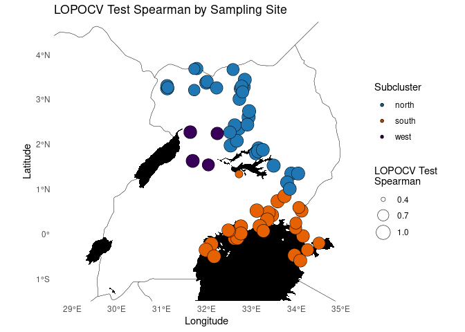<!-- -->

``` r
ggplot(site_metadata, aes(x = Spearman, fill = Subcluster)) +
  geom_density(alpha = 0.5, color = NA) +
  scale_fill_manual(values = c("north" = "#1f78b4", "south" = "#e66101", "west" = "#39005A")) +
  theme_minimal() +
  labs(
    title = "Distribution of Spearman's r by Subcluster",
    x = "Spearman's r (LOPOCV)",
    y = "Density"
  )
```

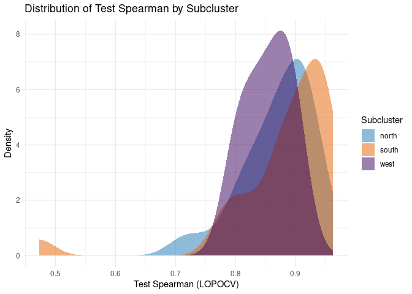<!-- -->

``` r
ggplot(site_metadata, aes(x = Spearman, fill = Subcluster)) +
  geom_density(alpha = 0.5, color = NA, position = "identity", aes(y = after_stat(count))) +
  scale_fill_manual(values = c("north" = "#1f78b4", "south" = "#e66101", "west" = "#39005A")) +
  theme_minimal() +
  labs(
    title = "Spearman's r by Subcluster (Scaled by Count)",
    x = "Spearman's r (LOPOCV)",
    y = "Count"
  )
```

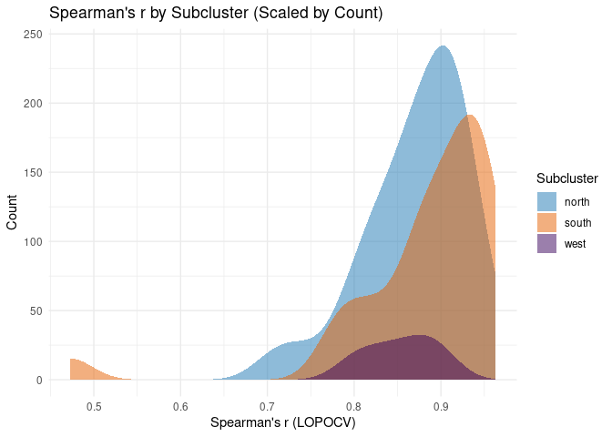<!-- -->

``` r
site_metadata$Cluster <- site_metadata$Subcluster
site_metadata$Cluster[site_metadata$Subcluster == "west"] <- "south"

p_lopocv_map <- ggplot() +
  geom_sf(data = uganda, fill = NA, color = "black", linewidth = 0.1) +
  geom_sf(data = lakes, fill = "black", color = NA) +
  geom_point(
    data = filter(site_metadata, Symbol == "circle"),
    aes(x = Longitude, y = Latitude, size = Spearman, fill = Cluster),
    shape = 21, color = "black", stroke = 0.3, alpha = 0.4
  ) +
  geom_point(
    data = filter(site_metadata, Symbol == "low"),
    aes(x = Longitude, y = Latitude, fill = Cluster),
    shape = 21, color = "black", size = 1, stroke = 0.3, alpha = 0.3
  ) +
  scale_fill_manual(
    name = "Genetic Cluster",
    values = c("north" = "#1f78b4", "south" = "#e66101"),
    labels = c("north" = "North", "south" = "South")
  ) +
  scale_size_continuous(
    name = "LOPOCV \nSpearman's r",
    limits = c(0.4, 1.0),
    breaks = c(0.4, 0.7, 1.0),
    range = c(2, 7)
  ) +
  guides(
    fill = guide_legend(
      override.aes = list(size = 5, alpha = 0.7)
    )
  ) +
  coord_sf(xlim = xlim, ylim = ylim, expand = FALSE) +
  theme_minimal() +
    theme(
    panel.grid = element_blank(),
    panel.background = element_rect(fill = "white", color = NA),
    plot.background = element_rect(fill = "white", color = NA),
    legend.background = element_rect(fill = "white", color = NA),
    legend.key = element_rect(fill = "white", color = NA)
  ) +
  theme(panel.grid = element_blank()) +
  labs(title = "LOPOCV Spearman's r by Site", x = "Longitude", y = "Latitude")

p_lopocv_map
```

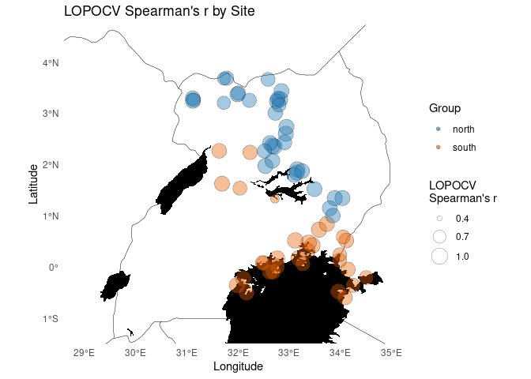<!-- -->

``` r
fig_dir <- "/uufs/chpc.utah.edu/common/home/saarman-group1/uganda-tsetse-LG/results//figures_pub"

ggsave(
  filename = file.path(fig_dir, "Fig_LOPOCV_fullRF_Spearman_map.png"),
  plot = p_lopocv_map,
  width = 5,
  height = 6,
  units = "in",
  dpi = 600,
  bg = "white"
)

ggplot(site_metadata, aes(x = Spearman, fill = Cluster)) +
  geom_density(alpha = 0.5, color = NA) +
  scale_fill_manual(values = c("north" = "#1f78b4", "south" = "#e66101")) +
  theme_minimal() +
  labs(
    title = "Distribution of Spearman's r by Cluster",
    x = "Spearman's r (LOPOCV)",
    y = "Density"
  )
```

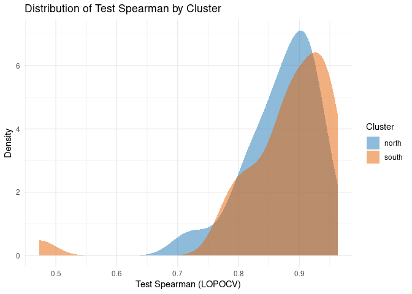<!-- -->

``` r
ggplot(site_metadata, aes(x = Spearman, fill = Cluster)) +
  geom_density(alpha = 0.5, color = NA, position = "identity", aes(y = after_stat(count))) +
  scale_fill_manual(values = c("north" = "#1f78b4", "south" = "#e66101")) +
  theme_minimal() +
  labs(
    title = "Spearman's r by Cluster (Scaled by Count)",
    x = "Spearman's r (LOPOCV)",
    y = "Count"
  )
```

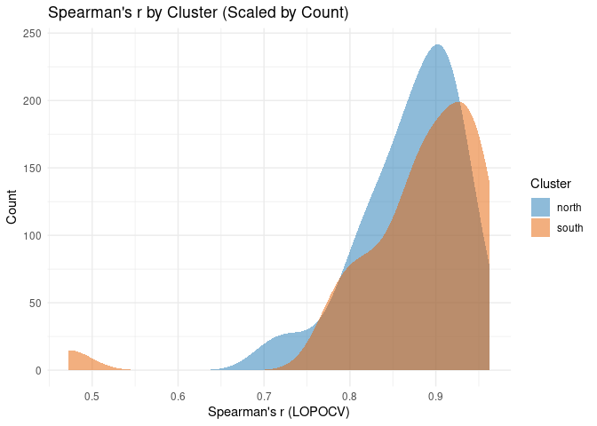<!-- -->

``` r
# write.csv(site_metadata, file.path(results_dir, "site_metadata.csv"), row.names = FALSE)
```

## Chunk 6: Plot Full Model: Predicted vs Observed

``` r
# Load full RF model trained on V.model (non-spatial)
rf_model_raw <- readRDS(file.path(results_dir, "rf_mean_full_tuned.rds"))
rownames(rf_model_raw$importance) # predictor variables used in final model
```

    ##  [1] "BIO1"      "BIO2"      "BIO3"      "BIO4"      "BIO5"      "BIO6"     
    ##  [7] "BIO7"      "BIO8S"     "BIO9S"     "BIO10S"    "BIO11S"    "BIO12"    
    ## [13] "BIO13"     "BIO14"     "BIO15"     "BIO16S"    "BIO17S"    "BIO18S"   
    ## [19] "BIO19S"    "slope"     "alt"       "lakes"     "riv_3km"   "samp_20km"
    ## [25] "pix_dist"

``` r
# Filter to modeling-relevant columns only
predictor_vars <- c("BIO1_mean","BIO2_mean","BIO3_mean","BIO4_mean", "BIO5_mean","BIO6_mean","BIO7_mean", "BIO8S_mean", "BIO9S_mean","BIO10S_mean", "BIO11S_mean","BIO12_mean", "BIO13_mean","BIO14_mean","BIO15_mean","BIO16S_mean","BIO17S_mean", "BIO18S_mean","BIO19S_mean","slope_mean","alt_mean", "lakes_mean","riv_3km_mean", "samp_20km_mean","pix_dist")

V.model <- V.table[, c("CSEdistance", predictor_vars)]

# Rename predictors by removing "_mean" for later projections
names(V.model) <- gsub("_mean$", "", names(V.model))

# Predict on full data
pred_all <- predict(rf_model_raw, newdata = V.model[,-1])
obs_all <- V.model[,1]
# Plot predicted vs observed
ggplot(data.frame(obs = obs_all, pred = pred_all), aes(x = obs, y = pred)) +
  geom_point(alpha = 0.6) +
  geom_abline(slope = 1, intercept = 0, linetype = "dashed") +
  coord_equal() +
  xlim(0, 1) +
  ylim(0, 1) +
  theme_minimal() +
  labs(x = "Observed CSE", y = "(No Model Projection) \n Predicted CSE")
```

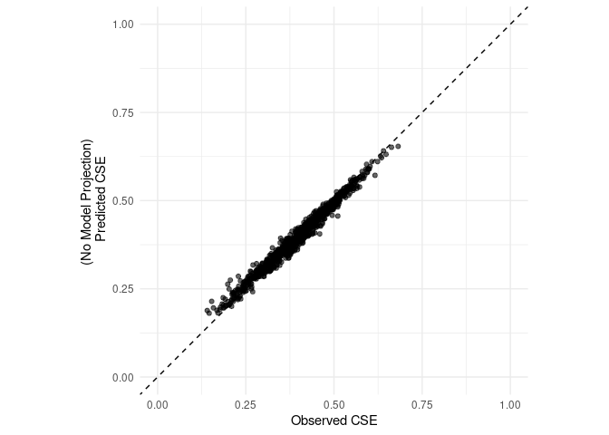<!-- -->

## Chunk 7: Variable importance with pca-pruned env. variable importance

### %IncMSE

``` r
# Load full model
full_model <- readRDS(file.path(results_dir, "rf_mean_full_tuned.rds"))

print(full_model)
```

    ## 
    ## Call:
    ##  randomForest(x = x, y = y, mtry = res[which.min(res[, 2]), 1],      importance = TRUE) 
    ##                Type of random forest: regression
    ##                      Number of trees: 500
    ## No. of variables tried at each split: 12
    ## 
    ##           Mean of squared residuals: 0.001159808
    ##                     % Var explained: 85.7

``` r
importance(full_model)
```

    ##             %IncMSE IncNodePurity
    ## BIO1      15.402725    0.08260644
    ## BIO2      13.973900    0.13417148
    ## BIO3      20.081142    0.49594070
    ## BIO4      19.971111    0.14142361
    ## BIO5      14.729129    0.09686819
    ## BIO6      18.780347    0.28761449
    ## BIO7      21.588124    0.12205648
    ## BIO8S     17.780629    0.11071230
    ## BIO9S     16.876518    0.16430456
    ## BIO10S    18.009074    0.08892864
    ## BIO11S    19.622665    0.18474855
    ## BIO12     14.317559    0.08642528
    ## BIO13     19.728394    0.16883174
    ## BIO14     14.588808    0.26422377
    ## BIO15     16.386966    0.18748348
    ## BIO16S    16.439604    0.08259274
    ## BIO17S    11.566631    0.11029099
    ## BIO18S     7.346078    0.07294360
    ## BIO19S    10.219341    0.09772391
    ## slope     16.515957    0.10049135
    ## alt       17.359818    0.10772336
    ## lakes      9.130651    0.10792335
    ## riv_3km   17.252330    0.12710960
    ## samp_20km 23.662285    1.28875961
    ## pix_dist  87.248679    4.07276605

``` r
varImpPlot(full_model)
```

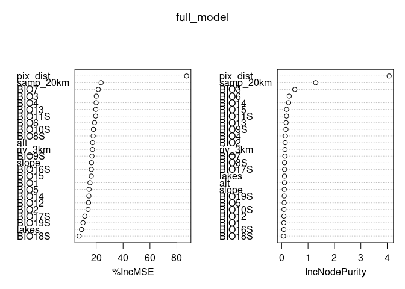<!-- -->

``` r
full_imp <- importance(full_model, type = 1) %>%
  as.data.frame() %>%
  rownames_to_column("variable") %>%
  rename(IncMSE = `%IncMSE`) %>%
  mutate(model = "full")

# Load LOPOCV models
lopocv_imp <- map_df(1:67, function(fold_idx) {
  rf_model <- readRDS(sprintf("%s/lopocv/rf_model_%02d.rds", results_dir, fold_idx))
  imp <- importance(rf_model, type = 1)
  data.frame(
    variable = rownames(imp),
    IncMSE = imp[,1],
    model = paste0("fold_", fold_idx)
  )
}) %>%
  mutate(variable = str_replace(variable, "_mean$", ""))


# Load PCA-pruned model
pruned_model <- readRDS(file.path(results_dir, "rf_mean_pcapruned_tuned.rds"))

print(pruned_model)
```

    ## 
    ## Call:
    ##  randomForest(x = x, y = y, mtry = res[which.min(res[, 2]), 1],      importance = TRUE) 
    ##                Type of random forest: regression
    ##                      Number of trees: 500
    ## No. of variables tried at each split: 6
    ## 
    ##           Mean of squared residuals: 0.001177704
    ##                     % Var explained: 85.48

``` r
importance(pruned_model)
```

    ##            %IncMSE IncNodePurity
    ## BIO3      31.09694     0.6633338
    ## BIO4      29.00780     0.3260843
    ## BIO7      36.76577     0.3491370
    ## BIO11S    30.06047     0.4480731
    ## BIO13     30.33539     0.3133014
    ## slope     21.14116     0.1822154
    ## alt       28.60231     0.3312492
    ## lakes     12.25125     0.1550735
    ## riv_3km   20.83758     0.2063074
    ## samp_20km 30.48908     1.6003861
    ## pix_dist  99.75679     4.1926504

``` r
varImpPlot(pruned_model)
```

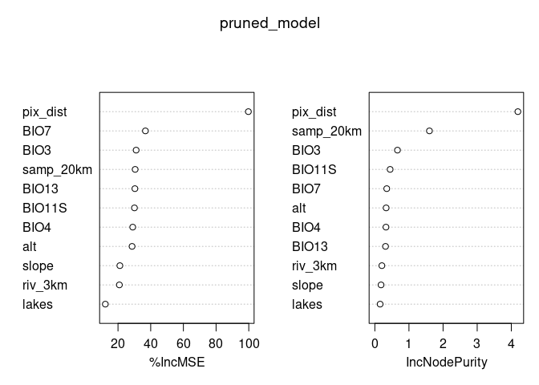<!-- -->

``` r
pruned_imp <- importance(pruned_model, type = 1) %>%
  as.data.frame() %>%
  rownames_to_column("variable") %>%
  rename(IncMSE = `%IncMSE`) %>%
  mutate(
    variable = str_replace(variable, "_mean$", ""),
    model = "pruned"
  )

# Combine
all_imp <- bind_rows(full_imp, lopocv_imp, pruned_imp)

# Define custom labels
label_map <- c(
  BIO1   = "Annual Mean Temperature (BIO1)",
  BIO2   = "Mean Diurnal Temp Range (BIO2)",
  BIO3   = "Isothermality (BIO3)",
  BIO4   = "Temperature Seasonality (BIO4)",
  BIO5   = "Max Temp of Warmest Month (BIO5)",
  BIO6   = "Min Temp of Coldest Month (BIO6)",
  BIO7   = "Temperature Annual Range (BIO7)",
  BIO8S  = "Mean Temp of Wettest Season (BIO8S)",
  BIO9S  = "Mean Temp of Driest Season (BIO9S)",
  BIO10S = "Mean Temp of Warmest Season (BIO10S)",
  BIO11S = "Mean Temp of Coldest Season (BIO11S)",
  BIO12  = "Annual Precipitation (BIO12)",
  BIO13  = "Precipitation of Wettest Month (BIO13)",
  BIO14  = "Precipitation of Driest Month (BIO14)",
  BIO15  = "Precipitation Seasonality (BIO15)",
  BIO16S = "Precipitation of Wettest Season (BIO16S)",
  BIO17S = "Precipitation of Driest Season (BIO17S)",
  BIO18S = "Precipitation of Warmest Season (BIO18S)",
  BIO19S = "Precipitation of Coldest Season (BIO19S)",
  slope  = "Slope",
  alt    = "Altitude",
  lakes  = "Lake Presence/Absence",
  riv_3km= "River Kernel Density (3 km bandwidth)",
  samp_20km = "Sampling Density (20 km bandwidth)",
  pix_dist    = "Geographic Distance"
)

# Define abreviated custom labels (NOT USED IN CURRENT SCRIPT)
label_map_abrev <- c(
  BIO1   = "BIO1",
  BIO2   = "BIO2",
  BIO3   = "BIO3",
  BIO4   = "BIO4",
  BIO5   = "BIO5",
  BIO6   = "BIO6",
  BIO7   = "BIO7",
  BIO8S  = "BIO8S",
  BIO9S  = "BIO9S",
  BIO10S = "BIO10S",
  BIO11S = "BIO11S",
  BIO12  = "BIO12",
  BIO13  = "BIO13",
  BIO14  = "BIO14",
  BIO15  = "BIO15",
  BIO16S = "BIO16S",
  BIO17S = "BIO17S",
  BIO18S = "BIO18S",
  BIO19S = "BIO19S",
  slope  = "Slope",
  alt    = "Altitude",
  lakes  = "Lakes",
  riv_3km= "Rivers",
  samp_20km = "Sampling",
  pix_dist    = "Geo. Dist."
)
# Order by full model's %IncMSE (top to bottom)
full_order <- all_imp %>%
  filter(model == "full") %>%
  arrange(desc(IncMSE)) %>%
  pull(variable)

all_imp$variable <- factor(all_imp$variable, levels = rev(full_order))

# Plot
#pdf("../figures/VarImpPlot.pdf",width =6, height=6)
ggplot(all_imp, aes(x = variable, y = IncMSE)) +
  geom_point(data = filter(all_imp, model != "full" & model != "pruned"),
             aes(group = model),
             color = "grey70", alpha = 0.4, size = 2) +
  geom_point(data = filter(all_imp, model == "full"),
             color = "black", size = 3) +
  geom_point(data = filter(all_imp, model == "pruned"),
             shape = 17, size = 3.5, color = "grey70") +
  coord_flip() +
  scale_y_continuous(name = "%IncMSE") +
  scale_x_discrete(labels = label_map) +
  labs(x = NULL,
       title = "Variable Importance",
       subtitle = "Triangles show model with PCA-pruned env. vars. only") +
  theme_minimal()
```

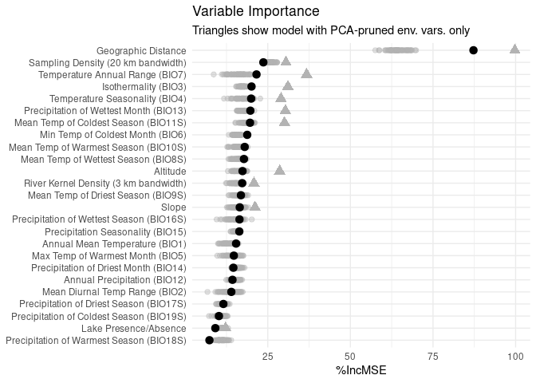<!-- -->

``` r
#dev.off()

ggplot(all_imp, aes(x = variable, y = IncMSE)) +
  geom_point(data = filter(all_imp, model != "full" & model != "pruned"),
             aes(group = model),
             color = "grey70", alpha = 0.4, size = 2) +
  geom_point(data = filter(all_imp, model == "full"),
             color = "black", size = 3) +
  geom_point(data = filter(all_imp, model == "pruned"),
             shape = 17, size = 3.5, color = "grey70") +
  coord_flip() +
  scale_y_continuous(name = "%IncMSE") +
  scale_x_discrete(labels = label_map_abrev) +
  labs(x = NULL,
       title = "Variable Importance") +
  theme_minimal()
```

<!-- -->

### NodePurity

``` r
# Load full model
full_model <- readRDS(file.path(results_dir, "rf_mean_full_tuned.rds"))
full_imp <- importance(full_model, type = 2) %>%
  as.data.frame() %>%
  rownames_to_column("variable") %>%
  rename(NodePurity = IncNodePurity) %>%
  mutate(model = "full")

# Load LOPOCV models
lopocv_imp <- map_df(1:67, function(fold_idx) {
  rf_model <- readRDS(sprintf("%s/lopocv/rf_model_%02d.rds", results_dir, fold_idx))
  imp <- importance(rf_model, type = 2)
  data.frame(
    variable = rownames(imp),
    NodePurity = imp[,1],
    model = paste0("fold_", fold_idx)
  )
}) %>%
  mutate(variable = str_replace(variable, "_mean$", ""))


# Load PCA-pruned model
pruned_model <- readRDS(file.path(results_dir, "rf_mean_pcapruned_tuned.rds"))
pruned_imp <- importance(pruned_model, type = 2) %>%
  as.data.frame() %>%
  rownames_to_column("variable") %>%
  rename(NodePurity = IncNodePurity) %>%
  mutate(
    variable = str_replace(variable, "_mean$", ""),
    model = "pruned"
  )

# Combine
all_imp <- bind_rows(full_imp, lopocv_imp, pruned_imp)

# Define custom labels
label_map <- c(
  BIO1   = "Annual Mean Temperature (BIO1)",
  BIO2   = "Mean Diurnal Temp Range (BIO2)",
  BIO3   = "Isothermality (BIO3)",
  BIO4   = "Temperature Seasonality (BIO4)",
  BIO5   = "Max Temp of Warmest Month (BIO5)",
  BIO6   = "Min Temp of Coldest Month (BIO6)",
  BIO7   = "Temperature Annual Range (BIO7)",
  BIO8S  = "Mean Temp of Wettest Season (BIO8S)",
  BIO9S  = "Mean Temp of Driest Season (BIO9S)",
  BIO10S = "Mean Temp of Warmest Season (BIO10S)",
  BIO11S = "Mean Temp of Coldest Season (BIO11S)",
  BIO12  = "Annual Precipitation (BIO12)",
  BIO13  = "Precipitation of Wettest Month (BIO13)",
  BIO14  = "Precipitation of Driest Month (BIO14)",
  BIO15  = "Precipitation Seasonality (BIO15)",
  BIO16S = "Precipitation of Wettest Season (BIO16S)",
  BIO17S = "Precipitation of Driest Season (BIO17S)",
  BIO18S = "Precipitation of Warmest Season (BIO18S)",
  BIO19S = "Precipitation of Coldest Season (BIO19S)",
  slope  = "Slope",
  alt    = "Altitude",
  lakes  = "Lake Presence/Absence",
  riv_3km= "River Kernel Density (3 km bandwidth)",
  samp_20km = "Sampling Density (20 km bandwidth)",
  pix_dist    = "Geographic Distance"
)

# Order by full model's node purity (top to bottom)
full_order <- all_imp %>%
  filter(model == "full") %>%
  arrange(desc(NodePurity)) %>%
  pull(variable)

all_imp$variable <- factor(all_imp$variable, levels = rev(full_order))

# Plot
ggplot(all_imp, aes(x = variable, y = NodePurity)) +
  geom_point(data = filter(all_imp, model != "full" & model != "pruned"),
             aes(group = model),
             color = "grey70", alpha = 0.4, size = 2) +
  geom_point(data = filter(all_imp, model == "full"),
             color = "black", size = 3) +
  geom_point(data = filter(all_imp, model == "pruned"),
             shape = 17, size = 3.5, color = "grey70") +
  coord_flip() +
  scale_y_continuous(name = "Node Purity") +
  scale_x_discrete(labels = label_map) +
  labs(x = NULL,
       title = "Variable Importance",
       subtitle = "Triangles show model with PCA-pruned env. vars. only") +
  theme_minimal()
```

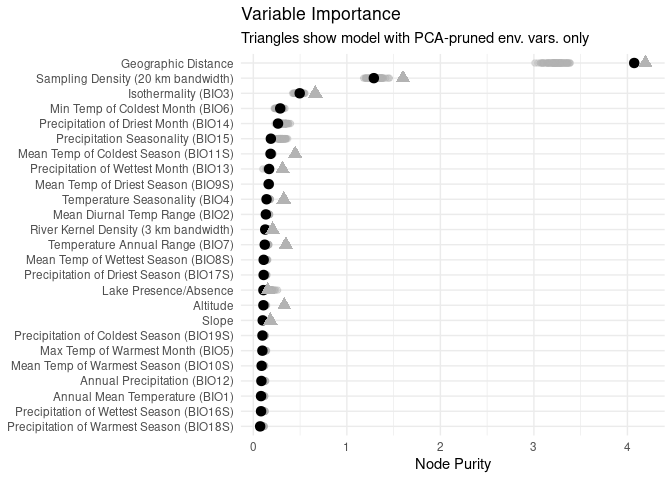<!-- -->

# Spatial LOPOCV:

## Chunk 8: Spatial eval. on existing LOPOCV

Here, we keep internal LOPOCV as already completed reuse saved
results/lopocv/rf_model_01.rds to rf_model_67.rds but change spatial
evaluation to:  
- LCP_sum - lakes high cost (maximum predicted CSE for the model) -
calibration on training pairs only - kdist = 1km , this was the best
choice for the full model

What this chunk does: - loads saved `rf_model_XX.rds` from
`results/lopocv` - projects a resistance surface with `pix_dist = 1` -
forces lakes to high cost - recomputes LCPs - summarizes `LCP_sum` -
calibrates on training pairs only - evaluates on the held-out site pairs
only - saves per-fold outputs

Helpers

``` r
calibrate_pred <- function(obs_train, pred_train, pred_test, return_fit = FALSE) {
  keep <- complete.cases(obs_train, pred_train)
  df <- data.frame(obs = obs_train[keep], pred = pred_train[keep])
  fit <- lm(obs ~ pred, data = df)

  out <- rep(NA_real_, length(pred_test))
  keep_test <- complete.cases(pred_test)
  out[keep_test] <- predict(fit, newdata = data.frame(pred = pred_test[keep_test]))

  if (return_fit) {
    list(
      pred_cal = out,
      fit = fit
    )
  } else {
    out
  }
}

calc_metrics <- function(obs, pred) {
  keep <- complete.cases(obs, pred)

  obs  <- obs[keep]
  pred <- pred[keep]

  mse      <- mean((obs - pred)^2)
  rmse     <- sqrt(mse)
  mae      <- mean(abs(obs - pred))
  pearson  <- cor(obs, pred, method = "pearson")
  spearman <- cor(obs, pred, method = "spearman")

  data.frame(
    n = length(obs),
    MSE = mse,
    RMSE = rmse,
    MAE = mae,
    Pearson = pearson,
    Spearman = spearman
  )
}
```

Least-cost-paths: This recomputes paths from the projected resistance
surface each fold.

``` r
# Load environmental raster stack
env <- stack(file.path(data_dir, "processed", "env_stack.grd"))
names(env) <- c(
  "BIO1_mean", "BIO2_mean", "BIO3_mean", "BIO4_mean", "BIO5_mean", "BIO6_mean",
  "BIO7_mean", "BIO8S_mean", "BIO9S_mean", "BIO10S_mean", "BIO11S_mean",
  "BIO12_mean", "BIO13_mean", "BIO14_mean", "BIO15_mean", "BIO16S_mean",
  "BIO17S_mean", "BIO18S_mean", "BIO19S_mean", "alt_mean", "slope_mean",
  "riv_3km_mean", "samp_20km_mean", "lakes_mean", "pix_dist"
)
crs(env) <- crs_geo

# Build lake mask from lakes layer
lake_mask <- raster(env[["lakes_mean"]])
lake_mask[lake_mask > 0] <- 1

# Load pair table
V.table_full <- read.csv(file.path(input_dir, "Gff_cse_envCostPaths.csv"))

V.table <- V.table_full %>%
  filter(Var1 != "50-KB", Var2 != "50-KB") %>%
  mutate(id = paste(Var1, Var2, sep = "_"))

# Pair table used in spatial evaluation
site_pairs <- V.table %>%
  dplyr::select(id, Var1, Var2, CSE = CSEdistance) %>%
  distinct()

# FORCE same ordering as LOPOCV models
sites <- sort(unique(c(lcp_sf$Var1, lcp_sf$Var2)))

# Site coordinates
sites_coords_1 <- V.table %>%
  dplyr::select(Site = Var1, lon = long1, lat = lat1) %>%
  distinct()

sites_coords_2 <- V.table %>%
  dplyr::select(Site = Var2, lon = long2, lat = lat2) %>%
  distinct()

sites_coords <- bind_rows(sites_coords_1, sites_coords_2) %>%
  distinct(Site, .keep_all = TRUE) %>%
  arrange(Site)

#check and stop if sites not represented in order
stopifnot(all(sites %in% sites_coords$Site))

# fixed projection distance
kdist <- 1
```

Run in loop for sum of predicted CSE along LCP, and calibration

``` r
# Parallel setup
n_cores <- 8
cl <- makeCluster(n_cores)
registerDoParallel(cl)

for (fold_idx in seq_along(sites)) {

  site <- sites[fold_idx]

  # existing saved LOPOCV model
  fold_model_file <- file.path(output_dir, sprintf("rf_model_%02d.rds", fold_idx))

  # new spatial outputs: write v2 so original files remain untouched
  fold_eval_file <- file.path(
    spatial_output_dir,
    sprintf("spatial_eval_fold_%02d_v2.csv", fold_idx)
  )

  if (!file.exists(fold_model_file)) {
    warning(sprintf("Missing saved LOPOCV model: %s", fold_model_file))
    next
  }

  # skip completed folds
  if (file.exists(fold_eval_file)) {
    next
  }

  rf_model <- readRDS(fold_model_file)

  # -----------------------------------
  # Step 1: project surface at kdist = 1
  # -----------------------------------
  env_k <- env
  env_k[["pix_dist"]] <- setValues(env[[1]], kdist)

  # force raster names to match the saved RF model exactly
  rf_vars <- attr(rf_model$terms, "term.labels")
  names(env_k) <- rf_vars

  # sanity check
  stopifnot(identical(names(env_k), rf_vars))

  cse_surface <- predict(env_k, rf_model, type = "response")

  # align lake mask if needed
  if (!compareRaster(cse_surface, lake_mask,
                     extent = TRUE, rowcol = TRUE,
                     crs = TRUE, res = TRUE,
                     stopiffalse = FALSE)) {
    lake_mask_use <- projectRaster(lake_mask, cse_surface, method = "ngb")
  } else {
    lake_mask_use <- lake_mask
  }

  # assign lakes high cost
  cse_surface[lake_mask_use[] == 1] <- max(values(cse_surface), na.rm = TRUE)

  # -----------------------------------
  # Step 2: prepare sites in raster CRS
  # -----------------------------------
  sites_df <- st_as_sf(sites_coords, coords = c("lon", "lat"), crs = crs_geo) %>%
    st_transform(crs(cse_surface))

  sites_sp <- as(sites_df, "Spatial")
  site_index <- setNames(seq_len(nrow(sites_df)), sites_coords$Site)

  # -----------------------------------
  # Step 3: build transition object
  # -----------------------------------
  resistance_rast <- cse_surface
  min_pos <- min(values(resistance_rast)[values(resistance_rast) > 0], na.rm = TRUE)
  resistance_rast[resistance_rast <= 0] <- min_pos

  conductance_rast <- 1 / resistance_rast
  tr <- transition(conductance_rast, transitionFunction = mean, directions = 16)
  tr_lcp <- geoCorrection(tr, type = "c")

  # -----------------------------------
  # Step 4: recompute least-cost paths
  # -----------------------------------
  paths_list <- foreach(
    ii = seq_len(nrow(site_pairs)),
    .packages = c("gdistance", "sp", "sf")
  ) %dopar% {
    i <- site_index[site_pairs$Var1[ii]]
    j <- site_index[site_pairs$Var2[ii]]

    path <- tryCatch({
      shortestPath(tr_lcp, sites_sp[i, ], sites_sp[j, ], output = "SpatialLines")
    }, error = function(e) NULL)

    if (!is.null(path)) {
      path_sf <- st_as_sf(path)
      path_sf$id <- site_pairs$id[ii]
      path_sf
    } else {
      NULL
    }
  }

  paths_list <- paths_list[!sapply(paths_list, is.null)]

  if (length(paths_list) == 0) {
    warning(sprintf("No paths recovered for fold %02d", fold_idx))
    next
  }

  paths_sf <- do.call(rbind, paths_list)
  st_crs(paths_sf) <- st_crs(cse_surface)

  # extract raster values along each path
  path_vals <- raster::extract(cse_surface, as(paths_sf, "Spatial"))

  lcp_summary <- data.frame(
    id = paths_sf$id,
    LCP_sum = sapply(path_vals, function(x) {
      if (is.null(x) || all(is.na(x))) NA_real_ else sum(x, na.rm = TRUE)
    })
  )

  # -----------------------------------
  # Step 5: combine and calibrate
  # -----------------------------------
  eval_results <- site_pairs %>%
    left_join(lcp_summary, by = "id")

  test_ids <- eval_results$id[eval_results$Var1 == site | eval_results$Var2 == site]
  train_df <- eval_results[!eval_results$id %in% test_ids, ]
  test_df  <- eval_results[eval_results$id %in% test_ids, ]

  cal_obj <- calibrate_pred(
    obs_train = train_df$CSE,
    pred_train = train_df$LCP_sum,
    pred_test = test_df$LCP_sum,
    return_fit = TRUE
  )

  test_df$LCP_sum_cal <- cal_obj$pred_cal
  cal_coef <- coef(cal_obj$fit)

  test_df$cal_intercept <- unname(cal_coef[1])
  test_df$cal_slope <- unname(cal_coef[2])

  # save outputs
  write.csv(test_df, fold_eval_file, row.names = FALSE)
}

# stop cluster
stopCluster(cl)
```

## Chunk 9: Evaluative metrics

After you run the chunk above once, this is the chunk you use for
downstream plots. It loads the predictions, estimates evaluative
metrics, and combines all fold metrics, then saves it to file in the
results_dir.

Calculate metrics: Why Spearman instead of RSQ?

Fold-specific RSQ values were unstable because several held-out sites
exhibited limited variance in observed CSE, making the denominator of
RSQ (total sum of squares) small and sensitive to minor prediction
error. In contrast, Spearman’s rank correlation provides a
scale-independent measure of association and more robustly captures
whether the model preserves relative differences among site pairs under
these conditions. This is particularly relevant for resistance-based
distance models, where relative ordering of pairwise connectivity is
often more important than absolute prediction accuracy.

``` r
## Chunk 9: Evaluative metrics

kdist = 1
for (fold_idx in seq_along(sites)) {

  site <- sites[fold_idx]

  # use new v2 spatial eval files written by Chunk 8c
  fold_eval_file <- file.path(
    spatial_output_dir,
    sprintf("spatial_eval_fold_%02d_v2.csv", fold_idx)
  )

  # original
  # fold_metrics_file <- file.path(
  #   spatial_output_dir,
  #   sprintf("spatial_metrics_fold_%02d.csv", fold_idx)
  # )

  fold_metrics_file <- file.path(
    spatial_output_dir,
    sprintf("spatial_metrics_fold_%02d_v2.csv", fold_idx)
  )

  if (!file.exists(fold_eval_file)) {
    warning(sprintf("Missing fold evaluation file: %s", fold_eval_file))
    next
  }

  test_df <- read.csv(fold_eval_file)

  metrics_k <- calc_metrics(
    obs = test_df$CSE,
    pred = test_df$LCP_sum_cal
  ) %>%
    mutate(
      site = site,
      projection_km = kdist,
      method = "LCP_sum",
      mean_residual = mean(test_df$CSE - test_df$LCP_sum_cal, na.rm = TRUE),
      cal_intercept = test_df$cal_intercept[1],
      cal_slope = test_df$cal_slope[1]
    ) %>%
    dplyr::select(
      site, projection_km, method,
      cal_intercept, cal_slope, mean_residual,
      everything()
    )

  write.csv(metrics_k, fold_metrics_file, row.names = FALSE)
}

# combine all fold metrics
metric_files <- list.files(
  spatial_output_dir,
  pattern = "^spatial_metrics_fold_[0-9]{2}_v2\\.csv$",
  full.names = TRUE
)

metrics_all_spatial <- bind_rows(lapply(metric_files, read.csv)) %>%
  mutate(site = factor(site, levels = sites)) %>%
  arrange(site)

# original
# write.csv(
#   metrics_all_spatial,
#   file.path(results_dir, "spatial_LOPOCV_LCPsum_k1_summary.csv"),
#   row.names = FALSE
# )

write.csv(
  metrics_all_spatial,
  file.path(results_dir, "spatial_LOPOCV_LCPsum_k1_summary_v2.csv"),
  row.names = FALSE
)

print(metrics_all_spatial)

# pooled out-of-fold predictive R2 across all folds
eval_files <- list.files(
  spatial_output_dir,
  pattern = "^spatial_eval_fold_[0-9]{2}_v2\\.csv$",
  full.names = TRUE
)

eval_all_spatial <- bind_rows(lapply(eval_files, read.csv))

keep_all <- complete.cases(eval_all_spatial$CSE, eval_all_spatial$LCP_sum_cal)

obs_all  <- eval_all_spatial$CSE[keep_all]
pred_all <- eval_all_spatial$LCP_sum_cal[keep_all]

R2_cv <- 1 - sum((obs_all - pred_all)^2) / sum((obs_all - mean(obs_all))^2)

pooled_summary_spatial <- data.frame(
  n = length(obs_all),
  pooled_R2 = R2_cv,
  pooled_Pearson = cor(obs_all, pred_all, method = "pearson"),
  pooled_Spearman = cor(obs_all, pred_all, method = "spearman"),
  pooled_RMSE = sqrt(mean((obs_all - pred_all)^2)),
  pooled_MAE = mean(abs(obs_all - pred_all))
)

# original
# write.csv(
#   pooled_summary_spatial,
#   file.path(results_dir, "spatial_LOPOCV_LCPsum_k1_pooled_summary.csv"),
#   row.names = FALSE
# )

write.csv(
  pooled_summary_spatial,
  file.path(results_dir, "spatial_LOPOCV_LCPsum_k1_pooled_summary_v2.csv"),
  row.names = FALSE
)

print(pooled_summary_spatial)

# -----------------------------------
# NEW: summarize spatial calibration slopes and intercepts
# -----------------------------------
spatial_calibration_summary <- metrics_all_spatial %>%
  summarise(
    slope_mean = mean(cal_slope, na.rm = TRUE),
    slope_sd   = sd(cal_slope, na.rm = TRUE),
    slope_min  = min(cal_slope, na.rm = TRUE),
    slope_max  = max(cal_slope, na.rm = TRUE),
    int_mean   = mean(cal_intercept, na.rm = TRUE),
    int_sd     = sd(cal_intercept, na.rm = TRUE),
    int_min    = min(cal_intercept, na.rm = TRUE),
    int_max    = max(cal_intercept, na.rm = TRUE)
  )

write.csv(
  spatial_calibration_summary,
  file.path(results_dir, "spatial_LOPOCV_LCPsum_k1_calibration_summary_v2.csv"),
  row.names = FALSE
)

print(spatial_calibration_summary)
```

## Chunk 10: Plot spatial eval of LOPOCV

``` r
results_dir <- "/uufs/chpc.utah.edu/common/home/saarman-group1/uganda-tsetse-LG/results/"

# Load Spatial LOPOCV summary
metrics_all <- read.csv(file.path(results_dir, "spatial_LOPOCV_LCPsum_k1_summary.csv"))
print(metrics_all)
```

    ##      site projection_km  method  n         MSE       RMSE        MAE   Pearson
    ## 1  01-AIN             1 LCP_sum 34 0.003843591 0.06199670 0.05239148 0.8617210
    ## 2  02-GAN             1 LCP_sum 34 0.003132155 0.05596566 0.04422107 0.8667188
    ## 3  03-DUK             1 LCP_sum 34 0.002709665 0.05205445 0.04412794 0.8243442
    ## 4  07-OSG             1 LCP_sum 34 0.001924589 0.04387014 0.03421054 0.7977330
    ## 5   08-MY             1 LCP_sum 34 0.003063888 0.05535240 0.04558687 0.7798523
    ## 6  09-ORB             1 LCP_sum 34 0.001751627 0.04185244 0.03327633 0.8395910
    ## 7  10-PAG             1 LCP_sum 34 0.001241094 0.03522916 0.02785642 0.8933229
    ## 8  12-OLO             1 LCP_sum 34 0.001140869 0.03377675 0.02682173 0.8722050
    ## 9  14-OKS             1 LCP_sum 34 0.002045662 0.04522900 0.03893983 0.9027847
    ## 10 15-NGO             1 LCP_sum 34 0.001550066 0.03937088 0.02744220 0.7764778
    ## 11 17-LAG             1 LCP_sum 34 0.001650230 0.04062303 0.03428387 0.8907716
    ## 12 18-BOL             1 LCP_sum 34 0.002470688 0.04970601 0.04144486 0.8286751
    ## 13 19-KTC             1 LCP_sum 34 0.001240438 0.03521985 0.02843296 0.8886503
    ## 14 20-TUM             1 LCP_sum 34 0.002080619 0.04561380 0.03787773 0.8328793
    ## 15  21-KT             1 LCP_sum 34 0.003069589 0.05540388 0.04918261 0.8093904
    ## 16 22-OMI             1 LCP_sum 34 0.001383317 0.03719297 0.03202972 0.8749602
    ## 17 24-KIL             1 LCP_sum 34 0.002406838 0.04905954 0.04357598 0.8157516
    ## 18 25-CHU             1 LCP_sum 34 0.003442569 0.05867341 0.05037092 0.8130497
    ## 19  26-OG             1 LCP_sum 34 0.004029817 0.06348084 0.05528035 0.7863525
    ## 20 27-OCA             1 LCP_sum 34 0.002326296 0.04823169 0.04100922 0.8068565
    ## 21 28-AKA             1 LCP_sum 34 0.002459216 0.04959048 0.04295016 0.8521116
    ## 22 30-OLE             1 LCP_sum 34 0.002616217 0.05114896 0.04583953 0.8344487
    ## 23 31-ACA             1 LCP_sum 34 0.001857831 0.04310256 0.03337214 0.7446083
    ## 24 32-APU             1 LCP_sum 34 0.003394618 0.05826335 0.04978838 0.8243721
    ## 25  33-AP             1 LCP_sum 34 0.001388579 0.03726364 0.02900522 0.8223463
    ## 26 36-UGT             1 LCP_sum 34 0.002402521 0.04901552 0.03881062 0.8388714
    ## 27  37-OT             1 LCP_sum 34 0.001445999 0.03802629 0.03130043 0.8322606
    ## 28 38-OCU             1 LCP_sum 34 0.002567059 0.05066615 0.04306817 0.7589280
    ## 29 40-KAG             1 LCP_sum 34 0.002327657 0.04824580 0.04182709 0.7995743
    ## 30  43-OS             1 LCP_sum 34 0.001836375 0.04285295 0.03510637 0.7976722
    ## 31  44-MK             1 LCP_sum 34 0.003334831 0.05774799 0.05148174 0.8796988
    ## 32 45-BKD             1 LCP_sum 34 0.001100764 0.03317776 0.02752184 0.9053937
    ## 33  46-PT             1 LCP_sum 34 0.002212532 0.04703756 0.03669759 0.8428693
    ## 34  47-BK             1 LCP_sum 34 0.003161987 0.05623155 0.04258631 0.8515937
    ## 35  48-BN             1 LCP_sum 34 0.008893827 0.09430709 0.08098099 0.7597233
    ## 36  51-MF             1 LCP_sum 31 0.004081878 0.06388958 0.05487373 0.7631684
    ## 37  52-KR             1 LCP_sum 31 0.002388137 0.04886857 0.04066011 0.8039985
    ## 38  54-MS             1 LCP_sum 31 0.008389312 0.09159319 0.08318529 0.8473597
    ## 39 55-KAF             1 LCP_sum 31 0.005857431 0.07653386 0.06520697 0.8010143
    ## 40  56-MA             1 LCP_sum 31 0.005194584 0.07207346 0.05516732 0.7982472
    ## 41  57-KG             1 LCP_sum 31 0.005873403 0.07663813 0.06085051 0.8173543
    ## 42  58-SS             1 LCP_sum 31 0.004870259 0.06978724 0.05332003 0.7585191
    ## 43  59-EB             1 LCP_sum 31 0.001678769 0.04097278 0.03351986 0.9077015
    ## 44  60-NA             1 LCP_sum 31 0.003379256 0.05813137 0.04553291 0.8826762
    ## 45  61-KO             1 LCP_sum 31 0.004138632 0.06433220 0.04954832 0.9020261
    ## 46  62-NS             1 LCP_sum 31 0.003623972 0.06019943 0.04836145 0.8994828
    ## 47  63-DB             1 LCP_sum 31 0.003692895 0.06076919 0.04737781 0.9018345
    ## 48  64-KL             1 LCP_sum 31 0.002569070 0.05068600 0.04090446 0.9143163
    ## 49  65-BZ             1 LCP_sum 31 0.003764721 0.06135732 0.05527847 0.7442803
    ## 50  66-BY             1 LCP_sum 31 0.004914680 0.07010478 0.06109800 0.7096671
    ## 51  68-LI             1 LCP_sum 31 0.004454891 0.06674497 0.05505736 0.7804667
    ## 52  69-BV             1 LCP_sum 31 0.002820504 0.05310842 0.04612787 0.8447135
    ## 53 70-MGG             1 LCP_sum 31 0.004257916 0.06525271 0.05443401 0.8042054
    ## 54  71-BD             1 LCP_sum 31 0.002641179 0.05139241 0.04497501 0.8479577
    ## 55  72-JN             1 LCP_sum 31 0.002030184 0.04505757 0.03473423 0.6405413
    ## 56 73-IGG             1 LCP_sum 31 0.003710537 0.06091418 0.05151280 0.7950704
    ## 57 74-NAM             1 LCP_sum 31 0.002665907 0.05163242 0.04379976 0.7689024
    ## 58  76-TB             1 LCP_sum 31 0.005013931 0.07080912 0.05989106 0.5934319
    ## 59  78-OK             1 LCP_sum 31 0.004079953 0.06387451 0.05272814 0.6640783
    ## 60  79-BU             1 LCP_sum 31 0.004797222 0.06926198 0.05924316 0.5977669
    ## 61 81-BUD             1 LCP_sum 31 0.005001718 0.07072282 0.06255776 0.8617711
    ## 62 82-BON             1 LCP_sum 31 0.007579524 0.08706046 0.07945100 0.8427461
    ## 63  83-ND             1 LCP_sum 31 0.004141087 0.06435128 0.04320117 0.7110836
    ## 64 84-MAN             1 LCP_sum 31 0.005495843 0.07413395 0.06779857 0.8717776
    ## 65 85-KSS             1 LCP_sum 31 0.006579793 0.08111592 0.07546441 0.8362678
    ## 66 86-SUB             1 LCP_sum 31 0.010216663 0.10107751 0.09248045 0.8283309
    ## 67 87-KAR             1 LCP_sum 31 0.004877399 0.06983838 0.06228944 0.8654663
    ##     Spearman
    ## 1  0.8252101
    ## 2  0.8212376
    ## 3  0.7103132
    ## 4  0.7087853
    ## 5  0.6855615
    ## 6  0.8071811
    ## 7  0.8600458
    ## 8  0.7347594
    ## 9  0.8157372
    ## 10 0.7805959
    ## 11 0.8728801
    ## 12 0.7662338
    ## 13 0.8814362
    ## 14 0.7842628
    ## 15 0.8108480
    ## 16 0.8634072
    ## 17 0.8203209
    ## 18 0.7937357
    ## 19 0.7818182
    ## 20 0.8041253
    ## 21 0.8355997
    ## 22 0.8194041
    ## 23 0.7423988
    ## 24 0.8108480
    ## 25 0.8242934
    ## 26 0.8469060
    ## 27 0.8487395
    ## 28 0.7790680
    ## 29 0.8181818
    ## 30 0.8774637
    ## 31 0.8979374
    ## 32 0.8982429
    ## 33 0.8707410
    ## 34 0.8539343
    ## 35 0.7961803
    ## 36 0.5512097
    ## 37 0.6318548
    ## 38 0.5979839
    ## 39 0.6241935
    ## 40 0.6947581
    ## 41 0.7733871
    ## 42 0.6572581
    ## 43 0.8584677
    ## 44 0.8758065
    ## 45 0.9044355
    ## 46 0.9064516
    ## 47 0.9072581
    ## 48 0.9149194
    ## 49 0.8169355
    ## 50 0.7608871
    ## 51 0.8754032
    ## 52 0.8774194
    ## 53 0.8810484
    ## 54 0.8846774
    ## 55 0.5794355
    ## 56 0.8169355
    ## 57 0.7983871
    ## 58 0.6237903
    ## 59 0.6943548
    ## 60 0.5798387
    ## 61 0.7729839
    ## 62 0.8068548
    ## 63 0.6572581
    ## 64 0.9008065
    ## 65 0.8504032
    ## 66 0.8072581
    ## 67 0.7903226

``` r
summary(metrics_all$Spearman)
```

    ##    Min. 1st Qu.  Median    Mean 3rd Qu.    Max. 
    ##  0.5512  0.7636  0.8108  0.7929  0.8617  0.9149

``` r
# Load Spatial Pooled Stats
pooled_summary_spatial <- read.csv(file.path(results_dir, "spatial_LOPOCV_LCPsum_k1_pooled_summary.csv"))
print(pooled_summary_spatial)
```

    ##      n pooled_R2 pooled_Pearson pooled_Spearman pooled_RMSE pooled_MAE
    ## 1 2182 0.5782235      0.7605472       0.7850421   0.0584843 0.04740392

``` r
# NEW: load spatial calibration summary
spatial_calibration_summary <- read.csv(
  file.path(results_dir, "spatial_LOPOCV_LCPsum_k1_calibration_summary_v2.csv")
)
print(spatial_calibration_summary)
```

    ##    slope_mean     slope_sd   slope_min   slope_max int_mean      int_sd
    ## 1 0.001420555 2.836345e-05 0.001314133 0.001485161 0.302026 0.001672321
    ##     int_min   int_max
    ## 1 0.2983355 0.3053339

``` r
# Load raster for extent
altitude <- raster::raster(file.path(
  "/uufs/chpc.utah.edu/common/home/saarman-group1/uganda-tsetse-LG/data/processed",
  "altitude_1KMmedian_MERIT_UgandaClip.tif"
))
crs(altitude) <- 4326

# Load site metadata including subcluster
indinfo <- read.delim("../input/Gff_11loci_allsites_indinfo.txt")
site_clusters <- indinfo %>%
  dplyr::select(Site = SiteCode, Subcluster = SiteMajCluster) %>%
  distinct()

# Build site metadata
site_metadata <- V.table %>%
  dplyr::select(Site = Var1, Latitude = lat1, Longitude = long1) %>%
  distinct() %>%
  left_join(site_clusters, by = "Site") %>%
  left_join(metrics_all, by = c("Site" = "site")) %>%
  mutate(Symbol = ifelse(Spearman < 0.3, "low", "circle")) %>%
  arrange(desc(Spearman))

# Extract map extent
r_ext <- extent(altitude)
xlim <- c(r_ext@xmin, r_ext@xmax)
ylim <- c(r_ext@ymin, r_ext@ymax)

# Natural Earth background
uganda <- ne_countries(scale = "medium", continent = "Africa", returnclass = "sf") %>% st_transform(4326)
lakes <- ne_download(scale = 10, type = "lakes", category = "physical", returnclass = "sf") %>% st_transform(4326)
```

    ## Reading 'ne_10m_lakes.zip' from naturalearth...

``` r
# Plot Spatial LOPOCV Spearman by site
ggplot() +
  geom_sf(data = uganda, fill = NA, color = "black", linewidth = 0.1) +
  geom_sf(data = lakes, fill = "black", color = NA) +
  geom_point(
    data = filter(site_metadata, Symbol == "circle"),
    aes(x = Longitude, y = Latitude, size = Spearman, fill = Subcluster),
    shape = 21, color = "black", stroke = 0.3
  ) +
  geom_point(
    data = filter(site_metadata, Symbol == "low"),
    aes(x = Longitude, y = Latitude, fill = Subcluster),
    shape = 21, color = "black", size = 1, stroke = 0.3
  ) +
  scale_fill_manual(
    name = "Subcluster",
    values = c("north" = "#1f78b4", "south" = "#e66101", "west" = "#39005A")
  ) +
  scale_size_continuous(
  name = "LOPOCV \nSpearman's r",
  limits = c(0.4, 1.0),
  breaks = c(0.4, 0.7, 1.0),
  range = c(2,7)
) +
  coord_sf(xlim = xlim, ylim = ylim, expand = FALSE) +
  theme_minimal() +
  theme(panel.grid = element_blank()) +
  labs(title = "Spatial LOPOCV Spearman's r by Site", x = "Longitude", y = "Latitude")
```

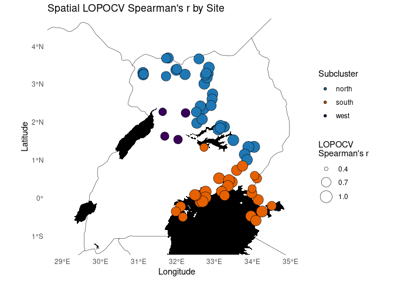<!-- -->

``` r
# Overlapping density plot
ggplot(site_metadata, aes(x = Spearman, fill = Subcluster)) +
  geom_density(alpha = 0.5, color = NA) +
  scale_fill_manual(values = c("north" = "#1f78b4", "south" = "#e66101", "west" = "#39005A")) +
  theme_minimal() +
  labs(
    title = "Distribution of Spearman's r by Subcluster",
    x = "Spearman's r (Spatial LOPOCV)",
    y = "Density"
  )
```

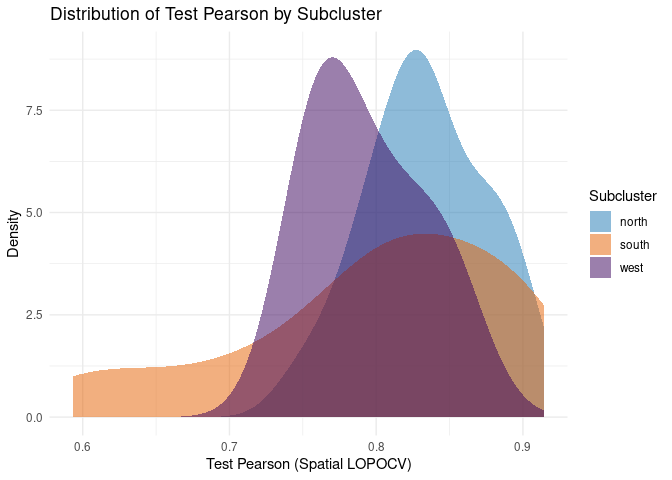<!-- -->

``` r
# Overlapping count plot
ggplot(site_metadata, aes(x = Spearman, fill = Subcluster)) +
  geom_density(alpha = 0.5, color = NA, position = "identity", aes(y = after_stat(count))) +
  scale_fill_manual(values = c("north" = "#1f78b4", "south" = "#e66101", "west" = "#39005A")) +
  theme_minimal() +
  labs(
    title = "Spearman's r by Subcluster (Scaled by Count)",
    x = "Spearman's r (Spatial LOPOCV)",
    y = "Count"
  )
```

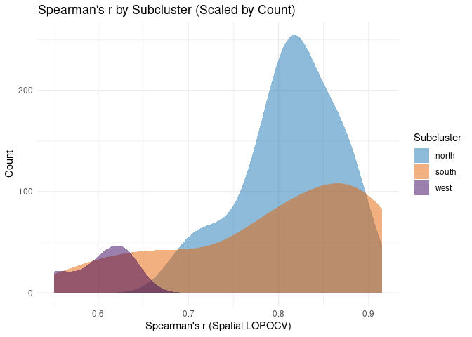<!-- -->

``` r
# Reassign Cluster
site_metadata$Cluster <- site_metadata$Subcluster
site_metadata$Cluster[site_metadata$Subcluster == "west"] <- "south"

# Plot Spatial LOPOCV Spearman by site just N/S
ggplot() +
  geom_sf(data = uganda, fill = NA, color = "black", linewidth = 0.1) +
  geom_sf(data = lakes, fill = "black", color = NA) +
  geom_point(
    data = filter(site_metadata, Symbol == "circle"),
    aes(x = Longitude, y = Latitude, size = Spearman, fill = Cluster),
    shape = 21, color = "black", stroke = 0.3
  ) +
  geom_point(
    data = filter(site_metadata, Symbol == "low"),
    aes(x = Longitude, y = Latitude, fill = Cluster),
    shape = 21, color = "black", size = 1, stroke = 0.3
  ) +
  scale_fill_manual(
    name = "Group",
    values = c("north" = "#1f78b4", "south" = "#e66101")
  ) +
  scale_size_continuous(
  name = "LOPOCV \nSpearman's r",
  limits = c(0.4, 1.0),
  breaks = c(0.4, 0.7, 1.0),
  range = c(2,7)
) +
  coord_sf(xlim = xlim, ylim = ylim, expand = FALSE) +
  theme_minimal() +
  theme(panel.grid = element_blank()) +
  labs(title = "Spatial LOPOCV Spearman's r by Site", x = "Longitude", y = "Latitude")
```

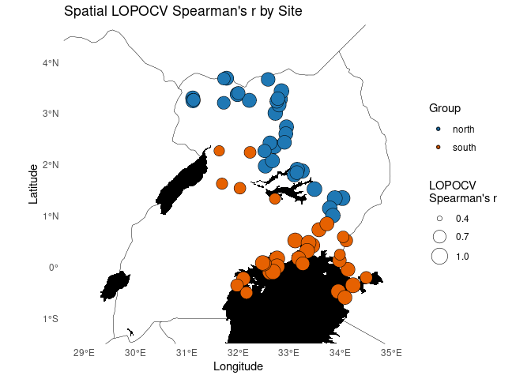<!-- -->

``` r
# Plot Spatial LOPOCV Spearman by site just N/S with shaded colors
ggplot() +
  geom_sf(data = uganda, fill = NA, color = "black", linewidth = 0.1) +
  geom_sf(data = lakes, fill = "black", color = NA) +
  geom_point(
    data = filter(site_metadata, Symbol == "circle"),
    aes(x = Longitude, y = Latitude, size = Spearman, fill = Cluster),
    shape = 21, color = "black", stroke = 0.3, alpha = 0.4
  ) +
  geom_point(
    data = filter(site_metadata, Symbol == "low"),
    aes(x = Longitude, y = Latitude, fill = Cluster),
    shape = 21, color = "black", size = 1, stroke = 0.3, alpha = 0.4
  ) +
  scale_fill_manual(
    name = "Group",
    #values = c("north" = "#2c3e50", "south" = "#4e342e")
    values = c("north" = "#2A4F6E", "south" = "#7A4A2A")
    #values = c("north" = "#2E8BC6", "south" = "#FFA64D")
  ) +
  scale_size_continuous(
  name = "LOPOCV \nSpearman's r",
  limits = c(0.4, 1.0),
  breaks = c(0.4, 0.7, 1.0),
  range = c(2,7)
) +
  coord_sf(xlim = xlim, ylim = ylim, expand = FALSE) +
  theme_minimal() +
  theme(panel.grid = element_blank()) +
  labs(title = "Spatial LOPOCV Spearman's r by Site", x = "Longitude", y = "Latitude")
```

<!-- -->

``` r
# Overlapping density plot just S/N
ggplot(site_metadata, aes(x = Spearman, fill = Cluster)) +
  geom_density(alpha = 0.5, color = NA) +
  scale_fill_manual(values = c("north" = "#1f78b4", "south" = "#e66101")) +
  theme_minimal() +
  labs(
    title = "Distribution of Spearman's r by Cluster",
    x = "Spearman's r (Spatial LOPOCV)",
    y = "Density"
  )
```

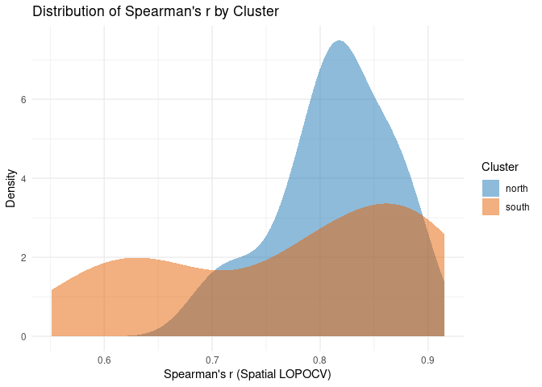<!-- -->

``` r
# Overlapping count plot just S/N
ggplot(site_metadata, aes(x = Spearman, fill = Cluster)) +
  geom_density(alpha = 0.5, color = NA, position = "identity", aes(y = after_stat(count))) +
  scale_fill_manual(values = c("north" = "#1f78b4", "south" = "#e66101")) +
  theme_minimal() +
  labs(
    title = "Spearman's r by Cluster (Scaled by Count)",
    x = "Spearman's r (Spatial LOPOCV)",
    y = "Count"
  )
```

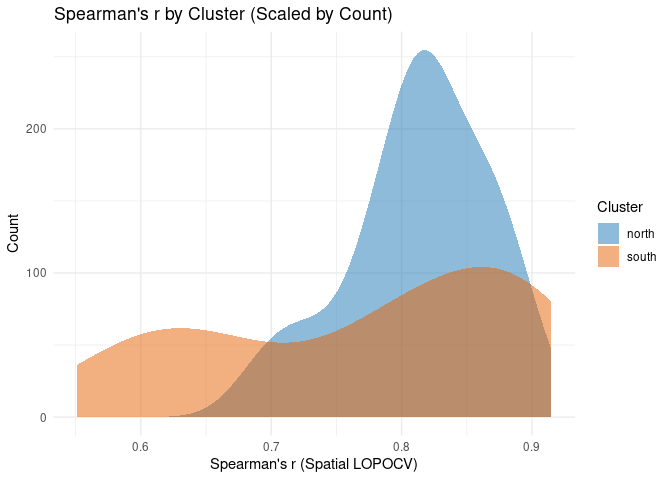<!-- -->

``` r
# write.csv(site_metadata, file.path(results_dir, "site_metadata_spatial.csv"), row.names = FALSE)
```
