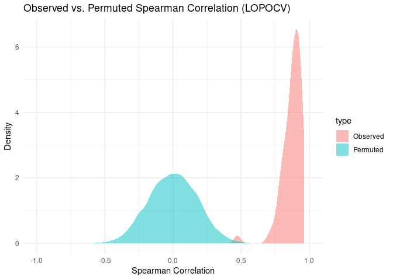
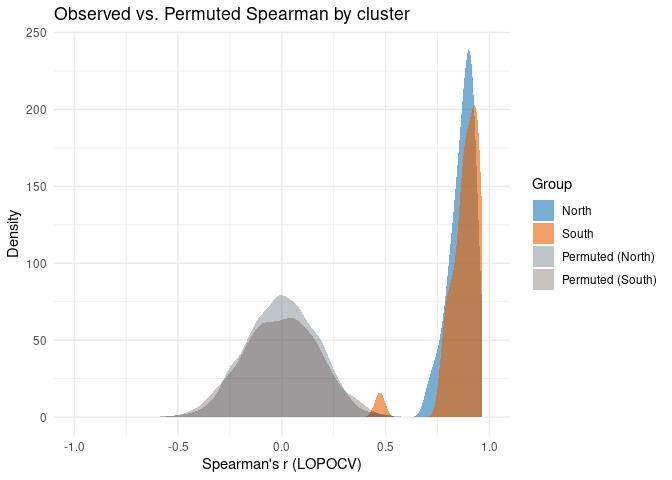

LOPOCV with permutated data as Null, then GeoDist as null
================
Norah Saarman
2026-04-27

- [Setup](#setup)
  - [Overview of script](#overview-of-script)
  - [Inputs](#inputs)
  - [Libraries](#libraries)
  - [Define Paths to Directories](#define-paths-to-directories)
- [Permutation test for LOPOCV
  Spearman’s](#permutation-test-for-lopocv-spearmans)
  - [Chunk 1: LOPOCV on permuted
    models](#chunk-1-lopocv-on-permuted-models)
  - [Chunk 2: Calculate the metrics](#chunk-2-calculate-the-metrics)
  - [Chunk 3: Compare observed vs permuted LOPOCV
    Spearman](#chunk-3-compare-observed-vs-permuted-lopocv-spearman)
  - [Chunk 4: Empirical p-value](#chunk-4-empirical-p-value)
  - [Chunk 5: Visualize permutated vs observed LOPOCV
    side-by-side](#chunk-5-visualize-permutated-vs-observed-lopocv-side-by-side)
  - [Chunk 6: Spatial included, all
    side-by-side](#chunk-6-spatial-included-all-side-by-side)
- [Geodist baseline test for LOPOCV
  Spearman’s](#geodist-baseline-test-for-lopocv-spearmans)
  - [Chunk 7: Geodist-only baseline LOPOCV
    eval](#chunk-7-geodist-only-baseline-lopocv-eval)
  - [Chunk 8: Visualize observed, spatial, permuted, and geodist-only
    LOPOCV
    results](#chunk-8-visualize-observed-spatial-permuted-and-geodist-only-lopocv-results)
  - [Chunk 9: Paired empirical sign-permutation test across the 67
    sites](#chunk-9-paired-empirical-sign-permutation-test-across-the-67-sites)

# Setup

RStudio Configuration:  
- **R version:** R 4.4.0 (Geospatial packages)  
- **Number of cores:** 16 (up to 32 available)  
- **Account:** saarman-np  
- **Partition:** saarman-np (allows multiple simultaneous jobs
automatically now)  
- **Memory per job:** 400G (cluster limit: 1000G total; avoid exceeding
half)

## Overview of script

Although model configuration and projection parameters were selected
based on full-model performance (RSQ), during LOPOCV, some held-out
folds exhibited limited variance in observed CSE, making fold-specific
RSQ unstable. We therefore report fold-level performance using Spearman
and Pearson correlation alongside RMSE and MAE.

(In contrast, model configuration and projection parameters were
selected based on full-model performance (RSQ) because in these cases,
variance in CSE was sufficiently large for stable estimation.)

## Inputs

- `../input/Gff_11loci_68sites_cse.csv` - Combined CSE table with
  coordinates (long1, lat1, long2, lat2)
- `../results_dir/fullRF_CSE_resistance.tif` - Final full model
  projected resistance surface
- `../results_dir/LC_paths_fullRF.shp"` -
- `../data_dir/processed/env_stack.grd` - Final prediction env stack
  with named layers (18 variables) env \<- stack(file.path(
- `../results_dir/lopocv/rf_model_01.rds` - 67 LOPOCV rf models leaving
  one point out

## Libraries

``` r
# load only required packages
library(doParallel)
library(foreach)
library(raster)
library(gdistance)
library(sf)
library(dplyr)
library(randomForest)
library(readr)
library(ggplot2)
library(sp)
library(tidyverse)
library(rnaturalearth)
library(rnaturalearthdata)
library(reshape2)
```

## Define Paths to Directories

``` r
# Define paths
data_dir  <- "/uufs/chpc.utah.edu/common/home/saarman-group1/uganda-tsetse-LG/data"
input_dir <- "../input"
results_dir <- "/uufs/chpc.utah.edu/common/home/saarman-group1/uganda-tsetse-LG/results/"
output_dir <- file.path(results_dir, "lopocv")
perm_model_dir <- file.path(results_dir, "perm_rds_temp")
dir.create(perm_model_dir, recursive = TRUE, showWarnings = FALSE)
stopifnot(dir.exists(perm_model_dir))
stopifnot(file.access(perm_model_dir, 2) == 0)

# High-quality figure output (for manuscript)
fig_dir <- file.path(results_dir, "figures_pub")
if (!dir.exists(fig_dir)) dir.create(fig_dir, recursive = TRUE)

# define coordinate reference system
crs_geo <- 4326     # EPSG code for WGS84

# define ggplot2 extent
xlim <- c(28.6, 35.4)
ylim <- c(-1.500000 , 4.733333)

# Input: shape file of least-cost paths (already filtered to 67 sites and has CSEdistance)
lcp_sf <- st_read(file.path(results_dir, "LC_paths_fullRF.shp"))
```

    ## Reading layer `LC_paths_fullRF' from data source 
    ##   `/uufs/chpc.utah.edu/common/home/saarman-group1/uganda-tsetse-LG/results/LC_paths_fullRF.shp' 
    ##   using driver `ESRI Shapefile'
    ## Simple feature collection with 1026 features and 4 fields
    ## Geometry type: LINESTRING
    ## Dimension:     XY
    ## Bounding box:  xmin: 31.12083 ymin: -0.5958333 xmax: 34.5125 ymax: 3.695833
    ## Geodetic CRS:  WGS 84

``` r
st_crs(lcp_sf) <- crs_geo

# Build list of unique sites from Var1 and Var2
sites <- sort(unique(c(lcp_sf$Var1, lcp_sf$Var2)))

output_dir <- file.path(results_dir, "lopocv")
#dir.create(output_dir, showWarnings = FALSE)
scratch_dir <- "/scratch/local/u6036559"
```

# Permutation test for LOPOCV Spearman’s

GOAL: Create and test if different: 67 x 100 matrix where each cell is
the Spearmans’s correlation for one LOPOCV fold (site) under a permuted
response (CSEdistance).

## Chunk 1: LOPOCV on permuted models

helpers:

``` r
# Chunk 1: setup + data + helpers 

# Load required packages
library(dplyr)
library(readr)
library(randomForest)
library(doParallel)
library(foreach)

# Load data
V.table_full <- read.csv(file.path(input_dir, "Gff_cse_envCostPaths.csv"))

# Filter out western outlier
V.table <- V.table_full %>%
  filter(Var1 != "50-KB", Var2 != "50-KB")

# Create unique pair ID
V.table$id <- paste(V.table$Var1, V.table$Var2, sep = "_")

# Define site list
sites <- sort(unique(c(V.table$Var1, V.table$Var2)))

# Predictors used in the original LOPOCV models
predictor_vars <- c(
  "BIO1_mean","BIO2_mean","BIO3_mean","BIO4_mean","BIO5_mean","BIO6_mean",
  "BIO7_mean","BIO8S_mean","BIO9S_mean","BIO10S_mean","BIO11S_mean",
  "BIO12_mean","BIO13_mean","BIO14_mean","BIO15_mean","BIO16S_mean",
  "BIO17S_mean","BIO18S_mean","BIO19S_mean","slope_mean","alt_mean",
  "lakes_mean","riv_3km_mean","samp_20km_mean","pix_dist"
)

# Modeling table
V.model <- V.table[, c("CSEdistance", predictor_vars)]
```

1b run the permutations and save .rds files

``` r
#run permuted LOPOCV models and save .rds files

# Set number of permutations
n_perm <- 100

# Set up parallel backend
cl <- makeCluster(8)
registerDoParallel(cl)

# Run permutations and save models
foreach(
  p = 1:n_perm,
  .packages = c("randomForest", "dplyr")
) %dopar% {
  set.seed(500 + p)

  # Shuffle response column while preserving row order
  V.model_perm <- V.model
  V.model_perm$CSEdistance <- sample(V.model_perm$CSEdistance)

  for (i in seq_along(sites)) {
    site <- sites[i]

    # Identify test/train indices
    test_ids  <- V.table$id[V.table$Var1 == site | V.table$Var2 == site]
    test_idx  <- which(V.table$id %in% test_ids)
    train_idx <- which(!V.table$id %in% test_ids)

    train_df <- V.model_perm[train_idx, ]
    test_df  <- V.model_perm[test_idx, ]

    # Fit Random Forest on permuted response
    rf_model <- randomForest(
      CSEdistance ~ .,
      data = train_df,
      ntree = 500
    )

    # Save RF model for this permutation–fold pair
    saveRDS(
  rf_model,
  file.path(perm_model_dir, sprintf("rf_model_perm_%02d_fold_%02d.rds", p, i))
)
    # Save metrics file for this permutation–fold pair
    #metrics_file <- file.path(results_dir, sprintf("perm_progress_%03d.csv", p))                               # commented this out because it is pretty much a blank file with just the permutation number, some mistake i made...
#write.csv(data.frame(perm = p), metrics_file, row.names = FALSE)
  }

  NULL
}

# Stop cluster
stopCluster(cl)
```

## Chunk 2: Calculate the metrics

``` r
# Chunk 2: calculate Spearman null matrix from saved permutation models

# Helper for calibration
calibrate_pred <- function(obs_train, pred_train, pred_test) {
  keep <- complete.cases(obs_train, pred_train)
  df <- data.frame(obs = obs_train[keep], pred = pred_train[keep])
  fit <- lm(obs ~ pred, data = df)

  out <- rep(NA_real_, length(pred_test))
  keep_test <- complete.cases(pred_test)
  out[keep_test] <- predict(fit, newdata = data.frame(pred = pred_test[keep_test]))
  out
}

# Set number of permutations
n_perm <- 100

# Preallocate matrix for results
spearman_null <- matrix(NA_real_, nrow = length(sites), ncol = n_perm)
rownames(spearman_null) <- sites
colnames(spearman_null) <- paste0("perm_", seq_len(n_perm))

for (p in seq_len(n_perm)) {
  set.seed(500 + p)

  # Recreate permuted response exactly as in Chunk 1
  V.model_perm <- V.model
  V.model_perm$CSEdistance <- sample(V.model_perm$CSEdistance)

  spearman_perm <- numeric(length(sites))

  for (i in seq_along(sites)) {
    site <- sites[i]

    fold_model_file <- file.path(
      perm_model_dir,
      sprintf("rf_model_perm_%02d_fold_%02d.rds", p, i)
    )

    if (!file.exists(fold_model_file)) {
      warning(sprintf("Missing model file: %s", fold_model_file))
      spearman_perm[i] <- NA_real_
      next
    }

    # Identify test/train indices
    test_ids  <- V.table$id[V.table$Var1 == site | V.table$Var2 == site]
    test_idx  <- which(V.table$id %in% test_ids)
    train_idx <- which(!V.table$id %in% test_ids)

    train_df <- V.model_perm[train_idx, ]
    test_df  <- V.model_perm[test_idx, ]

    rf_model <- readRDS(fold_model_file)

    train_obs <- train_df$CSEdistance
    test_obs  <- test_df$CSEdistance

    train_df <- train_df %>% dplyr::select(-CSEdistance)
    test_df  <- test_df %>% dplyr::select(-CSEdistance)

    stopifnot(!"CSEdistance" %in% names(train_df))
    stopifnot(!"CSEdistance" %in% names(test_df))

    stopifnot(identical(names(train_df), predictor_vars))
    stopifnot(identical(names(test_df), predictor_vars))
    stopifnot(identical(attr(rf_model$terms, "term.labels"), predictor_vars))

    pred_train <- predict(rf_model, newdata = train_df)
    pred_test  <- predict(rf_model, newdata = test_df)

    pred_test_cal <- calibrate_pred(
      obs_train = train_obs,
      pred_train = pred_train,
      pred_test = pred_test
    )

    keep <- complete.cases(test_obs, pred_test_cal)

    spearman_perm[i] <- cor(
      test_obs[keep],
      pred_test_cal[keep],
      method = "spearman"
    )
  }

  spearman_null[, p] <- spearman_perm
}

# Save matrix to file for later use
write.csv(
  spearman_null,
  file.path(results_dir, "spearman_LOPOCV_null_matrix.csv"),
  row.names = TRUE
)

print(spearman_null)
message("Permutation Spearman null matrix created and saved.")
```

## Chunk 3: Compare observed vs permuted LOPOCV Spearman

``` r
# observed LOPOCV summary from the true data
metrics_all <- read.csv(file.path(results_dir, "LOPOCV_summary.csv"))

# permutation matrix
spearman_null <- read.csv(
  file.path(results_dir, "spearman_LOPOCV_null_matrix.csv"),
  row.names = 1,
  check.names = FALSE
)

# make sure site order matches the permutation matrix
metrics_all <- metrics_all[match(rownames(spearman_null), metrics_all$site), ]

spearman_obs <- as.numeric(metrics_all$Spearman)

spearman_null_mat <- as.matrix(spearman_null)

# reorder rows to observed site order if needed
spearman_null_mat <- spearman_null_mat[match(metrics_all$site, rownames(spearman_null_mat)), ]

plot_df_spearman <- data.frame(
  spearman = c(spearman_obs, as.numeric(spearman_null_mat)),
  type = c(
    rep("Observed", length(spearman_obs)),
    rep("Permuted", length(as.numeric(spearman_null_mat)))
  )
)

ggplot(plot_df_spearman, aes(x = spearman, fill = type)) +
  geom_density(alpha = 0.5, color = NA) +
  coord_cartesian(xlim = c(-1, 1)) +
  theme_minimal() +
  labs(
    title = "Observed vs. Permuted Spearman Correlation (LOPOCV)",
    x = "Spearman Correlation",
    y = "Density"
  )
```

<!-- -->

## Chunk 4: Empirical p-value

GOAL: Calculate an empirical p-value comparing observed vs permuted
Spearman correlation.

``` r
# Define region based on SiteMajCluster
Gff <- read.csv(file.path(input_dir, "Gff_11loci_allsites_indinfo.txt"),
                header = TRUE, sep = "\t")
north_sites <- unique(Gff$SiteCode[Gff$SiteMajCluster == "north"])

# Load observed Spearman
metrics_all <- read.csv(file.path(results_dir, "LOPOCV_summary.csv"))
spearman_obs_df <- data.frame(
  site = metrics_all$site,
  spearman = metrics_all$Spearman
)
spearman_obs_df$cluster <- ifelse(spearman_obs_df$site %in% north_sites, "north", "south")
spearman_obs_df$type <- "Observed"

spearman_null_raw <- read.csv(
  file.path(results_dir, "spearman_LOPOCV_null_matrix.csv"),
  row.names = 1,
  check.names = FALSE
)
spearman_null_mat <- as.matrix(spearman_null_raw)

# align rows to observed site order
spearman_null_mat <- spearman_null_mat[match(metrics_all$site, rownames(spearman_null_mat)), ]

obs_mean_spearman <- mean(spearman_obs_df$spearman, na.rm = TRUE)
null_mean_spearman <- apply(spearman_null_mat, 2, mean, na.rm = TRUE)

# one-sided empirical p-value: observed mean Spearman greater than null
p_empirical <- (sum(null_mean_spearman >= obs_mean_spearman, na.rm = TRUE) + 1) /
  (sum(!is.na(null_mean_spearman)) + 1)

cat("Observed mean Spearman:", round(obs_mean_spearman, 4), "\n")
```

    ## Observed mean Spearman: 0.873

``` r
cat("Null mean Spearman range:", round(range(null_mean_spearman, na.rm = TRUE), 4), "\n")
```

    ## Null mean Spearman range: -0.0817 0.067

``` r
cat("Empirical one-sided p-value:", round(p_empirical, 4), "\n\n")
```

    ## Empirical one-sided p-value: 0.0099

``` r
obs_north <- spearman_obs_df$spearman[spearman_obs_df$cluster == "north"]
obs_south <- spearman_obs_df$spearman[spearman_obs_df$cluster == "south"]

null_north_mat <- spearman_null_mat[rownames(spearman_null_mat) %in% north_sites, , drop = FALSE]
null_south_mat <- spearman_null_mat[!rownames(spearman_null_mat) %in% north_sites, , drop = FALSE]

obs_mean_north <- mean(obs_north, na.rm = TRUE)
obs_mean_south <- mean(obs_south, na.rm = TRUE)

null_mean_north <- apply(null_north_mat, 2, mean, na.rm = TRUE)
null_mean_south <- apply(null_south_mat, 2, mean, na.rm = TRUE)

p_north <- (sum(null_mean_north >= obs_mean_north, na.rm = TRUE) + 1) /
  (sum(!is.na(null_mean_north)) + 1)
p_south <- (sum(null_mean_south >= obs_mean_south, na.rm = TRUE) + 1) /
  (sum(!is.na(null_mean_south)) + 1)

cat("Observed mean Spearman, north:", round(obs_mean_north, 4), "\n")
```

    ## Observed mean Spearman, north: 0.869

``` r
cat("Empirical p-value, north:", round(p_north, 4), "\n\n")
```

    ## Empirical p-value, north: 0.0099

``` r
cat("Observed mean Spearman, south:", round(obs_mean_south, 4), "\n")
```

    ## Observed mean Spearman, south: 0.8774

``` r
cat("Empirical p-value, south:", round(p_south, 4), "\n")
```

    ## Empirical p-value, south: 0.0099

## Chunk 5: Visualize permutated vs observed LOPOCV side-by-side

``` r
# Define region based on SiteMajCluster
Gff <- read.csv(file.path(input_dir, "Gff_11loci_allsites_indinfo.txt"),
                header = TRUE, sep = "\t")
north_sites <- unique(Gff$SiteCode[Gff$SiteMajCluster == "north"])

# Load observed Spearman
metrics_all <- read.csv(file.path(results_dir, "LOPOCV_summary.csv"))
spearman_obs_df <- data.frame(
  site = metrics_all$site,
  spearman = metrics_all$Spearman
)
spearman_obs_df$cluster <- ifelse(spearman_obs_df$site %in% north_sites, "north", "south")
spearman_obs_df$type <- "Observed"

# Load permuted Spearman matrix
spearman_null <- read.csv(
  file.path(results_dir, "spearman_LOPOCV_null_matrix.csv"),
  row.names = 1,
  check.names = FALSE
)

spearman_null_df <- data.frame(
  site = rownames(spearman_null),
  cluster = ifelse(rownames(spearman_null) %in% north_sites, "north", "south"),
  spearman_null,
  check.names = FALSE
)

# Stack all permutation columns
spearman_null_long <- reshape2::melt(
  spearman_null_df,
  id.vars = c("site", "cluster"),
  variable.name = "perm",
  value.name = "spearman"
)
spearman_null_long$type <- "Permuted"

# Combine
spearman_plot_df <- rbind(
  spearman_obs_df[, c("site", "cluster", "spearman", "type")],
  spearman_null_long[, c("site", "cluster", "spearman", "type")]
)

# Plot
ggplot(spearman_plot_df, aes(x = spearman, fill = interaction(type, cluster))) +
  geom_density(
    data = subset(spearman_plot_df, type == "Observed"),
    aes(y = after_stat(count)),
    alpha = 0.6,
    color = NA,
    position = "identity"
  ) +
  geom_density(
    data = subset(spearman_plot_df, type == "Permuted"),
    aes(y = after_stat(count / 100)),
    alpha = 0.3,
    color = NA,
    position = "identity"
  ) +
  scale_fill_manual(
    name = "Group",
    values = c(
      "Observed.north" = "#1f78b4",
      "Observed.south" = "#e66101",
      "Permuted.north" = "#4A545E",
      "Permuted.south" = "#5A4F49"
      #"Permuted.north" = "#2c3e50",
      #"Permuted.south" = "#4e342e"
    ),
    labels = c(
      "Observed.north" = "North",
      "Observed.south" = "South",
      "Permuted.north" = "Permuted (North)",
      "Permuted.south" = "Permuted (South)"
    )
  ) +
  coord_cartesian(xlim = c(-1, 1)) +
  theme_minimal() +
  labs(
    title = "Observed vs. Permuted Spearman by cluster",
    x = "Spearman's r (LOPOCV)",
    y = "Density"
  )
```

<!-- -->

## Chunk 6: Spatial included, all side-by-side

Now with the Spatial Spearman’s R included… “north” = “\#2A4F6E” “south”
= “\#7A4A2A”

``` r
results_dir <- "/uufs/chpc.utah.edu/common/home/saarman-group1/uganda-tsetse-LG/results/"
input_dir <- "../input"
fig_dir <- file.path(results_dir, "figures_pub")

# Run just once to save high quality png for publication
png(file.path(fig_dir, "Fig_LOPOCV_obs_vs_permuted.png"),
    width = 7, height = 2.8, units = "in", res = 600)

# Define region based on SiteMajCluster
Gff <- read.csv(
  file.path(input_dir, "Gff_11loci_allsites_indinfo.txt"),
  header = TRUE, sep = "\t"
)
north_sites <- unique(Gff$SiteCode[Gff$SiteMajCluster == "north"])

# 1. Non-spatial LOPOCV Spearman
metrics_obs <- read.csv(file.path(results_dir, "LOPOCV_summary.csv"))

obs_df <- data.frame(
  site = metrics_obs$site,
  cluster = ifelse(metrics_obs$site %in% north_sites, "north", "south"),
  spearman = metrics_obs$Spearman,
  method = "Observed"
)

# 2. Null LOPOCV Spearman from permutations
spearman_null <- read.csv(
  file.path(results_dir, "spearman_LOPOCV_null_matrix.csv"),
  row.names = 1,
  check.names = FALSE
)

perm_df <- data.frame(
  site = rownames(spearman_null),
  cluster = ifelse(rownames(spearman_null) %in% north_sites, "north", "south"),
  spearman_null,
  check.names = FALSE
)

perm_long <- reshape2::melt(
  perm_df,
  id.vars = c("site", "cluster"),
  variable.name = "perm",
  value.name = "spearman"
) %>%
  mutate(method = "Permuted")

# 3. Spatial LOPOCV Spearman
metrics_spatial <- read.csv(
  file.path(results_dir, "spatial_LOPOCV_LCPsum_k1_summary.csv")
)

spatial_df <- data.frame(
  site = metrics_spatial$site,
  cluster = ifelse(metrics_spatial$site %in% north_sites, "north", "south"),
  spearman = metrics_spatial$Spearman,
  method = "Spatial"
)

# Combine all three
plot_df <- bind_rows(
  obs_df[, c("site", "cluster", "spearman", "method")],
  perm_long[, c("site", "cluster", "spearman", "method")],
  spatial_df[, c("site", "cluster", "spearman", "method")]
)

# Set method and cluster order for legend/display
plot_df$method <- factor(
  plot_df$method,
  levels = c("Observed", "Spatial", "Permuted")
)

plot_df$cluster <- factor(
  plot_df$cluster,
  levels = c("north", "south")
)

# Plot
ggplot(plot_df, aes(x = spearman, fill = interaction(method, cluster, sep = "."))) +

  geom_density(
    data = subset(plot_df, method == "Observed"),
    aes(y = after_stat(count)),
    alpha = 0.6,
    color = NA,
    position = "identity"
  ) +

  geom_density(
    data = subset(plot_df, method == "Spatial"),
    aes(y = after_stat(count)),
    alpha = 0.5,
    color = NA,
    position = "identity"
  ) +

  geom_density(
    data = subset(plot_df, method == "Permuted"),
    aes(y = after_stat(count / 100)),
    alpha = 0.3,
    color = NA,
    position = "identity"
  ) +

  scale_fill_manual(
    name = "Prediction type",
    breaks = c(
      "Observed.north", "Observed.south",
      "Spatial.north",  "Spatial.south",
      "Permuted.north", "Permuted.south"
    ),
    values = c(
      "Observed.north" = "#1f78b4",
      "Observed.south" = "#e66101",
      "Spatial.north"  = "#2A4F6E",
      "Spatial.south"  = "#7A4A2A",
      "Permuted.north" = "#4A545E",
      "Permuted.south" = "#5A4F49"
    ),
    labels = c(
      "Observed.north" = "RF-predicted North",
      "Observed.south" = "RF-predicted South",
      "Spatial.north"  = "LCP-predicted North",
      "Spatial.south"  = "LCP-predicted South",
      "Permuted.north" = "Null-predicted North",
      "Permuted.south" = "Null-predicted South"
    )
  ) +
  coord_cartesian(xlim = c(-1, 1)) +
  theme_minimal() +
  labs(
    title = "Fold-level LOPOCV Spearman by prediction type and cluster",
    x = "Spearman's r",
    y = "Count"
  )


dev.off()
```

    ## png 
    ##   2

# Geodist baseline test for LOPOCV Spearman’s

GOAL: Create and test if different from full model: 67 x 100 matrix
where each cell is the Spearmans’s correlation for one LOPOCV fold
(site) under a baseline model (geographic distance + sampling density
only, excluding all environmental variables).

## Chunk 7: Geodist-only baseline LOPOCV eval

This baseline model uses only: 1. pix_dist 2. samp_20km_mean

Sampling density is included during training, but neutralized before
prediction, matching the approach used in the spatial eval.

``` r
# Chunk 7: run one geodist-only LOPOCV baseline model and calculate metrics

# Output directory for geodist baseline model objects
geodist_model_dir <- file.path(results_dir, "geodist_rds_temp")
dir.create(geodist_model_dir, recursive = TRUE, showWarnings = FALSE)
stopifnot(dir.exists(geodist_model_dir))
stopifnot(file.access(geodist_model_dir, 2) == 0)

# Mean sampling density used for neutralizing sampling effort
geodist_samp_neutral <- mean(V.table$samp_20km_mean, na.rm = TRUE)

# Geodist-only model predictors
geodist_predictor_vars <- c("pix_dist", "samp_20km_mean")

# Modeling table
V.model_geodist <- V.table[, c("CSEdistance", geodist_predictor_vars)]

# Helper for calibration
calibrate_pred <- function(obs_train, pred_train, pred_test, return_fit = FALSE) {
  keep <- complete.cases(obs_train, pred_train)
  df <- data.frame(obs = obs_train[keep], pred = pred_train[keep])
  fit <- lm(obs ~ pred, data = df)

  out <- rep(NA_real_, length(pred_test))
  keep_test <- complete.cases(pred_test)
  out[keep_test] <- predict(fit, newdata = data.frame(pred = pred_test[keep_test]))

  if (return_fit) {
    list(
      pred_cal = out,
      fit = fit
    )
  } else {
    out
  }
}

# Helper for fold-level metrics
calc_metrics <- function(obs, pred) {
  keep <- complete.cases(obs, pred)

  obs  <- obs[keep]
  pred <- pred[keep]

  mse      <- mean((obs - pred)^2)
  rmse     <- sqrt(mse)
  mae      <- mean(abs(obs - pred))
  pearson  <- cor(obs, pred, method = "pearson")
  spearman <- cor(obs, pred, method = "spearman")

  data.frame(
    n = length(obs),
    MSE = mse,
    RMSE = rmse,
    MAE = mae,
    Pearson = pearson,
    Spearman = spearman
  )
}

# Helper for pooled metrics
calc_pooled_metrics <- function(obs, pred) {
  keep <- complete.cases(obs, pred)

  obs  <- obs[keep]
  pred <- pred[keep]

  mse      <- mean((obs - pred)^2)
  rmse     <- sqrt(mse)
  mae      <- mean(abs(obs - pred))
  pearson  <- cor(obs, pred, method = "pearson")
  spearman <- cor(obs, pred, method = "spearman")

  sse <- sum((obs - pred)^2)
  sst <- sum((obs - mean(obs))^2)
  r2  <- 1 - (sse / sst)

  data.frame(
    n = length(obs),
    pooled_MSE = mse,
    pooled_RMSE = rmse,
    pooled_MAE = mae,
    pooled_Pearson = pearson,
    pooled_Spearman = spearman,
    pooled_R2 = r2
  )
}

# Set up parallel backend
cl <- makeCluster(8)
registerDoParallel(cl)

# Run one geodist-only LOPOCV pass in parallel
geodist_results <- foreach(
  i = seq_along(sites),
  .packages = c("dplyr", "randomForest")
) %dopar% {

  site <- sites[i]

  # Identify test/train indices
  test_ids  <- V.table$id[V.table$Var1 == site | V.table$Var2 == site]
  test_idx  <- which(V.table$id %in% test_ids)
  train_idx <- which(!V.table$id %in% test_ids)

  train_df <- V.model_geodist[train_idx, ]
  test_df  <- V.model_geodist[test_idx, ]

  # Fit geodist-only RF model
  set.seed(7000 + i)
  geodist_rf_model <- randomForest(
    CSEdistance ~ .,
    data = train_df,
    ntree = 500
  )

  # Save model immediately
  saveRDS(
    geodist_rf_model,
    file.path(geodist_model_dir, sprintf("rf_model_geodist_fold_%02d.rds", i))
  )

  # Observed values
  train_obs <- train_df$CSEdistance
  test_obs  <- test_df$CSEdistance

  # Predictor data
  train_x <- train_df %>% dplyr::select(-CSEdistance)
  test_x  <- test_df %>% dplyr::select(-CSEdistance)

  # Neutralize sampling density before prediction
  train_x$samp_20km_mean <- geodist_samp_neutral
  test_x$samp_20km_mean  <- geodist_samp_neutral

  # Predict
  pred_train <- predict(geodist_rf_model, newdata = train_x)
  pred_test  <- predict(geodist_rf_model, newdata = test_x)

  # Calibrate test predictions using training predictions
  calibration <- calibrate_pred(
    obs_train = train_obs,
    pred_train = pred_train,
    pred_test = pred_test,
    return_fit = TRUE
  )
  
  pred_test_cal <- calibration$pred_cal
  calibration_fit <- calibration$fit

  saveRDS(
    calibration_fit,
    file.path(geodist_model_dir, sprintf("geodist_calibration_fit_fold_%02d.rds", i))
  )

  # Calculate fold-level metrics
  fold_metrics <- calc_metrics(test_obs, pred_test_cal) %>%
    mutate(
      fold = i,
      site = site
    ) %>%
    dplyr::select(fold, site, everything())

  # Save predictions for this fold
  fold_predictions <- data.frame(
    fold = i,
    site = site,
    id = V.table$id[test_idx],
    obs = test_obs,
    pred = pred_test_cal
  )

  # Save intermediate fold files immediately
  utils::write.csv(
    fold_metrics,
    file.path(geodist_model_dir, sprintf("geodist_metrics_fold_%02d.csv", i)),
    row.names = FALSE
  )

  utils::write.csv(
    fold_predictions,
    file.path(geodist_model_dir, sprintf("geodist_predictions_fold_%02d.csv", i)),
    row.names = FALSE
  )

  saveRDS(
    fold_metrics,
    file.path(geodist_model_dir, sprintf("geodist_metrics_fold_%02d.rds", i))
  )

  saveRDS(
    fold_predictions,
    file.path(geodist_model_dir, sprintf("geodist_predictions_fold_%02d.rds", i))
  )

  # Return file paths only
  list(
    metrics_file = file.path(
      geodist_model_dir,
      sprintf("geodist_metrics_fold_%02d.rds", i)
    ),
    predictions_file = file.path(
      geodist_model_dir,
      sprintf("geodist_predictions_fold_%02d.rds", i)
    )
  )
}

# Stop cluster
stopCluster(cl)

# Reload intermediate files
geodist_metric_files <- file.path(
  geodist_model_dir,
  sprintf("geodist_metrics_fold_%02d.rds", seq_along(sites))
)

geodist_prediction_files <- file.path(
  geodist_model_dir,
  sprintf("geodist_predictions_fold_%02d.rds", seq_along(sites))
)

# Check that all expected files exist
missing_metric_files <- geodist_metric_files[!file.exists(geodist_metric_files)]
missing_prediction_files <- geodist_prediction_files[!file.exists(geodist_prediction_files)]

if (length(missing_metric_files) > 0) {
  stop(
    "Missing geodist metric files:\n",
    paste(missing_metric_files, collapse = "\n")
  )
}

if (length(missing_prediction_files) > 0) {
  stop(
    "Missing geodist prediction files:\n",
    paste(missing_prediction_files, collapse = "\n")
  )
}

# Combine fold-level outputs
geodist_fold_metrics <- bind_rows(lapply(geodist_metric_files, readRDS))
geodist_pooled_predictions <- bind_rows(lapply(geodist_prediction_files, readRDS))

# Calculate pooled metrics
# Calculate pooled metrics
geodist_pooled_metrics <- calc_pooled_metrics(
  obs = geodist_pooled_predictions$obs,
  pred = geodist_pooled_predictions$pred
)

# Save final combined outputs
utils::write.csv(
  geodist_fold_metrics,
  file.path(results_dir, "geodist_LOPOCV_summary.csv"),
  row.names = FALSE
)

utils::write.csv(
  geodist_pooled_predictions,
  file.path(results_dir, "geodist_LOPOCV_pooled_predictions.csv"),
  row.names = FALSE
)

utils::write.csv(
  geodist_pooled_metrics,
  file.path(results_dir, "geodist_LOPOCV_pooled_summary.csv"),
  row.names = FALSE
)

saveRDS(
  geodist_fold_metrics,
  file.path(results_dir, "geodist_LOPOCV_summary.rds")
)

saveRDS(
  geodist_pooled_predictions,
  file.path(results_dir, "geodist_LOPOCV_pooled_predictions.rds")
)

saveRDS(
  geodist_pooled_metrics,
  file.path(results_dir, "geodist_LOPOCV_pooled_summary.rds")
)
```

## Chunk 8: Visualize observed, spatial, permuted, and geodist-only LOPOCV results

``` r
# Chunk 8: load geodist baseline results and visualize with previous LOPOCV metrics

# Directories
results_dir <- "/uufs/chpc.utah.edu/common/home/saarman-group1/uganda-tsetse-LG/results/"
input_dir <- "../input"
fig_dir <- file.path(results_dir, "figures_pub")
if (!dir.exists(fig_dir)) dir.create(fig_dir, recursive = TRUE)

# Define region based on SiteMajCluster
Gff <- read.csv(
  file.path(input_dir, "Gff_11loci_allsites_indinfo.txt"),
  header = TRUE,
  sep = "\t"
)

north_sites <- unique(Gff$SiteCode[Gff$SiteMajCluster == "north"])

# 1. Full RF LOPOCV Spearman
metrics_obs <- read.csv(file.path(results_dir, "LOPOCV_summary.csv"))

obs_df <- data.frame(
  site = metrics_obs$site,
  cluster = ifelse(metrics_obs$site %in% north_sites, "north", "south"),
  spearman = metrics_obs$Spearman,
  method = "Observed"
)

# 2. Permuted Spearman null
spearman_null <- read.csv(
  file.path(results_dir, "spearman_LOPOCV_null_matrix.csv"),
  row.names = 1,
  check.names = FALSE
)

perm_df <- data.frame(
  site = rownames(spearman_null),
  cluster = ifelse(rownames(spearman_null) %in% north_sites, "north", "south"),
  spearman_null,
  check.names = FALSE
)

perm_long <- reshape2::melt(
  perm_df,
  id.vars = c("site", "cluster"),
  variable.name = "perm",
  value.name = "spearman"
) %>%
  mutate(method = "Permuted")

# 3. Spatial LOPOCV Spearman
metrics_spatial <- read.csv(
  file.path(results_dir, "spatial_LOPOCV_LCPsum_k1_summary.csv")
)

spatial_df <- data.frame(
  site = metrics_spatial$site,
  cluster = ifelse(metrics_spatial$site %in% north_sites, "north", "south"),
  spearman = metrics_spatial$Spearman,
  method = "Spatial"
)

# 4. Geodist-only baseline LOPOCV Spearman
metrics_geodist <- read.csv(
  file.path(results_dir, "geodist_LOPOCV_summary.csv")
)

geodist_df <- data.frame(
  site = metrics_geodist$site,
  cluster = ifelse(metrics_geodist$site %in% north_sites, "north", "south"),
  spearman = metrics_geodist$Spearman,
  method = "Geodist"
)

# Combine all prediction types
plot_df <- bind_rows(
  obs_df[, c("site", "cluster", "spearman", "method")],
  spatial_df[, c("site", "cluster", "spearman", "method")],
  geodist_df[, c("site", "cluster", "spearman", "method")],
  perm_long[, c("site", "cluster", "spearman", "method")]
)

# Set method and cluster order
plot_df$method <- factor(
  plot_df$method,
  levels = c("Observed", "Spatial", "Geodist", "Permuted")
)

plot_df$cluster <- factor(
  plot_df$cluster,
  levels = c("north", "south")
)

# Plot 1: fold-level Spearman distributions with all four prediction types
p_lopocv_all4 <- ggplot(
  plot_df,
  aes(x = spearman, fill = interaction(method, cluster, sep = "."))
) +

  geom_density(
    data = subset(plot_df, method == "Observed"),
    aes(y = after_stat(count)),
    alpha = 0.6,
    color = NA,
    position = "identity"
  ) +

  geom_density(
    data = subset(plot_df, method == "Spatial"),
    aes(y = after_stat(count)),
    alpha = 0.5,
    color = NA,
    position = "identity"
  ) +

  geom_density(
    data = subset(plot_df, method == "Geodist"),
    aes(y = after_stat(count)),
    alpha = 0.45,
    color = NA,
    position = "identity"
  ) +

  geom_density(
    data = subset(plot_df, method == "Permuted"),
    aes(y = after_stat(count / 100)),
    alpha = 0.3,
    color = NA,
    position = "identity"
  ) +

  scale_fill_manual(
    name = "Prediction type",
    breaks = c(
      "Observed.north", "Observed.south",
      "Spatial.north",  "Spatial.south",
      "Geodist.north",  "Geodist.south",
      "Permuted.north", "Permuted.south"
    ),
    values = c(
      "Observed.north" = "#1f78b4",
      "Observed.south" = "#e66101",
      "Spatial.north"  = "#2A4F6E",
      "Spatial.south"  = "#7A4A2A",
      "Geodist.north"  = "#7BA7C7",
      "Geodist.south"  = "#C79A72",
      "Permuted.north" = "#4A545E",
      "Permuted.south" = "#5A4F49"
    ),
    labels = c(
      "Observed.north" = "RF-predicted North",
      "Observed.south" = "RF-predicted South",
      "Spatial.north"  = "LCP-predicted North",
      "Spatial.south"  = "LCP-predicted South",
      "Geodist.north"  = "Geodist-predicted North",
      "Geodist.south"  = "Geodist-predicted South",
      "Permuted.north" = "Null-predicted North",
      "Permuted.south" = "Null-predicted South"
    )
  ) +

  coord_cartesian(xlim = c(-1, 1)) +
  theme_minimal() +
  theme(
    #panel.grid = element_blank(),
    panel.background = element_rect(fill = "white", color = NA),
    plot.background = element_rect(fill = "white", color = NA),
    legend.background = element_rect(fill = "white", color = NA),
    legend.key = element_rect(fill = "white", color = NA)
  ) +
  labs(
    title = "Fold-level LOPOCV Spearman by prediction type and cluster",
    x = "Spearman's r",
    y = "Count"
  )

p_lopocv_all4
```

<!-- -->

``` r
ggsave(
  filename = file.path(fig_dir, "Fig_LOPOCV_obs_spatial_geodist_permuted.png"),
  plot = p_lopocv_all4,
  width = 7,
  height = 2.8,
  units = "in",
  dpi = 600,
  bg = "white"
)


# Plot 2: fold-level Spearman distributions with geodist-only baseline
plot_df_geodist_baseline <- plot_df %>%
  filter(method %in% c("Observed", "Spatial", "Geodist")) %>%
  droplevels()

p_lopocv_geodist_baseline <- ggplot(
  plot_df_geodist_baseline,
  aes(x = spearman, fill = interaction(method, cluster, sep = "."))
) +

  geom_density(
    data = subset(plot_df_geodist_baseline, method == "Observed"),
    aes(y = after_stat(count)),
    alpha = 0.6,
    color = NA,
    position = "identity"
  ) +

  geom_density(
    data = subset(plot_df_geodist_baseline, method == "Spatial"),
    aes(y = after_stat(count)),
    alpha = 0.5,
    color = NA,
    position = "identity"
  ) +

  geom_density(
    data = subset(plot_df_geodist_baseline, method == "Geodist"),
    aes(y = after_stat(count)),
    alpha = 0.45,
    color = NA,
    position = "identity"
  ) +

  scale_fill_manual(
    name = "Prediction type",
    breaks = c(
      "Observed.north", "Observed.south",
      "Spatial.north",  "Spatial.south",
      "Geodist.north",  "Geodist.south"
    ),
    values = c(
      "Observed.north" = "#1f78b4",
      "Observed.south" = "#e66101",
      "Spatial.north"  = "#2A4F6E",
      "Spatial.south"  = "#7A4A2A",
      "Geodist.north"  = "#7BA7C7",
      "Geodist.south"  = "#C79A72"
    ),
    labels = c(
      "Observed.north" = "RF-predicted North",
      "Observed.south" = "RF-predicted South",
      "Spatial.north"  = "LCP-predicted North",
      "Spatial.south"  = "LCP-predicted South",
      "Geodist.north"  = "Geodist-predicted North",
      "Geodist.south"  = "Geodist-predicted South"
    )
  ) +

  coord_cartesian(xlim = c(-1, 1)) +
  theme_minimal() +
  labs(
    title = "Fold-level LOPOCV Spearman with geodist-only baseline",
    x = "Spearman's r",
    y = "Count"
  )

p_lopocv_geodist_baseline
```

<!-- -->

``` r
ggsave(
  filename = file.path(fig_dir, "Fig_LOPOCV_obs_spatial_geodist_only.png"),
  plot = p_lopocv_geodist_baseline,
  width = 7,
  height = 2.8,
  units = "in",
  dpi = 600
)

# Save high-quality figure
ggsave(
  filename = file.path(fig_dir, "Fig_LOPOCV_obs_spatial_geodist_permuted.png"),
  plot = p_lopocv_all4,
  width = 7,
  height = 2.8,
  units = "in",
  dpi = 600
)

# Plot 3: fold-level Spearman distributions for internal LOPOCV vs geodist-only baseline
plot_df_lopocv_geodist <- plot_df %>%
  filter(method %in% c("Observed", "Geodist")) %>%
  droplevels()

# Set x-axis limits based only on the plotted subset
spearman_range_lopocv_geodist <- range(
  plot_df_lopocv_geodist$spearman,
  na.rm = TRUE
)

spearman_pad_lopocv_geodist <- diff(spearman_range_lopocv_geodist) * 0.05

if (spearman_pad_lopocv_geodist == 0) {
  spearman_pad_lopocv_geodist <- 0.05
}

spearman_xlim_lopocv_geodist <- c(
  spearman_range_lopocv_geodist[1] - spearman_pad_lopocv_geodist,
  spearman_range_lopocv_geodist[2] + spearman_pad_lopocv_geodist
)

p_lopocv_vs_geodist <- ggplot(
  plot_df_lopocv_geodist,
  aes(x = spearman, fill = interaction(method, cluster, sep = "."))
) +

  geom_density(
    data = subset(plot_df_lopocv_geodist, method == "Observed"),
    aes(y = after_stat(count)),
    alpha = 0.6,
    color = NA,
    position = "identity"
  ) +

  geom_density(
    data = subset(plot_df_lopocv_geodist, method == "Geodist"),
    aes(y = after_stat(count)),
    alpha = 0.45,
    color = NA,
    position = "identity"
  ) +

  scale_fill_manual(
    name = "Prediction type",
    breaks = c(
      "Observed.north", "Observed.south",
      "Geodist.north",  "Geodist.south"
    ),
    values = c(
      "Observed.north" = "#1f78b4",
      "Observed.south" = "#e66101",
      "Geodist.north"  = "#4A545E",
      "Geodist.south"  = "#5A4F49"
    ),
    
    labels = c(
      "Observed.north" = "Full model North",
      "Observed.south" = "Full model South",
      "Geodist.north"  = "GeoDist baseline North",
      "Geodist.south"  = "Geodist baseline South"
    )
  ) +

  coord_cartesian(xlim = spearman_xlim_lopocv_geodist) +
  theme_minimal() +
  theme(
    #panel.grid = element_blank(),
    panel.background = element_rect(fill = "white", color = NA),
    plot.background = element_rect(fill = "white", color = NA),
    legend.background = element_rect(fill = "white", color = NA),
    legend.key = element_rect(fill = "white", color = NA)
  ) +
  labs(
    title = "Fold-level LOPOCV Spearman: full RF vs geodist-only baseline",
    x = "Spearman's r",
    y = "Count"
  )

p_lopocv_vs_geodist
```

<!-- -->

``` r
ggsave(
  filename = file.path(fig_dir, "Fig_LOPOCV_fullRF_vs_geodist_Spearman.png"),
  plot = p_lopocv_vs_geodist,
  width = 6,
  height = 5,
  units = "in",
  dpi = 600,
  bg = "white"
)

# Load pooled summaries
pooled_obs <- read.csv(file.path(results_dir, "LOPOCV_pooled_summary.csv"))

pooled_spatial <- read.csv(
  file.path(results_dir, "spatial_LOPOCV_LCPsum_k1_pooled_summary.csv")
)

pooled_geodist <- read.csv(
  file.path(results_dir, "geodist_LOPOCV_pooled_summary.csv")
)

# Pooled comparison table
pooled_compare_geodist <- data.frame(
  method = c("Observed", "Spatial", "Geodist"),
  pooled_R2 = c(
    pooled_obs$pooled_R2[1],
    pooled_spatial$pooled_R2[1],
    pooled_geodist$pooled_R2[1]
  ),
  pooled_RMSE = c(
    pooled_obs$pooled_RMSE[1],
    pooled_spatial$pooled_RMSE[1],
    pooled_geodist$pooled_RMSE[1]
  ),
  pooled_MAE = c(
    pooled_obs$pooled_MAE[1],
    pooled_spatial$pooled_MAE[1],
    pooled_geodist$pooled_MAE[1]
  ),
  pooled_Pearson = c(
    pooled_obs$pooled_Pearson[1],
    pooled_spatial$pooled_Pearson[1],
    pooled_geodist$pooled_Pearson[1]
  ),
  pooled_Spearman = c(
    pooled_obs$pooled_Spearman[1],
    pooled_spatial$pooled_Spearman[1],
    pooled_geodist$pooled_Spearman[1]
  )
)

write.csv(
  pooled_compare_geodist,
  file.path(results_dir, "LOPOCV_pooled_observed_spatial_geodist_comparison.csv"),
  row.names = FALSE
)

pooled_compare_geodist
```

    ##     method pooled_R2 pooled_RMSE pooled_MAE pooled_Pearson pooled_Spearman
    ## 1 Observed 0.8041449  0.03985341 0.03062131      0.8968776       0.8903838
    ## 2  Spatial 0.5782235  0.05848430 0.04740392      0.7605472       0.7850421
    ## 3  Geodist 0.5051725  0.06334685 0.05018125      0.7126573       0.7277357

``` r
# Fold-level summary by method and cluster
fold_summary_geodist <- plot_df %>%
  filter(method != "Permuted") %>%
  group_by(method, cluster) %>%
  summarise(
    n_sites = n(),
    mean_Spearman = mean(spearman, na.rm = TRUE),
    median_Spearman = median(spearman, na.rm = TRUE),
    sd_Spearman = sd(spearman, na.rm = TRUE),
    .groups = "drop"
  )

write.csv(
  fold_summary_geodist,
  file.path(results_dir, "LOPOCV_fold_summary_observed_spatial_geodist.csv"),
  row.names = FALSE
)

# Load final metrics to view results all in one place
geodist_fold_metrics <- read.csv(file.path(results_dir, "geodist_LOPOCV_summary.csv"))
geodist_fold_metrics
```

    ##    fold   site  n         MSE       RMSE        MAE   Pearson  Spearman
    ## 1     1 01-AIN 34 0.002482008 0.04981976 0.04104095 0.7744717 0.7924211
    ## 2     2 02-GAN 34 0.002444174 0.04943859 0.04054934 0.7428083 0.7442322
    ## 3     3 03-DUK 34 0.002652340 0.05150087 0.04282452 0.6344905 0.6594851
    ## 4     4 07-OSG 34 0.003549498 0.05957766 0.04422687 0.6065792 0.6258691
    ## 5     5  08-MY 34 0.004116849 0.06416267 0.05153542 0.5114489 0.3897632
    ## 6     6 09-ORB 34 0.002691701 0.05188160 0.04261410 0.6154849 0.7407747
    ## 7     7 10-PAG 34 0.001689283 0.04110088 0.03299134 0.8354913 0.8368220
    ## 8     8 12-OLO 34 0.001570784 0.03963312 0.03142585 0.7955904 0.7487203
    ## 9     9 14-OKS 34 0.003205346 0.05661577 0.04832561 0.8104959 0.7610390
    ## 10   10 15-NGO 34 0.002028346 0.04503717 0.03674334 0.7964245 0.7833461
    ## 11   11 17-LAG 34 0.002618689 0.05117312 0.04462515 0.7911532 0.6997249
    ## 12   12 18-BOL 34 0.003439028 0.05864323 0.04776293 0.7350672 0.6911147
    ## 13   13 19-KTC 34 0.001929237 0.04392308 0.03650766 0.8005155 0.7758252
    ## 14   14 20-TUM 34 0.002230295 0.04722600 0.03685330 0.7925094 0.7862164
    ## 15   15  21-KT 34 0.003861411 0.06214025 0.05141178 0.7670497 0.7960883
    ## 16   16 22-OMI 34 0.001699391 0.04122368 0.03542282 0.8168953 0.7726161
    ## 17   17 24-KIL 34 0.003678285 0.06064887 0.05298776 0.7180653 0.7175491
    ## 18   18 25-CHU 34 0.004247684 0.06517426 0.05650786 0.7090616 0.7209658
    ## 19   19  26-OG 34 0.003915181 0.06257141 0.05359327 0.8397087 0.8170844
    ## 20   20 27-OCA 34 0.003815364 0.06176863 0.05270291 0.7055076 0.7254947
    ## 21   21 28-AKA 34 0.002588127 0.05087363 0.04574824 0.8211237 0.8154939
    ## 22   22 30-OLE 34 0.003184831 0.05643431 0.04855823 0.7857604 0.7656095
    ## 23   23 31-ACA 34 0.002180995 0.04670113 0.03970839 0.7410630 0.6662083
    ## 24   24 32-APU 34 0.003631341 0.06026061 0.05262135 0.8173428 0.7727099
    ## 25   25  33-AP 34 0.002545928 0.05045719 0.03888254 0.6852437 0.7326763
    ## 26   26 36-UGT 34 0.003041259 0.05514761 0.04573325 0.7775788 0.7427611
    ## 27   27  37-OT 34 0.002094645 0.04576729 0.03704490 0.7777961 0.7889670
    ## 28   28 38-OCU 34 0.003516176 0.05929735 0.04822328 0.6797995 0.7293147
    ## 29   29 40-KAG 34 0.002895219 0.05380724 0.04566053 0.7466424 0.7878371
    ## 30   30  43-OS 34 0.002631265 0.05129586 0.03553793 0.7749432 0.8198350
    ## 31   31  44-MK 34 0.003056349 0.05528426 0.04628164 0.9285821 0.7429707
    ## 32   32 45-BKD 34 0.001849603 0.04300701 0.03640732 0.8341059 0.7888142
    ## 33   33  46-PT 34 0.001513411 0.03890258 0.03082884 0.9011094 0.6772616
    ## 34   34  47-BK 34 0.001704923 0.04129072 0.02927063 0.9122304 0.7594743
    ## 35   35  48-BN 34 0.005294820 0.07276551 0.06412669 0.7659725 0.7673619
    ## 36   36  51-MF 31 0.004922601 0.07016125 0.06019337 0.5853388 0.2190125
    ## 37   37  52-KR 31 0.003342735 0.05781639 0.04905236 0.7333123 0.4436378
    ## 38   38  54-MS 31 0.015357241 0.12392434 0.11176297 0.6354930 0.3805203
    ## 39   39 55-KAF 31 0.008670541 0.09311574 0.07785036 0.6797759 0.6093356
    ## 40   40  56-MA 31 0.005257205 0.07250658 0.06033551 0.7623367 0.6710354
    ## 41   41  57-KG 31 0.005562940 0.07458512 0.05578608 0.8546461 0.7039016
    ## 42   42  58-SS 31 0.006663366 0.08162945 0.06838210 0.6554468 0.3615284
    ## 43   43  59-EB 31 0.002577028 0.05076444 0.03981001 0.7696296 0.6958363
    ## 44   44  60-NA 31 0.002748223 0.05242349 0.04253047 0.8282383 0.7406735
    ## 45   45  61-KO 31 0.004536240 0.06735162 0.05433254 0.8338868 0.7906039
    ## 46   46  62-NS 31 0.003003862 0.05480750 0.04553058 0.8505743 0.8166146
    ## 47   47  63-DB 31 0.004046632 0.06361315 0.05004551 0.8030871 0.7458413
    ## 48   48  64-KL 31 0.003789451 0.06155852 0.04854686 0.7779146 0.7638637
    ## 49   49  65-BZ 31 0.002908550 0.05393098 0.04186940 0.8839894 0.7865712
    ## 50   50  66-BY 31 0.004278658 0.06541145 0.05147952 0.8387649 0.7068080
    ## 51   51  68-LI 31 0.003977654 0.06306864 0.05402924 0.8224684 0.8286290
    ## 52   52  69-BV 31 0.002833672 0.05323225 0.04614157 0.8064300 0.7758065
    ## 53   53 70-MGG 31 0.003571774 0.05976432 0.04625633 0.8095332 0.8221774
    ## 54   54  71-BD 31 0.002811832 0.05302671 0.04117342 0.7851549 0.7561246
    ## 55   55  72-JN 31 0.003017000 0.05492722 0.03893669 0.4151634 0.3375681
    ## 56   56 73-IGG 31 0.003665250 0.06054131 0.04921920 0.7757010 0.7581409
    ## 57   57 74-NAM 31 0.002736465 0.05231124 0.04412439 0.7744605 0.7424884
    ## 58   58  76-TB 31 0.006504298 0.08064923 0.05698876 0.5230282 0.5338710
    ## 59   59  78-OK 31 0.004544448 0.06741252 0.05714635 0.6552861 0.6431452
    ## 60   60  79-BU 31 0.005392754 0.07343538 0.06549816 0.5967743 0.4776691
    ## 61   61 81-BUD 31 0.005204390 0.07214146 0.05495882 0.6923594 0.7192257
    ## 62   62 82-BON 31 0.010095800 0.10047786 0.08538116 0.6212839 0.6750000
    ## 63   63  83-ND 31 0.008696854 0.09325692 0.07119294 0.4095111 0.5245968
    ## 64   64 84-MAN 31 0.008876090 0.09421300 0.08316804 0.7284636 0.7713710
    ## 65   65 85-KSS 31 0.005223931 0.07227676 0.05291085 0.6108900 0.5833249
    ## 66   66 86-SUB 31 0.010856209 0.10419313 0.08760826 0.6548661 0.6600806
    ## 67   67 87-KAR 31 0.007545359 0.08686403 0.06697608 0.5734827 0.6055046

``` r
summary(geodist_fold_metrics)
```

    ##       fold          site                 n              MSE          
    ##  Min.   : 1.0   Length:67          Min.   :31.00   Min.   :0.001513  
    ##  1st Qu.:17.5   Class :character   1st Qu.:31.00   1st Qu.:0.002625  
    ##  Median :34.0   Mode  :character   Median :34.00   Median :0.003439  
    ##  Mean   :34.0                      Mean   :32.57   Mean   :0.004072  
    ##  3rd Qu.:50.5                      3rd Qu.:34.00   3rd Qu.:0.004540  
    ##  Max.   :67.0                      Max.   :34.00   Max.   :0.015357  
    ##       RMSE              MAE             Pearson          Spearman     
    ##  Min.   :0.03890   Min.   :0.02927   Min.   :0.4095   Min.   :0.2190  
    ##  1st Qu.:0.05123   1st Qu.:0.04111   1st Qu.:0.6798   1st Qu.:0.6686  
    ##  Median :0.05864   Median :0.04822   Median :0.7745   Median :0.7425  
    ##  Mean   :0.06164   Mean   :0.05051   Mean   :0.7387   Mean   :0.6954  
    ##  3rd Qu.:0.06738   3rd Qu.:0.05465   3rd Qu.:0.8100   3rd Qu.:0.7758  
    ##  Max.   :0.12392   Max.   :0.11176   Max.   :0.9286   Max.   :0.8368

``` r
geodist_pooled_metrics <- read.csv(file.path(results_dir, "geodist_LOPOCV_pooled_summary.csv"))
geodist_pooled_metrics
```

    ##      n  pooled_MSE pooled_RMSE pooled_MAE pooled_Pearson pooled_Spearman
    ## 1 2182 0.004012823  0.06334685 0.05018125      0.7126573       0.7277357
    ##   pooled_R2
    ## 1 0.5051725

``` r
fold_summary_geodist
```

    ## # A tibble: 6 × 6
    ##   method   cluster n_sites mean_Spearman median_Spearman sd_Spearman
    ##   <fct>    <fct>     <int>         <dbl>           <dbl>       <dbl>
    ## 1 Observed north        35         0.869           0.878      0.0605
    ## 2 Observed south        32         0.877           0.893      0.0915
    ## 3 Spatial  north        35         0.813           0.818      0.0531
    ## 4 Spatial  south        32         0.771           0.803      0.117 
    ## 5 Geodist  north        35         0.741           0.759      0.0780
    ## 6 Geodist  south        32         0.645           0.700      0.159

## Chunk 9: Paired empirical sign-permutation test across the 67 sites

This tests whether the real LOPOCV Spearman values are higher than the
geodist-only Spearman values, paired by held-out site.

``` r
# Empirical paired permutation test:
# Does the full RF LOPOCV have higher fold-level Spearman than geodist-only?

spearman_compare_geodist <- metrics_obs %>%
  dplyr::select(site, Spearman_obs = Spearman) %>%
  inner_join(
    metrics_geodist %>%
      dplyr::select(site, Spearman_geodist = Spearman),
    by = "site"
  ) %>%
  mutate(
    diff_obs_minus_geodist = Spearman_obs - Spearman_geodist
  )

# Observed mean paired difference
obs_mean_diff_spearman <- mean(
  spearman_compare_geodist$diff_obs_minus_geodist,
  na.rm = TRUE
)

# Empirical sign-permutation test
# Randomly flips the sign of each paired site-level difference
set.seed(12345)
n_perm_geodist <- 10000

perm_mean_diff_spearman <- replicate(
  n_perm_geodist,
  {
    signs <- sample(c(-1, 1), size = nrow(spearman_compare_geodist), replace = TRUE)
    mean(spearman_compare_geodist$diff_obs_minus_geodist * signs, na.rm = TRUE)
  }
)

# One-sided p-value: observed full model improvement greater than geodist baseline
p_empirical_geodist_spearman <- (
  sum(perm_mean_diff_spearman >= obs_mean_diff_spearman, na.rm = TRUE) + 1
) / (n_perm_geodist + 1)

cat("Observed mean Spearman, full RF:",
    round(mean(spearman_compare_geodist$Spearman_obs, na.rm = TRUE), 4), "\n")
```

    ## Observed mean Spearman, full RF: 0.873

``` r
cat("Observed mean Spearman, geodist-only:",
    round(mean(spearman_compare_geodist$Spearman_geodist, na.rm = TRUE), 4), "\n")
```

    ## Observed mean Spearman, geodist-only: 0.6954

``` r
cat("Mean paired Spearman difference, full RF - geodist:",
    round(obs_mean_diff_spearman, 4), "\n")
```

    ## Mean paired Spearman difference, full RF - geodist: 0.1776

``` r
cat("Empirical one-sided p-value:",
    round(p_empirical_geodist_spearman, 4), "\n")
```

    ## Empirical one-sided p-value: 1e-04

``` r
# Save test results
geodist_spearman_empirical_test <- data.frame(
  metric = "Spearman",
  comparison = "Full RF LOPOCV vs geodist-only LOPOCV",
  n_sites = nrow(spearman_compare_geodist),
  mean_full_RF = mean(spearman_compare_geodist$Spearman_obs, na.rm = TRUE),
  mean_geodist = mean(spearman_compare_geodist$Spearman_geodist, na.rm = TRUE),
  mean_difference = obs_mean_diff_spearman,
  empirical_p_one_sided = p_empirical_geodist_spearman,
  n_permutations = n_perm_geodist
)

write.csv(
  geodist_spearman_empirical_test,
  file.path(results_dir, "LOPOCV_full_vs_geodist_Spearman_empirical_pvalue.csv"),
  row.names = FALSE
)

geodist_spearman_empirical_test
```

    ##     metric                            comparison n_sites mean_full_RF
    ## 1 Spearman Full RF LOPOCV vs geodist-only LOPOCV      67    0.8730005
    ##   mean_geodist mean_difference empirical_p_one_sided n_permutations
    ## 1    0.6954173       0.1775832             9.999e-05          10000
