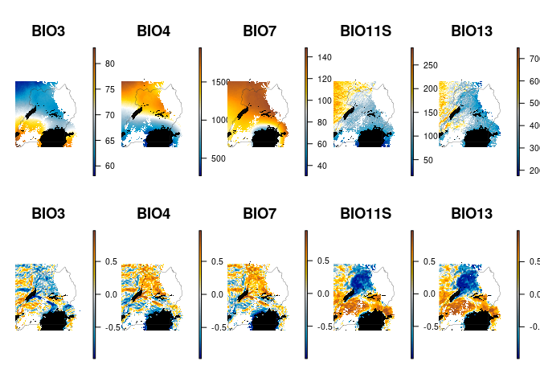

Environmental correlations with final model (opening the RF black box)
================
Norah Saarman
2026-04-15

- [Setup](#setup)
- [Overview](#overview)
  - [Chunk 1: Directories, objects, color
    palettes](#chunk-1-directories-objects-color-palettes)
  - [Chunk 2: Load data (rasters, objects,
    etc)](#chunk-2-load-data-rasters-objects-etc)
  - [Chunk 3: extract selected predictors and calculate local
    correlations](#chunk-3-extract-selected-predictors-and-calculate-local-correlations)
  - [Chunk 4: Plot raw env predictors (top) and local Pearson
    correlations
    (bottom)](#chunk-4-plot-raw-env-predictors-top-and-local-pearson-correlations-bottom)

# Setup

RStudio Configuration:  
- **R version:** R 4.4.0 (Geospatial packages)  
- **Number of cores:** 16 (up to 32 available)  
- **Account:** saarman-np  
- **Partition:** saarman-np (allows multiple simultaneous jobs
automatically now)  
- **Memory per job:** 400G (cluster limit: 1000G total; avoid exceeding
half)

# Overview

Pearson’s correlation in a sliding window, of the current variable
versus full model, add this to figure with direction of change

Top less-correlated predictors: BIO3, BIO4, BIO7, BIO11S, BIO13

Figure X. Local Pearson correlations between predicted CSE and selected
environmental predictor rasters, calculated in a sliding window with
neighborhood size = 21. Positive values indicate local areas where
higher predictor values are associated with higher predicted CSE;
negative values indicate areas where higher predictor values are
associated with lower predicted CSE.

## Chunk 1: Directories, objects, color palettes

``` r
# Libraries
library(raster)
```

    ## Loading required package: sp

``` r
library(sf)
```

    ## Linking to GEOS 3.10.2, GDAL 3.4.1, PROJ 8.2.1; sf_use_s2() is TRUE

``` r
library(ggplot2)
library(dplyr)
```

    ## 
    ## Attaching package: 'dplyr'

    ## The following objects are masked from 'package:raster':
    ## 
    ##     intersect, select, union

    ## The following objects are masked from 'package:stats':
    ## 
    ##     filter, lag

    ## The following objects are masked from 'package:base':
    ## 
    ##     intersect, setdiff, setequal, union

``` r
# Directories
project_dir <- "/uufs/chpc.utah.edu/common/home/saarman-group1/uganda-tsetse-LG"
data_dir    <- file.path(project_dir, "data")
raw_dir     <- file.path(data_dir, "raw")
results_dir <- file.path(project_dir, "results")

# High-quality figure output (for manuscript)
fig_dir <- file.path(results_dir, "figures_pub")
if (!dir.exists(fig_dir)) dir.create(fig_dir, recursive = TRUE)

# Color palettes
n_col <- 100

make_diverging_palette <- function(zmin, zmax, n = 100) {
  if (is.na(zmin) || is.na(zmax)) {
    list(cols = rep("white", n), zlim = c(0, 0))
  } else if (zmin >= 0) {
    list(
      cols = colorRampPalette(c("white", "gold", "darkorange", "#924532"))(n),
      zlim = c(0, zmax)
    )
  } else if (zmax <= 0) {
    list(
      cols = colorRampPalette(c("blue4", "deepskyblue3", "#8db4c9", "white"))(n),
      zlim = c(zmin, 0)
    )
  } else {
    n_neg <- max(1, round(n * abs(zmin) / (abs(zmin) + abs(zmax))))
    n_pos <- max(1, n - n_neg)

    neg_col <- colorRampPalette(c("blue4", "deepskyblue3", "#8db4c9", "white"))(n_neg)
    pos_col <- colorRampPalette(c("white", "gold", "darkorange", "#924532"))(n_pos)

    list(
      cols = c(neg_col, pos_col),
      zlim = c(zmin, zmax)
    )
  }
}
```

## Chunk 2: Load data (rasters, objects, etc)

``` r
# Load connectivity model output
cse_surface <- raster(file.path(results_dir, "fullRF_CSE.tif"))

# Load habitat suitability rasters
fao    <- raster(file.path(data_dir, "FAO_fuscipes_2001.tif"))
update <- raster(file.path(data_dir, "SDM_2018update.tif"))

# Load vector layers for plotting
uganda <- st_read(file.path(raw_dir, "UGA_adm0.shp"), quiet = TRUE)
lakes  <- st_read(file.path(raw_dir, "Uganda_lakes_shape.shp"), quiet = TRUE)

# Match FAO and update rasters before combining
fao_crop    <- crop(fao, update)
update_crop <- crop(update, fao_crop)
fao_resamp  <- resample(fao_crop, update_crop)

# Combine suitability rasters
sdm_raw <- max(fao_resamp, update_crop, na.rm = TRUE)

# Crop both surfaces to overlapping extent
sdm <- crop(sdm_raw, cse_surface)
cse <- crop(cse_surface, sdm)

# Mask low-suitability areas
sdm[sdm <= 0.05] <- NA

# Scale habitat suitability to 0-1
sdm_min <- cellStats(sdm, stat = "min", na.rm = TRUE)
sdm_max <- cellStats(sdm, stat = "max", na.rm = TRUE)
sdm <- (sdm - sdm_min) / (sdm_max - sdm_min)

# Mask CSE surface to same suitable area
cse <- mask(cse, sdm)

# Convert predicted CSE to connectivity
cse_min <- cellStats(cse, stat = "min", na.rm = TRUE)
cse_max <- cellStats(cse, stat = "max", na.rm = TRUE)
conn <- 1 - ((cse - cse_min) / (cse_max - cse_min))
```

## Chunk 3: extract selected predictors and calculate local correlations

``` r
# Load env stack with named layers
env <- stack(file.path(data_dir, "processed", "env_stack.grd"))

# Selected predictors for post hoc interpretation
top_vars <- c("BIO3", "BIO4", "BIO7", "BIO11S", "BIO13")

# Extract selected predictor rasters
predictor_rasters <- lapply(top_vars, function(v) env[[v]])
names(predictor_rasters) <- top_vars

# Align predictors to conn and mask to modeled area
predictor_rasters <- lapply(predictor_rasters, function(r) {
  if (!compareRaster(r, conn,
                     extent = TRUE, rowcol = TRUE,
                     crs = TRUE, res = TRUE,
                     stopiffalse = FALSE)) {
    r <- crop(r, conn)
    r <- resample(r, conn, method = "bilinear")
  } else {
    r <- crop(r, conn)
  }
  mask(r, conn)
})

names(predictor_rasters) <- top_vars

# Save prediction rasters
saveRDS(predictor_rasters, file = file.path(results_dir, "predictor_rasters_list.rds"))

# Local Pearson correlations with connectivity surface
cor_rasters <- lapply(predictor_rasters, function(pred) {
  raster::corLocal(
    x = pred,
    y = conn,
    method = "pearson",
    ngb = 21
  )
})

names(cor_rasters) <- top_vars

# Re-mask and crop correlation rasters to clean edges
cor_rasters <- lapply(cor_rasters, function(r) {
  r <- crop(r, conn)
  r <- mask(r, conn)
  r
})

# Save correlation rasters
saveRDS(cor_rasters, file = file.path(results_dir, "cor_rasters_list.rds"))
```

## Chunk 4: Plot raw env predictors (top) and local Pearson correlations (bottom)

``` r
# Load env stack with named layers
env <- stack(file.path(data_dir, "processed", "env_stack.grd"))

# Selected predictors for post hoc interpretation
top_vars <- c("BIO3", "BIO4", "BIO7", "BIO11S", "BIO13")

cor_rasters <- readRDS(file.path(results_dir, "cor_rasters_list.rds"))

predictor_rasters <- readRDS(file.path(results_dir, "predictor_rasters_list.rds"))

# Run just once to save high quality png for publication
# png(file.path(fig_dir, "Fig_env_raw_and_localcorr.png"), 
# width = 14, height = 5.6, units = "in", res = 600) 

par(mfrow = c(2, length(top_vars)),
    mar = c(1.5, 1.5, 2, 2.5),
    oma = c(0, 0, 2, 1))

# Top row: raw predictor rasters
for (v in top_vars) {

  pred <- predictor_rasters[[v]]

  pred_cols <- colorRampPalette(
    c("blue4", "deepskyblue3", "#8db4c9", "white",
      "gold", "darkorange", "#924532")
  )(100)

  plot(pred,
       col = pred_cols,
       main = v,
       cex.main = 1.75,
       axes = FALSE, box = FALSE,
       smallplot = c(0.88, 0.90, 0.15, 0.85))
  plot(st_geometry(lakes), col = "black", border = NA, add = TRUE)
  plot(st_geometry(uganda), border = "grey20", lwd = 0.3, add = TRUE)
}

# Bottom row: local Pearson correlation rasters
for (v in top_vars) {

  corr <- cor_rasters[[v]]

  corr_vals <- values(corr)
  corr_vals <- corr_vals[!is.na(corr_vals)]

  pal_info <- make_diverging_palette(
    zmin = min(corr_vals, na.rm = TRUE),
    zmax = max(corr_vals, na.rm = TRUE),
    n = 100
  )

  plot(corr,
       col = pal_info$cols,
       zlim = pal_info$zlim,
       main = v,
       cex.main = 1.75,
       axes = FALSE, box = FALSE,
       smallplot = c(0.88, 0.90, 0.15, 0.85))
  plot(st_geometry(lakes), col = "black", border = NA, add = TRUE)
  plot(st_geometry(uganda), border = "grey20", lwd = 0.3, add = TRUE)
}
```

<!-- -->

``` r
#dev.off()
```
